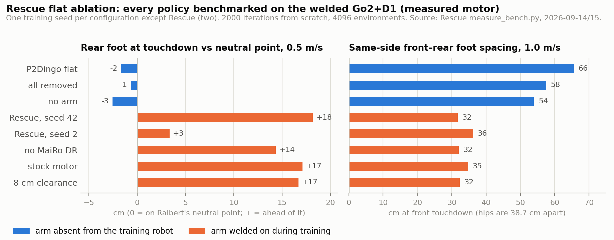
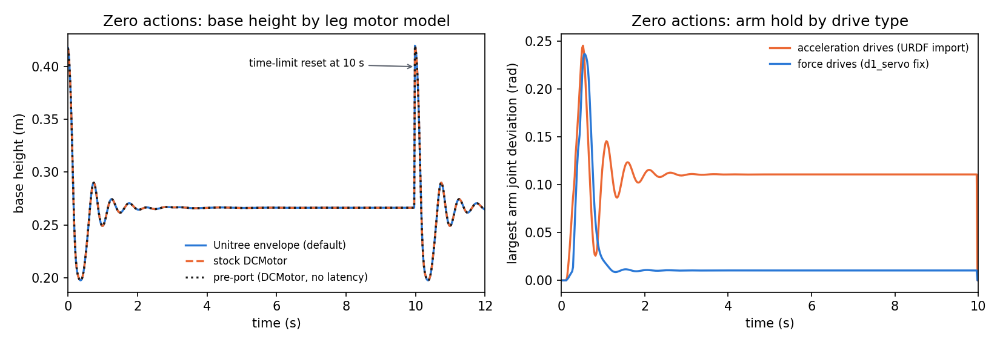
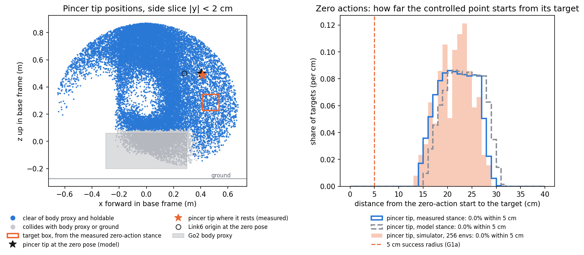
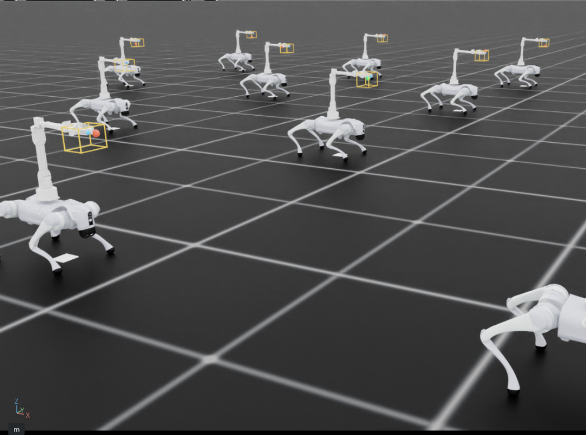
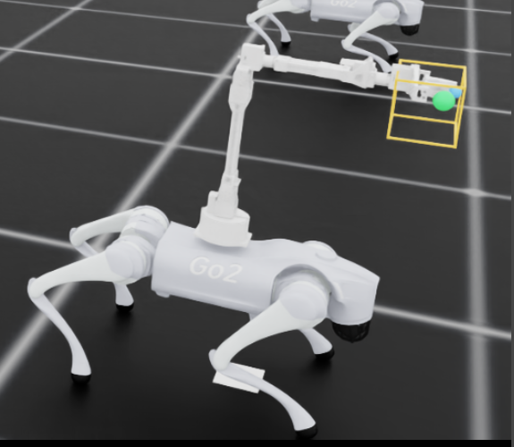

# Week 1 — 14–20 September 2026

**Status:** in progress
**Focus:** Finish environment/evaluator work; begin method reproduction, camera setup and hardware measurements

## Planned

From the [revised Thesis B plan](../../docs/thesis_b_plan.md#thesis-b-weekly-schedule),
16 September 2026. This replaces the original Appendix A timing; earlier dated logs remain historical evidence.

- **Reuse, simulation and learning:** Close remaining G0 checks, validate workspace/reset changes, start the frozen evaluator, and trace UniFP plus the Go2+D1 position-only reference.
- **Hardware and camera:** Bring up RealSense/AprilTags and D1 telemetry; measure basic arm response and the real box mechanism; establish robot, fixture, GPU and storage access.
- **Evidence and deliverable:** Record reproduction attempts and interface measurements. Freeze the task and deployment contract in Week 2.
- **Gate focus:** G0; preparation for G1a and G4.

**Where the two tracks stand, 16 September.** Simulation: the workspace and reset were resolved (F-016) and the
frozen evaluator is written and measured (F-018); the UniFP and Go2+D1 reference traces have not been started,
and neither repository is cloned here. Hardware and camera: **the D1 half is started, the camera half is not**.
This PC has no RealSense (no Intel USB device, no `pyrealsense2`), no serial device and no wired link to the
robot. The arm, however, is reachable through the Go2: later on 16 September the dog was up on Tailscale with
the D1 welded and powered, and its interface was measured from the Jetson payload (F-020 to F-023, sixth-session
log below). RealSense, AprilTags, the box mechanism and any camera/tag/tool frame work remain not started, and
Week 2's G4 still depends on them.

## Checklist

- [x] Thesis A timeline and experimental matrix reviewed into the plan
- [x] Codebase candidates reviewed at pinned revisions ([investigation](../../docs/codebase_investigation.md))
- [x] Position-only task scaffold: 18 actions, world-fixed targets, 69 observations, PPO config
- [x] CPU frame and PPO-API tests pass (F-003)
- [x] Results record and dashboard set up
- [x] `run_position_only.py check` passes on the GPU (2026-09-14, see log)
- [x] unitree_rl_lab (via MaiRo) reviewed; motor model, critic split, noise/randomisation and deploy manifest adopted (F-005, F-006)
- [x] D1 servo limits and interface latency model added (`--arm_actuator d1_servo`, `--latency estimated`; F-007)
- [x] Headless smoke run, 1 environment (defaults: `--leg_actuator unitree`, `--robustness none`) (2026-09-15, see log)
- [x] Headless smoke run, 1 environment, `--leg_actuator dc_motor`: standing posture within 0.1 mm of the default, 0 failure resets in both
- [x] `params/deploy.yaml` from the smoke run checked: motor ids, limits, 66-wide actor layout, timing block
- [x] `run.json` `arm_limits_in_physx` checked against 3.3/1.7 N·m and 1.05/1.73 rad/s (exact)
- [x] Held arm targets visible in a trace: arm target changes only every 5 policy steps (`verify`, 8 envs, F-009)
- [x] Smoke run with `--latency none --leg_actuator dc_motor --arm_actuator implicit` (pre-port configuration) for comparison
- [x] Headless smoke run, 4 environments
- [x] Visible 1-environment run inspected (2026-09-16): `view --episode` replays a pinned manifest episode; seed 43 on development ep94. It found two things 300 evaluated episodes had not — the robot walks 20 cm to its target (F-043) and oscillates at 5–8 Hz while holding (F-044)
- [x] Model the arm's measured command latency and ramp (2026-09-17, F-045, F-046). Fitted from the raw samples, the ~127 ms and ~220 ms figures were feedback-sampling artefacts: 10 ms dead time, 15.5/17.4 rad/s², restart from rest on each setpoint. `--arm_trajectory measured` is the default; `verify` 25/25; manifests re-frozen
- [x] Retrain the three seeds under `--arm_trajectory measured` (2026-09-17, F-047): precision mostly recovers (6.7–11.5 mm), holding shake doubles (median 11.5–14.6 mm), falls 3/0/1 so G1a still fails. Planner-off diagnostic: the planner absorbs the shake rather than causing it
- [x] Retune `action_rate` and retrain (2026-09-17, F-048): swept −0.05/−0.1/−0.3 on seed 42 under a rule fixed first; −0.05 selected; three seeds 100/100/100 with 0 falls and 3.6 cm of walking on `development`. Shake unchanged on average (12.4 mm), now mostly a body bob
- [ ] Draw a fresh validation manifest and measure G1a on the v5 policies (F-048)
- [ ] Price the ~2 Hz body bob while holding, then retrain (F-048)
- [ ] Hardware: re-send an identical setpoint at 10 Hz through one 30° step to settle whether the D1 restarts its plan on an unchanged setpoint (F-045, F-046) — **now a prerequisite for any physical trial** of a planner-trained policy (F-047)
- [ ] G4 contract: decide whether the deploy stack streams the policy's arm output at 10 Hz, given streaming costs the arm a third of its speed (F-046)
- [ ] Price base translation, once the timing model is right (F-043)
- [x] Self-collision check: no resting contact from overlapping weld shapes (measured headless, with a positive control; a screenshot is optional)
- [x] Deliberate reset tests: time limit, low base, tilt, base contact, workspace exit, partial reset (`verify`, F-009)
- [x] Controlled point chosen: the Link7_1 pincer tip (CAD end-face centre; `--tip_body`, `--tip_offset`), matched in simulation to 0.9 µm (F-013). Not measured on the physical arm
- [x] Target box checked against the reachable, collision-free workspace: reachable, but zero actions meet 5 cm for 12.9% of targets (F-011, then F-013)
- [x] Playback reference: bare Go2 and Go2+D1, with forward, lateral and yaw commands (F-012)
- [x] Short PPO pilot: 64 envs × 24 steps × 100 iterations (153,600 transitions); throughput and memory recorded (three pilots)
- [x] Rescue flat ablation recorded as external evidence (F-008)
- [x] Frozen-manifest evaluator written, with development/validation/test manifests and the zero-action baseline measured on all three (2026-09-16, F-018)
- [ ] Gait-quality metrics (foot vs neutral point, front–rear spacing, backward after request, turn tracking at 0.2/0.5/1.0 rad/s, pitch wobble) added to the P0 evaluator design for G1b
- [x] Run the evaluator against a trained checkpoint (2026-09-16, F-019): `model_1499` scores 100/100 on the development manifest against 0/100 for zero actions. The truncation and fall paths are still untested by a real failure, because this policy never fell
- [x] Cartesian (IK) controller for the arm: `d1_ik.py` solver and `d1_hardware.py` client (2026-09-16, F-025). **Executed on hardware**: an 11.3 cm Cartesian move tracked to a 6.0 mm residual, which is the arm settling rather than the solver (F-026). Absolute Cartesian accuracy still unvalidated pending the J1/J2 zero
- [~] Hardware and camera half of the revised Week 1: D1 telemetry and arm response **done** on the real arm via the Go2 (F-020, F-021, F-022, F-023, 2026-09-16); RealSense/tags, box loads and fixture needs still not started
- [x] Move the target box (or change the reset height) so zero actions do not meet the 5 cm criterion, before P0 training (F-013): box moved forward and down, spawn lowered to 0.30 m; zero actions now score 0/256 (2026-09-16, F-014, F-015, F-016)
- [x] Price the squat: `base_height_l2` at weight −50 against the measured stance; retrained seed 42 and re-evaluated (2026-09-16, F-040). Squat gone (0 of 100 episodes below 0.20 m), tracking 30% better, 1 fall in 100 at a corner target
- [x] Three seeds (42/43/44) at the frozen budget, evaluated on development and validation (2026-09-16, F-041). **G1a fails on falls**: 3% / 0% / 3% against ≤1%. Failures are far-reach tilt terminations; seed 43 is clean
- [x] Reduce the tilt failures at far reach (2026-09-16, F-042): `base_angular_motion_l2` at −0.2 — rotation had never been priced while translation was. Falls 4 → 1 across 300 development episodes, seed 44 fixed outright, leg saturation effectively gone
- [ ] Draw a **fresh validation manifest** on a new RNG stream, versioned beside the existing one, and measure G1a on it. The current validation set is contaminated: F-041's diagnosis was read off its episodes and F-042's reward term followed from that diagnosis (F-042)
- [ ] Diagnose the remaining tip-while-holding failure (seed 42 ep62, far bottom corner, 4.92 s dwell then tipped). The arm's missing command latency (F-021) and acceleration ramp (F-035) bear on holding behaviour (F-042)
- [ ] Grow the target range beyond the first box: base-motion targets and a growth schedule for plan stage 6 (the 12 × 16 × 12 cm stage-5 box is set; `workspace.py` scores candidates against the measured stance)
- [x] D1 joint speed limits measured on hardware and `motor_model.py` updated: 1.20–1.29 rad/s on every joint, no 1.05/1.73 split (2026-09-16, F-033)
- [x] Validate the servo signs on hardware with an observer (2026-09-16, F-034): J0 and J3 inverted, J4/J5 correct, J1/J2 indirect. `SERVO_SIGN = [-1,1,1,-1,1,1]`
- [ ] Give `params/deploy.yaml` a per-joint sign before G4 freezes the deployment contract — it would currently mirror two joints (F-034)
- [ ] Measure the joint **zero offsets** (signs are done; zeros are not — F-023, F-025)
- [ ] Explain the 0.010 rad residual at J3 with force drives (F-010)
- [ ] Decide whether playback (`run_sim.sh`) should also get force arm drives; it would change the F-012 reference

### Added by the 16 September plan revision

- [x] Frozen-manifest evaluator started, including zero-action reference and terminal metrics (F-018, F-019)
- [~] UniFP and one position-only reference reproduction attempts started with a setup time budget — **UniFP reproduction complete** (2026-09-20, F-083): the full 60,000-iteration schedule finished in 39.85 h with no crashes, and the curve says ~10,000 would have done (F-083). Policy evaluated on frozen episode sets (2026-09-20, F-086: 2.6 cm against 26 cm for zero actions) and **ported to Isaac Sim** (2026-09-20, F-087/F-088: the interface is exact, but the policy stands and does not walk on the Isaac Lab model). The *task* is now ported too (2026-09-20, F-089): `unifp_train/` trains it natively in Isaac Lab and scores within 0.4% of the Isaac Gym recording term by term; a training run and a frozen-manifest evaluation remain. **UniFP setup and retarget done** (2026-09-18, F-078/F-079): installed on the spare PC in ~40 min of the two-day budget, upstream B2Z1 launched, retargeted to Go2+D1 and a 60,000-iteration run started (F-081). The Go2+D1 position-only reference is **not started**
- [ ] RealSense stream and AprilTag detections recorded
- [x] D1 feedback/command timing and basic joint response measured on hardware (2026-09-16): angle feedback 111.0 ms / 9.00 Hz and status 100.5 ms / 9.96 Hz (F-020); J0 step latency 126–138 ms, peak 1.15 rad/s, steady-state error ≤0.1° (F-021). One joint, unloaded
- [ ] Box latch/lever loads, travel, geometry and tool engagement measured
- [~] Robot access recorded (2026-09-16): `sshuni` → `unitree@100.99.23.36` over Tailscale, arm at 192.168.123.100 on `enP8p1s0`, dog's host `python3` carries `cyclonedds` 0.10.2. Fixture availability and recording storage budget still open

## Environment

| Item | Value | Source |
| --- | --- | --- |
| GPU | NVIDIA GeForce RTX 4080, 16 GB; driver 580.159.03, CUDA 13.0 | `nvidia-smi`, 2026-09-14 |
| Isaac Sim | 5.1.0.0 | [codebase investigation](../../docs/codebase_investigation.md#local-implementation-audit) |
| Isaac Lab | package 0.54.3; `~/IsaacLab` at `4df6560e187f` (`training-checkpoints-develop`) | same |
| Isaac Lab RL / RSL-RL | 0.5.0 / 5.0.1 | same |
| Python / PyTorch | 3.11.15 / 2.7.0+cu128 (`env_isaaclab`) | same |
| Task physics / policy rate | 200 Hz / 50 Hz (decimation 4) | `position_only/env_cfg.py` |
| CPU / RAM | AMD Ryzen 9 9950X3D, 16 cores; 31 GB | Isaac Sim startup report, 2026-09-15 |
| Root disk | 34 GB free (85% used); `logs/` holds 292 MB. Was 3.6 GB free on 2026-09-15; freed outside this record | `df -h`, 2026-09-16 |
| GPU during Week 1 runs | No other compute job: every launch checked `nvidia-smi --query-compute-apps` first | 2026-09-15, 2026-09-16 |

## Log

### 2026-09-14 · planning and task scaffold (first session)

- Reviewed Thesis A §§3.1–3.4, Tables 3–4 and Appendices A–C into the
  [ten-week plan](../../docs/thesis_b_plan.md), including gates G0–G3 and the P0–P4 matrix.
- Reviewed six codebases from source at pinned revisions. The recommendation (F-004) is to build on the local Isaac Lab
  model and treat the Isaac Gym codebases as references.
- Wrote the [position-only environment](../../docs/position_only_environment.md) and `run_position_only.py`
  (`check` / `smoke` / `train`). Each run writes `run.json` with versions, source hashes, action order and USD hash.
- CPU tests: 5 pass (F-003). That session could not see a GPU (`nvidia-smi` failed, no `/dev/nvidia*`), so no
  simulator run was possible.

### 2026-09-14 · results record and GPU bring-up (second session)

- Set up this record: `results/` with a folder per week, [findings](../findings.md), [gates](../gates.md), and
  `./dashboard.py` for viewing and for recording runs.
- The GPU is visible in this session. `python run_position_only.py check` exited 0: CUDA available, 1 GPU,
  torch 2.7.0+cu128, isaacsim 5.1.0.0, isaaclab 0.54.3, isaaclab-rl 0.5.0, rsl-rl-lib 5.0.1, D1 URDF present.
  This establishes prerequisites only. No simulator has been launched for this task yet.
- The GPU is shared. A Rescue experiment queue (another session) held 6.6 GB and ~90% utilisation:
  `exp_Control` trained 14:07–14:57, and five more arms (Com, Riser, StairFwd, Placement, Thigh, ~50 min
  each plus benchmarks) follow. Lukas chose not to run the smoke tests or the PPO pilot alongside it. They
  are still to do, with the commands in the [environment guide](../../docs/position_only_environment.md#run-sequence).
  When the pilot runs, note any other GPU jobs, because they contaminate the throughput and memory figures.
- Root disk had 7.5 GB free (97% used). Each run rebuilds its ~10 MB robot USD inside its run folder, and
  pilot checkpoints are small, but long runs will need log housekeeping.
- Recorded scalars take about 0.4 KB per iteration (≈1.6 MB for a 4,000-iteration run), measured by recording
  two existing Rescue logs into a scratch copy of this tree. Nothing from that test was added here.

### 2026-09-14 · unitree_rl_lab review and sim-to-real changes (second session)

Reviewed `~/mairo-rl-lab-rinam` (commit `a179aa0`), recommended for sim-to-real transfer from accurate motor
models. It is the MaiRo course container around Unitree's official `unitree_rl_lab`. The sim-to-real parts are
upstream Unitree code; MaiRo's own changes are course exercises. Source-level notes are in the
[codebase investigation](../../docs/codebase_investigation.md#source-level-findings-to-act-on) (F-006).

Adopted into the position-only task before any P0 training, so P0–P4 all share them:

| Change | Detail | Default |
| --- | --- | --- |
| Go2 leg motor model | `UnitreeActuator` ported to `motor_model.py` and `unitree_actuators.py` (Apache-2.0 notice in `third_party/`): explicit PD 25/0.5, envelope Y1 20.2 / Y2 23.4 N·m, X1 13.5 / X2 30 rad/s | `--leg_actuator unitree`; `dc_motor` for comparison. Playback keeps `dc_motor` |
| Actor/critic split | Actor 66 inputs with no base linear velocity (not measurable on the Go2); critic 87 with base linear velocity and joint torques | Always |
| Observation noise and randomisation | Unitree's Go2 noise levels; friction, restitution, base mass and CoM, ±0.5 m/s pushes | `--robustness none` until nominal reaching works |
| Solver and self-collision | 8/4 solver iterations (stock 4/0); self-collision switchable | 8/4; `--self_collisions` off pending a weld-overlap check |
| Deploy manifest | Each run writes `params/deploy.yaml`: policy output → motor id per bus, scale/offset/clip/limits, gains, actuator models, actor layout | Always |

Checks, all CPU only:

- The ported envelope equals the original unitree_rl_lab clipping function exactly: max abs difference 0.0 over
  801 × 1001 torque–speed points.
- Envelope comparison (F-005). At 13.5 rad/s the stock `DCMotor` allows 12.9 N·m of driving torque; the Unitree
  model allows 20.2. At 20 rad/s braking, stock allows 23.5 N·m against the Unitree model's 14.2.
- 28 tests pass in `env_isaaclab` (7 new in `tests/test_sim2real.py`; the PPO test now asserts 66/87 input widths).

Not yet validated: the actuator class, observation groups, randomisation terms, solver settings and deploy export
have not run in Isaac Sim. They first execute in the smoke tests above. The earlier `check` result predates these
changes but does not depend on them. Not adopted: MaiRo's C++ controller (Go2 legs only, `unitree_sdk2`), kept
as the Thesis C reference; its base policy (12 actions, different observations), which cannot initialise the
18-action actor. (Superseded the same day: a D1 servo and latency model was then added; see the next entry.)

### 2026-09-14 · D1 servo model and interface latency (second session)

Lukas asked for the D1 motor model and latency to be brought over as well. The MaiRo/unitree_rl_lab repo has
neither. It contains no D1 or arm files, and its delay support is set to zero for the Go2. So the mechanisms
came from that repo, and the D1 numbers from the best available sources, each labelled in `motor_model.py`:

| Quantity | Value used | Source and confidence |
| --- | --- | --- |
| D1 joint torque limits | 3.3, 3.3, 1.7, 1.7, 1.7, 1.7 N·m | Unitree D1-550 published spec (README). Published |
| D1 joint speed limits | 1.05 rad/s (J1–3), 1.73 rad/s (J4–6) | `d1_arm/d1.urdf`. **Unverified**: Unitree's `d1_description` has `velocity="0"`; filled in during the Rescue port (2026-07-16) with no source. No published D1-550 joint speed found online |
| D1 torque–speed curve | None: implicit stiff drive with the limits above | Not published by Unitree; an explicit 4000/400 PD is unstable at 200 Hz |
| D1 command rate | Arm targets held 5 policy steps (10 Hz), random phase | D1 SDK streaming setpoints at ~10 Hz (Rescue `d1_sdk`, reproduced from the SDK) |
| D1 feedback | Joint angles sampled at 10 Hz, random phase; velocity differenced from samples | D1 SDK publishes angles only at 10 Hz |
| D1 firmware smoothing | Not modelled | SDK exposes a smoothing mode; its filter is undocumented |
| Go2 leg command delay | 0–2 physics steps (0–10 ms), drawn per episode | Estimated from unitree_rl_lab's controller: 50 Hz policy thread, 1 kHz command publish. Not measured |

Implementation: `HeldJointPositionAction` (arm command hold) and `SampledJointFeedback` (arm angle/velocity feedback)
in `position_only/mdp.py`; `SampleAndHold` in `position_only/core.py`; the leg delay uses the Unitree actuator's delay
buffer. The actor's layout is unchanged at 66 (legs then arm, positions then velocities) and the critic still sees
exact state. New flags: `--arm_actuator {d1_servo,implicit}` and `--latency {estimated,none}`. Both are recorded in
`run.json` and the deploy file's `timing` block. `run.json` also records the arm limits PhysX actually applies.

Checks (CPU only): 33 tests pass, including the latency profiles and sample-and-hold phases, differenced velocity,
reset, and repeated updates within one step. Nothing here has run in Isaac Sim. The first smoke run exercises all
of it, with a pre-port comparison run listed in the checklist.

### 2026-09-15 · Rescue flat ablation: training with the arm attached degrades the gait (external evidence)

Lukas ran a locomotion ablation in the Rescue project. It is recorded here because it is direct evidence that
attaching the D1 makes locomotion learning harder. Evidence, provenance and definitions are in
[external/rescue_flat_ablation](external/rescue_flat_ablation/README.md), copied because nothing was committed in
Rescue.

**Setup.** These are Rescue's flat velocity-tracking policies: 12 leg actions, with the D1 welded on but passive
(folded, held at zero). Each run removes one factor Rescue's task added to P2Dingo's. Every policy trained for 2000
iterations from scratch with 4096 environments, seed 42 unless noted. All were benchmarked on the same welded
Go2+D1 with the measured motor (Rescue `measure_bench.py`, seed 1, 200 robots, flat ground).



| | P2Dingo flat | all removed | **no arm** | Rescue, seed 42 | Rescue, seed 2 | no MaiRo DR | stock motor | 8 cm clearance |
| --- | --- | --- | --- | --- | --- | --- | --- | --- |
| Arm on the training robot | no | no | no | yes | yes | yes | yes | yes |
| Front / rear foot vs neutral point, 0.5 m/s (cm) | −1 / −2 | −2 / −1 | **−4 / −3** | −12 / +18 | −9 / +3 | −7 / +14 | −10 / +17 | −10 / +17 |
| Same-side front–rear spacing, 1.0 m/s (cm) | 66 | 58 | **54** | 32 | 36 | 32 | 35 | 32 |
| Stride / stance, 0.5 m/s | 28 cm / 346 ms | 21 / 253 | 17 / 189 | 25 / 234 | 12 / 131 | 28 / 274 | 23 / 223 | 27 / 250 |
| Forward tracking, 0.5 / 1.0 m/s | 98 / 100 % | 95 / 97 | 106 / 102 | 100 / 107 | 104 / 102 | 101 / 104 | 98 / 107 | 101 / 105 |
| Turn tracking, 0.2 / 0.5 / 1.0 rad/s | 7 / 98 / 104 % | 58 / 99 / 99 | 51 / 124 / 109 | – / – / 76 | 75 / 106 / 105 | – / – / 89 | – / – / 99 | – / – / 102 |
| Drift turning at 1.0 rad/s (m/s) | 0.055 | 0.059 | 0.028 | 0.060 | 0.030 | 0.067 | 0.053 | 0.048 |
| Backward within 1 s of a 1.0 m/s request | 0 % | 0 | 0 | 57 | 0 | 0 | **99.5** | 0 |
| Pitch wobble, 1.0 m/s (deg) | 0.73 | 0.70 | 0.46 | 1.17 | 0.17 | 0.93 | 0.95 | 0.94 |

(– = not measured at that turn rate. Unrounded values: [summary.csv](external/rescue_flat_ablation/summary.csv).)

What it shows:

- "All removed" reproduces P2Dingo (rear foot −1 cm against −2 cm; spacing 58 against 66 cm), so no difference
  between the two tasks was missed.
- Of the single removals, only taking the arm off the **training** robot puts the feet back under the body. Both
  arm-free runs land within 4 cm of the neutral point with 54–58 cm spacing. Three of the four runs that kept the
  arm (no DR, stock motor, 8 cm clearance) land the rear feet 14–17 cm ahead of it, with 32–35 cm spacing. Rescue
  seed 42 is the same at +18 cm. Rescue seed 2 avoids that only with a 12 cm stride and 131 ms stance, a shuffle.
  In all, 2 of 2 arm-free runs walk well and 0 of 5 arm-on runs do.
- The randomisation, the motor model and the clearance target did not cause it. The stock-motor run also backed
  away after a forward request in 99.5% of robots (one seed).
- A policy that never trained with the arm walks the welded robot better than every policy that did. This is
  consistent with F-001, now with foot-placement and turn metrics.

What it does not show: why. Rescue's hypothesis is that the arm's added height and pitch inertia make "feet under
the body" the cheapest pitch control during learning; that is untested. It covers one task (locomotion with a
passive arm, not whole-body control), flat ground only, and one training seed per configuration (the five arm-on
runs are not independent replicates of one setting). No 0.2 rad/s turn is tracked well by any policy (7–75%).

For this project (F-008), P0 is exactly "arm on the training robot", so the plan now asks locomotion evaluations
(G1b) to report gait quality alongside tracking.

### 2026-09-15 · First simulator runs: smoke, deliberate checks, arm drive fix, pilots, workspace, playback (third session)

The GPU was free (742 MiB display only, no compute processes). Every launch below first checked
`nvidia-smi --query-compute-apps` and found nothing else running, so the throughput figures are uncontaminated. All
commands ran from the repository root in `env_isaaclab` with ROS variables unset.

#### Runner fix: failed runs exited 0

The first two `python run_position_only.py smoke --headless --num_envs 1 --steps 600` attempts exited 0 but wrote no run
folder. Isaac Sim's `SimulationApp.close()` ends the process with status 0 before Python can print an exception, so any
error inside `run()` looked like a success. The runner now prints the traceback and exits 1, and it flushes output
before shutdown. The hidden error was `AttributeError: type object 'FlatSceneCfg' has no attribute 'terrain'`:
`configclass` turns mutable class attributes into default factories. The scene config now reads them from an instance.
Neither attempt created a run folder, so neither could be recorded.

#### Smoke runs (zero actions: default joint targets)

| Run | Configuration | Failure / time-limit resets | Settled base height | Arm joint deviation (mean) |
| --- | --- | --- | --- | --- |
| [first simulator run](#/week/1/run/20260915T093352_794571Z_smoke_seed42) | defaults, 1 env | 0 / 1 | (no posture trace yet) | |
| [defaults](#/week/1/run/20260915T093730_338089Z_smoke_seed42) | Unitree legs, `d1_servo`, estimated latency | 0 / 1 | 0.2661 m | 0.110 rad |
| [`dc_motor`](#/week/1/run/20260915T093743_674698Z_smoke_seed42) | stock DCMotor legs | 0 / 1 | 0.2661 m | 0.110 rad |
| [pre-port](#/week/1/run/20260915T093756_424913Z_smoke_seed42) | `dc_motor`, `implicit` arm, no latency | 0 / 1 | 0.2661 m | 0.110 rad |
| [4 envs](#/week/1/run/20260915T093809_039560Z_smoke_seed42) | defaults | 0 / 4 | 0.2666 m | 0.110 rad |
| [force arm drives](#/week/1/run/20260915T095815_165623Z_smoke_seed42) | defaults after the drive fix (below) | 0 / 1 | 0.2663 m | 0.018 rad |
| [4 envs, contact logged](#/week/1/run/20260915T100526_698612Z_smoke_seed42) | self-collisions off | 0 / 4 | 0.2664 m | 0.018 rad |
| [4 envs, `--self_collisions`](#/week/1/run/20260915T100540_450156Z_smoke_seed42) | self-collisions on | 0 / 4 | 0.2664 m | 0.018 rad |

Posture statistics exclude the first 50 steps. `smoke_trace.csv` holds the per-step trace; only the first
smoke run (09:33 UTC) predates it.



What they show:

- **Interface.** One articulation with 20 joints and 18 actions in the declared order, 66 actor and 87 critic inputs,
  arm sensor bodies resolved, finite observations and rewards, automatic resets. Articulation mass 18.171 kg.
- **Deploy manifest.** All 12 leg motor ids match unitree_sdk2's FR, FL, RR, RL order (FL_hip → 3, FR_hip → 0,
  RL_hip → 9, RR_hip → 6, …). The arm maps to ids 0–5, the actor layout is 66 wide, and the timing block holds
  0–2 leg delay steps and 5-step arm hold and feedback periods.
- **Arm limits in PhysX** exactly 3.3/3.3/1.7/1.7/1.7/1.7 N·m and 1.05/1.05/1.05/1.73/1.73/1.73 rad/s, with
  `d1_servo` **and** with `implicit`: the URDF import already carries these limits, so `d1_servo` restates them.
- **Leg limits in PhysX.** Both leg models inherit the Go2 USD's joint speed limits (30.1 rad/s hip and thigh,
  15.7 rad/s calf), and explicit actuators give PhysX a 1e9 N·m torque cap because the envelope does the clipping.
  The deploy file's leg `effort_limit` (23.7 / 45.43 N·m) is the USD value, which the Unitree envelope does not use.
  None of these speed limits carries a source label in `motor_model.py`.
- **Stance.** Spawned at 0.42 m, the robot drops for about 7 steps, lands with a peak tilt of 18.9° and slides 7 cm.
  It settles by 2 s at 0.266 m, tilt 1.3°, legs 0.35 rad from their default angles, peak leg torque 8.7 N·m. Every
  episode starts with this drop.
- **Leg models.** Unitree and DCMotor standing traces agree to 0.1 mm in height. Standing never reaches the joint
  speeds where the two envelopes differ (F-005), so a smoke run cannot compare them; that needs motion.
- **Gripper.** It resets to 1.5 mm open: its default of 0 lies outside the 0.9-scaled soft limits of its
  0–30 mm stroke.

What they do not show: standing is a PD response to default targets, not a learned stance, and nothing here reaches
for anything.

#### Deliberate checks: new `verify` mode

`python run_position_only.py verify --headless --num_envs 8` induces each mechanism and states what it expects
(`position_only/verify.py`, output `verify.json`):

| Run | Result | What changed |
| --- | --- | --- |
| [verify 1](#/week/1/run/20260915T094240_086775Z_verify_seed42) | 11/16 | Two errors in the checks themselves: joints compared against the unclamped gripper default, and a base placed 7 mm into the ground, too shallow to outlast the contact sensor's 3-substep history |
| [verify 2](#/week/1/run/20260915T094418_958379Z_verify_seed42) | 16/16 | Timing, terminations and partial resets |
| [verify 3](#/week/1/run/20260915T095136_775722Z_verify_seed42) | 18/19 | Arm model added: kinematics and masses match; **the arm sags at rest** |
| [verify 4](#/week/1/run/20260915T095318_759126Z_verify_seed42) | 18/19 | Sag diagnostics (below) |
| [verify, force drives](#/week/1/run/20260915T095752_008164Z_verify_seed42) | 19/19 | `d1_servo` with force drives |
| [verify, acceleration drives](#/week/1/run/20260915T095803_471192Z_verify_seed42) | 18/19 | `--arm_actuator implicit`, same check code |
| [verify, self-collision control, off](#/week/1/run/20260915T100737_413430Z_verify_seed42) | 20/20 | Positive control added |
| [verify, self-collision control, on](#/week/1/run/20260915T100751_257895Z_verify_seed42) | 20/20 | `--self_collisions` |

- **Arm command hold.** Targets change exactly every 5 policy steps, at per-environment phases 0–3 in 8 envs. Legs
  update every step.
- **Arm feedback.** Samples change exactly every 5 steps at their own phases. A fresh sample equals the simulator's
  angle (0.0 rad error), and differenced velocity matches (sample − previous) / 0.1 s to 1.2e-7 rad/s, held between
  samples. Leg delays drawn: 2, 0, 1, 0, 1, 0, 2, 1 physics steps.
- **Terminations and partial resets.** Each condition was induced in its own environment:
  - episode length set to 499 → `time_out`;
  - base placed at 0.10 m → `low_base`;
  - base rolled 60° → `bad_orientation`;
  - base centre placed at ground level → `base_contact` and `low_base`;
  - base moved 0.80 m → `outside_workspace`.

  Only those environments reset, to the default root pose and the soft-clamped default joints (error 0.0), with a new
  target inside the box and the arm hold back at default. Three control environments carried on (episode length 61,
  same target, 0.5 mm drift), and nothing terminated in the 5 steps after the resets.
- **Arm model.** PhysX link masses and centres of mass equal the weld mass model (0 g, < 1 µm). At 8 random arm poses,
  Link6 in the base frame equals URDF forward kinematics to 0.6 µm.

#### Finding: the arm sagged because the URDF import made acceleration drives (F-010)

Verify 3 found J2, J3 and J5 standing 0.013, 0.080 and 0.110 rad off target, although PhysX reported joint loads of
1.20, 1.10 and 0.29 N·m, below the 3.3/1.7/1.7 N·m limits. Verify 4 ruled out the landing: joint friction and armature
were 0, and reseating the arm exactly on target while standing returned it to the same sag within 0.2 s. A scratch
probe read the drive attributes from the stage: `Joint1`–`Joint6` are `acceleration` drives and the Go2 legs are
`force`. PhysX scales an acceleration drive's gains by joint inertia, so the arm's 4000 N·m/rad behaved like roughly
90, 14 and 3 N·m/rad at J2, J3 and J5. The probe (not a run folder) was reproduced by the two recorded verify runs:

| Arm drives | J2 / J3 / J5 deviation at rest | Link6 droop | Joint load J2 / J3 / J5 |
| --- | --- | --- | --- |
| acceleration (URDF import, `--arm_actuator implicit`) | 0.013 / 0.080 / 0.110 rad | 35.5 mm | 1.20 / 1.10 / 0.29 N·m |
| force (`d1_servo`, now) | 0.003 / 0.010 / 0.0002 rad | 4.1 mm | 1.18 / 1.10 / 0.30 N·m |

**Change:** `make_robot_cfg(..., arm_actuator="d1_servo")` sets `JointDrivePropertiesCfg(drive_type="force")`, and
`run.json` records the drive types read from the stage. Playback's arm is unchanged: it still uses the import's
acceleration drives. The 35.5 mm droop matches F-002's 3.3 cm at stiffness 4000, so F-002 is superseded. With force
drives J3 still carries its load at 0.010 rad (about 105 N·m/rad); that residual is unexplained. The 5 mm pass
threshold was set after the probe, so the check separates the two drive types but does not bound what is still
unexplained.

#### Self-collision

With `--self_collisions`, arm contact force at rest was 0.0 N over 600 steps × 4 envs, and posture matched the
self-collisions-off run to 4 decimals. A zero means "no overlap" only if the sensor can see arm-to-body contact, so
`verify` now commands the arm to angles (0, 1.0, 0.88, 0, −0.16, 0). Forward kinematics put the fingertips 7 cm inside
the trunk at that pose. With self-collisions **off**, the arm reached the pose (0.002 rad) with 0 N contact: it passed
through the body. With them **on**, the body stopped it 0.344 rad short, with 16.2–20.2 N peak arm contact in all
8 envs. The touch did not trigger the base-contact termination.

**Change:** self-collisions are now on by default (`--no-self_collisions` to disable), as in unitree_rl_lab. The
documented condition for turning them on (no resting contact from the weld) is met. Arm-to-body contact is not a
termination or a penalty in the task yet.

#### PPO pilots: `train --headless --num_envs 64 --iterations 100 --seed 42`

| Pilot | Arm drives / self-collisions | Steps/s (mean over iterations 1–99) | Training time | GPU memory added (peak) | Peak tilt-failure share | Final mean reward / episode length | Episode-end reach error, last 20 iterations |
| --- | --- | --- | --- | --- | --- | --- | --- |
| [pilot 1](#/week/1/run/20260915T094508_663721Z_train_seed42) | acceleration / off | 3,787 | 40.8 s (47 s wall) | +2.72 GB (3,347 MiB) | 23% | 16.15 / 500 | 0.065–0.157 m |
| [pilot 2](#/week/1/run/20260915T095829_331585Z_train_seed42) | force / off | 3,605 | 42.8 s | +2.72 GB (3,328 MiB) | 37% | 14.79 / 495 | 0.081–0.215 m |
| [pilot 3](#/week/1/run/20260915T100923_720849Z_train_seed42) | force / on (new defaults) | 3,675 | 41.9 s | +3.02 GB (3,632 MiB) | 37% | 14.79 / 495 | 0.081–0.215 m |

Collection took about 0.36 s per iteration and learning 0.035 s. GPU memory is whole-GPU `nvidia-smi` sampled every
2 s against a 610–630 MiB baseline (`gpu_memory.csv` in each run).

What they show:

- **Pipeline.** PPO runs end to end on the GPU with the 66/87 split, saves checkpoints and logs every term. Early tilt
  failures from exploration noise fall to 0% by iteration 79 in all three pilots.
- **Self-collisions** cost no measurable throughput and changed nothing in this pilot. Pilots 2 and 3 are identical
  in all 2,200 learning scalars, so the arm never touched the body in 100 iterations of this seed.
- **Reproducibility.** That identity also shows a repeated seeded run on this machine reproduces exactly.

What they do not show: any reaching. The reach metric is a training-time value at episode end, averaged over
whichever environments reset. It is no better than zero actions (4.4–11.7 cm), because the targets start next to the
arm (F-011). Differences between pilots 1 and 2 come from a single seed.

#### Workspace and tool point (CPU, validated against the simulator)

`python -m position_only.workspace --out results/week_01/figures` samples 400,000 arm poses inside the 0.9 soft
limits. It uses URDF kinematics and the weld mass model, both confirmed in simulation above, and a box-shaped
collision proxy for the Go2 body.



*Correction, later on 2026-09-15:* the start distances in this subsection assume the base at the environment origin.
Under zero actions the robot settles 7.4 cm back, and the controlled point is now the pincer tip, so these Link6
figures are superseded (F-013 and the next entry). The figure file now shows the pincer tip; the origin-stance Link6
values remain in `d1_workspace.json` under `by_base_height`.

- **Reachable.** At every base height from 0.22 to 0.38 m, at least 99.9% of the target box is reachable by Link6
  (within 1.5 cm), clear of the body proxy and statically holdable. Every sampled pose is holdable: the largest
  static load stays inside the torque limits, and 0.99 kg of the arm moves.
- **Starts next to the arm.** The arm's zero pose, where every episode starts, puts Link6 at (0.280, −0.001, 0.500) m
  in the base frame. At the zero-action stance height of 0.266 m that is inside the top of the box. Targets are
  0.4–15.5 cm from it (mean 8.3 cm), and 14% are within the 5 cm success radius. At 0.30 m base height the share is
  5%, and from 0.34 m it is 0% (F-011). Zero actions already earn a coarse reach reward of about
  exp(−(0.083/0.15)²) ≈ 0.74 of its maximum.
- **Tool point.** From the finger meshes (CAD, not measured on the arm), the closed fingertip centre is at
  (0.0007, −0.0005, 0.1251) m in the Link6 frame, and the pad centre at (0.0004, 0.0000, 0.1241) m. Link6's z axis
  points forward at the zero pose, so the fingertips sit 12.5 cm ahead of the controlled point. Whether P0 controls
  the fingertip, a tool or Link6 is still open.

#### Playback reference (F-012)

`./run_sim.sh --headless --no_ros2 --selftest 10 --selftest_command VX VY WZ --selftest_out logs/playback [--no_arm]`
uses the new self-test options: a command vector, mean base velocity, and a run folder `dashboard.py record` can
store. The walking checkpoint is `logs/rsl_rl/unitree_go2_rough/2024-04-06_02-37-07/model_7850.pt` (sha256
`7e684601…`) with DCMotor legs. The first runs' `run.json` named the policy wrongly; the label was corrected to this
path and hash after the runs. Each run is 10 s after a 1 s settle, one robot.

| Command | Go2 + D1, 18.17 kg | Bare Go2, 15.02 kg |
| --- | --- | --- |
| Forward 1.0 m/s | [0.955 m/s (96%)](#/week/1/run/20260915T100336_284175Z_playback_arm_+1.0_+0.0_+0.0), max tilt 7.8°, min height 0.328 m | [0.972 m/s (97%)](#/week/1/run/20260915T100410_249895Z_playback_bare_+1.0_+0.0_+0.0), 8.0°, 0.363 m |
| Lateral 0.5 m/s | [0.436 m/s (87%)](#/week/1/run/20260915T100348_230691Z_playback_arm_+0.0_+0.5_+0.0), 6.4°, 0.376 m | [0.409 m/s (82%)](#/week/1/run/20260915T100420_122466Z_playback_bare_+0.0_+0.5_+0.0), 5.6°, 0.403 m |
| Yaw 1.0 rad/s | [0.923 rad/s (92%)](#/week/1/run/20260915T100400_365939Z_playback_arm_+0.0_+0.0_+1.0), **31.2°**, **0.227 m**, drift 0.15 m/s | [0.782 rad/s (78%)](#/week/1/run/20260915T100430_024793Z_playback_bare_+0.0_+0.0_+1.0), 16.1°, 0.323 m, drift 0.04 m/s |

- **Forward** reproduces F-001: 96% of command and 7.8° peak tilt, against 95% and 7.3° pre-term.
- **Turning** is where the arm shows: twice the peak tilt, a 10 cm lower base and four times the sideways drift.
- **Arm and gripper.** The IK arm target was held to 3.4–3.8 cm (acceleration drives, as in F-002), and the gripper
  opened to 59–60 mm of the commanded 60 in every arm run.

Single 10 s runs with one checkpoint that never trained with the arm: a reference, not a P0 result.

#### Code and document changes

- **Runner (`run_position_only.py`).** Nonzero exit on failure, posture trace, leg and arm limits and drive types in
  `run.json`, and the `verify` mode.
- **Task config.** `position_only/env_cfg.py` gets the scene fix and self-collisions on; `flat_env_cfg.py` gives
  `d1_servo` force arm drives.
- **New modules.** `position_only/verify.py` and `position_only/workspace.py`.
- **Playback.** `sim.py` and `main.py` gain the self-test command and run folder.
- **Record.** `evidence/record.py` summarises `verify.json` and `selftest.json`; `results/config.json` adds
  `logs/playback`.
- **Tests.** `tests/test_workspace.py` is new. 37 tests pass in `env_isaaclab`, and `test_evidence` passes on the
  system Python.
- **Docs.** [Environment guide](../../docs/position_only_environment.md): status, arm drives, self-collisions,
  `verify`, provisional choices. [README](../../README.md) "Known behaviour" now says the droop table used
  acceleration drives. [Plan](../../docs/thesis_b_plan.md) status updated.

### 2026-09-15 · Controlled point moved to the Link7_1 pincer tip; zero-action baseline measured (third session, continued)

Lukas asked what "tool point" meant and chose one of the pincers for now.

**What it is.** The tool point is the one point on the end effector that the task steers: its distance to the target
is the reach error, the reach rewards are computed from it, the actor observes it (`tip_position`), and G1a's 5 cm
criterion applies to it. Until now it was the Link6 origin, the wrist frame, which sits 12.5 cm behind the fingertips.

**Choice.** The tip of the Link7_1 pincer: the centre of its 26 × 7 mm end face, at (0.0547, 0.0060, 0.0170) m in
Link7_1's own frame, from the CAD finger mesh (`workspace.pincer_tip`). At the arm's zero pose this is the pincer on
the robot's right, at (0.406, −0.014, 0.500) m in the base frame. The point is attached to the pincer rather than to
Link6, so it follows the finger when the jaw opens. It is now the default (`position_only/tool_point.py`;
`--tip_body Link7_1 --tip_offset 0.0547 0.0060 0.0170`). `--tip_body Link6 --tip_offset 0 0 0` restores the old
point, and `run.json` records the body and offset.

| Run | Result |
| --- | --- |
| [verify, pincer tip](#/week/1/run/20260915T103642_229904Z_verify_seed42) | 20/21: the new tool-point kinematics check failed at 1.12 mm |
| [verify, per-env diagnostics](#/week/1/run/20260915T104019_667798Z_verify_seed42) | 20/21: only env 6 was off. Its random arm pose sat inside the Go2 trunk (self-collisions now on), with 602 N arm contact in one physics step. The other 7 matched to ≤ 1 µm |
| [verify, new defaults](#/week/1/run/20260915T104104_347118Z_verify_seed42) | **21/21**: random poses now clear the body proxy; the pincer tip matches URDF kinematics to 0.9 µm |
| [smoke, 8 envs](#/week/1/run/20260915T103656_126177Z_smoke_seed42) | final error 3.4–13.3 cm (after the 10 s reset) |
| [smoke, 8 envs, base position logged](#/week/1/run/20260915T104159_671108Z_smoke_seed42) | the robot settles 7.4 cm **behind** the environment origin (x −0.065 to −0.094 m, y 0.000 m, yaw 0.0°) |
| [zero-action baseline, 256 envs](#/week/1/run/20260915T104334_162270Z_smoke_seed42) | final error at 9 s: 1.2–14.8 cm, mean 8.2 cm; **33 of 256 (12.9%, 95% interval 9.3–17.6%) within 5 cm** |

Two probes in the scratchpad (not run folders) located the 1.12 mm. At rest, and with the jaw opened 10 and 20 mm per
pincer, the simulator's pincer poses relative to Link6 match the URDF joint transforms to 0.0 mm. The error needed the
arm teleported into the trunk. That is a contact effect from the check itself, not a kinematics error.

**The workspace model had the stance wrong.** The first pincer-tip estimate put the base at the environment origin,
and predicted targets 4.6–21.8 cm from the start with 0.5% within 5 cm. The simulator disagreed, 3.4 cm in the first
8 envs, so the smoke trace now logs base x, y and yaw. Every reset drops the robot from 0.42 m and it slides 7.4 cm
back, which carries the pincer tip to (0.331, −0.014, 0.766) m from the origin: inside the box. With the measured
stance, `python -m position_only.workspace --out results/week_01/figures --baseline_smoke …` predicts 13.1% within
5 cm and a mean of 8.7 cm. The simulator measured 12.9% and 8.2 cm.


What it shows:

- **Controlled point.** The pincer tip is implemented, and matches the model to 0.9 µm in simulation. The target
  box stays at least 99.8% reachable for it.
- **Free successes remain.** Switching from Link6 to the pincer tip did not remove them. At the real stance, the
  Link6 origin would have started 12.3 cm from its targets (1.8% within 5 cm), and the pincer tip starts 8.7 cm away
  (13%). So F-011's numbers were wrong about the stance, and its conclusion still holds for the new point (F-013).
  The box has to move, or the reset has to stop the slide, before G1a.

What it does not show:

- **Hardware.** The tip is CAD geometry; it has not been measured on the arm (Thesis C registration).
- **Grasping.** A pincer tip suits pressing or touching; grasping would use the point between the pincers.
- **Earlier runs.** PPO pilots 1–3 and every run before this entry used Link6.

### 2026-09-15 · Visual replay of the target box issue (third session, continued)

Lukas asked to see the issue. `python run_position_only.py view --num_envs 16` (new mode) runs zero-action episodes in
real time in the viewer until the window closes, printing one line per episode. The command term now draws markers
whenever a run has a viewer:

- **Target:** green once the pincer tip is within 5 cm, red otherwise.
- **Pincer tip:** blue dot.
- **Target box:** orange wireframe.
- **Spawn position:** grey ground plate.

| Overview (16 robots) | Close-up |
| --- | --- |
|  |  |

(Viewport captures by Claude from the desktop, cropped to leave out a desktop menu; not Lukas's screenshots.)

[Replay run](#/week/1/run/20260915T105401_574747Z_view_seed42):

- **Result.** 42 episodes × 16 robots. **111 of 672 targets (16.5%, 95% interval 13.9–19.5%) were within 5 cm at 9 s
  with no arm motion**, 0–6 per episode, mean error 8.4 cm. The base slid 7.2 cm back in each reset episode (7.5 cm
  after the initial spawn). This agrees with the headless 256-robot measurement (12.9%, 9.3–17.6%). Pooled: 144 of
  928, 15.5%.
- **How it ended.** The process was killed with SIGKILL (exit 137) after about 7 minutes; no out-of-memory message was
  found, and the cause was not logged. `run.json` had not yet stored the episodes, so they were recovered from the
  console log (rounded to 0.1 cm) and the status set to `killed`, with that explanation in its `error` field. `view`
  now saves each episode as it finishes.
- **Camera.** The camera opened on a wide world view instead of the side view set in the config. The viewer panel's
  Follow Mode showed World, so `origin_type="env"` did not take effect.

Questions raised while watching:

- **The arms do not move** because this is the zero-action baseline: no policy, joints held at their default angles.
  A trained policy is meant to move the pincer tip onto the target.
- **The box is small on purpose.** Plan stage 5 starts with a small workspace, and stage 6 grows it: trajectories,
  then base movement, then contact. The current box also surrounds the resting tip and never needs the base to move
  (F-013). Its replacement, a start-pose exclusion and a growth schedule are open design choices. The ±1 rad arm
  action clip may need widening for a larger range.

### 2026-09-16 · Target box moved off the resting tip; the reset drop replaced by a standing spawn (fourth session)

The Week 1 blocker from F-013: the target box surrounded the pincer tip's resting position, so 12.9% of
targets were met with no arm motion at all and the reach metric could not be told apart from doing nothing.
Lukas chose a forward-and-down box and asked for the reset drop to be fixed in the same change.

#### The backward slide is the posture, not the drop

A spawn-height sweep (8 envs, 250 steps, zero actions; the five runs below) separated the two. Lowering the
spawn cuts the tilt transient sharply but leaves the slide almost untouched:

| Spawn | Peak tilt | Lowest base | Settled base x | Run |
| --- | --- | --- | --- | --- |
| 0.42 m | 18.6° | 0.197 m | −7.5 cm | [sweep 0.42](#/week/1/run/20260915T233821_522424Z_smoke_seed42) |
| 0.34 m | 8.4° | — | −4.9 cm | [sweep 0.34](#/week/1/run/20260915T233830_692754Z_smoke_seed42) |
| 0.32 m | 6.7° | — | −5.5 cm | [sweep 0.32](#/week/1/run/20260915T233839_655054Z_smoke_seed42) |
| 0.30 m | 4.3° | 0.260 m | −5.5 cm | [sweep 0.30](#/week/1/run/20260915T233847_549394Z_smoke_seed42) |
| 0.28 m | 4.3° | — | −5.4 cm | [sweep 0.28](#/week/1/run/20260915T233855_377869Z_smoke_seed42) |

Even spawning at 0.28 m, essentially the settled height, the robot still slides ~5 cm back and overshoots to
−8.8 cm before recovering. So the slide is the zero-action posture settling under its own leg PD, not the
drop. F-013 attributed it to the drop; that attribution was wrong (F-014).

Two scratchpad probes (16 envs, 12 s, no time limit, one process per height; not run folders) measured the
converged stance and separated its spread:

| Spawn | Converged base x | Base height | Tilt | Pincer tip (env frame) | Settled by | Peak tilt | Lowest base |
| --- | --- | --- | --- | --- | --- | --- | --- |
| 0.42 m | −7.461 cm | 0.2667 m | 1.30° | (0.3435, −0.0142, 0.7514) m | 2.6 s | 18.83° | 0.197 m |
| 0.30 m | −5.551 cm | 0.2737 m | 1.03° | (0.3601, −0.0141, 0.7604) m | 3.6 s | 5.11° | 0.260 m |

The spread of the settled base x **across environments** is 0.22 cm (sd) at 0.42 m and 0.005 cm at 0.30 m.
F-013 reported a 2.9 cm spread; that range was the settling transient over time, not variation between
environments, which is small (F-014).

The deciding number is the lowest base height. Dropping from 0.42 m takes the base to 0.197 m, only 4.7 cm
above the `low_base` termination at 0.15 m, before it recovers. Spawning at 0.30 m keeps it at 0.260 m.
With randomisation on (`--robustness unitree`: pushes, mass and CoM changes) the drop is close enough to the
limit to terminate episodes at reset for reasons that have nothing to do with the task. `SPAWN_HEIGHT_M = 0.30`
is now the task default; `--spawn_height` overrides it, and `run.json` records it. Playback (`run_sim.sh`)
keeps `flat_env_cfg.ROBOT_START_POS`, so F-012's reference is unchanged.

#### The CPU model puts the resting tip 1.6 cm out

The workspace model predicted the resting tip at (0.3502, −0.0139, 0.7732) m; the simulator measures
(0.3601, −0.0141, 0.7604) m, 1.6 cm away. The model has neither the arm's residual sag (F-010) nor the base's
1.0° resting tilt. The box is placed against the **measured** point, and `task_space.ZERO_ACTION_TIP_M` records
it (F-015).

#### The new box

`TARGET_RANGES = ((0.36, 0.48), (−0.08, 0.08), (0.50, 0.62))` m from the environment origin: same
12 × 16 × 12 cm as before, moved forward and down so it sits below the resting tip rather than around it.
Chosen from a CPU search over box centres that scored 0% free successes and ≥99% reachable, then re-scored
against the measured stance.

| | Old box | New box |
| --- | --- | --- |
| Start distance, model (min/mean/max) | 0.4 / 9.8 / 18.3 cm | 14.0 / 21.9 / 30.2 cm |
| Within 5 cm of the resting tip | 8.6% | **0.0%** |
| Reachable, clear and holdable | 100% | 99.1% |
| Simulator zero-action baseline | 12.9% (33/256) | **0.0% (0/256)** |

- [verify, 8 envs](#/week/1/run/20260915T235632_928071Z_verify_seed42): **23/23**, up from 21. Two new checks
  measure the resting tip in the simulator and require every point of the box, not just the drawn targets, to
  be further than 5 cm from it: minimum distance to the box 14.3 cm, 0 of 8 sampled targets within 5 cm, and
  the resting tip within 3.1 mm of the recorded stance.
- [Zero-action baseline, 256 envs](#/week/1/run/20260915T235714_363411Z_smoke_seed42): final error at 9 s
  13.5–28.7 cm, mean 21.5 cm, **0 of 256 within 5 cm**, 0 failure resets. The base settles at 0.2737 m and
  −0.0550 m, matching the probe.


A second `verify` run from the committed configuration ([23/23](#/week/1/run/20260916T000418_054709Z_verify_seed42))
reproduces the first. CPU tests: 40 pass in `env_isaaclab`, 16 in `tests/test_evidence.py` on the system Python.

What it shows:

- **Reaching is no longer free.** Zero actions score 0/256 where they scored 33/256. Every target needs at
  least 13.5 cm of tool-point motion, so a reach metric now measures reaching.
- **Episodes start standing.** Peak tilt at reset falls from 18.6° to 4.3°, and the lowest base height rises
  from 0.197 m to 0.260 m, well clear of the 0.15 m termination.
- **The box is still a small, fixed-target workspace**, as plan stage 5 asks: 12 × 16 × 12 cm, one target per
  episode, and 99.1% of it reachable, clear of the body proxy and statically holdable.

What it does not show:

- **No policy has been trained against this box.** The three PPO pilots used the old box, the old spawn and
  the Link6 control point, so their numbers do not carry over. Reaching ability is still unmeasured.
- **The slide remains.** The base still settles 5.6 cm behind where it spawns and takes 3.6 s to get there,
  inside a 10 s episode. This moves the robot relative to a world-fixed target for the first third of every
  episode. It is measured and repeatable, not removed.
- **Still not the G1a evaluation.** This is a zero-action snapshot at 9 s, not the frozen-manifest evaluator
  with a 1 s dwell.
- **The box never requires the base to move**, and it is not a validated choice of difficulty — it is the
  nearest placement that removes free successes while staying reachable.

#### Code changes

| Change | Detail |
| --- | --- |
| `position_only/task_space.py` (new) | `SPAWN_HEIGHT_M`, `ZERO_ACTION_BASE_OFFSET_M`, `ZERO_ACTION_TIP_M`, `TARGET_RANGES`, with no imports, so the task and the CPU tools read one copy. `mdp.py` and `workspace.py` each held their own copy of the box before |
| `env_cfg.make_cfg` | `spawn_height` and `target_ranges` arguments; the spawn height overrides the init state after `make_robot_cfg`, leaving playback's `ROBOT_START_POS` alone |
| `run_position_only.py` | `--spawn_height`; `run.json` records `reset.spawn_height_m` and `target_box_env_frame_m` |
| `verify.py` | `target_box_needs_arm_motion` and `resting_tip_matches_recorded_stance` (23 checks) |
| `workspace.py` | Reports and plots the measured resting tip beside the model's, with the model error; histogram bins follow the data instead of stopping at 22 cm |

### 2026-09-16 · revised B/C plan: reuse, tagged box demonstration and C refinements

- Revised the [plan](../../docs/thesis_b_plan.md) at Lukas's request: target a complete
  AprilTag-guided real Go2+D1 box-opening sequence in B, with markerless perception and
  broader refinements in C. First integrated attempt is targeted Week 6; Weeks 7–9
  support repeatability and comparisons, followed by the Week 10 report/demonstration.
- B prioritises pressing for force calibration and the box/lever as the application.
  Additional tasks and autonomous tool changes are conditional. Source reuse centres on
  UniFP, the Go2+D1 position-only reference, UMI-on-Legs and the existing robot interfaces.
- Updated all ten weekly plans and the [gate record](../gates.md), adding G4–G7 for
  measured observations, physical reaching, contact and integrated repeated trials.
  Task/interface definitions move to Week 2 and contact calibration to Week 3.
- This is a planning/documentation change. Existing dated logs, checked items and gate
  statuses are retained. No new simulation, training, camera or hardware result is claimed;
  workspace/reset findings F-014–F-016 remain separately recorded experimental evidence.

### 2026-09-16 · Frozen-manifest evaluator, and the zero-action baseline G1a is read against (fifth session)

The revised plan's Week 1 asks to "start frozen evaluator". It is written and running. Hardware is not
available on this machine today, so the hardware and camera half of Week 1 stays untouched.

#### What it measures

`run_position_only.py eval --manifest <file>` runs every episode of a frozen manifest under one
controller with deterministic actions, and reports what the plan's measurement section asks for:
reach success with a continuous dwell, survival, falls, error norm, RMS, 95th percentile, time to
reach, base tilt and height, joint-limit and effort figures, with transient and final-two-second
tracking kept apart. Without `--checkpoint` it evaluates zero actions, which is the baseline every
reach number has to be read against.

Three rules are enforced in code rather than left to the writer, because each one can quietly flatter
a result. They have unit tests (`tests/test_evaluate.py`, 29 tests) built around exactly those cases:

- **Failed episodes stay in the success denominator.** `error_all_episodes` is the reported figure;
  `error_surviving_episodes_only` exists but is labelled "for diagnosis only".
- **Truncated traces are not padded.** An episode that ends early keeps the samples it produced; the
  missing tail is not filled with the last good value, and truncated episodes are counted separately.
- **The dwell must be continuous.** Four separate 0.5 s visits do not add up to G1a's 1 s.

A terminated environment is reset inside Isaac Lab's `step()`, so the state read after that step
belongs to the next episode. The terminating step's sample is discarded and the episode's last valid
sample is the one before it, 20 ms earlier. An episode that ends early cannot be a success however
close the tool point got, because G1a requires surviving to the end.

#### Three manifests, and a guard on the conditions

`manifest` mode writes a versioned, hashed episode set: `development` (free to look at),
`validation` (checkpoint selection only) and `test` (untouched until the final result), 100 episodes
each, drawn from independent RNG streams. The file fixes the targets *and* the conditions the
episodes run under — spawn height, target box, robustness, latency, both actuator models,
self-collisions, tool point, episode length, success radius and dwell. Loading re-checks the hash, so
a hand-edited manifest is rejected.

| Role | Seed | `content_sha256` |
| --- | --- | --- |
| development | 20260916 | `e2e0d3e6a566…` |
| validation | 20260917 | `8754dc71f8a0…` |
| test | 20260918 | `27ef0f8569ea…` |

Every evaluation compares the run's actual conditions against the manifest's and records any
mismatch in `eval.json`. [A deliberate check](#/week/1/run/20260916T005431_232893Z_eval_seed42) ran
the development manifest at the old 0.42 m spawn with the old `implicit` arm drives: both deviations
were named, and the mismatched run reported **RMS 16.6 cm against the correct 21.7 cm**. A sagging
arm drops the tool point toward a box that sits below it, so the wrong configuration looks 5 cm
*better*. That is the whole reason for the guard.

#### The zero-action baseline

100 episodes per manifest, zero actions, 50 environments per batch, about 14 s each:

| Manifest | Success | Falls | Truncated | RMS | 95th pct | Final 2 s | Lowest base | Peak tilt |
| --- | --- | --- | --- | --- | --- | --- | --- | --- |
| [development](#/week/1/run/20260916T005258_970617Z_eval_seed42) | **0/100** | 0 | 0 | 21.7 cm | 23.1 cm | 21.7 cm | 0.260 m | 5.11° |
| [validation](#/week/1/run/20260916T005318_737159Z_eval_seed42) | **0/100** | 0 | 0 | 21.6 cm | 23.1 cm | 21.6 cm | 0.260 m | 5.11° |
| [test](#/week/1/run/20260916T005338_474757Z_eval_seed42) | **0/100** | 0 | 0 | 22.2 cm | 23.6 cm | 22.1 cm | 0.260 m | 5.11° |

No episode reached within 5 cm at any point, in any of the 300. G1a's own thresholds are checked in
`eval.json` (`g1a.passed`), and this correctly reports `false`. The three sets agree to 0.6 cm of RMS,
so the development/validation/test split is balanced rather than three different difficulties.

#### Finding: the arm's commanded torque saturates while the robot stands still (F-017)

The first evaluation reported the arm at its effort limit in 100% of steps, which sits oddly against
F-010's measured joint loads of about 1.1 N·m against 1.7–3.3 N·m limits. Both are true, because they
are different quantities. The arm is an `ImplicitActuator`, where PhysX runs the PD itself and Isaac
Lab's `applied_torque` is only its own Python-side estimate clipped to the limit — the class calls
them "approximate torques … since PhysX does not expose this quantity". Measured at rest, zero
actions, settled:

| Joint | Isaac Lab `computed_torque` | `applied_torque` (clipped) | Limit | PhysX reaction torque |
| --- | --- | --- | --- | --- |
| Joint2 | −4.46 N·m | −3.30 N·m | 3.3 N·m | 1.10 N·m |
| Joint3 | −25.80 N·m | −1.70 N·m | 1.7 N·m | 1.08 N·m |
| Joint5 | 2.87 N·m | 1.70 N·m | 1.7 N·m | 0.29 N·m |

With 4000 N·m/rad standing in for the D1's servo loop, J3's 0.011 rad residual alone demands 44.9 N·m
before damping, against a 1.7 N·m limit. So the commanded torque saturates on four of six arm joints
with the robot doing nothing at all. An "effort saturation" metric built on `applied_torque` would
report 100% saturation for a motionless robot and tell a reader nothing about a policy. The evaluator
now reports `arm_commanded_effort_at_limit_frac` (named as commanded, with the caveat in the JSON)
beside `peak_arm_joint_torque_nm` from PhysX's reaction torques. The legs use an explicit actuator, so
their figures are the model's own clipped output and need no such caveat.

What it shows:

- **The measurement G1a needs exists**, with its rules tested and the zero-action reference measured
  on all three manifests.
- **The comparison is protected**: manifests are hashed, conditions are checked, and a wrong
  configuration is caught rather than silently reported.

What it does not show:

- **No policy has been evaluated.** Every number here is zero actions. The evaluator has never been
  run against a trained checkpoint, so its behaviour on a moving robot is untested — in particular
  the truncation and fall paths have not been exercised by a real failure, only by unit tests.
- **One simulator seed.** Per-seed spread across training seeds 42/43/44 is a G3 item, not done.
- **The arm's gains are a modelling choice**, not an identified servo loop (F-002, F-007). The
  saturation result describes this model, not D1 hardware.

### 2026-09-16 · First policy trained against the revised box: it reaches by squatting (fifth session, continued)

The revised box (F-016) had never been trained against, so its difficulty was unvalidated. It is
learnable, and the way the policy learns it is the result worth keeping.

#### Throughput first

The pilots measured 3,787 steps/s at 64 environments, but the box, the spawn and the controlled point
have all changed since. A [probe](#/week/1/run/20260916T013722_481886Z_train_seed42) of
`train --headless --num_envs 2048 --iterations 20 --seed 42` gave **86,331 steps/s**, 0.57 s per
iteration, so 1500 iterations costs about 15 minutes rather than the pilots' 153,600 transitions.

#### The candidate run

`python run_position_only.py train --headless --num_envs 2048 --iterations 1500 --seed 42`
([run](#/week/1/run/20260916T013817_908786Z_train_seed42)): 73,728,000 transitions, 13 min 27 s,
88,020 steps/s, peak GPU 4,673 MiB of 16,376. Tilt failures behaved as the pilots did — 19.2% of
episodes terminating on `bad_orientation` at iteration 20, 0% by iteration 300 — and from iteration
300 every episode ran to its time limit.

| Iteration | Mean reward | Episode-end reach error | Mean episode length | `bad_orientation` |
| --- | --- | --- | --- | --- |
| 20 | 10.65 | 0.471 m | 452.7 | 19.2% |
| 300 | 32.33 | 0.0107 m | 500.0 | 0.0% |
| 600 | 33.66 | 0.0079 m | 500.0 | 0.0% |
| 900 | 33.88 | 0.0059 m | 500.0 | 0.0% |
| 1500 | 34.00 | 0.0060 m | 500.0 | 0.0% |

Those are training-time diagnostics sampled at reset, which the plan says do not pass G1.

#### The frozen-manifest measurement

`eval --headless --num_envs 50 --manifest results/manifests/development.json --checkpoint
…/model_1499.pt` ([run](#/week/1/run/20260916T015224_579606Z_eval_seed42)), development manifest
`e2e0d3e6a566…`, no condition mismatches:

| | Zero actions | model_1499 |
| --- | --- | --- |
| Success (5 cm, 1 s dwell, survived) | 0/100 | **100/100** (Wilson 96.3–100%) |
| Falls | 0 | 0 |
| Truncated | 0 | 0 |
| RMS error | 21.7 cm | 2.11 cm |
| 95th percentile | 23.1 cm | 1.37 cm |
| Final 2 s mean | 21.7 cm | 0.52 cm |
| Mean time to reach | — | 0.135 s |
| Mean max dwell | 0.0 s | 9.85 s |
| Lowest base height | 0.260 m | **0.159 m** |
| Peak tilt | 5.11° | 17.38° |
| Legs at effort limit | 0.0% of steps | 9.8% of steps |

RMS (2.11 cm) exceeds the 95th percentile (1.37 cm) because RMS is dominated by the first 0.135 s,
before the tool point arrives; the final-2 s figure is the steady-state one.

#### It passes the criterion, and it should not be the P0 baseline

G1a's arithmetic is met on this manifest. The posture is not a stance-and-reach:

- **All 100 episodes drop the base below 0.20 m**, median 0.172 m, against the `low_base`
  termination at 0.15 m. The margin is **9 mm at worst, 22 mm at the median**.
- **The squat tracks the target.** Correlation between target height and lowest base height is
  **+0.50**, and between target *distance* and lowest base height **−0.50**: lower and further
  targets are met by squatting further. Lowest-half targets average 0.169 m of base height,
  highest-half 0.175 m.
- **It reaches in 0.10–0.18 s.** Arm joints are limited to 1.05–1.73 rad/s and arm commands are held
  for 5 policy steps at 10 Hz, so one or two arm commands have issued by then. The body is doing the
  early work, not the arm.
- **The legs pay for it**: saturated for up to 30.1% of an episode's steps, peak 23.4 N·m, exactly
  the Unitree envelope's Y2 limit (F-005).

The mechanism is available because the reward has no base-height term at all: `upright`
(`flat_orientation_l2`, −1.0) penalises tilt and `base_motion` (−0.2) penalises velocity, but nothing
opposes a slow, level squat. F-016 moved the box forward and *down* to remove the free successes, and
lowering the whole arm by crouching is the cheapest way to follow it. `alive` (+0.5) against
`failure` (−2.0) then teaches the policy to hover just above the termination rather than on it.

What it shows:

- **The revised box is learnable**, and the evaluator works against a trained checkpoint, not only
  zero actions. This clears the Week 1 worry that the box's difficulty was unvalidated.
- **The zero-action baseline separates cleanly**: 0/100 against 100/100 on the same frozen episodes.

What it does not show:

- **Not a G1a pass.** One seed, one manifest, `--robustness none`. G1a wants three seeds, and G3 wants
  matched budgets; neither is done. The `development` manifest is the one that may be looked at, so a
  number measured on it cannot be the reported result.
- **Not a usable P0 baseline as configured.** A policy living 9 mm above its fall threshold with legs
  at their torque limit for a third of an episode will not survive G5's "no falls or limit violations"
  on hardware, and it makes P0's reaching largely leg work, which would confound the P0–P4 comparisons
  those policies exist to make.
- **The truncation and fall paths are still untested by a real failure.** This policy never fell.
- **Squatting is not itself cheating.** The plan allows stance and posture changes for whole-body
  coordination. The objection is the 9 mm margin, the leg saturation and the confound, not the crouch.

### 2026-09-16 · First hardware session: D1 arm telemetry, J0 step response and the protocol's real behaviour (sixth session)

The Go2 was reachable over Tailscale (`sshuni` → `unitree@100.99.23.36`) with the D1 welded and powered, so the
hardware half of Week 1 started. The dog was **sitting** throughout and nothing on the legs was touched: arm only.

**Route in.** The arm answers at `192.168.123.100` on the Jetson payload's `enP8p1s0` (0.65 ms, 0% loss). There is
no serial link and no RealSense on this route; the arm speaks CycloneDDS on domain 0. Two paths exist to it — the
C++ samples in `~/d1Arm` on the dog, and the VIP-Rescue driver `unitree-d1-control` (pinned at `b9d3b8a`, the same
commit `VIP-Rescue/Docker/unitree-d1-control` points to, mounted into the `vip-arm` container). The `vip-arm`
container was **not running**; `vip-livox`, `vip-realsense`, two zenoh bridges and the `p2v-*` services were. The
dog's host `python3` already has `cyclonedds` 0.10.2 — the same version the arm's message headers were generated
with — so the measurements were taken with small standalone scripts against the driver's protocol, without
starting the container or disturbing the running stack. Commands are **JSON strings** on `rt/arm_Command`
(`ArmString_`), not the `SetServoAngle_` struct, and angles are **degrees**.

**Telemetry, read-only** ([run](#/week/1/run/20260916T043123_d1_telemetry)). Nothing was published during this
capture. Over 120 s, `current_servo_angle` delivered 1080 samples at **8.9986 Hz, median period 111.016 ms,
stdev 0.516 ms**. A 45 s capture split `rt/arm_Feedback` into two streams: `funcode 1`, the seven joint angles,
at **8.9852 Hz / 111.009 ms**, and `funcode 3`, the enable/power/error status, at **9.9614 Hz / 100.455 ms**.
So the angle cycle is 111 ms and the 10 Hz cycle carries status only (F-020). The servo floats are **float32**
on the wire: the shipped driver's dataclass uses Python's bare `float` (float64), and its "primary" angle path
would fall back to JSON parsing rather than decode them. Angles quantise to 0.1° with a resting noise stdev of
≤0.047°, which sets the resolution floor for everything below. Resting pose
**[2.1, −90.9, 91.7, −3.1, 4.1, 3.1, 40.8]°** — J1 and J2 sit outside the driver's own limit table (F-023).

**J0 step response** ([run](#/week/1/run/20260916T043641_d1_j0_step)). Lukas approved powering the arm and
moving **J0 only** (base rotation, ±135°, resting 2.0°), confirming that enabling holds the current pose. Steps
of ±5°, ±10° and ±20° about rest, each held 4 s, then J0 returned to 2.0° and the motors released. Measured on
both angle topics with agreeing results:

| Step | Command → motion | Peak rate | Settle | Steady-state error |
| --- | --- | --- | --- | --- |
| ±5° | 132.9–138.2 ms | 46.0–46.7 °/s (0.80–0.82 rad/s) | 133–138 ms | ≤0.10° |
| ±10° | 126.3–129.4 ms | 50.6–51.3 °/s (0.88–0.90 rad/s) | 238–353 ms | ≤0.08° |
| ±20° | 126.4–127.9 ms | 64.5–65.9 °/s (1.13–1.15 rad/s) | 349–350 ms | ≤0.10° |

Latency clustered at 126–138 ms across all six excursions. Peak rate was **still climbing at the largest step**,
so J0 never saturated and 1.15 rad/s is a lower bound — already above the 1.05 rad/s `d1_arm/d1.urdf` carries
with no recorded source (F-021). The joint holds within 0.1° and dithers ±0.1°, one quantisation step.

**What it does not show.** One joint, one posture, unloaded, with the arm folded so J0 turns the lightest inertia
it ever sees. Nothing here transfers to J1/J2 working against gravity or to a loaded gripper. Both numbers are
bounded by the 111 ms feedback cycle: a 20° move spans about three samples, so the peak rate is a lower bound and
the 127 ms latency an upper bound (true latency is that minus up to one sample period). This is interface
characterisation, **not** reaching ability and not a sim-to-real comparison.

**The protocol does not behave as its driver documents** (F-022). `funcode 5 {"mode": 1}` ("enable all") never set
`enable_status`, alone or as the per-joint `funcode 4`; the flag went 0→1 100 ms after the first *motion* command,
so the arm **enables itself implicitly** when a `funcode 1` arrives. Release (`funcode 5 {"mode": 0}`) works,
in 99.6 ms. `funcode 6 {"power": 1}` works, in 79.3 ms. `funcode 6 {"power": 0}` **does not**: three attempts, the
last sending 14,208 power-off commands over 5 s, left `power_status` at 1. `arm_control.py` documents that call as
an emergency stop and the GUI exposes it as an emergency power-off button, so **there is currently no software
stop for this arm** — the working abort is release, which drops torque but leaves the arm powered and
backdrivable. This matters beyond Thesis B: the driver is shared with VIP-Rescue. Raised with Lukas.

**State left behind.** J0 is back at its 2.0° resting angle, the motors are released (`enable_status=0`) and the
whole arm is within 0.1° of the pose it started in. `power_status` is **1** and could not be cleared in software;
it was 0 before this session. Mechanically that is the same released, backdrivable state as before — no joint is
holding torque — but the arm is energised until it is power-cycled.

**Model updated.** `motor_model.py` `D1_FEEDBACK_HZ` 10.0 → **9.0**, now labelled measured, which moves
`arm_feedback_period_steps` from 5 to 6 at the 50 Hz policy rate: simulated arm feedback had been refreshing one
policy step sooner than hardware allows. `tests/test_sim2real.py` updated to match; all 69 tests pass in
`env_isaaclab`. **Runs recorded before this change, including the F-019 policy, were trained and evaluated at
5 steps** and are not directly comparable to runs made after it. `D1_COMMAND_HZ` is unchanged at 10.0 and still
carries an unmeasured label — the arm's maximum accepted command rate was not tested, only that single commands
are honoured. The velocity limits are unchanged, with the hardware disagreement recorded against them.

**`verify` has not been re-run against this change.** `nvidia-smi` could not reach the driver in this session, as
in the first session of 2026-09-14, so no simulator could be launched. The 23/23 G0 pass of 2026-09-16 was measured
with `arm_feedback_period_steps = 5`, and one of those checks reads the arm feedback period directly. Run
`python run_position_only.py verify --headless --num_envs 8` before the next training run and record the result.

### 2026-09-16 · Is there a higher-rate mode? Full DDS surface enumerated (sixth session, continued)

Lukas asked whether the D1 has a higher-Hz mode that can be unlocked. Answered read-only, publishing nothing.

**The arm's complete DDS surface**, from the builtin `DCPSPublication`/`DCPSSubscription` readers across 36
participants ([`dds_topics.txt`](#/week/1/run/20260916T043123_d1_telemetry)): `rt/arm_Command`, `rt/arm_Feedback`,
`current_servo_angle`, `arm_zero`, plus three struct topics the JSON samples never use — `set_servo_angle` and
`set_servo_angle_control` (`SetServoAngle_` = `{seq, id, angle, delay_ms}`) and `set_servo_dumping`
(`SetServoDumping_` = `{seq, id, power}`, i.e. per-servo damping). **There is no `rt/arm_sdk` and no
`arm_LowCmd`**, so the per-joint kp/kd topic that `unitree-d1-control/haptic_control.md` hoped for is not on this
firmware, and the gravity-compensated teach mode that doc plans cannot be built the way it assumes. Watched for
20 s with the arm idle, all four struct topics were silent — no hidden internal high-rate stream.

**No published source describes a faster mode.** The community D1 SDK extension lists both feedback topics at
10 Hz, and Unitree told the Caltech group that 10 Hz is the arm's control cycle. That group tried what this
question is asking: 100 Hz commands "appeared to move more smoothly", and mode-0 `execution_time` was edited from
0.04 s to 0.1 s and 0.01 s without curing the shaking. Within minutes their arm stopped reaching commanded
positions and then stopped responding entirely, with servos "burning hot" on the Go2's own supply; they concluded
it was defective. Unitree support told them the D1 R&D team had been lost and its data deleted. The D1 is
discontinued. That is one arm they judged defective, so it is not proof that high-rate commanding kills a healthy
D1 — but it is the only public account of trying, and there is no replacement path for ours (F-024).

**What is actually adjustable** is per-command, not per-rate: `delay_ms` (funcode 1), and `execution_time` and
`mode` 0/1 (funcode 2, "small smoothing of 10 Hz data" versus "large smoothing of trajectory-use").
`set_servo_dumping` is undocumented and untested. Port 22 is open on the arm itself (192.168.123.100) and the
Caltech author describes SSHing in to edit execution time, so an on-device configuration surface probably exists;
it was **not** explored here.

**What this means for the task.** The command side is not rate-limited — 14,208 commands in 5 s were accepted
(F-022) — but feedback stays at 111 ms whatever the command rate, so closed-loop arm control is capped by the
observation rate regardless. Design for 9 Hz observation. No high-rate command test was run, and none should be
without deciding the risk is worth it.

### 2026-09-16 · Cartesian (IK) controller for the arm, validated read-only against hardware (sixth session, continued)

Lukas asked for an IK controller for hardware testing. `d1_ik_controller.py` already does this in simulation, but
it is Isaac- and torch-bound and `isaaclab` is not on the dog, so the solver could not follow the arm. It does,
though, keep a deliberate `KinematicsBackend` seam "if this ever needs to talk to a real arm again", and
`DirectD1` defines the client seam. Both are now filled for hardware.

**Two new modules.** [`d1_ik.py`](../../d1_ik.py) is a damped least-squares solver in plain numpy, built on the
FK already in `position_only/workspace.py` rather than a second copy of the kinematics — `forward()` returns each
arm joint's axis and origin in the base frame, so the geometric Jacobian is analytic. It defaults to the task's
controlled point (the Link7_1 pincer tip, F-013), handles position-only and full-pose targets, clamps every
iterate to the URDF soft limits, and optionally checks `clear_of_body`. [`d1_hardware.py`](../../d1_hardware.py)
speaks the measured protocol (F-020, F-022) and mirrors `DirectD1`'s method names, so simulator and hardware
differ only in transport. Neither needs Isaac; `d1_hardware` imports CycloneDDS lazily, so the solver and its
tests run on the system Python.

**Tests:** 19 new, 88 in the full suite in `env_isaaclab`, all passing. The analytic Jacobian matches central
differences to 1e-6 (linear) and 1e-5 (angular); position-only IK converges on 20+/25 random reachable targets
and full-pose on 12+/15; every solution lies inside the soft limits even for targets 1.5 m outside the workspace;
unreachable targets fail without NaN; the collision proxy refuses to command; and each commanded step respects
the step cap. `tests/test_d1_ik.py` and `tests/test_d1_hardware.py` need only numpy, so they run without Isaac.

**Against the arm, read-only** ([run](#/week/1/run/20260916T0500_d1_ik_bringup)). Deployed to the dog and run
there, since DDS needs the arm's subnet. FK of the measured resting pose puts the tool point at
**[0.1366, −0.0097, 0.2069] m** in the Go2 base frame, and the CLI correctly flags J1/J2 as outside the soft
limits (F-023). A dry-run approach to [0.30, 0.0, 0.30] planned in 8 iterations to 0.10 mm and rehearsed as **15
bounded 5° steps** to 0.05 mm, with the error falling monotonically. As a cross-check, the solver's zero-pose tool
point sits 1.6 cm from the simulated resting tip — the same gap F-015 attributes to sag and base tilt, so the new
FK agrees with the existing CPU model.

**Not done, deliberately.** **The arm was not moved.** Lukas approved J0-only motion earlier in the session;
unfolding the arm from its rest pose to a Cartesian target is a much larger motion with the robot sitting, and
that is a separate decision. Everything above is a software test or FK of a measured joint vector.

**The honest limit** (F-025): the solver is only as accurate as the URDF, and it assumes servo *i* reports
`Joint{i+1}` with the same zero and sign. The arm rests outside the limits both the URDF and the driver give
(F-023), so the zero point is not established, and a constant joint offset would shift every Cartesian number
without failing a single test here. There is no external measurement of the tool point — that is the camera and
tag work G4 needs and Week 1 has not started. So treat the output as joint-space commands that are safe to send,
not as calibrated Cartesian positions. One gotcha recorded in the module: `from __future__ import annotations`
must not be added to `d1_hardware.py`, because CycloneDDS resolves an `IdlStruct`'s field types by name at
runtime and PEP 563 breaks it.

### 2026-09-16 · The IK controller on the real arm: an 11 cm Cartesian move, and two defects it exposed (sixth session, continued)

Lukas gave permission to run a safe target. **Target [0.20, 0.00, 0.30] m** in the base frame, 11.3 cm up and
forward of the folded rest pose. Up was chosen deliberately: it is the one direction clear of both the trunk
(top at z = 0.06) and the ground whatever the dog's sitting posture, which is exactly what `clear_of_body` cannot
vouch for, since it models the standing trunk box.

**A defect found before moving anything.** The dry run exposed that `set_all_joint_angles` clamped to the
solver's **soft** limits (±81°). The arm rests at J1 = −90.9°, outside them, so the first command of any approach
would have been clamped to −81° — a 9.9° jump that silently defeats the step cap the whole safety argument rests
on. The wire now clamps to the **hard** URDF limits, which is the clamp's actual job (reject what the arm will
refuse), with the soft band left to the solver. Three tests pin it.

**The move** ([run](#/week/1/run/20260916T0530_d1_ik_execute)). The arm tracked it, in bounded 3° steps with the
error falling monotonically: tool **[0.1366, −0.0097, 0.2069] → [0.1984, −0.0013, 0.2943] m**, an achieved
displacement of **107.4 mm against 113.0 mm commanded**. Then it stopped improving at **6.03 mm** and ran all 200
cycles.

**Second defect: no stall detection.** 186 of those 200 cycles made no progress and kept commanding. `run()` now
stops on `reached` / `stalled` / `max_cycles` and says which.

**What the 6 mm actually is.** Not the solver: re-solving from the measured pose converges to **0.025 mm** and
asks for [+0.31, +0.26, −0.72, −0.06, −0.42, +0.03]°. The arm had simply landed up to **0.7°** from the last
command. The return leg explained it — parking to a fixed joint vector with the command held **constant**, the
worst joint error fell **3.00 → 2.20 → 1.20 → 0.40°** over four consecutive cycles. The arm was still settling.
A loop that re-solves every 111 ms re-commands before the arm arrives, so the residual is substantially settling
lag rather than a fixed deadband (F-026). The fix for accuracy is to hold and let it settle, not to tighten the
tolerance; below about 1 cm a continuously re-solving loop at this rate is not meaningful. 6 mm is well inside
G1a's 5 cm, so this does not threaten the position-only gate.

**A new primitive.** `approach_joints` (CLI `park`): a bounded joint-space move. Needed because the rest pose is
outside the joint limits, so IK cannot express it — solving for its tool point returns a different, less folded
configuration (J1 −74° against −91°).

**The arm is back as found.** Parked to the limit, then released; tool within **1.1 mm** of where it started.
Released, it settled *past* the commanded −89.9°/+89.9° to **−90.8°/+91.6°** — its mechanical rest. That makes an
encoder zero-point error less likely than a limit table 1–2° tighter than the mechanism (F-027), which is mildly
good news for F-025's caveat, though it is not proof and G4 still needs the zero measured externally.

27 tests now cover the solver, the client and the mover (11 + 16); 96 in the full suite in `env_isaaclab`, all passing.

### 2026-09-16 · Second target, faster — and the arm dropped (sixth session, continued)

A larger, faster move: **[0.25, 0.08, 0.32] m**, 183.8 mm of travel with a lateral component (J0 2.5° → 19.6°),
at 6°/step ≈ 54°/s against 3°/step ≈ 27°/s before, under the 65°/s of F-021. Before running it, a
settle-and-measure step was added to `run()`, specifically to test what F-026 had predicted: that holding the
command would shrink the residual.

**It reached, and the prediction was wrong** ([run](#/week/1/run/20260916T0600_d1_ik_faster)). The approach hit
its 5 mm tolerance at 4.78 mm, in 99 steps rather than the 10 the dry run predicted. Then, with **no commands
published for 3 s**, the error did not decay: it oscillated **5.93–6.68 mm** across 17 samples and finished at
**6.27 mm — worse than the loop end**. The settled joints sit up to **0.7°** from the last command, the same
joints and magnitude as the first move. So the residual is a persistent per-joint offset with a ±0.1° dither,
not settling lag (F-029, superseding F-026). What F-026 had read as settling was real but different: on the park
leg the arm was closing on its folded **mechanical stop**, where it does keep creeping in; in free space it does
not. Speed did not degrade accuracy — the faster move landed in the same 6 mm band. Treat ~6 mm as the practical
floor for open-loop joint commands to this arm; closing it needs a measured tool position (G4) or per-joint
calibration, not a tighter tolerance.

**Then the arm dropped, and it was this code that dropped it** (F-028). After the settle the CLI published
release (`funcode 5 {"mode": 0}`) as its normal end-of-move action, with the arm extended and holding at
J1 = −30.1°, J2 = +57.7°. The next reading, with nothing commanding it, was J1 = −90.9°, J2 = +92.8°: **J1 fell
60.8° and J2 35.1°**, an uncommanded drop to the folded mechanical stop. Lukas saw it and said so. The arm
reports `error_status = 0` and is back at the session-start rest pose within 0.4° per joint and ~1 mm at the
tool, so no damage is evident — but nothing has been inspected mechanically, and what it passed through on the
way down is not known.

**Why it happened.** The D1 has **no holding brake**. Release is a torque-off, so on an extended arm the only
working software stop *is* a fall. That refines F-022, which called release "the working stop" — it works, but
it does not hold. The first execution made it look safer than it is: release at J1 = −49.9° left the arm in
place, so holding on release is **pose-dependent**, not a property of the arm. The direct cause was mine:
`d1_hardware.py` released at the end of every `--execute` path, which is exactly backwards — releasing is an
emergency action, not a way to finish a move.

**Fixed.** The CLI now leaves the arm energised and holding and says so; `release` warns and refuses on an
unfolded arm without `--force`; `is_safe_to_release()` gates on J1 ≤ −80° and J2 ≥ +80°, a conservative folded
test bounded by the two observations (fell from −30°, held at −50°) rather than a measured threshold. Three
tests pin it against both real poses. 32 tests on the solver, client and mover.

**For the gates.** G5 requires "abort/hold behaviour demonstrated". Between this and F-022, **the D1 has no
software stop that holds position at all**: power-off is ignored and release is a fall. An abort must either
leave the arm energised and holding, or be planned from a pose where a fall is acceptable. That has to be
designed for, not discovered on the day.

### 2026-09-16 · Up-and-left: the arm went right, and the servo sign was wrong (sixth session, continued)

A third target, **[0.22, +0.16, 0.36] m** — 242 mm, up 15 cm with J0 swinging to 37.6°, nearly double the
previous move's lateral component. Before running it I stated the prediction out loud, because the servo-to-URDF
sign mapping is exactly what F-025 flags as unvalidated and Lukas was watching: **+y should be the dog's left**.

**It moved right** ([run](#/week/1/run/20260916T0630_d1_ik_left)). Lukas reported it immediately.

**Diagnosis.** Two explanations fitted: an inverted J0 sign, or the arm being physically mounted 180° about
vertical from what the model assumes. They differ in a single observation — a mount rotation flips **+x** as well,
so the arm would reach over the *tail* rather than the head. Lukas confirmed it reached **forward over the head**,
which leaves only the sign. `weld.py` mounts with identity rotation (`Quatf(1,0,0,0)`) and `workspace.forward`
does the same, and the two agree with each other to the 1.6 cm of F-015 — so the model is self-consistent and it
is the hardware mapping that is wrong (F-030).

**Fixed at the one place the mapping lives.** `d1_ik.SERVO_SIGN = [-1, 1, 1, 1, 1, 1]`, applied in
`to_servo_deg`/`from_servo_deg`. Applying it exposed a **latent unit bug**: `step_towards` compared a solver
result in URDF radians against a measured pose in servo degrees — harmless only while every sign is +1, and a
mirrored joint the moment one is not. It is now servo-space throughout, and clamping moved to
`servo_limits_deg`, because a sign flip swaps a joint's low and high. Four tests pin it, including the exact
regression: a +y target must command a **negative** J0.

**Re-run** ([run](#/week/1/run/20260916T0700_d1_sign_fix)). Same target, servo 0 now commanded **−37.30°**
against +37.63° before. Settled at 6.26 mm — a fourth point in the same 6–7 mm band (F-029), across two
directions and two speeds. **The corrected direction has not yet been visually confirmed.**

**What is still wrong, and it is bigger than the arm.** `position_only/deploy.py` maps `Joint1..Joint6` to motor
ids 0–5 **by index with no sign convention at all**, so `params/deploy.yaml` — the deployment contract G4 is meant
to freeze — carries the same error. A policy trained in simulation and deployed through it would mirror its J0.
The manifest needs a per-joint sign and every joint's sign needs measuring first. Left as a deliberate decision
rather than changed here, since it alters the contract. **J3–J5 signs remain unvalidated**: no motion so far
isolates a wrist joint, so orientation targets cannot be trusted yet.

**Process note.** This was found because the prediction was stated before the move and someone was watching. The
same check should be run for each remaining joint before G4 freezes anything.

**Arm state:** parked folded, released at the folded pose per the F-028 rule, settled and stable at
[+2.8, −90.8, +91.2, −2.9, +5.1, +2.5]°, `error_status = 0`. Full traces captured for every run this time.

### 2026-09-16 · Per-joint sweeps: the command path was the story, then the arm stopped responding (sixth session, continued)

Lukas asked for the remaining hardware checks, including the wrist signs. The autonomous half — per-joint speed
limits, latency and tracking — needs no observer, so it went first, with a `sweep` subcommand added to
`d1_hardware.py` (a pure `analyse_sweep` so the timing maths is unit-tested against synthetic traces, plus a
Jacobian-derived prediction of what each sweep should do to the tool, for a watcher to check).

**The first results were nonsense**, and two things were wrong. One was mine: the outbound analysis window had no
end, so it swallowed the return leg and read the steady-state error as the full amplitude. The other was the
finding ([run](#/week/1/run/20260916T0730_d1_sweeps)): peak rate came out at **14.5°/s, identical across joints
and directions**, when F-021 had measured J0 at 65°/s. The difference was the command path. F-021 used funcode 1;
the sweep and the whole Cartesian controller used **funcode 2 mode 1**. Same joint, same 30°, same pose:

| path | peak rate | latency | settle | steady-state error | hold band |
| --- | --- | --- | --- | --- | --- |
| funcode 2, mode 1 | 13.5 °/s | 202 ms | not reached in 3 s | **−5.09°** | 13.1° |
| funcode 2, mode 0 | **69.3 °/s** | 93 ms | **538 ms** | **−0.20°** | **0.00°** |
| funcode 1 | **70.5 °/s** | 61 ms | **505 ms** | **−0.20°** | 0.10° |

Unitree documents mode 0 as "small smoothing of 10 Hz data" and mode 1 as "large smoothing of trajectory-use".
Mode 1 is a slow interpolator, so commanding it once per feedback cycle re-commands a waypoint the arm is still
slewing toward, and it never arrives. **Everything this session had attributed to the hardware was this**: the
99–117 step approaches against a predicted 10–14, the stalls, and the "0.5–0.7° tracking offset". Mode 0 is now
the default and the same Cartesian move takes **13 steps** (F-031, superseding F-029). Lukas, watching, confirmed
the fast path was much better and asked to keep it.

A residual did survive: the loop still stalls around **4.95 mm**, the arm sitting 0.3–0.7° from the last command,
and neither silence nor streaming the final command for 3 s closes it — while a single 30° command lands within
0.20°. That points to a small-increment deadband. It was being measured when the arm stopped.

**Then the arm stopped responding** (F-032). Sweeps of 0.5, 1, 2, 5 and 10° on J0 all returned peak **0.0 °/s**
with the joint never leaving its start angle, on **both** command paths. Throughout it reported
`power_status = 1`, `enable_status = 1`, `error_status = 0`, with unbroken 9 Hz feedback — healthy in telemetry,
inert in fact. This is the failure the Caltech report describes (F-024) and it is the first time this project has
seen it. The trigger is not established. A plausible contributor is ours: the `settle --hold-stream` loop re-sent
commands on every poll rather than pacing to 10 Hz, which is the over-commanding that preceded the Caltech
failures — but their arm also failed at 10 Hz, so rate may not be the variable.

**Changes made in response.** Motion commands (funcode 1 and 2) are now rate-limited to 10 Hz in the client,
deliberately **not** applied to release so the abort path is never delayed. The sweep window bug is fixed with a
regression test. Bare-client construction in the tests is centralised, so a new client attribute fails once
rather than a dozen times. 31 tests on the hardware module, 45 across the two new files.

**Not done, because the arm stopped:** J1–J5 speed limits on the fast path, the wrist sign checks Lukas asked
for, and the deadband measurement. The URDF's 1.05/1.73 rad/s are therefore **still unreplaced** — J0's measured
1.21–1.25 rad/s exceeds its 1.05, but changing one entry on one joint's evidence would be worse than leaving the
table consistent.

**Arm state:** holding an extended pose, **not released**, because release drops it (F-028) and an unresponsive
arm cannot be brought down first. Lukas is power-cycling it physically; it will drop when power is cut.

**The lesson worth keeping**, since it cost most of this session: **characterise the interface before attributing
a number to the mechanism.** Three findings — F-026, F-029 and the "6 mm floor" — were explanations of a
configuration choice, written up as properties of the arm.

### 2026-09-16 · After the power cycle: per-joint speed limits, and why the arm was steadier when it was broken (sixth session, continued)

Lukas power-cycled the arm and it came back healthy — fresh boot, `power=False`, fallen to folded as expected,
and responsive again (a park reached its pose in 15 steps on the fast path). He also made an observation worth
more than the recovery: **while unresponsive, the held pose was not jittering the way it had been during the
tests** — and since a camera is going on the end effector, that steadiness is what he wants.

**Per-joint speed limits, finally measured** ([run](#/week/1/run/20260916T0800_d1_hold_sweeps)). A 30° step on
each joint in turn on the fast path:

| servo | URDF joint | previous URDF limit | measured peak (rad/s) |
| --- | --- | --- | --- |
| 0 | Joint1 | 1.05 | 1.209–1.249 |
| 1 | Joint2 | 1.05 | **1.292–1.293** |
| 2 | Joint3 | 1.05 | 1.213–1.231 |
| 3 | Joint4 | 1.73 | **1.197–1.210** |
| 4 | Joint5 | 1.73 | 1.213–1.247 |
| 5 | Joint6 | 1.73 | 1.211–1.245 |

There is **no 1.05/1.73 split**: every joint tops out in a narrow 1.20–1.29 rad/s band, which reads as one
controller-wide ceiling rather than six mechanical limits. `motor_model.py` now carries the measured numbers in
place of the URDF's, which were never Unitree data. The old values were wrong in both directions, and the
dangerous one is Joint4–Joint6, where simulation was allowing the arm **40% more speed than the hardware
delivers** (F-033). Latency 20–132 ms and settling 505–574 ms across all six.

**The steadiness question, answered with numbers.** Holding the same pose for 20 s in three regimes, as
tool-point excursion from the mean:

| regime | worst joint p-p | max tool excursion |
| --- | --- | --- |
| silent (no commands) | 0.20° | **0.991 mm** |
| streaming one fixed pose | 0.10° | **1.295 mm** |
| re-solving IK every cycle | 0.30° | **2.686 mm** |

The first guess — that streaming itself caused the jitter — was wrong: a fixed streamed pose is as steady as
silence, both at the 0.1° encoder quantisation floor. The culprit is **re-solving**. A Cartesian loop sitting on
its target re-solves IK from a measured pose that dithers by one quantisation step, so the command dithers, so
the arm moves: a feedback loop amplifying encoder noise, roughly doubling tool motion. That is exactly what
Lukas saw — the unresponsive arm was steadier because nothing was commanding it. **Rule for the camera: once on
target, stop re-solving.** The controller already stops commanding when an approach ends; the thing to avoid is
leaving a re-solving loop running under a camera.

**A unit bug of mine, caught by disbelieving the output.** `measure_hold` first reported a tool peak-to-peak of
0.001 mm alongside a 0.789 mm max excursion, which cannot both be true. `tool_ptp_mm` was missing its
metres-to-millimetres conversion. Fixed, with a regression test that asserts peak-to-peak is never smaller than
the max excursion — the check that would have caught it immediately.

**Wrist sweeps ran cleanly** (J3, J4, J5 all at ~69–71 °/s, settling ~555 ms, hold band 0.00°), so their
*speeds* are measured. Their **signs are still unvalidated**: the sweeps give magnitude, and direction needs an
observer. Each sweep prints the model's Jacobian-derived prediction of the tool motion, so the check is a
two-minute job whenever someone is watching the arm.

**Arm state:** parked folded, released at the folded pose, settled at [−0.20, −90.90, +92.40, −0.20, +1.70,
−0.20]°, `error_status = 0`. 116 tests in the full suite, all passing.

### 2026-09-16 · Wrist sign validation with an observer: two of six signs were wrong (sixth session, continued)

Lukas offered to watch and report while the sweeps ran. Each joint was stepped +30° alone from a raised pose,
with the model's Jacobian-derived prediction **stated before the move**
([run](#/week/1/run/20260916T0830_d1_wrist_signs)):

| sweep | model predicted | observed | verdict |
| --- | --- | --- | --- |
| J0 | swings ~113 mm to the dog's right | swivelled **right** | matches — confirms the F-030 fix |
| J3 | rolls forearm **left side up**, ~7 mm travel | rolled **left side down** | **inverted** |
| J4 | pitches wrist down, tip drops ~106 mm | **wrist down**, tip dropped | matches |
| J5 | rolls wrist **left side down**, ~7 mm travel | rolled **left side down** | matches |

The decisive detail was in Lukas's own phrasing — "tilted arm left, then wrist down, then wrist tilt left" —
**J3 and J5 rolled the same way**, while the model had them counter-rotating. That is a harder error to spot than
a single reversed joint, and it would have quietly corrupted every orientation target.

`SERVO_SIGN` is now `[-1, 1, 1, -1, 1, 1]`, every entry measured rather than assumed, and the corrected model
reproduces all four observations including both rolls coming out left-side-down (F-034). A test pins the J3/J5
relationship specifically, since that was the subtle one. Every sweep also moved cleanly at 68.7–69.7 °/s,
settling in 516–578 ms with a hold band ≤0.10° — consistent with F-033.

**What this does to G4.** `position_only/deploy.py` maps `Joint1..Joint6` to motor ids 0–5 by index with **no
sign convention**, so `params/deploy.yaml` would mirror **two** joints, not one: the base rotation and a wrist
roll. A policy deployed through it would reach to the wrong side *and* twist the tool the wrong way. The manifest
needs a per-joint sign carrying these measured values before the deployment contract can be frozen.

**The method is the reusable part.** State the model's prediction, move one joint, have someone watch. It found
two errors in four sweeps, and **neither was visible in telemetry** — the arm faithfully reports the angle it was
commanded no matter which way the joint physically turns. Any remaining convention question (the joint zeros, the
pincer side, J1/J2 in isolation) should be settled the same way.

**Still open:** J1 and J2 are confirmed only indirectly, by the arm rising and reaching forward as predicted; no
sweep isolated them. Joint **zero offsets** remain unmeasured — signs are not zeros (F-023, F-025). The pincer
side is still the CAD claim.

**Arm state:** parked folded and released, [+0.10, −90.90, +92.40, −0.20, +1.70, −0.30]°, `error_status = 0`.

### 2026-09-16 · A browser console for the arm: click a point on a sphere, the real arm goes there (sixth session, continued)

Lukas asked for a 3D UI: the D1 and the Go2 drawn as a model, joints updating live, and a hologram sphere around
the arm where clicking a point sends the real tool there. It lives in [`d1_ui/`](../../d1_ui/) and runs **on the
Jetson** (`python3 d1_ui/server.py --port 8090`), because CycloneDDS needs the arm's subnet; it is not a hosted
page. Stdlib only on the wire — `ThreadingHTTPServer`, Server-Sent Events for the ~9 Hz state, JSON POSTs — and
the same `d1_ik`/`d1_hardware` the CLI uses, so a click does exactly what `move` does.

**What it draws.** Both robots are built straight from their URDFs: the server turns each into a JSON chain
(`/model.json`) and the page composes, per joint, translate(xyz)·R(rpy)·Rot(axis, q) — the same composition
`workspace.forward` uses. A browser cannot run in the test suite, so `tests/test_d1_ui.py` does that composition
in numpy from the same JSON and checks it against `d1_ik.tool_pose` on random configurations: **agreement to
1e-9**. On the page, a red marker shows the server's FK of the tool point; if it sits on the pincer tip, the
picture and the solver agree live. The Go2's legs come from `rt/lowstate` (the dog's own DDS, same NIC), so
the sitting posture is real rather than nominal. D1 meshes are the binary STLs; the Go2 is its Collada set
(metres, Z-up).

**Safety is in the server, not the page.** It starts in **dry run** and stays there until the LIVE switch is
turned on (a confirm dialog, and the state lives in the process, so a reloaded page cannot arm it silently). A
click never moves the arm — it requests an IK preview, and SEND is a separate action. Targets are refused below
the mount plane, outside the sphere, when IK fails, or when the trunk/ground proxy says the solution folds into
the dog (the proxy is the standing trunk box with a conservative 0.15 m ground, a coarse guard for a sitting
robot, not a clearance model). STOP cancels the approach and **leaves the arm holding** — the mover gained a
`should_stop` hook for it, with tests — because release is a fall (F-028). RELEASE is its own button, refused
unless the arm is folded, forced only through a second confirm. One command at a time, paced at 10 Hz by the
client (F-032), and the loop stops re-solving when it arrives (F-033). Every executed command is appended to a
JSONL on the dog.

**Verified from here, dry run**, with the arm folded and released: live feedback at ~15 frames/s over SSE, all
meshes served, IK preview accepted [0.25, 0.15, 0.40] (0.04 mm, 8 iterations) and refused a point below the
mount, a rehearsed move ran **13 steps to 2.2 mm without publishing**, and release was withheld. The arm's
reported pose did not change. **Not verified: the rendering itself.** No browser runs on this machine, so the
mesh orientations, the sphere placement and the leg animation are checked by the FK test and by reading the
loader conventions, not by eye — the red tool marker is the on-page check for the arm, and the Go2 is
best-effort until someone looks at it.

### 2026-09-16 · Why the arm stepped, and the fix: one waypoint instead of one per cycle (sixth session, continued)

Lukas reported the arm stepping to its targets rather than gliding, with wobble, and said speed was an acceptable
price for smoothness ([run](#/week/1/run/20260916T0900_d1_smooth_motion)).

**The cause was the control architecture, not the arm.** A single mode-0 waypoint is already smooth — a proper
trapezoid, per-sample speed **0 → 28 → 67.5 → 69.3 → 69.3 → 34 → 0 °/s** for a 30° step — but roughly **two of
the 111 ms feedback cycles go on acceleration alone**. The Cartesian loop issued a new waypoint every cycle,
restarting that profile before cruise was reached, so every cycle became an accelerate/decelerate pair. That is
the stepping, and each decel→accel is the jerk that wobbles the arm.

**Raising the step cap does not fix it**, which was worth measuring rather than assuming. Same move, four caps,
as displacement per cycle against the 7.8–8.3° a speed-limited arm would cover:

| step cap | travelled/cycle | speed | duty |
| --- | --- | --- | --- |
| 5° | 2.5° | 21 °/s | 0.30 |
| 8° | 4.4° | 37 °/s | 0.54 |
| 12° | 4.9° | 42 °/s | 0.60 |
| 16° | 5.3° | 46 °/s | 0.64 |

Duty plateaus at 0.64. Lukas confirmed it from the other side: *"the steps were smaller just then but still
there."*

**Single-shot works.** Sending the whole solution as one waypoint and letting the arm run its own trajectory
gives **7.8–7.9°/cycle at 70–71 °/s, duty 1.00 — continuous**, covering a 45° excursion in one sweep and arriving
at **4.2–4.9 mm**. `run_oneshot` is the new primitive and the browser console now uses it. The per-cycle `run()`
is kept deliberately: with a small cap it is bounded and interruptible, a fresh decision every cycle, which is
the safer primitive near obstacles. Single-shot gives that up, so it carries its own guard — a
`max_excursion_deg` limit (70°) refuses a far solution rather than flying it, and STOP now commands the arm to
its measured pose (`hold_here`) so it decelerates in place instead of releasing (F-028).

The residual is unchanged at ~4 mm and is the small-increment floor, not the motion mode: the correction pass
asks for 0.4–0.5°, below what the arm executes, so it is now skipped rather than waited out.

**Three bugs found building this, all regression-tested.** `analyse_motion` first derived its saturation
reference *from the trace*, which is itself capped — it would have called every approach continuous; the
reference now comes from the independently measured peak rate (F-033). Then the settle detector counted the arm's
60–130 ms command latency as arrival, returning before motion began. Then it counted **repeats of a cached
feedback sample** as stillness — the loop can spin faster than the 111 ms feedback, so stale reads look exactly
like a stationary arm. That one made a completed move report **199.73 mm** when the arm had in fact arrived
correctly; stillness is now judged only on fresh samples.

**Arm state:** parked folded and released, [0.00, −90.80, +92.30, −0.30, +1.30, −0.10]°, `error_status = 0`. The
console is restarted on the new code, in dry run. 70 tests across the arm modules; 133 in the full suite.

### 2026-09-16 · "Why is the 70 degree limit there?" — a good question with an uncomfortable answer (sixth session, continued)

Lukas asked why `run_oneshot` refuses excursions above 70°. The honest answer was that **I picked it**: a round
number that let the 44.6–45.0° moves we had been flying pass with headroom. Checking what it was actually
protecting turned up something worse than an arbitrary constant.

**`solve` only ever reports clearance for the configuration it converged to.** Nothing tested the way there. Of
600 pairs of randomly drawn configurations that are each clear of the trunk/ground proxy, **29 have a colliding
path** — the worst spending 58% of the traversal inside the body, first entering it a quarter of the way along
(F-036). Their largest joint moves are 87–191°, so the 70° limit did catch all of them — while refusing **96% of
ordinary moves**. It was working by being over-broad, not by testing the hazard.

**And on the CLI the clearance proxy was off entirely**: `--base-height` defaulted to `None`, which skips the
check, so the excursion limit was the *only* guard there. That is now a conservative 0.15 m by default, with `0`
to disable.

**The real guard now exists.** `d1_ik.path_clearance` samples the traversal and refuses a move whose path enters
the proxy even when both endpoints are clear, reporting where along the path it fails. Both movers enforce it and
the browser console refuses such targets at preview time, before SEND is offered. The traversal is modelled
rather than assumed straight: every joint slews at the same ~1.2 rad/s ceiling (F-033), so joints with less to do
finish early and stop while the rest continue, and the path bends — modelling that finds 29 colliding pairs where
a straight line finds 20.

**So can the limit go?** For collisions, it is now redundant. It should stay for a different reason: it bounds how
long the arm flies **uncorrected** in a single-shot move — 70° is about 1.0 s, a full J0 span about 3.5 s — and
STOP acts through the same 111 ms feedback and ~100 ms command path, with overtravel that is **still unmeasured**.
Measuring the stop distance is what should set that number, and until then 70° remains a guess, just a guess
about the right quantity now.

**What the proxy still is not:** a capsule chain against the Go2's *standing* trunk box and a flat ground, with
the dog sitting. It knows nothing about the environment, cabling, the payload, or the camera being mounted, and
it has never been checked against a real collision.

### 2026-09-16 · A launcher for the console, so it is not something only this session can start (sixth session, continued)

The console only worked because files had been scp'd to `/tmp/d1train` on the dog by hand, which no one else could
reproduce and which a reboot erases. [`run_ui.sh`](../../run_ui.sh) replaces that:
`./run_ui.sh` deploys and starts it, plus `status`, `stop`, `restart`, `logs` and `deploy`. It re-deploys on every
start, so editing a file here and re-running is the workflow. Arguments pass through to `server.py`. The remote
path stays under `/tmp` deliberately — nothing about this is committed to the dog — and the script says so, since
"it worked yesterday" after a reboot is the obvious trap. [`d1_ui/README.md`](../../d1_ui/README.md) documents
both the script and the by-hand `ssh` route.

Tested by wiping `/tmp/d1train` entirely and rebuilding from nothing: `status` correctly reported not running,
`start` deployed and came up, `--sphere-radius 0.45` reached the server (`model.json` confirmed the change),
`stop` and `restart` behaved, and `stop` leaves the arm untouched. The `pkill` trap is now handled properly —
every remote action goes through a script file written on the dog, because `pkill -f` inside an inline
`ssh '...'` matches the ssh shell running it and kills the connection instead. That is visible in the transcript:
the wipe command's own `echo` never printed.

### 2026-09-16 · Holding the gripper level at each goal (sixth session, continued)

Lukas asked for the gripper to finish level at every target, for the camera going on the end effector.

**"Level" is defined from the URDF, not guessed.** `tip_offsets` gives the approach direction in the Link6 frame,
and the two finger joints sit at ∓y there, which fixes an orthonormal tool triad: approach ≈ +x, jaw-separation
≈ +z, up ≈ −y in `Link7_1`. Level means the approach axis lies in the horizontal plane with no roll about it,
**leaving the heading free** — two rotational constraints instead of three. The levelled attitude is re-derived
from the current one on every solver iteration, which is what keeps the heading unconstrained; a fully specified
orientation would make most of the workspace unreachable. Without the constraint, the gripper points **10–27°
downward** at typical poses, so it was doing real work.

**On hardware** ([F-037](../findings.md)), commanded level (0.00°) at three targets:

| target (m) | measured elevation | measured roll | position error |
| --- | --- | --- | --- |
| [0.25, 0.10, 0.35] | −1.30° | −0.18° | 5.73 mm |
| [0.20, 0.18, 0.30] | −1.48° | −0.14° | 6.78 mm |
| [0.30, 0.00, 0.28] | −1.49° | +0.13° | 6.38 mm |

**The cost is workspace**, and it is not small: over 300 sphere points, **89% reachable position-only against 51%
with the gripper level**. Solving it in one stage managed only **24%** — reaching the point first and levelling
from that configuration recovers more than half the apparent loss, so most of it was the solver rather than the
geometry. Staged solving is now what `level=True` does internally. The console defaults to level, shows the pitch
and roll of every preview, and **refuses a target it can only reach tilted** instead of silently solving it that
way; `--no-level` trades back for the larger workspace.

**The residual is the interesting part.** −1.3° to −1.5° of pitch, *consistent across all three targets*, against
a commanded 0.00°. A systematic bias of that size is exactly what an uncorrected joint zero offset looks like,
and it is the same order as the arm's ~0.5°-per-joint landing floor compounded through the wrist. It should
**not** be tuned out by biasing the target — that would bake a calibration error into the controller. Measuring
the joint zeros (G4, F-023) is what resolves it, and this gives that measurement a concrete repeatable
observable: command level, measure the pitch.

Also worth stating plainly: the camera is **not mounted**, so "level gripper" has not been shown to mean "level
image". The attitude is computed from reported joint angles through the URDF, so it inherits the same unmeasured
zeros it is now measuring.

**Arm state:** parked folded and released, [−0.30, −90.80, +92.50, −0.30, +1.00, −0.10]°. Console restarted with
the level gripper on by default.

### 2026-09-16 · What the hardware session changes for training (sixth session)

The D1 bring-up (F-020 to F-037, commit `e239a51`) replaced two values the simulated arm had been
using on faith. This entry is what that does to the task and to the policy trained an hour earlier.

#### The task still passes, with different numbers underneath

`verify --headless --num_envs 8` passes **23/23**
([run](#/week/1/run/20260916T093504_798069Z_verify_seed42)). PhysX now carries the measured joint
speed limits and the feedback period has moved:

| | before | after | source |
| --- | --- | --- | --- |
| Joint1–3 velocity limit | 1.05 rad/s | 1.25 / 1.29 / 1.23 | measured (F-033) |
| Joint4–6 velocity limit | 1.73 rad/s | 1.21 / 1.25 / 1.25 | measured (F-033) |
| `D1_FEEDBACK_HZ` | 10.0 (SDK headers) | 9.0 | measured (F-020) |
| `arm_feedback_period_steps` | 5 | 6 | derived at 50 Hz |

#### The squat policy does not care, which is the point

`model_1499` (F-019) trained under the old values, re-run on the same development manifest
([run](#/week/1/run/20260916T093536_565075Z_eval_seed42)):

| | trained-under | measured | change |
| --- | --- | --- | --- |
| Success | 100/100 | 100/100 | none |
| Falls | 0 | 0 | none |
| Final-2 s error | 0.52 cm | 1.33 cm | **2.6× worse** |
| 95th percentile | 1.37 cm | 2.66 cm | **1.9× worse** |
| Lowest base height | 0.1590 m | 0.1588 m | none |
| Peak tilt | 17.38° | 17.63° | none |
| Legs at effort limit | 9.8% | 14.0% | worse |

Taking 40% off the wrist's simulated speed changed the success rate by nothing at all. That is not
reassurance about the policy, it is confirmation of what the policy is doing: a reaching controller
indifferent to a 40% wrist slowdown is not reaching with its wrist. The cost lands precisely where
the arm does the work — steady-state tracking — and nowhere else (F-038).

The zero-action baseline is unchanged to four decimals
([run](#/week/1/run/20260916T093636_038122Z_eval_seed42)): 0/100, RMS 21.74 cm, lowest base 0.2602 m.
Zero actions hold the default joint targets and never reach the speed ceiling, so F-018 stands.

#### The guard did not notice

Both evaluations ran against manifest `e2e0d3e6a566…` and both reported `condition_mismatches: []`.
The manifest records `latency: "estimated"` as a *label*; the numbers behind that label changed
underneath it, and the arm's velocity limits were never in the conditions at all. The same guard
that caught a deliberate spawn-height and arm-drive mismatch cannot catch the robot model changing
(F-039). The plan requires the same robot dynamics across P0–P4, so the model is part of the frozen
comparison whether the manifest says so or not.

#### Still not simulated

The two corrections that landed are the ones that were easy to apply. The measurements that are not
yet in the simulator are arguably larger:

- **~127 ms command-to-motion delay** (F-021). `motor_model.py` now says so explicitly:
  `arm_command_hold_steps` is a command *hold*, not a *delay*. At 50 Hz that is about six policy
  steps of dead time the task does not represent.
- **Two feedback cycles to reach cruise** (F-035). The arm runs a trapezoid — 0 → 28 → 67.5 → 69.3
  °/s over ~0.55 s for a 30° step — so roughly 220 ms of it is acceleration. The simulation models a
  velocity ceiling with no acceleration limit, so a policy can command step changes the arm cannot
  follow.
- **Two inverted servo signs**, J0 and J3 (F-030, F-034). A deployment concern rather than a training
  one, but `params/deploy.yaml` maps joints to motor ids by index with no sign convention, so a
  policy deployed through it would reach to the wrong side and twist the tool the wrong way. G4
  cannot freeze the contract until this is decided.

What it shows:

- **The corrected arm model is in and the task is intact** (23/23), with the values labelled measured
  rather than estimated.
- **F-019's mechanism is confirmed from a second direction.** The insensitivity to the wrist
  correction is evidence the body is doing the reaching.

What it does not show:

- **Not a retrained policy.** This is one checkpoint evaluated off its training distribution. How
  much retraining recovers is unmeasured.
- **The arm model is still optimistic**: no command latency, no acceleration limit, and the measured
  speeds are lower bounds (F-033).

### 2026-09-16 · Pricing the squat, and pinning the robot model into the manifests (sixth session, continued)

Three changes in one pass, so the retrained policy carries all of them: the base-height reward term
(F-019's fix), the measured arm model (already in from the hardware session), and the manifest
conditions carrying the model rather than the labels that select it (F-039's fix).

#### The manifests now freeze the robot, not just the episodes

`conditions` gained `policy_hz`, per-joint `arm_velocity_limits_rad_s` and `arm_effort_limits_nm`,
`leg_delay_physics_steps`, `arm_command_hold_steps` and `arm_feedback_period_steps`. The run reports
these from the live articulation and the resolved config, not by asking `motor_model` again — the
manifest froze that source's values, so re-reading it would compare it with itself.

| Role | old `content_sha256` | new |
| --- | --- | --- |
| development | `e2e0d3e6a566…` | `3c5270d9b2cb…` |
| validation | `8754dc71f8a0…` | `1fa18142908d…` |
| test | `27ef0f8569ea…` | `3a39f0b95baf…` |

The episode targets are byte-identical; only the conditions block grew. The old files are preserved
in git at `62561f3`. The zero-action baseline reproduces F-018 exactly on the new development
manifest — 0/100, RMS 21.74 cm, final-2 s 21.67 cm, lowest base 0.2602 m — so those baselines carry
over rather than needing to be re-established.

A deliberate `--latency none` run now reports what the old guard could not:

```
latency: manifest 'estimated', run 'none'
leg_delay_physics_steps: manifest [0, 2], run [0, 0]
arm_command_hold_steps: manifest 5, run 1
arm_feedback_period_steps: manifest 6, run 1
```

Only the first line would have appeared before, and when the values *behind* `estimated` changed
this morning, not even that.

Two defects surfaced while wiring it, both now regression-tested:

- **`mismatches()` skipped any condition the run did not report.** A condition nobody checks is
  exactly how a model change slips through. It is a mismatch now.
- **The evaluator ignored the manifest's `dwell_s`**, taking the module constant instead. A manifest
  declaring a 2 s dwell would have been silently evaluated at 1 s — the manifest saying one thing and
  the code doing another, the same family as F-039. Two keys, `success_radius_m` and `dwell_s`, are
  marked as dictated *by* the manifest, so they are not asked back from the run.

#### The base-height term

`base_height_l2` at weight −50 against the measured settled stance (0.2737 m), squared deviation so a
2 cm shift costs 0.02 per step against reaching's ~3.0 while F-019's 10 cm crouch would cost 0.52.
It prices the squat rather than forbidding it, which is what the plan's allowance for stance changes
requires, and the workspace analysis says the arm can reach 99.1% of the box from the settled stance
without one.

Retrained at the identical budget and seed
([run](#/week/1/run/20260916T095614_757009Z_train_seed42)): 73,728,000 transitions, 12 min 38 s,
98,966 steps/s, peak GPU 4,873 MiB. `Episode_Reward/base_height` went −0.0185 at iteration 300 to
−0.0039 at 1500: RMS deviation from the settled stance falling from 1.9 cm to 0.9 cm.

#### It worked, and it cost one episode in a hundred

Both policies on development manifest `3c5270d9b2cb`, no condition mismatches
([evaluation](#/week/1/run/20260916T100927_254710Z_eval_seed42)):

| | F-019 squat | base-height term |
| --- | --- | --- |
| Success | 100/100 | **99/100** |
| Falls | 0 | **1** (1.0%, Wilson 0.18–5.45%) |
| Final-2 s error | 1.33 cm | **0.93 cm** |
| 95th percentile | 2.66 cm | 2.39 cm |
| Lowest base height | 0.1588 m | **0.2182 m** |
| Episodes below 0.20 m | 100 of 100 | **0 of 100** |
| Median tilt | 10.89° | **8.00°** |
| Peak tilt | 17.63° | 42.79° |
| Legs at effort limit | 14.0% | **6.9%** |

The squat is gone outright. The worst margin above the `low_base` termination goes from 9 mm to
6.8 cm, steady-state tracking improves 30%, leg saturation halves, and median tilt drops — the policy
is reaching with its arm.

The cost is one failure: episode 12, target (0.471, 0.080, 0.598), the far top corner of the box at
the edge of two ranges. It reached and held for 0.82 s — short of the 1 s G1a wants — then tipped at
1.80 s to 42.8° against the 45.84° limit. It is the only episode past 30°; the 95th percentile is
13.2°.

What it shows:

- **The squat was a reward gap, not a property of the task** (F-040). One term removed it, and
  reaching got *better* rather than worse, which is the evidence that the arm could always do it.
- **The guard now covers the robot model**, demonstrated by a deliberate mismatch rather than argued.

What it does not show:

- **Not a G1a pass.** `eval.json` says `passed: true`, but one fall in 100 *is* 1.0% against a
  "≤1% falls" criterion — on the boundary, not inside it, with a Wilson upper bound of 5.45%. One
  seed, and `development` is the set that may be inspected, so this cannot be the reported result.
- **The corner is not diagnosed.** Whether the far top corner needs a posture term, a curriculum or a
  box the robot can hold at its corners is unknown; one failure is one data point.
- **The arm model is still optimistic**: no command latency (F-021), no acceleration limit (F-035).

### 2026-09-16 · Three seeds: G1a fails on falls, and the failure is reach distance (sixth session, continued)

Seeds 43 and 44 at the identical budget and configuration as seed 42
([43](#/week/1/run/20260916T103409_463915Z_train_seed43), 12 min 36 s at 94,182 steps/s;
[44](#/week/1/run/20260916T104701_429356Z_train_seed44), 12 min 25 s at 93,842 steps/s; peak GPU
4,700 MiB). No checkpoint selection: `model_1499` from each. `test` untouched.

#### Per-seed, on both inspectable sets

| Seed | Set | Success | Falls | Final-2 s | 95th pct | Lowest base | Peak tilt | Legs at limit |
| --- | --- | --- | --- | --- | --- | --- | --- | --- |
| 42 | development | 99/100 | 1 | 0.93 cm | 2.39 cm | 0.2182 m | 42.8° | 6.9% |
| 42 | validation | 97/100 | **3** | 0.89 cm | 2.82 cm | 0.1872 m | 44.9° | 5.7% |
| 43 | development | 100/100 | **0** | 0.52 cm | 1.41 cm | 0.2395 m | 12.2° | 0.1% |
| 43 | validation | 100/100 | **0** | 0.49 cm | 1.39 cm | 0.2383 m | 11.8° | 0.1% |
| 44 | development | 97/100 | **3** | 0.74 cm | 2.69 cm | 0.1824 m | 45.7° | 3.0% |
| 44 | validation | 97/100 | **3** | 0.72 cm | 2.56 cm | 0.1837 m | 45.7° | 2.6% |

**G1a is not passed.** It wants ≤1% falls per seed; validation gives 3% / 0% / 3%. Reach is not the
problem — every seed clears the ≥90% success criterion comfortably — falls are.

#### The failures are about how far, not how high

All six are tilt terminations against the 45.84° limit, at 42.0–45.7°, dying 1.68–4.66 s in:

| Seed | Ep | Target (m) | Depth into box | Tilt | Died |
| --- | --- | --- | --- | --- | --- |
| 42 | 39 | (0.448, +0.038, 0.580) | 0.73 | 44.2° | 1.80 s |
| 42 | 58 | (0.476, +0.039, 0.543) | 0.97 | 44.9° | 1.68 s |
| 42 | 60 | (0.431, +0.005, 0.510) | 0.60 | 42.0° | 2.42 s |
| 44 | 5 | (0.460, +0.060, 0.566) | 0.83 | 45.7° | 2.38 s |
| 44 | 15 | (0.473, −0.066, 0.605) | 0.94 | 45.6° | 4.66 s |
| 44 | 41 | (0.477, +0.044, 0.532) | 0.97 | 44.6° | 2.50 s |

Depth into the box averages 0.84 against 0.49 for all episodes; five of six sit in the far 40%,
which has a chance probability of 0.4⁶ = 0.004. Height does not predict them at all — they span
0.08 to 0.87 of the z range.

This **corrects** what the previous entry inferred from seed 42's single development failure. That
one episode was the far *top* corner, and the top looked like it mattered. With six failures it is
clearly reach distance, and the corner was a coincidence of one data point. It is the reason for not
tuning against it then.

#### Seed 43 shows the task is fine

Seed 43 reaches **39 of 39** of the same far targets, at a median tilt of 10.3° and 0.1% leg
saturation across the whole run. Median tilt on far targets by seed: 8.4° (42), 10.3° (43),
15.5° (44) — seed 44 learned a generally tippier policy, not merely a worse tail. So a stable
solution to this exact task exists and PPO finds it about one time in three at this budget.

#### Development understated it

Seed 42 fell once on development and three times on validation. Same policy, same budget, two frozen
100-episode sets that agree to 0.6 cm of RMS under zero actions (F-018). That is ordinary sampling
variation on a 3% event, and it is exactly why a development number cannot be the reported result.
Had the three-seed decision rested on seed 42's development run alone, G1a would have looked like a
boundary pass instead of a clear failure.

What it shows:

- **G1a fails on falls at this configuration** (F-041), on the criterion rather than on reach.
- **The squat fix held**: no seed goes below 0.18 m, and seed 43 runs at 0.1% leg saturation.
- **Training variance, not infeasibility.** Seed 43 is an existence proof.

What it does not show:

- **Why seed 43 is stable.** Its tilt distribution is lower throughout, not just in the tail, but the
  mechanism is not established.
- **That a tilt cost would fix it.** That is the obvious next step, not a measured one.
- `validation` is now spent for these three policies. Further tuning goes on `development`, and
  `test` stays untouched.

#### Minor: eval run directories are named for the simulator seed

Every evaluation above is in a directory ending `_eval_seed42`, because `--seed` defaults to 42 for
the evaluator regardless of which checkpoint it loads. The checkpoint path and SHA are recorded
inside `eval.json` and `run.json`, so nothing is ambiguous in the data, but the directory names are
misleading to read. Worth renaming to carry the checkpoint's training seed.

### 2026-09-16 · Rotation was never priced; pricing it cuts falls four-to-one (sixth session, continued)

F-041 left three seeds failing G1a on falls, every failure rotational. The diagnosis pointed at a
term that was simply absent rather than at a weight to turn up.

#### Why not a tilt penalty

`upright` already prices tilt magnitude, and magnitude does not separate the seeds: seed 42 had the
**lowest** median tilt (8.3°) and fell three times, while seed 43 at 9.3° never fell. The tails were
bimodal — across seeds 42 and 44 no episode landed between 18° and 30° — so these were discrete
balance losses, not a distribution creeping over a threshold.

What did separate them was how much each used its body. Median arm reaction torque and leg load:

| Seed | Arm reaction | Peak leg | Legs at limit | Falls |
| --- | --- | --- | --- | --- |
| 42 | 6.59 N·m | 21.34 N·m | 5.7% | 3 |
| 43 | **9.85 N·m** | **18.92 N·m** | **0.1%** | **0** |
| 44 | 10.38 N·m | 21.11 N·m | 2.6% | 3 |

`base_motion_l2` costs linear base velocity. Nothing costed rotation. The same body-versus-arm axis
as the squat (F-019), no longer able to express itself as a crouch because the base-height term
blocks that, so expressing itself as trunk rotation instead.

#### The term

`base_angular_motion_l2` on `root_ang_vel_b` at weight −0.2, matching the linear term: price turning
the trunk as dearly as moving it. Squared rate keeps ordinary posture adjustment cheap — 0.3 rad/s
costs 0.02 per step — while a 2 rad/s topple costs 0.8 against reaching's ~3.0.

Three seeds retrained at the identical budget
([42](#/week/1/run/20260916T113837_593527Z_train_seed42),
[43](#/week/1/run/20260916T115122_647918Z_train_seed43),
[44](#/week/1/run/20260916T120408_316600Z_train_seed44)): 73,728,000 transitions each, 12 min 29 s to
12 min 31 s, 93,864–95,324 steps/s, peak GPU 4,691 MiB.

#### Development manifest, before → after

| Seed | Success | Falls | Final-2 s | 95th pct tilt | Max tilt | Legs at limit |
| --- | --- | --- | --- | --- | --- | --- |
| 42 | 99 → 99 | 1 → 1 | 0.93 → **0.47 cm** | 13.2° → **7.4°** | 42.8° → 44.3° | 6.9% → **0.4%** |
| 43 | 100 → 100 | 0 → 0 | 0.52 → **0.45 cm** | 11.6° → **8.1°** | 12.2° → **9.0°** | 0.1% → **0.0%** |
| 44 | 97 → **100** | 3 → **0** | 0.74 → 0.80 cm | 17.7° → **5.8°** | 45.7° → **8.0°** | 3.0% → **0.4%** |

Falls across 300 development episodes: **4 → 1**. Seed 44 is fixed outright, its worst tilt falling
from 45.7° to 8.0°. Leg saturation is effectively gone everywhere. The three seeds now converge on
one solution: median arm reaction torques within 4.74–5.48 N·m of each other, where they previously
spanned 6.59–10.38.

#### The last failure is a different failure

Seed 42, episode 62, target (0.477, −0.065, 0.509) — depth 0.98 and height 0.07 of the box, the far
bottom corner. It **dwelled 4.92 s** and then tipped at 5.64 s. The earlier failures died at
1.68–2.50 s *during* the reach; this one reached, held for nearly five seconds, and then lost
balance. Seed 42's distribution is otherwise very tight: p50 5.8°, p99 8.9°, exactly one episode
above 20°.

A failure that happens during a *hold* rather than during a reach points somewhere different — at
drift in an extreme static pose — and the arm model's missing command latency (F-021) and
acceleration ramp (F-035) bear directly on holding behaviour.

What it shows:

- **The missing term was real, not a knob** (F-042). Rotation was unpriced while translation was
  priced, and the seed-to-seed variance in F-041 was largely variance in how much trunk the policy
  used. Reaching got *better* for two of three seeds while falls dropped.

What it does not show:

- **Not a G1a pass, and not measurable as one on `validation`.** Seed 42's 1 fall in 100 is 1.0%
  against a ≤1% criterion, on the boundary again, and development understated seed 42 before (1 fall
  there, 3 on validation).
- **Validation is contaminated for this comparison.** The diagnosis above — far-target concentration,
  arm-versus-leg effort split — was read off the validation episodes in F-041. Re-measuring these
  policies there would report a number tuned against that set. The gate needs a fresh validation
  draw on a new RNG stream, versioned beside the existing one rather than replacing it: about 15 s to
  build, 20 s per seed to measure. `test` stays untouched.

### 2026-09-16 · A visual replay finds two things the metrics were blind to (sixth session, continued)

Lukas asked for a replay of the best episode we have. `view` could only sample fresh targets, so it
gained `--episode` to pin one from a manifest, recording the manifest hash and episode index into
`run.json` so a replay is traceable to the evaluation it came from. Seed 43, development episode 94
(dwell 9.88 s, final error 1.19 mm, 5.8° peak tilt), one environment
([run](#/week/1/run/20260916T130843_655086Z_view_seed42)).

Watching it produced two findings that 300 evaluated episodes had not.

#### The robot walks to its target

The viewer printed the base 20.1–21.2 cm **forward** of its spawn point, 17 episodes running. The
sign was checked against the Week 1 zero-action viewer run, which recorded −0.075 m and printed it
as "7.5 cm behind", matching F-014's backward settle.

Base translation was then added to the evaluator and all three v3 policies re-measured:

| Policy | Mean final base x | Max final base x | Max horizontal travel |
| --- | --- | --- | --- |
| zero actions | **−5.6 cm** | −5.5 cm | 9.2 cm |
| seed 42 | **+24.1 cm** | **+48.1 cm** | 51.8 cm |
| seed 43 | **+20.5 cm** | +29.8 cm | 30.6 cm |
| seed 44 | **+25.3 cm** | +34.5 cm | 35.5 cm |

Zero actions reproduce F-014's −5.55 cm exactly, which validates the measurement. Seed 42's median
episode walks 23.5 cm and six go past 30 cm; it still scores 99/100 and nothing in that result showed
it (F-043).

The fourth instance of one pattern. `base_motion_l2` prices base **velocity**, so a slow creep is
nearly free — as a slow squat was free before F-040, and rotation unpriced before F-042. The
evaluator recorded base height and tilt, which is exactly why the squat and the tilt failures were
visible, and never recorded translation.

#### It oscillates at a frequency the hardware cannot produce

Lukas described the body and arm "oscillating back and forth / up and down" while the tool point
tracked accurately. RMS cannot describe a limit cycle — a slow sway and a fast shake can share one —
so the evaluator gained peak-to-peak amplitude and a mean-crossing frequency over the final two
seconds, by which the tool point is parked:

| Policy | Base z p-p | z | Base x p-p | x | Tip error p-p | err | Arm joint vel RMS | Leg |
| --- | --- | --- | --- | --- | --- | --- | --- | --- |
| zero actions | 0.5 mm | 0.5 Hz | 2.2 mm | 0.5 Hz | 1.2 mm | 0.5 Hz | **0.020 rad/s** | 0.012 |
| seed 42 | 8.0 mm | 3.6 Hz | 7.8 mm | 2.2 Hz | 9.8 mm | **5.1 Hz** | **0.731 rad/s** | 0.204 |
| seed 43 | 7.6 mm | 4.8 Hz | 10.5 mm | 3.1 Hz | 6.9 mm | **7.8 Hz** | **1.129 rad/s** | 0.306 |
| seed 44 | 5.3 mm | 4.8 Hz | 1.9 mm | 3.8 Hz | 5.4 mm | **5.5 Hz** | **0.839 rad/s** | 0.213 |

Zero actions sit at the measurement floor, so this is the policies' own motion. **While holding
station the arm runs at 0.73–1.13 rad/s RMS against a measured ceiling of 1.20–1.29 rad/s** (F-033) —
60–90% of full speed, continuously, to stay still.

#### Is the motor latency in these trials?

Partly, and the missing part is what governs this. `--latency estimated` models the arm command
*hold* (5 policy steps, 10 Hz) and the feedback *period* (6 steps, 9 Hz measured, F-020), plus a
0–10 ms leg command delay. It does **not** model the ~127 ms arm command-to-motion delay (F-021) or
the ~220 ms acceleration ramp (F-035); `motor_model.py` says so explicitly — the hold is a hold, not
a delay, so the simulated arm has zero dead time.

The tip oscillates at 5.1–7.8 Hz. The arm is commanded at 10 Hz and reports at 9 Hz, so this is at
or above half the loop rate, and a 220 ms ramp is about 4.5 Hz, so **the real arm cannot execute this
motion at all**. The oscillation lives precisely in the band the unmodelled terms govern, and the
simulation is currently *easier* than the hardware: less dead time, instant acceleration (F-044).

What it shows:

- **Every policy walks 20–25 cm to reach** (F-043), and the reported results were blind to it.
- **The policies oscillate at 5–8 Hz** (F-044) with the arm near its speed limit while stationary.
- **Visual inspection earned its place on the G0 checklist.** Neither finding came from 300 evaluated
  episodes; both came from watching one.

What it does not show:

- **Neither is diagnosed.** Whether the walking is a gait, a slide or a lunge is unmeasured (that is
  G1b), and the oscillation's cause is inferred from the timing model rather than isolated.
- **Nothing here is a hardware measurement.** It is a claim about what the model permits.
- **Do not retune `action_rate` yet.** At −0.01 it prices chatter at about a hundredth of what
  reaching pays, but tuning it against a 5–8 Hz artefact would be tuning against the missing latency.
  The arm timing model comes first.

### 2026-09-17 · The D1's latency and ramp, fitted from raw samples and added to the simulator (seventh session)

Lukas asked to add the arm's measured latency and ramp to the simulation. The figures on record were
~127 ms of command-to-motion delay (F-021) and ~220 ms to reach cruise (F-035), both read off 9 Hz
feedback. Fitting the raw samples first showed both were mostly the 111 ms feedback period.

#### Fitting the hardware

`python -m position_only.arm_response` fits the recorded samples at their actual timestamps, using
`core.TrapezoidTracker` — the implementation the task now runs — so the values are values for that code
([figure](figures/d1_arm_response.png), [json](figures/d1_arm_response.json)).

- **Steps**: the six 30° single-joint sweeps (run `20260916T0800_d1_hold_sweeps`, 12 legs, 234 samples).
  A 127 ms dead time fits at 2.39° RMS against 0.34° for the best, and 60 ms at 0.52°; everything from
  0 to 40 ms fits within 0.02°, because dead time trades against acceleration on a single step.
- **Streaming**: the F-035 cap sweep. A speed-preserving planner covers 6.8/7.8/7.8 °/cycle at caps
  8/12/16; restarting from rest covers 5.0; the arm covered 4.4/4.9/5.3. Dead times of 0–10 ms fit best
  (0.93–0.94 °/cycle RMS), 40 ms at 1.90.

Chosen by a rule written before reading its output (best streaming fit among the step ties): **10 ms
dead time, 15.5 rad/s² acceleration, 17.4 rad/s² deceleration, restart from rest.** Two reconstruction
errors had to be fixed before any number meant anything — the holds were 2 s, not 3 s, and the J1/J2
return-leg latencies in the recording are dither crossing the 0.3° threshold, not motion (F-045).

#### Into the simulator

- `core.TrapezoidTracker`: vectorised trapezoid planner with dead time and replan retention. Exact
  discrete braking — a first version crept up to its goal (15 ms late on a 505 ms move) and overshot short
  moves by 1 mrad. 16 unit tests (`tests/test_arm_trajectory.py`), including one that fails if
  `motor_model.py` drifts from the committed fit.
- `motor_model.arm_trajectory("measured" | "none")` with labelled constants; `interface_timing` and the
  deploy manifest untouched.
- The held arm action sends each 10 Hz setpoint to the planner and writes the plan to the drive every
  physics step. `processed_actions` stays the setpoint, so `verify`'s 10 Hz command check still measures
  the interface.
- `--arm_trajectory measured|none` (default measured), recorded in `run.json`, reported from the live
  action term in eval conditions, and frozen into the manifests.

#### Validating it in simulation

`run_position_only.py arm_steps` repeats the hardware protocol, each joint 30° out and back
([figure](figures/d1_arm_sim_vs_hardware.png)):

| | Fastest speed per command cycle | Drive vs plan |
| --- | --- | --- |
| D1, one message per step | 1.27 rad/s | — |
| D1, a new waypoint every cycle | **0.83 rad/s** | — |
| [sim, no planner](#/week/1/run/20260916T234613_766543Z_arm_steps_seed42) | 1.27 rad/s | — |
| [sim, planner, no feedforward](#/week/1/run/20260916T234602_388647Z_arm_steps_seed42) | 0.77 rad/s | 2.26° RMS, **97 ms lag** |
| [sim, planner + feedforward](#/week/1/run/20260916T234806_566293Z_arm_steps_seed42) | **0.81 rad/s** | 0.31° RMS, 0 ms |

The first planner run trailed its own plan by 97 ms: with a zero velocity target the drive's damping
needs 7.2° of error to sustain 1.25 rad/s, counting the servo's lag twice. The planned velocity is now
the drive's velocity target (F-046).

The old model was right about the arm's *capability* — it matches a single-message D1 exactly — and
wrong about what a policy streaming at 10 Hz gets from it.

#### Checks, manifests, baselines

- `verify` **25/25** with the planner ([run](#/week/1/run/20260916T235005_620389Z_verify_seed42)): two new
  checks, planned targets bounded by the ceilings and the fitted acceleration, and the joint following
  the plan at 0.58° RMS. A first attempt also bounded deceleration and failed at 41.9 rad/s² — the
  per-message restart the model exists to have ([run](#/week/1/run/20260916T234904_615402Z_verify_seed42)).
  `verify` passes with `--arm_trajectory none` too ([run](#/week/1/run/20260916T235123_684069Z_verify_seed42)).
- Manifests re-frozen with the planner in their conditions: development `930d188d26b9`, validation
  `c0eb26cd7611`, test `a7069027f9ee` (previous files in git), episodes byte-identical.
- Zero-action baseline unchanged: 0/100, RMS 21.74 cm, lowest base 0.2602 m
  ([run](#/week/1/run/20260916T235043_764291Z_eval_seed42)). A deliberate `--arm_trajectory none` run
  against the new manifest is flagged ([run](#/week/1/run/20260916T235104_189156Z_eval_seed42)).

#### The current policies on the corrected arm

The v3 policies were trained without the planner. Development manifest, old arm → realistic arm
([42](#/week/1/run/20260916T235151_095359Z_eval_seed42), [43](#/week/1/run/20260916T235212_429925Z_eval_seed42),
[44](#/week/1/run/20260916T235233_194735Z_eval_seed42)):

| Seed | Success | Falls | Final-2 s error | Tip p-p holding | Arm vel holding | Base travel | Max tilt |
| --- | --- | --- | --- | --- | --- | --- | --- |
| 42 | 99 → 96 | 1 → 0 | 4.7 → **23.2 mm** | 9.8 → 7.8 mm | 0.73 → 0.55 rad/s | 24.1 → 22.2 cm | 44.3° → 28.1° |
| 43 | 100 → 98 | 0 → 0 | 4.5 → **23.7 mm** | 6.9 → 6.6 mm | 1.13 → 0.79 rad/s | 20.5 → 11.8 cm | 9.0° → 10.2° |
| 44 | 100 → 100 | 0 → 0 | 8.0 → 7.2 mm | 5.4 → 2.8 mm | 0.84 → 0.57 rad/s | 25.3 → 25.6 cm | 8.0° → 8.4° |

Two of three lose 5× their steady-state precision; the oscillation shrinks but persists; the walking
does not change.

#### Corrections to the record

- **F-021**: latency figure superseded by F-045.
- **F-035**: mechanism refined — "two cycles to reach cruise" is an ~80 ms ramp sampled at 9 Hz; the
  per-waypoint restart is confirmed and quantified.
- **F-044**: implication corrected — "the D1 physically cannot execute this motion" is withdrawn; 5–10 mm
  of tip oscillation is about a degree at the joints. The measurements stand.
- `docs/thesis_b_plan.md` and `docs/position_only_environment.md` still described 10 Hz feedback and the
  URDF's unverified 1.05/1.73 rad/s speed limits — the latter stale since the 2026-09-16 hardware session.
  Both corrected.

What it shows:

- **The D1's command dead time is 0–10 ms, and its motion is a trapezoid that restarts on every new
  setpoint** (F-045).
- **The simulated arm now matches a streamed D1** (0.81 vs 0.83 rad/s) where it previously had
  single-command speed (F-046), with `verify` and the manifests carrying the change.

What it does not show:

- **Anything about loaded or posture-dependent response.** One unloaded arm, one posture per joint.
- **Whether an identical re-sent setpoint restarts the plan.** Untested on hardware; the simulator assumes it
  does, the conservative choice.
- **Retrained behaviour.** The policies above ran off their training distribution.

### 2026-09-17 · Retraining on the realistic arm (seventh session, continued)

`python run_position_only.py train --headless --num_envs 2048 --iterations 1500 --seed {42,43,44} --arm_trajectory measured`
([42](#/week/1/run/20260917T001239_982420Z_train_seed42), [43](#/week/1/run/20260917T002655_508750Z_train_seed43),
[44](#/week/1/run/20260917T004051_857200Z_train_seed44)): 13 min 06 s to 13 min 59 s each, mean 90,810 steps/s
(the planner costs no measurable throughput), peak GPU 4,959 MiB.

#### Development manifest, against the same seeds trained without the planner on the realistic arm

([42](#/week/1/run/20260917T005428_483101Z_eval_seed42), [43](#/week/1/run/20260917T005449_861568Z_eval_seed42),
[44](#/week/1/run/20260917T005510_929735Z_eval_seed42))

| Seed | Success | Falls | Final-2 s error | Median tip p-p holding | Base travel | Max tilt |
| --- | --- | --- | --- | --- | --- | --- |
| 42 | 96 → 97 | 0 → **3** | 23.2 → **11.5 mm** | 6.6 → **12.2 mm** | 22.2 → 28.3 cm | 28.1° → 44.8° |
| 43 | 98 → 100 | 0 → 0 | 23.7 → **6.7 mm** | 6.2 → **11.5 mm** | 11.8 → 5.4 cm | 10.2° → 10.7° |
| 44 | 100 → 99 | 0 → **1** | 7.2 → 10.4 mm | 4.9 → **14.6 mm** | 25.6 → 11.4 cm | 8.4° → 43.5° |

Precision mostly comes back. The shake while holding doubles, in most episodes (77–94% over 10 mm). Seed 42's
falls return to the far edge of the box (depth 0.92–1.00), F-041's pattern. Training-time action-rate penalty
rose from −0.021 to −0.032: the policies change their commands about 50% more.

#### Does the planner cause the shake? No

I expected the per-setpoint restarts to be the cause. The same retrained checkpoints with the planner switched
off, a deliberate mismatch the guard flags ([42](#/week/1/run/20260917T005629_356785Z_eval_seed42),
[43](#/week/1/run/20260917T005649_629717Z_eval_seed42), [44](#/week/1/run/20260917T005710_296304Z_eval_seed42)):

| Seed | Median tip p-p holding | Final-2 s error | Falls |
| --- | --- | --- | --- |
| 42 | 12.2 → **35.1 mm** | 11.5 → 23.5 mm | 3 → 1 |
| 43 | 11.5 → **67.1 mm** | 6.7 → 44.3 mm | 0 → **46** |
| 44 | 14.6 → **48.2 mm** | 10.4 → 32.9 mm | 1 → 7 |

The planner absorbs the shake rather than producing it. Trained against an arm that only partly follows each
command, the policies learned to send bigger ones (F-047).

What it shows:

- **G1a still fails**: 3 / 0 / 1 falls, seed 42 above 1%.
- **The precision loss of F-046 was mostly a training mismatch**, recovered by retraining.
- **Command chatter is the thing to price now.** `action_rate` at −0.01 was held back until the arm model was
  right (F-044); it is now fitted.

What it does not show:

- **Hardware behaviour.** These policies rely on the D1 restarting exactly as modelled. If an identical re-sent
  setpoint does not restart the real plan (untested, F-045), their commands could act closer to the planner-off
  numbers. That makes the re-send test a prerequisite for any physical trial of a policy trained this way.
- **A result on `validation`**, which stays contaminated for this line of work.

### 2026-09-17 · Pricing command changes (seventh session, continued)

F-047 left the retrained policies sending bigger, jumpier commands and shaking twice as much while holding.
`action_rate` had been held at −0.01 until the arm model was right (F-044); it now is.

The runner gained `--reward_weight TERM=WEIGHT` ([smoke check](#/week/1/run/20260917T011428_380022Z_smoke_seed42):
rejected a malformed value, recorded `{'default': -0.01, 'used': -0.1}` in `run.json`, and `env.yaml` carries the
used weight).

#### Sweep on seed 42, rule fixed first

Among weights with ≥95/100 successes and ≤1 fall on `development`, the lowest median tip shake while holding;
ties go to the smaller magnitude. Seed 42 was chosen because it was the failing seed, which also makes its row
optimistic.

| Weight | Run | Success | Falls | Settled error | Median shake | Base travel | Max tilt | Reach time |
| --- | --- | --- | --- | --- | --- | --- | --- | --- |
| −0.01 | (F-047) | 97 | 3 | 11.5 mm | 12.2 mm | 28.3 cm | 44.8° | 0.17 s |
| **−0.05** | [train](#/week/1/run/20260917T011444_487339Z_train_seed42) / [eval](#/week/1/run/20260917T015631_528331Z_eval_seed42) | 100 | 0 | 4.4 mm | **8.4 mm** | 7.8 cm | 11.2° | 0.17 s |
| −0.1 | [train](#/week/1/run/20260917T012822_678050Z_train_seed42) / [eval](#/week/1/run/20260917T015652_592002Z_eval_seed42) | 100 | 0 | 5.0 mm | 10.6 mm | 2.0 cm | 11.7° | 0.17 s |
| −0.3 | [train](#/week/1/run/20260917T014131_782753Z_train_seed42) / [eval](#/week/1/run/20260917T015713_451363Z_eval_seed42) | 100 | 0 | 8.2 mm | 11.2 mm | 11.5 cm | 12.0° | 0.27 s |

Selected: −0.05. Shake does not keep falling with a heavier penalty, and at −0.3 reaching slows.

#### Three seeds at −0.05

Seeds 43 and 44 ([43](#/week/1/run/20260917T015804_638974Z_train_seed43) /
[eval](#/week/1/run/20260917T022526_763200Z_eval_seed42), [44](#/week/1/run/20260917T021141_560571Z_train_seed44) /
[eval](#/week/1/run/20260917T022548_061142Z_eval_seed42)):

| | Falls /300 | Success per seed | Mean settled error | Median tip shake per seed | Mean base travel |
| --- | --- | --- | --- | --- | --- |
| v3, old arm | 1 | 99 / 100 / 100 | 5.8 mm | 6.6 / 6.2 / 4.9 mm | 23.3 cm |
| v4, realistic arm, −0.01 | 4 | 97 / 100 / 99 | 9.5 mm | 12.2 / 11.5 / 14.6 mm | 15.0 cm |
| **v5, realistic arm, −0.05** | **0** | **100 / 100 / 100** | 7.7 mm | **8.4 / 16.3 / 12.5 mm** | **3.6 cm** |

#### Where the shake is

Medians over the final 2 s of each episode:

| | Base height p-p | at | Tip p-p | at | Leg vel holding |
| --- | --- | --- | --- | --- | --- |
| v3 seeds 42/43/44 | 7.4 / 7.6 / 4.9 mm | 4–5 Hz | 6.6 / 6.2 / 4.9 mm | 5–8 Hz | 0.22 / 0.31 / 0.21 rad/s |
| v5 seeds 42/43/44 | 2.5 / **30.0 / 23.6 mm** | ~2 Hz | 8.4 / 16.3 / 12.5 mm | 6.5–9.8 Hz | 0.24 / 0.49 / 0.42 rad/s |

What it shows:

- **Falls and walking are fixed across seeds** (F-048): 0 falls in 300 episodes, base travel 1–8 cm.
- **G1a's numbers are met on `development` by all three seeds** for the first time. A candidate only.
- **The shake is not fixed.** Seed 42's improvement did not carry to the other seeds. It is now mostly a 2–3 cm
  body bob at about 2 Hz, which the stance terms price at about 0.01 per step.

What it does not show:

- **A G1a pass.** That needs a set nobody has tuned on: `validation` is contaminated (F-042), so a fresh draw.
- **Anything about the bob's cause**, beyond the legs working harder than the old-arm policies did.

### 2026-09-17 · Scripted cup pick in simulation: the Go2 lying down, a wrist RealSense and stock YOLO (cup-pick session)

Lukas asked for a pick demonstration with no training: the arm's IK plus an Intel RealSense (a **D435i**) on the wrist
just behind the gripper, YOLO to find a cup, and the Go2 sitting at ground level if that can reach the floor, else
standing at a table. Tested in simulation first, with the arm's measured latency and acceleration.

New: `pick_demo/` (camera models, perception, grasp planning, the sequence, cup asset, scene) and
`run_pick_demo.py`; 16 new tests in `tests/test_pick_demo.py`, all passing on the system Python. The arm runs through
the position-only task's own interface: `d1_servo` force drives, 10 Hz setpoints into the F-045 planner, 9 Hz
feedback. Its action clip was widened to the joint range (scale π); the planner and hold are unchanged. The legs hold
Unitree's lie-down target from `go2_stand_example.cpp`. Perception is stock `yolo11s-seg` (COCO class 41, `cup`),
depth from the rendered camera with D435 range limits (min-Z 17.7 cm at 848×480) and Intel's best-case stereo
noise, and a rim-circle fit in the base frame through forward kinematics of the *feedback* angles. The cup is
`~/Downloads/High-Resolution_3D_Cup_Model_FBX.usdz`, rebuilt as a 55 × 100 mm mug with a cylinder-and-box collider.
Its licence is not recorded, so it is not committed. (Since found and committed: see the cup-model entry below.)

**Environment change.** `ultralytics` 8.3.228 and `ultralytics-thop` 2.0.18 installed into `env_isaaclab` with
`--no-deps`. A plain install would have upgraded numpy 1.26 → 2.4 and added `opencv-python` 5 beside the headless
build. A later ultralytics (8.4.154) needs a newer `filelock` and was uninstalled. Nothing already installed changed.

#### Can a lying robot reach the floor? Only from above

CPU model, 300,000 configurations inside the soft limits:
- **Level grasps are out.** No level grasp (approach within 15° of horizontal) puts the jaw centre within 8 cm of
  the floor, at any base height from 0.12 m to 0.27 m. The lowest the jaw centre gets is 15.7 cm below the base
  origin in any attitude.
- **Top-down grasps work for a tall cup.** Pointing down, the IK finds grasp, pregrasp and a clear path for a 10–12 cm
  cup 35–45 cm ahead of the base at base heights 0.10–0.14 m.

That fixed the design: top-down, jaw axis across the robot-to-cup line, a cup about 10 cm tall. In simulation the
robot settles lying with its base 8.5 cm up and 7.3° nose-up.

#### Development runs: each failure and the change it caused

| Run | Outcome | What it showed → change |
| --- | --- | --- |
| [1](#/week/1/run/20260917T024745_428318Z_pick_seed42) | failed at grasp planning | YOLO found the cup (0.95), rim fit 3.6 mm / −6.3 mm from truth. Every grasp rejected: the trunk/ground proxy puts the floor at z = −base height in the base frame, 5–6 cm too high under a 7.3° pitch (F-050) → ground test along gravity (`grasp.arm_clear`) |
| [2](#/week/1/run/20260917T024959_791290Z_pick_seed42) | lifted 11.9 cm | Closing pushed the cup 11 mm; cup axis ended 12 mm from the jaw centre. The re-look from 10 cm saw nothing: the gripper hides the cup and a D435 is inside min-Z → pregrasp raised to 18 cm |
| [3](#/week/1/run/20260917T025256_661501Z_pick_seed42) | lifted 11.9 cm | Re-look now detects (0.55). Finger trace: both fingers close to contact at ~21 mm, then finger 1 closes to 6.8 mm and drives finger 2 to its −30 mm open stop (F-051) → close to 4 mm under the measured diameter |
| [4](#/week/1/run/20260917T025517_631413Z_pick_seed42) | lifted 11.9 cm | Cup 3.8 mm from the jaw centre, tilt 0.9° |
| [cup (0.38, −0.08)](#/week/1/run/20260917T025620_184698Z_pick_seed42) | no cup found | Visible in the frames but half hidden behind the gripper, which fills the lower ~40% of the image; no detection from six viewpoints → viewpoints place the look point 30% down the image |
| [cup (0.48, 0.10)](#/week/1/run/20260917T025709_583644Z_pick_seed42) | out of reach | as the CPU model predicts |
| [handle 90°](#/week/1/run/20260917T025738_577089Z_pick_seed42) | descent blocked | the handle lies on the jaw axis, under a finger |
| [D405](#/week/1/run/20260917T025813_331780Z_pick_seed42), [seed 7](#/week/1/run/20260917T025853_553586Z_pick_seed7) | lifted 11.9 cm | — |
| [default](#/week/1/run/20260917T030037_588865Z_pick_seed42), [handle 45°](#/week/1/run/20260917T030202_259461Z_pick_seed42) | lifted 11.9 cm | aiming change does not break the default |
| [(0.38, −0.08)](#/week/1/run/20260917T030116_775933Z_pick_seed42), [(0.36, 0.12)](#/week/1/run/20260917T030139_530312Z_pick_seed42) | seen, planning failed | a straight descent could not get under 4 mm at any subdivision (worst 4.2–4.3 mm) → 6 mm tolerance; the open jaws clear the cup by 11 mm a side |
| [(0.38, −0.08)](#/week/1/run/20260917T030313_712260Z_pick_seed42), [(0.36, 0.12)](#/week/1/run/20260917T030351_634634Z_pick_seed42) | lifted 11.8 / 11.9 cm | — |
| [camera check](#/week/1/run/20260917T030530_523746Z_pick_seed42) | lifted 11.9 cm | the rendered wrist camera is 11 mm / 1.1° from its modelled mount (F-052) |
| [measured mount](#/week/1/run/20260917T031040_040502Z_pick_seed42) | lifted 11.9 cm | with the rendered pose as the mount, the estimate error drops to 1.4 mm / +0.3 mm |
| [D405](#/week/1/run/20260917T031321_560469Z_pick_seed42), [seed 7](#/week/1/run/20260917T031406_039331Z_pick_seed7), [45°](#/week/1/run/20260917T031449_858944Z_pick_seed42) | lifted 11.9–12.0 cm, cup 11 mm off | At 6 mm tolerance the descent became **one** 18 cm move. J2 overshot the target by 7 mrad, the robot-side edge of the wrist shell (+1.9 cm in Link6, lowered by the 10° tilt) came onto the rim, pushed the cup 3.5 mm and held J3 18.6 mrad off → descent capped at 2 cm per move, finger reach limited to keep the shell 15 mm above the rim |
| [handle 90°](#/week/1/run/20260917T031532_871146Z_pick_seed42), [(0.48, 0.10)](#/week/1/run/20260917T031614_580451Z_pick_seed42) | knocked over / out of reach | — |

#### Final set, same code for every run

`python run_pick_demo.py --headless --max_time 60 [variant]`, D435 preset unless stated:

| Variant | Run | Result | Lift | Cup axis to jaw centre | First look error (horizontal / height) | Re-look error |
| --- | --- | --- | --- | --- | --- | --- |
| default, cup (0.42, 0.03) | [run](#/week/1/run/20260917T031953_563859Z_pick_seed42) | success | 11.9 cm | 4 mm | 2.9 / −7.3 mm | 2.3 / −7.5 mm |
| cup (0.38, −0.08) | [run](#/week/1/run/20260917T032038_913154Z_pick_seed42) | success | 11.9 cm | 4 mm | 3.7 / −6.5 mm | 2.3 / −7.4 mm |
| cup (0.36, 0.12) | [run](#/week/1/run/20260917T032122_471038Z_pick_seed42) | success | 11.9 cm | 3 mm | 3.3 / −6.4 mm | 2.5 / −7.4 mm |
| D405 preset | [run](#/week/1/run/20260917T032205_838793Z_pick_seed42) | success | 11.9 cm | 4 mm | 2.8 / −7.5 mm | not re-seen; first estimate used |
| seed 7 | [run](#/week/1/run/20260917T032252_138343Z_pick_seed7) | success | 11.9 cm | 4 mm | 3.0 / −7.3 mm | 2.4 / −7.4 mm |
| handle at 45° | [run](#/week/1/run/20260917T032337_691305Z_pick_seed42) | success | 11.9 cm | 4 mm | 2.9 / −7.3 mm | 2.3 / −7.5 mm |
| handle at 90° | [run](#/week/1/run/20260917T032422_853288Z_pick_seed42) | **failed**: descent blocked by the handle | 0.4 cm | — | 2.9 / −7.3 mm | 2.3 / −7.5 mm |
| cup (0.48, 0.10) | [run](#/week/1/run/20260917T032502_338994Z_pick_seed42) | success, 4 viewpoints, 30° tilt, fingers only 18 mm down | 11.8 cm | 8 mm | 4.2 / −6.5 mm | 3.7 / −6.3 mm |
| mount measured from the render | [run](#/week/1/run/20260917T032602_826979Z_pick_seed42) | success | 11.9 cm | 8 mm | **1.4 / +0.3 mm** | **0.05 / +0.2 mm** |

8 of 9 succeed; each pick takes 12.7–13.9 s of simulated time (20.8 s with the scan), about 23–29 s of wall time
after start-up. Every YOLO look from the first viewpoint detected the cup (confidence 0.95). Figure:
[wrist views and overview](figures/pick_demo_sim.png). The top row is the first look (rim fit in magenta) and the
re-look from 18 cm; the bottom row runs start, look, grasp, lifted (the default run of the final set).

#### Where the 7 mm height bias comes from

Forward kinematics of the simulator's joint angles put the jaw where PhysX has Link6, to 0.0 mm. The camera prim's
local transform is authored exactly: (−0.055, 0, 0.035) m, pitch 20°. Isaac Lab reports intrinsics identical to the
preset (fx 616.18). Yet the camera pose Isaac Lab reports sits at (−48.8, −0.9, 26.2) mm in the Link6 frame,
rotated 1.1°. That is the same at the look pose and the pregrasp pose, and it is the pose the image is rendered
from: estimating with it removes the bias. Two diagnostics (scratch scripts, no run directory) compared Link6's
PhysX pose, its USD prim and the camera prim. Overriding Link6's principal axes to identity left the offset
unchanged to 0.01 mm, which rules out the inertia frame. The cause is not isolated.

What it shows:

- **The pipeline closes in simulation:** stock YOLO, depth, forward kinematics and IK lift the cup in 8 of 9
  configurations, under the measured arm timing and with the robot lying on the floor.
- **The geometry a demonstration needs:** a cup about 55 mm wide and about 10 cm tall, 35–45 cm ahead of the base
  centre, handle not across the jaw axis. At (0.48, 0.10) the pick only just works.
- **What a wrist camera behind the gripper forces.** The gripper hides the lower 40% of the image, and the D435i's
  18 cm min-Z rules out a close re-look. So viewpoints aim high in the image and the re-look happens from 18 cm.
- **Two simulator artefacts to keep out of any claim:** the independent finger drives (F-051) and the rendered
  camera offset (F-052).

What it does not show:

- **Anything about the real arm.** The joint zero is unvalidated (F-023). There is a ~6 mm hold residual (F-029),
  no bracket and no hand-eye calibration. The real gripper couples its fingers and its grip force and speed are
  unmeasured.
- **Real perception.** Rendering is ideal, one lighting, a plain grey floor and one untextured white mug; depth
  noise is best case with no holes or flying pixels.
- **A stable real contact.** The cup's collider is a solid cylinder and box.
- **The streaming caveat.** The descent's 18 waypoints are passed at about the feedback rate, the per-cycle mode
  F-035 found jerky on the hardware.

**Viewer run.** `python run_pick_demo.py --settle 6` on the desktop display, paced to real time, with `--linger`
(new, on by default with the viewer) holding the final pose until the window is closed
([run](#/week/1/run/20260917T034542_706385Z_pick_seed42)). It matched the headless default: cup located after
2.66 s, fingertips 30 mm below the rim at a 10° tilt, lifted 11.9 cm and held 4 mm from the jaw centre after 13.3 s
of simulated time. It shows the sequence visually and nothing beyond the final set above.

**R for a new cup position.** Lukas asked for R in the viewer to restart with the cup somewhere random. The runner
now loops episodes:
- **What R does:** it aborts or ends the current pick, resets the environment, places the cup with `random_cup` and
  lets the robot settle again. Positions are drawn from x 0.36–0.44 m and y ±0.10 m from spawn, inside the region
  the final set picked from. The handle stays within 45° of pointing straight away from or at the robot, excluding
  the across-the-jaw case that fails (F-049).
- **Where results go:** each episode writes the usual files, into `episode_NN/` after the first, and
  `episodes.csv` lists them all.
- **Headless:** `--episodes N` runs the same placements back to back.

The reset did not work first time. [Episode 0 succeeded](#/week/1/run/20260917T035109_270640Z_pick_seed42), then
`env.reset()` raised outside `torch.inference_mode`, because the simulator's tensors had been made inside it; the
reset now runs inside.

`python run_pick_demo.py --headless --max_time 60 --episodes 5`
([run](#/week/1/run/20260917T035240_481110Z_pick_seed42)) lifted **5 of 5**. Every cup started where it was drawn,
to 0.1 mm, and the robot re-settled at 8.5 cm and 7.27–7.28° each time. The episodes after the first:

| Episode | Cup (x, y) | Handle relative to away | Lift | Cup axis to jaw centre | First look (horizontal / height) |
| --- | --- | --- | --- | --- | --- |
| 1 | (0.412, −0.091) | −43° | 11.8 cm | 4.2 mm | 3.5 / −7.0 mm |
| 2 | (0.407, −0.055) | −157° (towards) | 11.9 cm | 4.0 mm | 3.3 / −7.1 mm |
| 3 | (0.394, −0.010) | +41° | 11.9 cm | 3.5 mm | 3.4 / −6.4 mm |
| 4 | (0.382, −0.044) | +173° (towards) | 11.9 cm | 3.6 mm | 3.6 / −6.6 mm |

Episodes 2 and 4 are the first handles pointing towards the robot; both were picked. Five episodes from one seed
are a check that the restart works and that the placement region is sound, not a success rate.

In the viewer, Lukas pressed R three times ([run](#/week/1/run/20260917T035921_596731Z_pick_seed42)): **4 of 4** lifted,
11.8–11.9 cm, 3.5–4.0 mm from the jaw centre. Placements follow the seed, so these repeat the headless draws above;
`--seed` gives a different sequence. The session ended when the window was closed (the process exited 137, killed,
after all four episodes had been written).

Start script. `run_pick_demo.sh` wraps the launcher with the same conda/ROS-variable setup as `run_sim.sh`. Checked from
a clean environment (`env -i ... ./run_pick_demo.sh --headless`,
[run](#/week/1/run/20260917T041222_229724Z_pick_seed42)): exit 0, cup at (0.420, 0.030) lifted 11.9 cm, 3.9 mm from
the jaw centre, the same numbers as the default runs above. Shows the script sets the environment up; nothing new about
the pick.

### 2026-09-17 · Reach console sim mode: it follows the simulator, with the wrist camera and YOLO boxes (cup-pick session, continued)

Lukas asked for the reach console ([`d1_ui/`](../../d1_ui/)) to detect whether it is looking at the simulator or the
real hardware, to show a live window of the wrist RealSense with the bounding box, and to draw the arm from the
simulator's joints.

**How.** A simulator now publishes on localhost:8765 ([`d1_ui/sim_feed.py`](../../d1_ui/sim_feed.py)): joints by
name (arm, fingers, the 12 legs in SDK order), base height, the pick's state and, for the pick demo, the rendered
wrist frame. It copies nothing off the GPU unless the console has asked in the last 3 s, and a taken port only
warns. `run_pick_demo.py` and `main.py` start it by default (`--ui_feed_port 0` turns it off). The console decides
the mode at start-up: a feed answering means **sim**; otherwise the arm's NIC (`enP8p1s0`) being present means
**hardware** (the dog); neither means sim, waiting. `./run_ui.sh` makes the same check first: a simulator up on this
PC serves the console here, otherwise it deploys to the dog as before (`./run_ui.sh sim` and `./run_ui.sh robot`
force either). In sim mode the feed client stands in for `D1Client`'s reads, so the page draws through the same code.
**Commands are refused in sim mode**: SEND, PARK, RELEASE and LIVE get a 409 from the server and are disabled on the
page. IK preview still works. The camera window
([`d1_ui/camera_feed.py`](../../d1_ui/camera_feed.py)) runs the pick's own detector (stock `yolo11s-seg`,
`--detect cup` by default) in the console's process. It draws the box and mask outline onto the frame it detected
on and streams that as MJPEG, so a box is never on a different frame. On the dog the source is the RealSense
through pyrealsense2.

**Checks.** 29 console tests (20 new: the feed round trip in servo degrees, legs reordered to the SDK order, frames,
no copying without a reader, a taken port, mode detection, commands refused, camera endpoints, frames without a
detector); the full suite, 211 tests, passes. Then against the running simulator, all headless in real time, with
the console in sim mode reading throughout:

| Run | What it checked | Pick |
|---|---|---|
| [check 1](#/week/1/run/20260917T042456_006283Z_pick_seed42) | console started first, waiting; picked up the feed | lift 11.9 cm, 4 mm |
| [check 2](#/week/1/run/20260917T042656_120602Z_pick_seed42) | sampled at 2 Hz over 2 episodes (320 samples) | 2 of 2: 11.9 / 11.7 cm |
| [check 3](#/week/1/run/20260917T042857_021546Z_pick_seed42) | sim first, then plain `./run_ui.sh`: chose sim mode and served locally | lift 11.9 cm, 4 mm |
| [check 4](#/week/1/run/20260917T043340_187095Z_pick_seed42) | same console across a simulator restart; page open in headless Chrome | lift 11.9 cm, 4 mm |
| [teleop self-test](#/week/1/run/20260917T043529_517682Z_playback_arm_+1.0_+0.0_+0.0) | `main.py` feed: arm, legs, 0.37 m base height; camera window says this sim has none | 0.943 m/s, min 0.330 m, EE 3.6 cm |

The pick results are unchanged from the runs above, and the self-test matches the 2026-09-15 one (0.945 m/s, 0.328 m,
3.4 cm), so publishing does not disturb either loop. In check 2 the camera window ran at a median **12.3 frames/s** (8.3–14.4) with
YOLO at a median **8.7 ms**, and boxed the cup (confidence 0.27–0.95) during the look, re-look and descent, but not once
it was between the fingers ([camera frame](figures/d1_ui_sim_camera.png)). Rendered in headless Chrome
([page](figures/d1_ui_sim_page.png)): the lying legs and lifted arm match the simulator, the tool marker sits on the
pincer, the camera window is live at 11 frames/s, and the arm controls are disabled. That also settles the rendering
the 2026-09-16 entry could not check by eye: meshes, sphere and leg animation draw correctly, in the simulator's pose
at least.

**A bug the checks found, fixed.** Frame numbers restart with each simulator, but the console asked for "newer than
the last frame seen", so after a restart the window stayed blank for as long as the previous run had lasted
(check 2's first episode). Each feed now has an id; a new id starts the count over. There is a test for it, and
check 4 streamed straight away after a restart.

**Shows / does not show.** Shows the sim path end to end on this PC. **The hardware path is not run**: the dog was
unreachable (ssh timed out), so the detection on the Jetson, the RealSense source (written to the documented
pyrealsense2 API, never opened on a camera), YOLO on the Jetson (whether ultralytics and torch are installed there is
unknown; without them the window shows frames without boxes) and the extended `run_ui.sh` deploy (it now also copies
`pick_demo/` and the 21 MB weights, once) are untested. The sim joints are the simulator's true positions at up to
30 Hz, not a model of the real arm's 9 Hz feedback. The simulator stalls ~2 s at the pick's first YOLO call (model
warm-up in its own process); the page shows "sim not updating" then, which is accurate.

### 2026-09-17 · The cup model is committed, with its CC BY 4.0 attribution (cup-pick session, continued)

Lukas wanted the cup model in the repository so the pick demo runs on another PC. The earlier entry said its
licence was not recorded. It is in the file: the USDZ's layer metadata names "High-Resolution 3D Cup Model (FBX)" by
fayazg1aa, CC-BY-4.0, and Sketchfab's model API confirms "CC Attribution" for model
9030ed8db34a4110b6d3c508a9d57807. The repository is public, so it is committed with the attribution the licence
asks for: `pick_demo/assets/High-Resolution_3D_Cup_Model_FBX.usdz` (unmodified, sha256 `da2194b0…`), credit and the
run-time changes in `third_party/sketchfab_cup/NOTICE.md`, and the licence text beside it. `run_pick_demo.py` now
defaults to that path. `pick_demo/cup_asset.py`'s docstring gave the wrong Sketchfab model id; corrected. The
generated simulation asset is keyed by the source's content hash, so runs from the committed copy use the same cup as
every run above: a fresh build from the committed file into an empty directory gave the same key (`cb588c107b6a`) and
identical geometry.

The YOLO weights were the other thing another PC would lack. The README said they "download on first use"; they did
not, and `run_pick_demo.py` refused to start without them. They are still not committed (21 MB). Now, when the
default path is empty, they are fetched from Ultralytics' v8.3.0 release and must hash to
`1caa81c0…ff257c3`, the sha256 recorded in every pick run's `run.json`. The release file matches byte for byte. The
console's camera window does the same, and on the dog `run_ui.sh` copies them. 3 new tests; 214 pass.

### 2026-09-17 · Bringing the pick demo up on a second PC (cup-pick session, continued)

Lukas moved to a new machine and `./run_pick_demo.sh` would not start. Three things the repository does not
carry were missing, and only the first is a real environment step: `ultralytics` was absent from
`env_isaaclab`; the YOLO weights were absent; the cup model was absent. The launcher stopped at the cup with
`--cup_usdz must point to an existing file`, so only one of the three was visible at a time.

What the machine had: the `env_isaaclab` env itself (Python 3.11.15, isaacsim 5.1, isaaclab 0.54.3, torch
2.7.0+cu128, numpy 1.26.0, cv2 4.11.0), and an RTX 4070 Laptop with 8 GB, idle apart from the desktop. Note the
GPU is **not** the machine every run above was measured on; nothing here re-measures timing, and no run above is
superseded.

- `pip install --no-deps ultralytics==8.3.228 ultralytics-thop==2.0.18`, the versions and the flag the earlier
  entry fixed. numpy stayed at 1.26.0 and the headless OpenCV build was untouched, checked after the install.
- The weights and the cup came from `main` (867d4a9, pushed by Lukas during the session): the committed cup
  hashes to `da2194b0…dc677`, the source sha256 in every recorded pick run, and the fetched weights to
  `1caa81c0…ff257c3`, the sha256 in every `run.json`. Same assets, byte for byte, as the runs above.
- Stack check before the pick, `./run_sim.sh --headless --selftest 5 --no_ros2`: 4.71 m travelled on a 1.0 m/s
  command over 5 s (0.94 m/s, 94%), min base height 0.324 m, max tilt 7.3°, stayed up; arm EE error 3.9 cm at
  [0.3, 0, 0.4]; gripper 60 mm commanded → 58.8 mm. No run directory (no `--selftest_out`), so this is not
  recorded as evidence — it is a boot check, not a measurement.
- The pick itself, `./run_pick_demo.sh --headless --episodes 1`:
  [succeeded](#/week/1/run/20260917T064251_915378Z_pick_seed42) — cup at (0.420, 0.030) m, lift 11.9 cm, cup axis
  4 mm from the jaw centre, 13.3 s simulated. The same numbers as the seed-42 runs above, on a different GPU.

**Scope.** This shows the demo installs and runs from a clean checkout plus one pip command; it is one seeded
episode, and it says nothing new about the pick itself or about hardware. The README's install section is
already correct as written — nothing in the repository needed changing.

### 2026-09-17 · The reach console comes up with the pick demo (cup-pick session, continued)

Lukas asked for the console to launch beside the simulator instead of needing a second terminal.
`run_pick_demo.sh` now starts `d1_ui/server.py --mode sim` itself, pointed at this run's feed port, and stops
it when the script exits (`trap`, on a clean finish, a Ctrl-C, or a failed start). Only the launcher changed;
`run_pick_demo.py`, the console and `run_ui.sh` are untouched, and `./run_ui.sh` still runs a console by hand.

- **Started first, not last.** `--mode sim` waits for a feed rather than giving up when none answers, so the
  console is up and waiting through Isaac's ~2 minute load and follows the simulator the moment it publishes.
- **The browser tab waits for the feed**, not for the console: a tab opened at start-up would sit on "waiting
  for a simulator" for two minutes. `xdg-open` fires when `/health` on the feed port answers `"sim": true`, and
  only for a viewer run — `--headless` never opens one. It gives up after 10 minutes and leaves the console up.
- **Not wanted, or already there.** `--no_console` (shell-only, not forwarded) or `D1_UI_CONSOLE=0` leaves it
  out; `--help` and `--ui_feed_port 0` skip it; a console already answering on 8090 is left alone rather than
  fought over. `D1_UI_ARGS` reaches `server.py` for its own options, e.g. `--yolo-device cpu`.
- **Cost.** With both up on this 8 GB laptop card: Isaac 4807 MiB, console 348 MiB (YOLO on cuda), 6158 of
  8188 MiB total in a headless run. A viewer run renders more, so `D1_UI_ARGS='--yolo-device cpu'` or
  `--no_console` is the way out if it gets tight. Not yet measured in the viewer.

Verified on a headless run: console up while Isaac loaded, then `mode sim`, `connected true`, live `servo_deg`,
`legs_live true`, and `/camera.mjpg` serving the rendered wrist view; gone and port closed after the run, and
also after a run that exited on an argument error.

#### The camera body in the working tree hides the cup

The first run with the console attached failed —
[no cup found from any viewpoint](#/week/1/run/20260917T070553_982317Z_pick_seed42), 0 detections over 8 frames
at each of 5 viewpoints. That is not the console: it is the **uncommitted** RealSense body in the working tree
(`pick_demo/camera_body.py`, `scene.py`), whose docstring says its front face sits inside the render's near
plane and so cannot occlude the wrist camera. On this machine it does. Same seed, same cup at (0.420, 0.030) m,
same commit, `--no-camera_body` as the only difference:
[cup seen at 0.947 confidence on the first viewpoint, pick succeeds](#/week/1/run/20260917T070804_174822Z_pick_seed42)
— lift 11.9 cm, axis gap 4 mm, 13.3 s, the same numbers as every other seed-42 run.

No finding is written: the code is mid-edit and not committed, so there is nothing stable to cite. Raised with
Lukas. **Scope:** two headless runs, one seed, one cup position, and a near-plane interaction that may be
specific to this GPU or renderer version.

### 2026-09-17 — The bench RealSense measured, and the camera body given a front to see out of

Lukas has the D1 and a RealSense on the PC, off the Go2, with a bracket built but not yet measured, and asked
for the camera drawn in the simulator so the assumed mount can be checked against it. Two things came out of that.

**The camera answers, and it is not the preset.** `python -m pick_demo.realsense calibrate` on D435I 238222076237
(firmware 5.13.0.55, USB 2.1) gives colour fx 607.11, fy 607.37, principal point (323.00, 254.29) at 640×480 —
55.6° × 43.1°. `CAMERAS["d435"]`, which every recorded pick has used, says fx 616.18 and (320, 240) from the
datasheet's 69.4° at 1920×1080. The 640×480 colour mode is not a resized crop of the 16:9 stream, so the preset is
14° too wide, and cy is 14.3 px off centre — about 9 mm of height error on a cup at 40 cm. Written up as F-053;
`--calibration <file>` now selects the measured model, and `run.json` records which one produced a run.
Depth measured too: fx 387.75, baseline 50.05 mm, scale 1.000 mm/unit, depth origin 14.857 mm from colour.

**The body blinded the camera, then stopped.** Drawn as one solid 90 × 25 × 25 mm cuboid, the housing's front face
covered the lens: [48 frames of flat housing grey, no cup from any
viewpoint](#/week/1/run/20260917T070343_357515Z_pick_seed42). The optical centre sits 4.2 mm *behind* the front
glass, so a closed front face is exactly a lens cap; the near plane (10 mm) did not clip it, and expecting it to
was the mistake. The entry above reached the same conclusion independently by running `--no-camera_body`. Rebuilt
as an open-fronted shell of five 2 mm panels with nothing on the optical axis, the same command
[succeeds](#/week/1/run/20260917T070917_995149Z_pick_seed42): lift 11.9 cm, axis gap 4 mm, on the measured
calibration. Now written up as F-054, and `camera_body.view_obstruction` is a standing guard — it reports any part
reaching into the colour frustum, and the tests hold it at zero for every preset and for the measured model.

**What the wrist looks like.** [Four close-ups](#/week/1/run/20260917T071238_076387Z) with the arm at the pick's
observation pose, in `figures/camera_body_*.png`:

    ./run_camera_body_view.sh --calibration pick_demo/assets/calibration/d435i_238222076237_640x480.json

The geometry that the drawing makes obvious, and which numbers alone did not: at the assumed mount the optical x
axis maps to Link6 **−y**, so the 90 mm housing lies *across* the jaw axis, and its nearest face clears the Link6
shell by only 3.8 mm. The first render attempt had [the arm at
zero](#/week/1/run/20260917T071150_783318Z) — `set_joint_position_target` is overwritten by the arm action term
every step, so the pose has to be asked for through the action manager, as the pick does.

**What this does not show.** The mount is still assumed: `WristMount(-0.055, 0, 0.035)` at 20° pitch stands in for
a bracket nobody has measured. The renders are for *comparing* against the real bracket, not evidence that they
agree. Nothing here has run against the physical arm — `cyclonedds` is not installed on this PC, so the console has
never opened the arm from here, though the arm answers at 192.168.123.100 in 0.7–1.3 ms over `enx00e04c3c6376`.


### 2026-09-17 — Intel's CAD replaces the hand-built camera body, and the yellow square in the wrist view is explained

Lukas saw an olive square in the wrist camera stream and asked whether the hand-built RealSense body could be
fixed, or better, replaced with real CAD. Both, and the diagnosis turned up two things the record did not have.

**The square is the body, and the guard could not have caught it.** It appears only in runs launched with
`--camera_body`: [07:09](#/week/1/run/20260917T070917_995149Z_pick_seed42) and
[07:14](#/week/1/run/20260917T071420_080024Z_pick_seed42) have it in every saved frame, 146 × 146 px and
pixel-identical as the arm moves; the otherwise identical [07:08](#/week/1/run/20260917T070804_174822Z_pick_seed42)
with `--no_camera_body` has none. Solving its geometry from the two runs that used different intrinsics — the two
shapes only agree under one camera model — gives a 2.7 mm cube at ~12.7 mm, which is a `lens_colour_*` marker seen
from about 6 mm further back than `camera_body` places it. Converting the same run's `camera_model_vs_sim` error
into the optical frame puts the rendered eye at (+0.9, +8.85, −6.23) mm: 8.9 mm below and 6.2 mm behind the optical
origin, i.e. **inside the case**. `view_obstruction` was only ever asked about the model's eye, where it correctly
reported `[]`. F-057. It now takes the eye offset as an argument and both runners report it at both eyes.

**A second thing fell out of the same numbers.** The simulator's own reported intrinsics, asked for the measured
calibration, are fx = fy = 607.24 at (320.00, 240.00) — not fy 607.37, not (323.00, 254.29).
`from_intrinsic_matrix` computes and passes the aperture offsets; the rendered camera discards them. So every
simulated pick since the calibration landed has deprojected with cy 14.3 px away from where the renderer put it,
about 9 mm at 40 cm, in the same direction and of the same order as the −6.5 mm height error that run reports at
every look. F-053 said the *preset* was 14.3 px out in cy; F-056 says passing the measurement does not fix it.
It is also a candidate for part of F-052's unexplained render-vs-model gap.

**The CAD, and the sign it exposed.** Intel ships the D435 case mesh in the ROS package
`realsense2_description` (4.58.3, Apache-2.0), which is the right camera: `_d435i.urdf.xacro` builds the D435i by
including `_d435.urdf.xacro` unchanged and adding IMU frames. Pulled without installing it
(`apt-get download` + `dpkg-deb -x`), converted to PLY, committed as
`pick_demo/assets/realsense/d435_housing.ply` with provenance in `third_party/realsense2_description/NOTICE.md`.
The SolidWorks parts in `~/Downloads` are a dead end — `.SLDPRT` is a proprietary binary that nothing
open-source reads — and NVIDIA's built-in RealSense asset is the only one it ships, `rsd455.usd`, which measures
123.8 × 29.0 × 26.0 mm with a 95 mm baseline: a D455, not this camera.

The registration is the package's own `_d435.urdf.xacro`, and it checks itself. Transformed into the colour optical
frame, the mesh's three concentric colour-lens parts land at x = 0.00 mm, its left imager barrel at +15.25 mm and
its right at +65.25 mm, against measured values of 0, +14.857 and +64.90 mm on D435I 238222076237. Case
89.91 × 25.00 × 25.06 mm against the datasheet's nominal 90 × 25 × 25.

That registration says the hand-built body was **mirrored**. `camera_body` had the depth origin at *minus*
14.857 mm; librealsense's `depth.get_extrinsics_to(colour)` returns `p_colour = R p_depth + t`, so `t_x` is the
depth origin's position *in the colour frame* and the left imager is to the **right**. The case runs from
−12.5 mm to +77.4 mm about the colour lens where the old geometry ran −34.8 mm to +55.2 mm. F-055. Any bracket
sizing done against [the four close-ups](#/week/1/run/20260917T071238_076387Z) should be redone.

Rendering it corrected a claim made before the picture existed. The 22 mm moved along Link6 **y** — the case runs
from y −77.4 mm to +12.5 mm where it ran −55.2 to +34.8 — and `clearance_report` checks x and z only, because
those are the extents `grasp.py` carries. Its x numbers went from [−73.9, −41.8] mm to [−73.8, −41.8]: a 22 mm
error moved the case along the one axis the clearance check does not look at. The report now returns
`housing_y_link6_m` and `y_checked: false`, and nothing yet checks it.

**What changed in the code.** `pick_demo/camera_asset.py` builds the visual USD from the mesh, baked into the
optical frame, with the colour lens element removed — a real sensor looks out *through* its lens, a pinhole at the
sensor plane would be looking *at* it — which costs under 2000 of 231186 triangles and leaves the barrel and the
aperture intact. `pick_demo/scene.py` spawns one `rs_body` prim instead of eleven cuboids, so the markers that
produced the square are gone by construction. `camera_body` keeps the geometry and the guards, now measured off the
mesh. 247 tests pass, including new ones that hold the registration numbers above and that fail if the guard is
asked at the rendered eye and answers "clear".

**Rendered.** [Four close-ups](#/week/1/run/20260917T075946_132477Z) at the pick's observation pose, in
`figures/camera_body_cad_*.png`: a recognisable D435 with its ribbed back and rounded ends, no marker geometry of
any kind, and the case visibly on the other side of the wrist from the old grey box. The run reports the case
89.91 × 25.00 × 25.05 mm, clear of the Link6 shell, the aperture **clear at the model's eye** and **blocked at
F-052's rendered eye** — 1573 of 229148 triangles, 3.4 to 10.5 mm ahead — which is the guard doing what F-057 says
it should. An [earlier render of the same geometry](#/week/1/run/20260917T075744_469116Z) reported the obstruction
against the uncarved mesh and so showed the lens element as blocking at both eyes; that was a reporting bug in the
runner, fixed, and the render itself is identical.

**What this does not show.** Nothing has yet looked *through* the wrist camera with the CAD body in the scene —
the four views are external, and F-057 predicts the case will be in shot from the wrist until F-052 is resolved.
The mount is still assumed: `WristMount(-0.055, 0, 0.035)` at 20° pitch stands in for a bracket nobody has
measured, and these renders are for comparing against it, not evidence they agree. The mesh is nominal CAD of the
D435 case, not a measurement of the one on the bench.


### 2026-09-17 — A wrist mount editor in the console, and the mount becomes a file both ends can read

The mount has been four numbers and a placeholder since the pick was written: `WristMount(-0.055, 0,
0.035)` at 20° pitch, one position and one pitch, standing in for a bracket nobody has measured. With the
bracket now built and the camera's CAD in the scene, Lukas asked to be able to move the model against the
wrist and save the result, so the simulator and the controller stop each carrying their own default.

**Six numbers, not four.** A bracket can rotate the camera about any axis, and a hand-eye result is a
full rigid transform, so `pick_demo/camera.py` gains `mount_from_xyz_rpy` / `mount_as_xyz_rpy` (metres in
Link6, degrees in the URDF's ZYX convention) and `save_mount` / `load_mount`. The placeholder reads back
as xyz (−0.055, 0, 0.035), rpy (−20°, 0°, −90°) — legible numbers to edit from. The file stores both
parameterisations and the 4×4; `load_mount` refuses one where they disagree, because that means the file
was hand-edited in one place only. A test checks `rpy_matrix_zyx` against `workspace.rpy_matrix`, so a
number typed in the browser, stored in the file and used by the solver all mean one thing.

**The editor.** A *Wrist mount* panel in the console: Intel's D435 case parented to the Link6 node, an
axes helper at the colour optical origin, and six sliders. Every change POSTs to `/mount` and takes
effect immediately — `CupPerception` holds the same object, so the next frame is deprojected through the
new mount — while SAVE writes `pick_demo/assets/mounts/<name>.json`. It refuses a mount while a pick is
running, refuses non-finite numbers, and refuses anything over half a metre from the wrist, which is
what a metres/millimetres mix-up looks like. The editor works with no arm and no camera and says so,
because a workstation is where the simulator runs.

**One saved file, loaded everywhere, with nothing to pass.** `pick_demo/assets/mounts/wrist_mount.json`
is the default for the console, the pick and the body renders alike: `camera.resolve_mount` is the one
place that decides — an explicit `--mount`/`--pick-mount` first, then that file, then the placeholder —
and `--mount none` forces the placeholder so a run can still reproduce the assumed geometry
deliberately. The mount Lukas saved, xyz (−0.061, 0.034, 0.067) m and rpy (0, 0, −90)°, now loads on
every launch; the console's panel opens on it and names the file it came from.

This changes what a simulated run means, so it is recorded rather than silent: `resolve_mount` returns
the file's own provenance in its source string, every launch prints it, and `run.json` carries both
`mount_file` and a `mount_source` that reads "wrist_mount.json (the saved default): ... aligned by eye,
not measured". A run that used the bracket geometry and a run that used the placeholder are told apart
by their own records.

Both ends also take an explicit file: `./run_ui.sh bench --pick-mount <file>`,
`run_pick_demo.py --mount <file>`, `run_camera_body_view.py --mount <file>`. The runs' `run.json` now records the whole mount rather than a
position and a pitch, so a `MeasuredMount` no longer has to pretend to have a `pitch_deg`.

The browser reads the committed PLY directly through a ~60-line binary-PLY reader added beside the
existing binary-STL one, rather than vendoring three.js's `PLYLoader` or committing a second copy of the
mesh in another format. The CAD→optical registration is *not* repeated in JavaScript: the server sends
`camera_body.MESH_TO_OPTICAL` with the mount status, so that transform stays written down in one place.

The panel also runs `camera_body.clearance_report` on every change, so a mount that puts the case inside
the Link6 shell says so in millimetres while it is being dragged rather than in a render afterwards —
which the first arbitrary test edit promptly triggered.

286 tests pass, 43 of them new, covering the file round trip, the refusals, the clearance warning, and
that setting the mount moves the frame `CupPerception` actually uses. The endpoints were also exercised over real HTTP on a
spare port — the 7.3 MB mesh serves, the mount round-trips, `[5.0, 0, 0]` is refused with a units
message, and a saved file reloads to the same transform.

**Starting the console failed confusingly, and that is fixed too.** A bench console left running from an
earlier terminal kept port 8090, and the next `./run_ui.sh` bound *after* building the camera pipeline —
which imports torch and loads the detector — so the terminal sat silent for half a minute and then died
on an `Address already in use` traceback, or, launched from the desktop, just closed. The server now
binds first, prints a line before anything slow, and on a clash names the process holding the port
(`held by python (pid 177347)`) instead of raising. `./run_ui.sh stop-local` stops a console on this PC;
`stop` still means the dog's. The script also now opens the page in a browser once the server is
listening (`D1_UI_OPEN=0` to suppress) — it never did, which is what "it won't open" turned out to
mean; `sim` and `bench` still hold the terminal afterwards as the server's log.
A bare `./run_ui.sh` — which is what a double-click runs — used to go straight for the dog, wait out an
8 s ssh timeout and die, taking the reason with the window. It now works out where it is: on the dog
(a Jetson marker, or this machine owning the address the script deploys to) it serves locally with the
legs; otherwise a simulator here wins, then the arm on this PC's own NIC — which is the signal that the
arm is *not* on the dog, and is checked before the ssh probe so a click starts immediately — and only
then the dog. Every path still starts in DRY RUN, and `sim`/`bench`/`robot` force one when the guess is
wrong. `die` also holds the window open when stdin is not a terminal, so a failure launched from a file
manager can be read. `deploy` also now carries `camera_body.py`, `grasp.py` and the case mesh,
without which the editor would have quietly not existed on the robot — and where `trimesh` is missing
the panel loses the clearance warning and nothing else.

**The PICK button was off on a plain launch, and that was configuration rather than physics.** It
needed `--pick-base-height` and `--pick-depth` at start-up, so a console started without thinking of
them showed the pick as unavailable with no way back but a relaunch — and without `--pick-calibration`
it also quietly used the datasheet preset F-053 measured as 14° too wide. Three changes, all of the
same shape as the mount's: depth is on by default in hardware mode (`--no-pick-depth` turns it off);
one calibration stored in `pick_demo/assets/calibration/` is found and used, and only with none stored
does it fall back to the preset; and the base height is a field in the page, applied at once and
remembered in `pick_demo/assets/bench.json`. What cannot be worked around stays a refusal: sim mode has
no arm to command, and a camera without depth cannot place a cup.

The pick uses the mount the editor holds — one object, so the 3D scene, the perception and the sequence
cannot drift apart; a test asserts that identity rather than that the numbers happen to match. A bare
`./run_ui.sh` on this PC now reports `camera model -- calibration d435i_238222076237_640x480.json`,
`wrist mount -- wrist_mount.json (the saved default)`, `base height 0.02 m (remembered from bench.json)`,
and the button is live, with no arguments passed on either of two consecutive launches.

**What this does not show.** Dragging a model until it looks right is an alignment, not a calibration.
The file records `"measured": false` and states in `method` exactly how it was arrived at, and
`load_mount` folds that into the mount's `source` so a run log citing it reads "aligned by eye, not
measured". Nothing here sets `measured` true and nothing should until there is a hand-eye procedure
against a target. The saved numbers are the bracket as *intended* — enough to stop the simulator and the
controller disagreeing, not evidence about where the camera really is. Nor has the panel been driven in
a browser: the server side is tested, the page is not, for the reason `tests/test_d1_ui.py` already
gives — a browser cannot run in the suite.

### 2026-09-17 — The scripted pick ported to the physical arm, launchable from the console

The pick has only ever existed inside Isaac. `pick_demo/hardware.py` is the other end of the seam
`PickSequence` was already written against: the same state machine, grasp planner and perception,
driven by `D1Client` and the real RealSense instead of PhysX and a rendered camera. The console runs it
from a PICK button (`d1_ui/server.py`, `/pick`).

**The PC can drive the arm.** `cyclonedds` 11.0.1 and `pyrealsense2` 2.58.4 installed into
`env_isaaclab` with `--no-deps` (numpy stays at 1.26.0). The arm answers at 192.168.123.100 over
`enx00e04c3c6376` in 0.7–1.3 ms, and a read-only `D1Client` sees feedback 29 ms old at the folded rest
pose — J1 −90.9°, J2 92.9°, matching F-023 — with `power=0 enable=0`. `./run_ui.sh bench` runs the
hardware console here rather than deploying to the dog; it finds the arm's NIC itself and drops the
legs, since there is no `rt/lowstate` without the Go2.

**First run against the real hardware** ([dry run](#/week/1/run/20260917T073416_082125Z_pick_hw)):
48 real depth frames through real YOLO across all six viewpoints, **0 commands sent**, the arm never
energised and its angles unchanged before and after. It ended at "no cup found from any viewpoint" —
correct, because there was no cup in front of the camera. What this shows is that the pipeline closes
on hardware: DDS, camera, depth, detector, planner, state machine, run record. It shows nothing about
reaching or grasping.

**Three deliberate limits**, each visible in the page and in every run record:

- **The gripper is not commanded.** Servo 6's stroke mapping has never been measured on this arm and no
  finding covers it, so the sequence's closing width is logged as an intention and nothing is sent. A
  pick here is a reach, a descent and a lift.
- **`base_height_m` and `up_b` are stated, not sensed.** A bench-mounted arm has no IMU. `--pick-base-height`
  is required and the button stays off without it, because a wrong floor height does not fail loudly —
  it tilts the plane the grasp is planned against. 0.02 m was used above and is a placeholder, not a
  measurement.
- **The mount is still assumed.** Until the bracket is measured the cup's position carries the mount's
  error, so no accuracy figure from a hardware pick means anything yet.

**A dry run follows a virtual arm.** The sequence waits for arrival before advancing, so a dry run
against a stationary arm would stall on its first waypoint and prove nothing. With LIVE off the pick
follows a pose that slews toward each target at the measured 70 °/s (F-033); the camera, perception and
planner are all real. Every result carries `feedback: "virtual (dry run)"` so it cannot be read as
evidence the arm tracked anything.

**A correction to my own guard.** The first version refused any command more than 25° from the current
pose. That contradicts F-035: the sequence deliberately sends one *distant* waypoint and lets the
firmware plan its own trapezoid, so a 60° first move is by design. The cap is now a sanity bound at
120° — it catches a nonsense target, not normal motion. Smoothness is the arm's planner's job and
clearance is the grasp planner's.

Stopping commands `hold_here()`, never `release()` (F-028), and the tests assert it: a fake arm counts
zero releases across every abort path.


### 2026-09-17 — Why the bench pick sees the cup and stops: the width gate, not the reach

Lukas: "the arm sees the cup, but then it doesn't try and get in position to grab it." Three LIVE runs
([1](#/week/1/run/20260917T075204_004370Z_pick_hw), [2](#/week/1/run/20260917T075242_436661Z_pick_hw),
[3](#/week/1/run/20260917T075300_152735Z_pick_hw)) say it is not a reach failure. YOLO had the cup at
0.93–0.96, the rim circle fitted to 0.6–0.8 mm RMS on 6,600–9,400 points, and the arm sent 7–34
commands reaching viewpoints. All three stopped at `plan_top_down_grasp`'s width check before any
pregrasp move (F-058).

**The believed width followed the rim coverage:** 63° → 83 mm, 66° → 79 mm, 126° → 70 mm, on the same
mug within minutes. Short arcs read too wide. The simulated picks that succeed see 192°. The 126° look
also put the cup at 157 mm tall, which no mug is, so a sliver look is unreliable in more than one way.
**Nobody has put a ruler on the mug**, so which reading is right is still open.

**A wall grasp is not available.** Lukas asked, if the cup is too wide, to grab one side of it with one
finger inside. Measured from the finger meshes rather than the comment that claimed it: the pads' inner
faces meet at ±8.63 mm, so the **closed jaw gap is 17.26 mm** (F-059). A mug wall is 5–8 mm, so one
finger inside and one outside would straddle it with ~5 mm of slack a side and never touch. Nothing
thinner than 17.3 mm can be pinched by this gripper.

**But the cup was already within the jaws.** 70 mm sits between the 17.26 mm closed gap and the 77.2 mm
open one. The refusal came from a fixed `OPEN_GAP_M - 0.010` margin guarding the descent, since the jaw
centre may wander `line_tolerance_m` = 6 mm and a 70 mm cup leaves 3.6 mm a side. That margin is now
derived: `descent_tolerance_for` spends the clearance on a finer descent — 6.0 mm at 55 mm (identical
planning to every earlier run), 2.6 mm at 70 mm — and refuses only a cup leaving no room (≥ 75.2 mm).
Holding 2.6 mm over 18 cm needs 36 segments against the old cap of 32, so `line_max_segments` is a
parameter at 64. A first look now also needs ≥ 100° of rim before its circle may set the width.

**What is not shown.** Unit tests only: a 70 mm cup now plans, its descent stays inside its own
clearance, and 79/83 mm are still refused. **No simulated pick has run with a 70 mm cup** — the GPU was
running Lukas's own `run_pick_demo.py` (5.3 GB of 8) and a second simulator was not started. And even
with the plan accepted, a hardware pick still cannot close: servo 6's units are unmeasured, so the arm
would position and stop. The one experiment that unblocks both the gripper and any future rim grasp is
the same: command servo 6 across its range and measure the jaw gap.


### 2026-09-17 — The gripper is commanded during a hardware pick, on a scale still nobody has measured

Lukas: "the gripper isn't being commanded during the pick test, it stays still." It was not — that was
the deliberate choice from the first port, on the grounds that servo 6's units are unverified. It now is.

**How it is sent.** `set_all_joint_angles` takes an optional `gripper` and carries it as `angle6` on the
same funcode 2 message as the six arm angles. Not a separate funcode 1: that would spend one of the ten
command slots a second the arm allows (F-032) and would let the jaw and the pose arrive a cycle apart.
Values are clamped to `GRIPPER_UNITS_RANGE` (0–65) on the way out, and `gripper=None` keeps the old
behaviour of holding whatever the arm reports, so nothing that does not ask for a gripper command sends
one. Seven tests hold the wire payload: the value reaches `angle6`, it rides one message, it clamps, and
the six arm angles are untouched by it.

**The conversion is the simulator's own** — finger travel in metres × 2000, as `d1_direct` does — so a
width the grasp planner chose means the same thing on both sides of the seam. **That is an assumption,
not a measurement.** The protocol advertises a 65 mm jaw, the arm sits at 41.0 units at rest, and the CAD
gripper disagrees with both: its pads cannot come closer than 17.26 mm (F-059), so "0" is not obviously a
closed jaw. Every run records the units it asked for and claims no millimetres.

**A jog control was added to the console** for exactly the missing measurement: a slider over 0–65 and
SET GRIPPER, LIVE-gated like everything else. Command a value, put a ruler across the fingers, and that
pair of numbers is the calibration this arm has never had. Verified from here: a jog with LIVE off logs
"dry run, 55.0 units not sent" and the arm still reports 41.0; out of range is refused with a reason.
**Not verified: that the jaw physically moves.** That needs LIVE, which is Lukas's switch to throw, not
mine.

**The 70 mm cup now picks in simulation** ([run](#/week/1/run/20260917T091408_329082Z_pick_seed42)),
which was the validation left open this morning: 5.6 mm a side, descent held to 4.6 mm over 18
waypoints, lift 11.9 cm, axis gap 6 mm. The old fixed gate would have refused it. Rim coverage was 167°,
well over the new 100° floor.

**Two bugs fixed on the way.** `MeasuredMount` had no `quat_wxyz`, so *any* run that loaded a saved wrist
mount died with `AttributeError` before the simulator started — it is used interchangeably with
`WristMount` everywhere else, and now agrees there too. And `run_pick_demo.py` spelled its flag
`--no-camera_body` while `run_camera_body_view.py`, `scene.py` and F-057 all say `--no_camera_body`;
following the findings literally produced "unrecognized arguments". Both spellings are now accepted.


### 2026-09-17 — Correction: the real gripper closes to touching, so the CAD's 17 mm floor is not a real limit

I told Lukas a wall grasp was ruled out because the jaws bottom out 17.26 mm apart. That number is real
but it is the **URDF CAD's**, and I stated the conclusion far more flatly than that scope allowed.
Lukas backdrove the powered-down gripper by hand: the pincers **can be pushed until they touch**, and
pulled about 10 mm wider than any command leaves them, with no change in resistance at either end.

What that changes, recorded as corrections on F-059 and a note on F-060 rather than edits to their
measured claims:

- **A rim or wall pinch is not ruled out on the real arm.** A jaw that closes to touching can pinch a
  5–8 mm cup wall. Whether it is a *good* way to lift a mug is now a question about reach, control and
  friction, not one geometry has already answered.
- **Servo 6's 50.2 ceiling is the command path, not the mechanism.** The commandable span covers only
  part of the physical rail.
- **`grip_travel_m` is probably wrong for hardware.** It subtracts `CLOSED_GAP_M` = 17.2 mm because the
  CAD jaws start that far apart. If the real jaws start at zero, the computed travel is about 8.6 mm per
  finger too much — it would drive the fingers into the cup instead of onto it. Nothing should trust a
  computed grip width on this arm until the jaw gap is measured against servo 6.

**The measurement that settles all of it**, with the console's gripper jog and a ruler: command 0, 10,
25, 40, 50 and write down the gap between the pads at each. Five numbers. They give the scale, the
direction (which end is open), the real closed gap, and whether the relationship is linear — and they
turn every "unverified" caveat now attached to the gripper into a measured constant.


### 2026-09-17 — Servo 6 commanded and watched: the scale runs open-to-closed, and the console had been lying about the arm

Lukas: "the gripper isn't being commanded during the pick test." It is now — carried as `angle6` on the
same funcode 2 message as the arm angles, so the jaw and the pose cannot arrive a cycle apart and the
gripper costs none of the ten command slots a second the arm allows (F-032). Then three things came out
of actually commanding it, two of which were bugs of mine.

**The console was showing a frozen arm and calling it connected (F-061).** One `InvalidSample` — a DDS
sample carrying an instance-state notification and no data — raised `AttributeError` out of `poll` and
killed the state thread at 18:52. Six minutes later `/state` still said `connected: true` with
`feedback_age_s: 358.9`, and a gripper command that visibly moved the fingers a centimetre never changed
the reported value. `connected` ignored the feedback age entirely in hardware mode, so a dead cache read
as a live arm by construction. Fixed in both places: `poll` skips samples with no data, the state loop
catches and carries on, and `connected` now requires feedback under a second old in every mode. The dog's
cyclonedds 0.10.2 never did this; the workstation's 11.0.1, installed today, does.

**The gripper scale is inverted from what I assumed (F-062).** At 0.1 units the pincers stand at the far
end of their rails — open. Commanded 65 from there they closed by about a centimetre, watched by eye.
So units count *closing*, while `grasp.GRIPPER_OPEN_M` and the simulator's client count *opening*, and
my first mapping had them the same way round: a pick would have opened the jaw at the instant it meant
to close on the cup. Corrected, with a test that states the direction as behaviour — closing on a cup
must ask for more units than holding the jaws open — rather than as endpoints that can be flipped
together.

**The commandable window is a clamp inside the rails.** It reaches neither a shut jaw nor a fully open
one. Pushed past either extreme by hand, the servo can pull the fingers back into the window, but no
command takes them out of it — so this is a firmware or protocol limit on servo 6, not an end stop.
Nothing has yet been commanded outside 0–65 to find out whether the clamp is in the arm or in
`d1_hardware`'s own range.

**What is still missing is two numbers.** The jaw gap in millimetres at 0 units and at 50 units. They
decide whether a 70 mm mug even fits inside the commandable window, and `grip_travel_m` cannot be
trusted on hardware until they exist: it subtracts the CAD's 17.2 mm closed gap, and the real jaws do
not start there (F-059 correction).


### 2026-09-17 — Probing past the advertised gripper range: the closing half is negative, and the jaw shuts

Lukas asked to try getting the pincers to touch, so the probe went ahead as a `d1_hardware gripper
--probe` subcommand rather than a one-off: it steps past the advertised range and aborts on any error
status, stale feedback, or two steps without movement — three commands of exposure at most, because
F-032 is this arm going unresponsive after an out-of-spec command.

**Upward the arm clamps at 50.2** ([close probe](../../logs/gripper_probe/close_probe.json)): 55.2 and
60.2 both moved it 0.00, error 0 throughout. So the limit is the arm's, not `d1_hardware`'s — which was
the open question from F-062.

**Downward it keeps going, and shuts the jaw** ([open probe](../../logs/gripper_probe/open_probe.json)):
−4.8, −9.8, −14.8, −19.8 all tracked within 0.3, then it clamped near −19.8. At −19.7 Lukas reports the
pads touching. Nothing had ever commanded below zero because the vendor driver advertises 0–65 and
`d1_hardware` clamped to it, so **every command that would have shut the fingers was floored at the open
end**. Written up as F-063; it supersedes the mapping F-062 set up, which had put "closed" at +50.2 —
the wrong half of the scale, and a pick using it would have closed a centimetre onto the cup and stopped.

`GRIPPER_UNITS_RANGE` now spans −25 to 65, the jaw span is 0 (widest) to −19.8 (touching), and the
console's slider covers the negative half. This also settles F-059's correction: the real jaws **do**
close to touching, so a rim or wall pinch is mechanically available on this arm despite the CAD's claim
that the pads stop 17.26 mm apart.

**A scare that was not one.** Partway through, the working tree came back without any of the day's
changes — `git status` clean, findings down from 62 to 52. Something had run `git stash`. Everything was
in `stash@{0}` (4,194 insertions across 23 files) and `git stash apply` brought it all back; `apply`
rather than `pop`, so the stash stays as a backup in case whatever created it expects to find it. Worth
knowing that another session shares this working tree.

**Then a correction to my own correction.** I had recorded that 0 units was the jaws at their widest and
that the positive half of the scale closed them again — a strange, two-sided model I should have
distrusted on sight. Lukas pointed out that a sweep I ran "started closed and then got up to the old
clamped extent". A six-point ladder run in one process confirms it: the scale is **monotonic**,
−19.8 (pads touching) to +50.2 (widest a command reaches), more units meaning a wider jaw. F-062 and
F-063 are corrected, with the withdrawn claims named rather than quietly edited out.

Both wrong claims trace to the same root: they were inferred from watching the fingers while the
console's feedback was dead (F-061), so every number I quoted alongside what Lukas was seeing was stale.
One broken telemetry path produced three wrong inferences in a row, and none of them looked wrong at the
time. The ladder now runs in a single process with one DDS participant, because separate invocations
lost a command to discovery and made a sweep read as non-monotonic — which is what made the two-sided
model look plausible in the first place.

**And the dropped command had a cause.** Two of eight single-shot CLI commands vanished with no error,
live feedback and error 0 throughout. DDS discovery is per-endpoint: the arm's writer can be matched to
our reader — feedback flowing, joint angles printing — while our writer is not yet matched to the arm's
reader, and a command sent in that window is lost locally. `D1Client.wait_for_writer` now polls
`get_matched_subscriptions` before the first command and the CLI warns if the match never arrives; four
of four landed after that (F-064). On this arm "the command had no effect" and "the command was never
delivered" look identical, which is worth remembering the next time a measurement looks like physics.

**Still not measured:** millimetres per unit, linearity, and whether the window is fixed in the servo's
coordinates or re-derived at power-on. `grip_travel_m` still subtracts the CAD's 17.2 mm closed gap and
so is still wrong for hardware.


### 2026-09-17 — Grasping the wall of a cup too wide for the jaws: a pinch where the arm can shut, inside-out where it cannot

Lukas asked for the pick to *attempt* a cup too wide to grab normally rather than refuse it, by taking it
by the wall. F-058's bench mug measured 70–83 mm against 77.2 mm of open jaw, so this is the gate that
stopped every hardware pick, and F-059 had left it as an open question about the gripper rather than the
planner. `GraspParams.wall_grasp` now decides between three grasps, tried in that order:

- **`outside`** — unchanged. Fingers straddle the cup's body. Everything already recorded plans identically;
  a test asserts the 55 mm and 70 mm cups produce the same waypoints and the same grip as before.
- **`pinch`** — one finger inside the cup, one outside, closing on the wall itself. The jaw centre goes over
  the wall a quarter turn round the rim from the robot-to-cup line, which is where `top_down_rotation`
  already puts the jaw axis radially, so nothing about the approach changes and a handle pointing at or
  away from the robot stays as clear as it is for an outside grasp.
- **`inside_out`** — both fingers into the mouth shut, then opened against the inside of the wall. Their
  *outer* faces span 39.2 mm shut and 99.2 mm open (CAD, `workspace.gripper_points`), so a mouth of roughly
  50–100 mm can be held this way. It is the fallback for a cup too wide to pinch, and the only wall grasp
  the URDF's gripper can make.

**Which one a cup gets is decided by the gripper, not by preference.** A pinch needs jaws that shut below
the wall: the CAD pads stop 17.26 mm apart (F-059) and pinch nothing, while the real arm shuts until the
pads touch (F-063). `pinch_closed_gap_m` carries that number — 2 mm, **stated, not measured** — and with the
URDF's 17.2 mm the planner refuses the pinch on its first line and plans the inside-out grasp instead.

**Travel below the URDF's stop is now expressible.** `jaw_gap_m(t) = 17.2 mm + 2t` extends below zero, and
`closed_travel_m` is where a given gripper runs out: 0 for the CAD, −7.6 mm for the real arm. The pinch
commands that, and in simulation `run_pick_demo.py` widens the finger joint limits to match, which is the
one place the simulated robot is deliberately not the imported model — printed at startup and recorded in
`sim2real`. The widening has to clear the **soft** limit factor (0.9), not just the hard one, or the close
stops 2 mm short of the wall with nothing in the log to say why.

**The simulated cup got an inside.** It collided as a solid cylinder, so no finger could enter it;
`--cup_wall` builds the wall as 24 boxes in a ring on a disc of the same thickness. Default stays solid, so
every earlier pick is unaffected.

**The gripper is the plan's to choose.** `GraspPlan` carries `gripper_descend_m` and `gripper_grasp_m`, and
`PickSequence` commands them — so the simulator and `pick_demo/hardware.py` get the same behaviour from the
same object, and the "close" state opens the fingers when the plan says to.

**In simulation, on a 90 mm cup with a 5 mm wall, the pinch lifts it.** Four runs, all in the viewer with
Lukas watching:

| run | what it did | outcome |
|---|---|---|
| [1](#/week/1/run/20260917T100010_537902Z_pick_seed42) | inside-out, camera body left on | no detection from any of six viewpoints; the D435 case was in shot (F-052), which the log warned about and I missed |
| [2](#/week/1/run/20260917T100229_264853Z_pick_seed42) | inside-out, wrist view clear | cup found at 0.91 confidence and 170 deg of rim; fingers went 30 mm in and opened — and stopped **1.0 mm short** of the wall. Lift 0.0 cm |
| [3](#/week/1/run/20260917T101241_612167Z_pick_seed42) | **pinch** | **lift 11.9 cm.** Scored `failed` by a criterion written for centred grasps |
| [4](#/week/1/run/20260917T101442_504536Z_pick_seed42) | pinch, criterion fixed | **succeeded**: lift 11.9 cm, 1 mm off the planned pinch point, 12.8 s |

**Run 2 is why the press rule changed.** The planner opened the fingers to the *near* edge of where the
wall could be — rim fit (42.1 mm) minus a whole 5 mm wall — against a wall whose inside was really at
40.0 mm. The fingers reached 39.0 mm and touched nothing, and the arm lifted away from a cup it had
travelled 30 mm into. The rim circle is fitted to points anywhere between the lip's inner and outer edges,
so the inside is somewhere in [fit − wall, fit]: the descent has to assume the near end and the press the
far one. The costs are not symmetric — over-travel rests on the wall at the drives' 15 N limit, under-travel
grips nothing at all.

**Run 3 is the grasp Lukas asked for.** One finger 30 mm inside the cup and one outside, descending with
7.0 mm either side of the wall, then shut to 2 mm on it, and the cup came up 11.9 cm. The `failed` label is
the scoring, not the grasp: success required the cup's axis within 3 cm of the jaw centre, and a pinch puts
the jaw centre on the wall 39.8 mm off the axis by design. The measured gap was 40.6 mm — **0.8 mm from
where the plan put it**. The criterion now compares against the plan's own offset.

**Two things the run shows that are not about the gripper.** The steeper first viewpoint (75 deg, camera at
x = 0.36 m, past the nose instead of over the head) also improved the look: 0.93 confidence and **230 deg**
of rim against 170 deg at 65 deg elevation, on the same cup from the same distance. And `refine` did not
re-detect the cup from the pregrasp, so the pinch descended on the first estimate — the mode that most
depends on the radius being right is the one that got no second look.

**The first look is now a survey, and getting there took three wrong turns.** Watching the runs, Lukas's
objection was never about the grasp: the arm kept looking *at* the dog rather than in front of it.

1. **Steeper elevation (65 to 75 deg) did not fix it**, because moving the camera forward does not move
   the gripper forward -- the camera is mounted behind the fingers. At 75 deg the camera stands at
   x = 0.33 m while the jaws it is bolted to are at 0.27 m, over the body, pointing down at the head.
2. **Requiring the jaws themselves past the trunk forced 85 deg**, and at 85 deg the cup was **not
   detected at all**, from three viewpoints running: seen exactly end-on, a cup stops looking like one
   to a COCO model, and a first look only accepts the `cup` label. That run recovered only by falling
   through to a 75 deg look at a further floor point, where it succeeded (lift 11.9 cm, rim coverage
   359 deg -- a full ring).
3. **The framing was wrong.** `plan_observation` aims at a *named floor point from a fixed distance*,
   a two-parameter family in which "angled" and "wrist forward" cannot both hold. `plan_survey` describes
   the pose the way a person would: stand the camera at a height and tip it down by a pitch. Where the
   wrist ends up stops mattering -- and Lukas's own point, that looking down *and* forwards makes a wrist
   over the dog's back fine and even useful for height, is what the search now exploits. It picks
   45 deg with the camera 0.40 m above the floor, holding the floor from **0.23 m to 0.96 m** in one
   frame against the ~0.20 m patch a near-vertical look sees, with a cup at 0.42 m landing in the upper
   middle of the image, clear of the fingers. The close scan stays as the fallback, unchanged.

Scoring every candidate cost 46 s of inverse kinematics at one base height, with the robot waiting, so
the search stops at the first pose that holds enough floor and in any case after 40 candidates.

**Two hardware blockers found and fixed, without a ruler.** Asked whether this was ready for the bench:

- **`finger_travel_to_gripper_units` took `abs` of its argument.** A wall pinch commands travel *below*
  the CAD's stop (-7.6 mm, F-063), and `abs` sent that to -2.07 units -- about a quarter open. The arm
  would have opened its jaws on the wall it was told to close on. Negative travel now means the closed
  end. The test that asserted the old behaviour is updated in place, with why.
- **An intermediate opening is a guess on this arm.** The plan's 19 mm descent gap is CAD travel
  +0.9 mm, which the mapping sends to -17.7 units -- nearly shut -- because the travel-to-gap relation
  there is not the CAD's and nobody has measured it. Rather than guess, the pinch now descends **as wide
  as the cup allows** (Lukas: "as wide as possible on the descent, it shouldn't be a problem"), which for
  a 90 mm cup is fully open. A pinch therefore asks for only the two commands that *are* calibrated:
  +50.2 going down, -19.8 to shut. The planner still narrows the descent on a cup where the inner finger
  would otherwise reach the far wall.

**What this is not.** No wall grasp has run on the arm. The simulated pinch holds because the modelled pads
were allowed to shut to a number Lukas stated rather than measured, against a ring of 24 boxes standing in
for a cup, with a wall thickness the planner assumes and perception cannot see. The bench has a real mug
whose wall nobody has put a gauge to, and `grip_travel_m` still subtracts the CAD's closed gap (F-063), so
what the fingers do at a commanded travel on hardware remains the open question it was this morning.

**Also recorded here because it cost a run:** the third launch died in Isaac's startup with `Failed to
create simulation view backend`. A viewer run lingers for an hour by default and holds about 5 GB, so the
new one had no room on an 8 GB card. Stop the previous viewer before launching another, or pass
`--no-linger`. And earlier in the session a `git stash` of mine — taken to get a baseline test result —
wiped the working tree from under the other session working in this repo; that is the stash the entry
above this one describes. It was recovered in full. Do not use `git stash` in a shared tree.

### 2026-09-17 — The first live bench picks with the wall grasp: the arm was never the problem

Four executed picks on the bench arm, a 90 mm mug at 0.29 m
([1](#/week/1/run/20260917T105029_482472Z_pick_hw), [2](#/week/1/run/20260917T105145_214493Z_pick_hw),
[3](#/week/1/run/20260917T105326_457783Z_pick_hw), [4](#/week/1/run/20260917T111006_406673Z_pick_hw)).
All four ended at an arrival test, none reached a descent, and Lukas could hear the arm working while it
sat still. Written up as F-066; the short version is that both failures were in this repository.

**The pick's own work was right, and that is worth stating first.** The survey pose found the mug on its
*first* look — 0.93 confidence, 133 deg of rim, radius 45 mm — and the planner chose a **wall pinch** on
the real mug: 25 mm inside it, jaws 77 mm apart going down, shut to 2 mm on the wall, commanding only the
two calibrated ends of servo 6 (+50.2 and −19.8). The gripper obeyed: reported 49.8 units before the
first command.

**Failure one: the sequence charged its own planning time to the arm.** `Motion` started its deadline
when the move was *constructed*, and the planning that produces the move — `plan_survey`, or a grasp plan
of 18 inverse-kinematics waypoints — runs in the same `update`. Run 4 shows it plainly: **one command
sent in 10.09 s**, `covered 0% of the move`, every joint 0.3–1.2 rad out. The clock now starts on the
first update that actually commands the waypoint.

**Failure two: a trembling hold was not an arrival.** Run 3 reached its pregrasp to **0.008 rad** and
timed out for 5 s anyway, because a final waypoint had to go still — a spread under 0.004 rad across
0.35 s — and an arm holding a pose against gravity does not. Holding inside tolerance for 0.8 s now
counts; the spread test stays as the quick path.

**And the diagnosis only became possible after the message changed.** Three runs had reported a single
worst-joint number (0.036, 0.555 and 0.008 rad) which was read as the arm mistracking. A timeout now
prints per-joint errors, the fraction of the move covered and whether the arm is still moving — and the
first run with that message answered the question in one line.

**Two things the bench taught about the survey pose.** Lukas corrected the bench frame to
`base_height_m: -0.09` — the mug's measured base had said the table was 9 cm above where the planner
thought the floor was — and at that height the survey chose a pose seeing 0.36 to 0.86 m, which cannot
see a mug at 0.29 m. A pose whose near edge starts beyond 0.28 m is now refused. Separately, scoring the
whole pose grid was costing seconds on some frames, which is exactly the planning time failure one was
charging to the arm: the search now stops at the first pose that holds enough floor, and after 40
candidates regardless.

**Still open:** run 2 was 0.555 rad short with a full gripper stroke (−19.8 → +50.2) riding in the same
message. Whether this firmware paces a coordinated move to its slowest axis is unmeasured, and it would
change how the gripper should be sequenced around a move.

### 2026-09-17 — Both wall grasps run on the real arm, and the one refusal is the workspace edge, not a fault

With the arrival tests fixed (F-066), three more live picks at the bench, mug at 0.27-0.33 m:

| run | cup x | cup y | grasp | outcome |
|---|---|---|---|---|
| [111513](#/week/1/run/20260917T111513_503072Z_pick_hw) | 0.333 | −0.031 | **pinch**, tilt 30 | ran to `done`, 178 commands |
| [111731](#/week/1/run/20260917T111731_485032Z_pick_hw) | 0.273 | −0.047 | **inside-out**, tilt 30 | ran to `done`, 169 commands |
| [111840](#/week/1/run/20260917T111840_702733Z_pick_hw) | 0.273 | −0.064 | none | refused at planning |

**Both wall grasps have now executed on hardware, one each.** 111513 shut on the mug's wall at −19.8 units
after putting one finger inside it; 111731 re-planned at the refine step, went inside-out instead, and
opened to 19.3 mm of travel (77.7 mm of finger span) pressing outwards on the wall before lifting. Reach,
descend, grip, lift and hold, in 33 s, with arrival errors of 0.010-0.015 rad. **There is no ground truth
on a bench**: what the record shows is that the sequence completed, not that the mug came up. What Lukas
saw is the evidence for that, and it belongs beside this entry.

**The pinch lost to inside-out on the re-plan**, and the reason is reach: a pinch puts the jaw centre a
radius off the cup's axis, and at 0.27 m that offset is in the direction the arm has least of. Expect the
fallback near the inner edge of the workspace.

**The refusal is 17 mm.** 111840 sat 17 mm further right than 111731, which worked, and every mode failed
on reachability. The joints are not contorted — all six mid-range, none near a limit — but the proxy
clearance is **21 mm against 67 mm** for the pose that worked. Lukas read it as "the arm is too close to
the base", which is right in effect: reaching down to a cup this close and this low is the edge of what a
top-down grasp can do here, and a small lateral shift crosses it.

**A bench number to correct.** In all three runs the mug's base reads **+0.055**, while the operator's
`base_height_m: -0.09` puts the table at **+0.090**. The lowest point a camera above the cup can see is
*above* the true base, so the table is at most 5.5 cm above the arm's base plane. That 3.5 cm is what the
refusal was made of: the fingertips would have reached 27 mm above the stated floor against a proxy that
wants 30 mm. Two things follow. The bench height wants measuring (about −0.05). And the planner no longer
lets a *told* floor veto a *measured* cup: `ground_under` lowers the floor to the cup's own base when the
cup reads lower, by at most 5 cm, never upwards — a cup on a box says nothing about the ground beside it.
Planned against the cup's base, that same refused estimate produces a pinch at tilt 10.

Worth stating plainly, because it cuts the other way: if an estimate is *wrong* and reads low, this rule
removes a veto that would have caught it. The veto was never the right protection — it fires on good
estimates and bad ones alike — but nothing has replaced it, and the check that would (a rim seen twice
from different viewpoints agreeing on its height) does not exist yet.

### 2026-09-18 — UniFP set up on the spare PC and retargeted to the Go2+D1: it trains, and the RViz URDF nearly stopped it

On a **different machine** from the rest of this week — a Dell Precision 7680 with an RTX 3500 Ada Laptop
(12 GB), 32 threads, 31 GB RAM, Ubuntu 22.04, driver 580.178.04 — so the Environment table above does not
describe these runs. The shared Isaac Lab installation was not touched: the legacy stack lives entirely in
`~/thesis_b_legacy` and nothing there is committed. The committed source is [unifp_go2d1/](../../unifp_go2d1/),
which generates the port into a clean UniFP checkout; provenance and licence in
[third_party/UniFP](../../third_party/UniFP/NOTICE.md).

**Isaac Gym Preview 4 installs and upstream trains (F-078).** From the tarball in `~/Downloads` into a new
`unifp` conda environment (Python 3.8, torch 2.3.1+cu121, numpy 1.23.5); GPU PhysX comes up and `gymtorch`
builds unpatched. Then, unmodified UniFP at the pinned `68847a070f88`:

```bash
cd ~/thesis_b_legacy/UniFP && WANDB_MODE=disabled \
  python legged_gym/scripts/train_b2z1posforce.py --task=b2z1_pos_force --headless --num_envs 64 --max_iterations 3
```

[3 iterations](#/week/1/run/Sep18_10-45-06_), 2,973 steps/s, all 40 scalars reporting. About 40 minutes of the
two-working-day budget, and three stops worth recording because none is in upstream's README: `params_proto`
must be pinned below 3.0 (3.x needs Python ≥ 3.9, Isaac Gym Preview 4 needs 3.8), `wandb.init` is
unconditional, and `cfg.asset.file` resolves against the working directory — the README's `cd legged_gym/scripts`
makes the robot fail to load, and the error you get is `KeyError: 'ee_gripper_link'`, which names neither cause.
**Scope: the stack installs and the loop optimises. No upstream result is reproduced and no upstream checkpoint
was obtained.**

**The retarget: 18 actions, not 17.** B2Z1 is 12 legs + 5 controlled arm joints + 2 held; Go2+D1 is 12 legs +
6 arm joints + 2 held jaws, so every per-DOF observation widens by one (single observation 73 → 76, privileged
149 → 153). `port_env.py` applies 17 asserted substitutions to upstream's 2,345-line environment and refuses to
run if upstream ever differs, so the diff stays auditable; the PPO variant, history encoder, estimator
supervision, force curriculum and reward terms are untouched. Two changes were forced rather than chosen: the
arm joints are renamed `d1_Joint<n>` (Isaac Gym orders DOFs alphabetically by the joint starting each base
subtree, which put the arm between the front and rear legs and broke every fixed-index slice), and
`ee_gripper_link` is added at the CAD pincer tip, which is the same controlled point as the Isaac Lab task
(F-013 — CAD, not measured on the arm).

**The first launch NaNed before a single policy step, and the cause was our own drawing (F-079).**
11 of 64 environments had NaN in `dof_pos` at reset. Not self-collision, not the observation maths:
`description/go2_d1.urdf` drops every `<inertial>` on purpose, because `weld.py` owns the mass model and a
second set of numbers would drift. Isaac Lab never reads that file. Isaac Gym does, and with no inertials it
derives mass from collision geometry × `density = 0.005`. `build_asset.py` now rebuilds `weld.py`'s model into
the generated URDF — Go2 inertials from the Go2 description (15.019 kg), D1 shells from `d1_arm/d1.urdf`
(0.719 kg), servo masses (0.345 kg), remainder of ARM_MASS_KG on the arm base — and the loaded articulation
weighs **18.171 kg**, 2.165 kg at the arm base, 0.987 kg of moving arm. That total matches
`articulation_mass_kg` on the Isaac Lab smoke runs exactly, which is the first cross-check we have between the
two stacks' robots. The same command then [trains](#/week/1/run/Sep18_11-02-34_).

**The goal sphere was sized against the arm, not guessed at.** Centre on the arm shoulder (0.49 m over flat
terrain, on the base centreline — the D1 mounts centrally where the Z1 sits forward of the B2), radius
0.30–0.58 m. Against 200,000 random arm poses through `position_only/workspace.py`, **97.2% of sampled goals
have a reachable pose within 3 cm** (median 1.4 cm), and the arm's zero pose puts the tip at r = 0.51 m, mid
range. Self-collision with the dog is not in that check; the environment's own goal keep-out box is.

**The force range is the change that matters (F-080).** Upstream commands ±60 N at the end effector. The D1's
3.3 N·m shoulder makes about 7 N at this sphere's 0.45 m moment arm, so ±60 N is an instruction the arm can
only fail. The port commands **±8 N** at the tip and ±20 N at the base. That is arithmetic from published
limits, not a measured stall force — **force tracking on this robot is a few-newton problem, and the Week 3
calibration fixture and instrument need to resolve single newtons.**

**What the task actually rewards, since it is easy to misread.** The released config sets
`tracking_ee_sphere = 0` and puts weight on `tracking_ee_force_world`. That is not position-free: the term
rewards the tip for reaching `goal + (measured force + commanded force)/k`, so with no force it is end-effector
position tracking and with a force command it asks for that force through a virtual stiffness.
`tracking_lin_vel_force_world` does the same for base velocity. This is the unified formulation, and it is why
a position-only ablation means removing force inputs, force latents and force objectives rather than zeroing
the force command.

**Throughput, and what a full run costs (F-081).** At 4096 environments: [30.0k steps/s FP32](#/week/1/run/Sep18_11-03-27_),
3.28 s/iteration; [40.2k steps/s with TF32 matmuls](#/week/1/run/Sep18_11-06-23_), 2.44 s/iteration, 7.2 GB of
12.3 GB VRAM at 88% utilisation. The PPO update is 45% of an iteration (the actor reads 32 stacked frames of
76), which is why TF32 buys 26% of wall clock. Upstream's schedule is `max_iterations = 60000`, which the B2Z1
config does not override: **41 hours** with TF32. `force_start_step = 8000` gates every external force, so the
first **5.5 hours are locomotion and position tracking only**. TF32 is reduced precision — statistically
equivalent, not bit-identical — so runs record which was used; every other way to shorten a run (fewer
environments, fewer iterations, an earlier curriculum, smaller terrain) changes the experiment.

**The long run is launched** and [recording](#/week/1/run/Sep18_11-10-15_): 4096 environments, seed 1, TF32,
upstream's 60,000-iteration schedule, detached via `./unifp_go2d1/run_training.sh`. Checkpoints land every 200
iterations (~8 minutes), so it can be stopped at any point and the last checkpoint is still usable. At
iteration 62 mean episode length was 974 of 1000 steps and mean return 77.5 — the robot is surviving episodes,
which is **not** evidence that it reaches or tracks force, and the force curriculum has not started.

**Still open on this:** nothing has been evaluated. There is no frozen-manifest equivalent for this task, no
seed replication, no comparison with the Isaac Lab position-only policies, and the gains, goal ranges and force
ranges are engineering choices carried in `go2d1_pos_force_config.py` with their reasoning, not measurements.
The Go2+D1 position-only reference (`nayon007/Loco-Manipulation-with-RL-for-Go2-D1-Robot`) has not been touched,
so the Week 2 port-versus-retarget decision still has one of its two reproductions missing.

### 2026-09-18 — Making the 42-hour run survive without a human: resume works, but not the way it looks

Lukas is leaving the run unattended, so the question is whether a crash can be recovered from a
checkpoint without anyone present. It can, and `unifp_go2d1/supervise_training.sh` now does it —
but testing the resume path first turned up two defects that would have quietly spoiled the run
(F-082), plus one of my own.

**The force curriculum restarts on resume, silently.** External forces are gated on
`env.global_steps`, which `_init_buffers` zeroes on every launch, while the policy and optimiser
come back from the checkpoint. A crash at iteration 20,000 — 12,000 iterations into force
training — would have resumed into 8,000 more iterations of **position-only** training with
nothing in any log saying so. Measured on the task with the gate moved to iteration 1: peak
applied force over 12 steps is **0.000 N** with the gate shut and **0.394 N** past it, so the
gate really does follow `global_steps` and the fix really does re-arm it. `launch_training.py`
now sets `global_steps = resumed_iteration × num_steps_per_env` and prints which side of the
curriculum the run is on.

**`--max_iterations` on a resume is additive.** `learn()` runs
`current_learning_iteration + num_learning_iterations`, so passing 60,000 to a resume at 20,000
trains to 80,000. The supervisor asks for exactly the iterations still owed; verified by resuming
from 3 with 6 owed and stopping at 9.

**And `get_load_path(load_run=-1)` picks the alphabetically last run directory**, which after a
failed restart is an empty one. `find_checkpoint.py` scans every directory and orders by the
iteration in the filename.

**The supervisor's own first version was wrong, and the test caught it.** It judged a restart by
whether the process was still alive after a settle window, so a short run that *finished*
successfully was recorded as a crash — and the fallback then walked down the checkpoint list past
the newer checkpoint, hiding it from the completion check. Five restarts in a row "failed" on a
run that had actually reached its target every time. It now judges by **progress**: a job that
exits having written a newer checkpoint has succeeded, whatever its lifetime, and the completion
test always reads the newest checkpoint. Re-tested end to end: resumed from 3 asking for 6,
landed on 9, recognised the fast exit as success, reported COMPLETE and exited.

The supervisor also kills and resumes a job that is alive but has written no checkpoint for an
hour (a hung process holds the GPU and writes nothing), falls back one checkpoint if a restart
makes no progress, and stops after five consecutive failures rather than crash-looping.
`stop_training.sh` leaves a `STOP` file so a deliberate stop is not treated as a crash. Both the
training (pid 20922) and the supervisor are session leaders with no controlling terminal, so they
survive the terminal closing; **neither survives a reboot**, which would need a systemd user unit.

`unifp_go2d1/watch_progress.sh` opens a live readout — progress against the checkpoints (so it
survives a resume), ETA, whether the force curriculum has started, resume count, and whether the
job is alive but quiet. It opens a desktop terminal window where there is a display and falls back
to the current terminal over SSH.

**Not covered:** nothing here has been tested against a real crash of a long run — the resume path
was exercised on 3-iteration jobs. A resume also re-seeds the environment randomisation from the
config seed, which is what any legged_gym resume does, but it means a resumed run is not the same
trajectory as an uninterrupted one. Any comparison across runs has to say whether it was resumed.

### 2026-09-20 — The 60,000-iteration UniFP run finished, and the curve is more interesting than the result

It completed on its own: 60,000 iterations, 5,898,240,000 policy steps, **39.85 hours**, 301
checkpoints, **zero errors or NaN in 40 hours of log, and zero supervisor restarts** — the process
that started it is the one that finished it, and the supervisor's entire log is two lines, "up" and
"COMPLETE". The 41 h predicted from a 25-iteration benchmark (F-081) was out by −2.8%.
`model_60000.pt` loads, stores `iter = 60000`, and has 2,074,161 finite parameters with an 18-wide
action head. Curves: [unifp_go2d1_training.png](figures/unifp_go2d1_training.png).

Three things the curve says (F-083), none of which is a statement about the policy's ability,
because **no evaluation has been run**:

**Most of the run was wasted.** Mean return is 154.6 by iteration 6k–8k and 154.4 at the end. Taking
only the post-curriculum stretch, so the comparison is like-for-like: 150.7 at 8k–10k against 154.4
at 58k–60k — **+3.7 return for 52,000 iterations, 35 hours, 87% of the compute.** At 2.4 s/iteration
a three-seed comparison at this schedule is five days of GPU; at ~15,000 iterations it is about one.
Upstream's 60,000 is a base-class default its released config never overrides, so there is nothing
to reproduce by keeping it.

**The force curriculum costs tracking and does not give it back.** Implied tip L1 error ≥8.2 cm just
before forces, ≥11.3 cm immediately after, best ≥8.8 cm near iteration 48,800, ≥9.3 cm at the end.
Expected — the task got harder at 8,000 — but worth stating, because the headline return recovers
past its pre-force level while this term does not, so the composite hides it.

**A destabilisation at 55,000–57,500, twice, that I cannot explain.** Return 157 → 139 → 127. Mean
episode length 1002 → **929**: episodes terminating early, i.e. falls, after 45,000 iterations pinned
at ~1000. Collision penalty ten times worse (−0.014 → −0.143), value loss seven times (0.027 →
0.190), action noise std rising 0.664 → 0.730 as the adaptive-KL schedule widened exploration in
response. It partially recovers by 60,000 but not to the earlier level. The learning rate did not
spike (1.0–1.5 × 10⁻⁵ throughout) and no curriculum stage changes after 8,000, so the trigger is
unidentified.

**Consequently the last checkpoint is not the best one.** By mean training return over the 200
iterations before each checkpoint, `model_48800.pt` scores 157.5 against `model_60000.pt`'s 155.3,
with implied tip error 8.8 cm against 9.3 cm. That is selection on the training signal, which is
what F-019 refused to do for G1a — so it is a candidate to evaluate, not a choice to report.

**What this does not show, and what should come next.** Nothing here measures reaching or force
tracking. The "tip error" is a Jensen lower bound inferred from the tracking reward, it is an L1
error over three axes, and its target is the **force-displaced** goal, so it mixes position and
force and is not a reach error; it must not be set beside the 6.7–11.5 mm of the position-only
policies (F-047). One seed, no held-out set, no zero-action baseline for this task. The blocking
piece is now an evaluator: a frozen-manifest equivalent for the UniFP task, with a zero-action
reference, which would settle the plateau, the checkpoint choice and the cost of the force
curriculum at once. More training hours will not.

### 2026-09-20 — First look at a trained policy, and the robot was the wrong shape

Visualised `model_48800` — the best checkpoint by training return (F-083), with the external forces
switched on. Two things came out of it, one of which Lukas spotted immediately.

**The meshes were sideways, and it took two goes to fix (F-084).** `flip_visual_attachments` is one
flag for the whole asset, but this robot is merged from two sources that disagree: the Go2's `.dae`
meshes are y-up and need the flip, the D1's `.STL` meshes are z-up and must not have it. With the
flag off the dog lay on its side with its legs splayed; with it on the dog was right and the arm lay
on its side. Each arm mesh now gets a `_visflip` copy pre-rotated by Rx(−90°) with only `<visual>`
pointing at it, and both halves render correctly:
[unifp_go2d1_policy_48800.png](figures/unifp_go2d1_policy_48800.png).

**The 39.85-hour run is unaffected, and that was measured rather than assumed**: loading the asset
with the flag on and off gives identical masses and every body within **0.0000 mm** after a 2 s
settle, because the Go2's collisions are all primitives and the flag does not touch the arm's
collision meshes. The policy never saw a visual mesh. What *is* affected is any picture taken before
today — those show a robot in the wrong shape and should not be shown.

**Upstream's play script shows a force policy with the forces off.** Same mechanism as F-082: the
curriculum is gated on `env.global_steps`, which starts at 0 in a fresh process, so a play session
never reaches `force_start_step` and nothing ever pushes the robot — with no indication in the
window. `unifp_go2d1/play_policy.py` winds the gate open, follows the robot with the camera, and can
write a trace for the record.

**And the first numbers off the policy (F-085).** A 1500-step rollout, randomisation and noise off,
forces on ([recorded](#/week/1/run/20260920T0945_play48800_forces)): tip-to-goal L1 median **4.6 cm
undisturbed** and **6.3 cm while being pushed**, p90 11.3 cm, worst 28.0 cm; base height median
29.4 cm against the 30 cm target; force commanded up to 9.6 N and measured at the gripper up to
8.1 N. That is one rollout of one checkpoint of one seed under the easiest conditions the task
offers — not a gate result, and not comparable with the ≥9.2 cm figure inferred from training
reward in F-083, which is a population average under randomisation, noise and pushes. The useful
part is that it answers a question the training reward could not: the policy is tracking, not
merely surviving.

### 2026-09-20 — The policy evaluated: 2.6 cm against 26 cm for doing nothing, on episodes that prove they are the same episodes

Built a frozen-manifest evaluator for the UniFP task — the piece F-083 and F-085 both said was
blocking — and ran the zero-action baseline and two checkpoints through it (F-086).

**Freezing an episode here is harder than on the Isaac Lab side, and the solution is worth
recording.** The position-only task has one target per episode, so the manifest states it. This
task *generates* a schedule as it runs: velocity commands on a 5 s timer, an end-effector goal
trajectory, gripper force pushes on their own intervals, through dozens of random draws inside the
environment. Restating all that in a manifest would mean reimplementing the environment's timing —
a second source of truth that goes stale. So the set is frozen by one seed and one environment
count, and each episode carries a **digest of the schedule it actually received**. Every run
recomputes it. Every run reported `schedule_mismatches: []`, for the baseline and both
checkpoints, so the episodes really are the same episodes rather than merely claimed to be.

Two things had to be got right for that to hold. Episodes run **in parallel, one per environment**,
because the environment draws its schedule in batches — which is why the environment count is part
of the frozen conditions, not an implementation detail. And termination is **recorded but not acted
on**, because a reset mid-batch would redraw one environment's commands and shift the stream for
every episode after it; it also means the schedule is realised to full length rather than to
whatever prefix a policy survived. A fallen robot's tracking numbers stop meaning anything, so
metrics are cut at the fall.

| | zero actions | model_48800 | model_60000 |
| --- | --- | --- | --- |
| falls, development / validation | 15 / 19 of 50 | **0 / 0** | **0 / 0** |
| tip error, force-free, dev / val | 26.9 / 25.6 cm | **2.53 / 2.60 cm** | 2.99 / 2.99 cm |
| unified tracking, dev / val | 32.2 / 33.0 cm | 3.06 / 3.05 cm | 3.35 / 3.42 cm |
| force-estimator error, val | — | 1.22 N | 1.39 N |
| base velocity error, dev | 0.393 m/s | 0.050 m/s | 0.055 m/s |

**F-083's checkpoint call was made on training return alone, and it survives held-out episodes:**
`model_48800` beats `model_60000` by 0.39–0.46 cm on both sets, against a run-to-run spread of
about ±0.1 cm measured by repeating the same evaluation three times (2.53 / 2.58 / 2.65 cm). Real,
and small.

**Also worth knowing: this is not bitwise reproducible.** GPU physics is not deterministic, so the
zero-action fall count was 16 building the manifest and 15 evaluating it — same seed, same
controller. The schedule is exactly reproducible; the physics is not. Any comparison at the
half-centimetre level needs repeats, which is why they were run.

**What it still does not show.** One training seed, one training run — this measures this policy,
not the method. Randomisation and observation noise are off, which is the easiest condition the
task offers rather than the distribution it trained on. The force numbers are UniFP's simulated
admittance, not measured contact force; there is no force sensor anywhere in this loop. No gate is
defined for this task, so nothing here passes anything. The next two measurements are the same
policy with randomisation and noise **on**, and a second training seed — and the shorter-schedule
question from F-083 can now be settled by running 15,000 iterations and comparing on these same
sets instead of arguing about it.

### 2026-09-20 — The trained policy moved to Isaac Sim: it stands there, it cannot walk there, and three of the four bugs were silent

Lukas asked whether `model_48800` could be ported from the UniFP reproduction into Isaac Sim. It
can, and it now is — `unifp_isaaclab/` plus `run_unifp_isaaclab.py` — but what the port measures is
worth more than the fact that it runs (F-087, F-088).

**The policy interface is reproduced exactly, and that is checked rather than asserted.** The
inference half of the checkpoint is rebuilt as plain PyTorch — no Isaac Gym, no `b2_gym_learn`, so
it loads in the Isaac Lab environment as it is. What cannot be recovered from the weights is the
contract: a 76-wide observation in a specific order with specific scales, stacked 32 deep, and 18
actions read as joint-position offsets in Isaac Gym's DOF order. So
`unifp_go2d1/dump_interface.py` writes that contract out of the *running* Isaac Gym environment —
128 policy steps of raw state, the observation UniFP built from it, and the actions the policy
produced — and `tests/test_unifp_interface.py` checks the port against them with no simulator on
either side: observation **6e-8**, actions **9.5e-6**, the 32-frame history **exactly 0** from step
1 on. That split matters for reading everything below: if those pass, a disagreement in Isaac Sim
is the physics differing, not the plumbing.

Two model cross-checks came free and both are clean: the Isaac Lab articulation weighs **18.171 kg**
against Isaac Gym's **18.172 kg**, and all 20 joint position limits and effort limits are identical.
The DOF permutation is not a formality — Isaac Lab orders joints by tree level and puts the arm's
`Joint1` at index **8**, inside the leg block.

**Four bugs, three of them silent.** None of these errored; each just made the robot behave badly,
which is exactly what "the policy does not transfer" looks like.

- Spawning an articulation does not place its joints. The robot landed on straight legs, stood 8 cm
  too tall and fell within a second.
- `self_collisions = 0` in legged_gym means self-collision **enabled** — its own comment says
  "1 to disable, 0 to enable". The port had it off.
- Matching Isaac Gym's zero armature is wrong, for a reason about the integrator rather than the
  robot (F-087). The D1's wrist inertias are near 1e-5 kg·m², UniFP's 40 N·m/rad on that is a
  natural frequency near 1600 rad/s, and an explicit PD at 200 Hz cannot integrate it. Measured:
  `Joint4` left its ±2.35 rad limit and reached **−127.8 rad** with its torque saturated. With
  2e-4 kg·m² of rotor inertia added it stays put, and zero actions settle at **27.6 cm** —
  close to the 27.37 cm this repo measured for its own Isaac Lab task, though the spawn height and
  arm drives differ, so that is corroboration rather than a like-for-like match.
- `unifp_go2d1/play_policy.py --report-every 0` divided by zero and killed the run at step 0, after
  opening `trace.csv` — so it left a one-row trace and no `run.json` rather than an obvious failure.
  Fixed, and `--zero-actions` added alongside it, which is what makes the no-policy comparison below
  possible on the Isaac Gym side.

**The result (F-088).** Same checkpoint, flat ground, no forces, no randomisation, a held velocity
command, compared over 18 s — the Isaac Gym side resets at 20 s (`episode_length_s`), so a longer
window would average one continuous run against one-and-a-half episodes.

| condition | | Isaac Gym | Isaac Lab |
| --- | --- | --- | --- |
| zero actions | base height | 23.8 cm | 27.6 cm |
| standing command | tool-tip error L1 | **2.6 cm** | **8.7 cm** |
| walking, 0.5 m/s | tool-tip error L1 | **3.3 cm** | **69.7 cm** |
| | base height | 31.9 cm | 15.4 cm (fallen) |

Standing transfers: the policy holds the robot up for the whole rollout in both simulators and
tracks the moving goal about three times worse. Walking does not: told to go at 0.5 m/s the robot
is on its side within **0.5 s**, while the same command with zero actions leaves it standing — so
the fall is the policy acting, not the command.
[unifp_sim2sim.png](figures/unifp_sim2sim.png) shows both.

**And the standing result is marginal, which is the part not to quote on its own.** Raising the
PhysX solver iterations from 4/0 — what `legged_gym` uses, and what Isaac Lab's stock Go2 ships —
to 8/4, what this repository's own tasks use, makes the same policy fall immediately and stay down
for 100% of the window, while zero actions barely move (27.2 cm against 27.6 cm). A setting that
does not change whether the robot can stand decides whether the controller can. The port keeps 4/0
because that is what the training stack uses, not because it gives the better number. The walking
failure is not a solver artefact — at 8/4 it is down for 90.9% of the window against 13.6% at 4/0,
so both settings agree it falls. The two halves of the result carry different weight: the negative
locomotion result is robust to the one physics knob tested, the positive standing result is not.

What this does **not** show: the two robots are different files, the foot colliders differ, the
ground is flat where UniFP's is flat-but-rough, and the Isaac Lab side carries the added rotor
inertia. Any of those could account for the gap and this does not separate them. One rollout per
condition, one checkpoint, one seed, no error bars. The obvious next step is foot contact — the
23.8 cm against 27.6 cm zero-action standing height is a disagreement with no controller in it at
all, and is the cleanest thing to chase.

**The Isaac Lab environment was broken before any of this could run, and is now restored.**
`env_isaaclab` had no `isaaclab` core package at all — `run_position_only.py check` reported
`isaaclab: null`, `ready_for_gpu_smoke: false` — and `~/IsaacLab` had been sitting at tag v2.3.0
since June, whose `isaaclab_rl` 0.4.4 pins `rsl-rl-lib==3.0.1` against the 5.x API this repository
targets. The first pass installed core at 0.47.2 just to get the port running. On Lukas's
instruction the stack was then discarded and matched to this repository: fetched upstream, checked
out commit `2957920` (2026-04-28) on a branch `d1training-0.54.3` — the newest revision carrying
isaaclab **0.54.3** with isaaclab-rl **0.5.0** and a `rsl-rl-lib==5.0.1` pin, exactly the
combination this week's environment note records — reinstalled all five packages editable, and
pinned rsl-rl to 5.0.1. `run_position_only.py check` now reports `rsl_rl_5_api: true` and
`ready_for_gpu_smoke: true`, and the full suite is **339 tests, all passing** (it was 338 with
`test_position_agent.py` failing on `PPO.construct_algorithm`).

**The simulator version turned out not to matter here, which was worth checking rather than
assuming.** All four Isaac Lab conditions were re-run on 0.54.3 after the restore, and every median
and p90 is identical to the 0.47.2 run to the digit. Those re-runs are now the canonical copies
because `run.json` records the simulator versions, which the earlier ones did not — a provenance
gap this session found the hard way, since 0.47.2 no longer exists on the machine.

**The plan now says the method transfers, not the weights.** `docs/thesis_b_plan.md` treated
"reproduce upstream, then adapt" without saying which stack the adaptation is trained on, which
was fine until today made the cost concrete. Added a paragraph to its UniFP adoption section:
budget for retraining under the adopted method rather than for porting a trained policy across,
because the zero-action standing height alone disagrees by 3.8 cm with no controller involved.

**What is recorded, and what is not.** Twelve runs are in the record: 3 Isaac Gym references on
flat ground, 4 Isaac Lab runs of the same conditions, the pre-armature run that is the evidence for
F-087, 3 at raised solver iterations, and one re-run of the standing case that reproduced the
recorded numbers to every digit (so a single-environment run with a fixed seed is repeatable here,
which is worth knowing beside F-086's ±0.1 cm on the Isaac Gym side). Short diagnostic probes — 5
to 400 steps, used to read joint states and limits while chasing the bugs above — were not
recorded; the one that mattered is kept as the pre-armature run. Two Isaac Gym runs were discarded:
they hit the `--report-every 0` divide-by-zero and produced a one-row trace and no `run.json`.

Also worth noting for anyone running this: Isaac Sim 5.1 reliably hangs in `SimulationApp.close()`
here on a headless run — the rollout finishes, the summary prints, and the process then holds a
core and ~1 GB of GPU memory indefinitely. `run_unifp_isaaclab.py` writes its outputs and then
leaves via `os._exit`, because otherwise a scripted sequence of runs deadlocks on the first one.


### 2026-09-20 — Restoring the Isaac Lab stack, and starting the training port the sim-to-sim result argues for

Two jobs off the back of F-088, on Lukas's instruction: match the machine's Isaac Lab to what this
repository targets, and begin porting UniFP's *training* to Isaac Lab rather than moving trained
weights across.

**The stack is restored and training works again.** `~/IsaacLab` had been sitting at tag v2.3.0
since June, whose `isaaclab_rl` 0.4.4 pins `rsl-rl-lib==3.0.1` against the 5.x API this repository
targets. Fetched upstream and checked out commit `2957920` (2026-04-28) on a branch
`d1training-0.54.3` — the newest revision carrying isaaclab **0.54.3** with isaaclab-rl **0.5.0**
and a `rsl-rl-lib==5.0.1` pin, which is exactly the combination this week's environment note
records as working on 2026-09-15. Reinstalled all five packages editable, pinned rsl-rl to 5.0.1.
`run_position_only.py check` now reports `rsl_rl_5_api: true` and `ready_for_gpu_smoke: true`, and
the suite went from 338 passing with one failure to **339 passing**. Stale Orbit-era leftovers in
that checkout are untracked, absent from the target commit and not installed, so they were left
alone rather than deleted.

**The simulator version did not move the F-088 numbers, which was worth checking rather than
assuming.** All four Isaac Lab conditions were re-run on 0.54.3: every median and p90 is identical
to the 0.47.2 run, to the digit. Those re-runs are now the canonical copies because `run.json`
records the simulator versions — a provenance gap this session found the hard way, since 0.47.2 is
no longer installed anywhere and the earlier records cannot say what they ran on.

**The training port has its foundation, verified the same way the playback port was.** The
approach that made F-087 trustworthy — record the contract out of the *running* Isaac Gym
environment, compare with no simulator on either side — extends to the task.
`unifp_go2d1/dump_interface.py` now also writes the gait reference, the stance and contact masks,
the privileged observation, and **each of the 27 reward terms separately**. Not by calling the
reward functions again: `_reward_feet_air_time` mutates `feet_air_time`, so a second call per step
would change the run being recorded. They are taken as the change in the environment's own
`episode_sums`, which sums back to its `rew_buf` to 1.3e-06.

Built and verified against that (`tests/test_unifp_train.py`, 10 tests):

- `unifp_train/gait.py` — the stance mask and the reference trot pose the leg rewards score
  against. Exact.
- `unifp_train/task_cfg.py` — reward weights, command ranges, joint limits, episode length. All 27
  weights match the running environment.
- `unifp_train/rewards.py` — **all 27 reward terms**, worst error **4.8e-07**, including both
  objectives and the stateful `feet_air_time`.

Two conventions had to be measured rather than read. A reward is computed from **post-step** state,
so the reward recorded at step `t` uses the state at `t+1` — scanning the offset gives 1e-10 there
and 1e-2 at either neighbour. And `feet_air_time`/`last_contacts` are the exception, because they
are mutated inside the reward, so index `t` is what step `t` starts from. Also worth one line:
`_prepare_reward_function` folds `dt` into every scale on startup, so a scale read from a running
environment is 50x smaller than the config's — applying it twice would be a 50x error in every
term at once, and would read as a learning-rate problem.

**Four terms are ported but not verified in substance**: `collision`, `dof_pos_limits`,
`feet_height_high` and `stand_still` are identically zero throughout the reference — the robot
never collides, never reaches a limit, never lifts a foot past 20 cm and is never told to stand.
Agreeing with a column of zeros is not evidence. `collision` is weaker still: the fixture carries
no contact forces for the penalised bodies, so it is transcribed, not checked. A rollout that
provokes all four is needed before anything rests on them, and a test fails if a future fixture
starts exercising one, so the list cannot go stale quietly.

**The critic's observation and the environment followed.** The 153-wide privileged observation
(`unifp_train/observations.py`) is verified to **3.5e-07** across all 18 blocks — including the two
spherical ones, which meant reconstructing the goal-sphere centre and the force-displaced goal, so
they check `unifp_isaaclab/task.py` as a side effect. Its layout was *measured* rather than read:
blocks were located by correlating against recorded state, which also caught that three blocks
(`mass_params`, its 17-wide leg-mass slice, and `motor_strength - 1`) are identically zero in this
task and are kept at full width only because the critic's input dimension is part of the contract.

`unifp_train/env.py` is an Isaac Lab `DirectRLEnv` wiring those together: buffers, resets,
terminations (orientation only — upstream's contact-termination list is empty), and velocity
command sampling. It builds and steps.

> **Superseded — this table was reading a bug.** See the 2026-09-20 entry below, "The task
> finished, and the number that finished it found the bug it was hiding". The tool tip and its
> goal were measured in different frames, so the main objective scored exactly zero; the corrected
> figures are 0.09042 (zero actions) and 0.17519 (`model_48800`) against Isaac Gym's 0.17586. The
> caveat in the paragraph below — that this comparison would not catch a subtly wrong environment
> — was right, and this is what it failed to catch.

| 16 envs, flat ground, no forces, 400 steps | mean reward / step |
| --- | --- |
| zero actions | 0.123 |
| `model_48800` | **0.141** |
| `model_48800` in Isaac Gym, same task | 0.176 |

Neither falls. The reward is on the right scale, the trained policy beats doing nothing, and the
shortfall against Isaac Gym is the size F-088 leads you to expect. **This is a smoke test, not a
verification**: the two environments cannot be compared step-for-step without matching the random
streams that draw commands and goals, so what is established is every *component* — observations,
gait, all 27 reward terms — not their composition. The margin over zero actions is thin because
`alive`, `feet_contact_number` and `stand_still` all pay a stationary robot and 30% of episodes
command standing, which means this comparison would not catch a subtly wrong environment either.

One bug worth recording because of how it presented: indexing contact forces with **articulation**
body indices instead of the **contact sensor's** crashed as a CUDA device-side assert several
calls downstream, inside `root_lin_vel_b`, with nothing pointing at the real mistake. The two
orderings are different lists and neither is obviously the default.

**What remains** for a training run: external forces (the command channel, the applied wrench and
the curriculum — `commands[9:15]` are still zero, so what exists is UniFP's task as it runs before
`force_start_step`), and the adaptation-module actor-critic with its extra PPO loss. The learning
side looks tractable — rsl-rl 5.x resolves both model and algorithm classes by dotted path, so the
encoder/decoder actor-critic and the extra loss plug in rather than needing a fork.

### 2026-09-20 — The task finished, and the number that finished it found the bug it was hiding

The rest of `unifp_train/`: the external-force schedule, the force curriculum, the wrench, the
adaptation-module actor-critic and its extra PPO loss. `./run_unifp_train.py train` now runs.
Conclusions in [F-089](#/findings). Commands:

```
./run_unifp_train.py smoke --num_envs 16 --steps 400 --seed 42 --force_start_iteration 8000 --run_name baseline_zero --headless
./run_unifp_train.py play  --num_envs 16 --steps 400 --seed 42 --force_start_iteration 8000 --run_name baseline_48800 --headless
./run_unifp_train.py play  --num_envs 16 --steps 400 --seed 42 --force_start_iteration 0 --run_name forced_48800 --headless
./run_unifp_train.py train --num_envs 1024 --iterations 12 --force_start_iteration 3 --run_name smoke2 --headless
```

**The bug first, because it changes the previous entry.** The tool tip was read from
`body_pos_w`, which is in the simulation frame, and its goal was built from `root_pos_w -
env_origins`, which is in the environment frame. With one environment at the origin they agree.
With sixteen on a 2.5 m grid they differ by metres, and `tracking_ee_force_world` is
`exp(-2 * error)`, so one of the three objectives was **exactly zero in every environment** — no
contribution to the reward and none to the gradient. Nothing else in the task changed. The
symptom was a total reward that looked plausibly low, and I wrote it up as a simulator
difference.

What caught it was the per-term training log: `Episode_Reward/tracking_ee_force_world: 0.0000`
for twelve consecutive iterations while every other term moved. Not a test — the environment
needs a simulator, so the offline suite cannot reach this — and not the aggregate reward
comparison, which the previous entry had already labelled "a smoke test, not a verification" and
which failed in exactly the way that label predicted. `run_unifp_train.py` now reports the median
tool-tip error and refuses a run above one metre, because a metre is a frame error, not a
tracking error.

**Corrected, the environment agrees with the stack it was ported from.** Both `smoke` and `play`
now write all 27 reward terms as per-step means, so the comparison is 27 numbers rather than one
([figure](figures/unifp_task_terms.png)):

| `model_48800`, flat, no forces | reward / step | tool-tip error, median |
| --- | --- | --- |
| Isaac Gym, 1 env x 160 steps (the recorded fixture) | 0.17586 | 2.0 cm |
| **Isaac Lab port**, 16 envs x 400 steps ([run](#/week/1/run/20260920T041756_play_seed42_baseline_48800)) | **0.17519** (−0.4%) | 3.8 cm |
| Isaac Lab port, zero actions ([run](#/week/1/run/20260920T041744_smoke_seed42_baseline_zero)) | 0.09042 | 41.5 cm |

23 of the 27 terms agree to better than 0.0005/step. Of the four that do not, `stand_still`
(+0.00267) and `dof_pos_limits` (−0.00021) are terms the 160-step single-environment fixture
never exercises, which is the fixture being small rather than a disagreement — and `stand_still`
alone is larger than the total gap, so without it the port sits 1.9% *below* Isaac Gym rather
than 0.4%. The two objectives are each 3–4% lower and `action_rate_arm` is four times larger
(the arm chatters more here), both consistent with F-087's added rotor inertia and F-088's
transfer gap without separating them.

The zero-action baseline is worth a caveat of its own: it is not a fixed number. Measured over
100, 200 and 400 steps it reads 0.138, 0.106, 0.090, because a passive robot keeps collecting
`alive` and `feet_contact_number` early and accumulates penalties later. The trained policy is
flat over the same windows (0.172, 0.175, 0.175). Part of the discrepancy with the previous
entry's 0.123 is the window, not the bug — which is its own small lesson about quoting a
baseline without its window.

**Forces.** `unifp_train/forces.py` reproduces UniFP's push schedule — draw a peak and a
duration, ramp up, hold, ramp down, rest, with 20% of draws suppressed — for both channels: the
commanded force written into `commands[9:12]`, and the real wrench applied to the tool. It is
checked against a *transcription of upstream's own `_push_gripper`* in
`tests/test_unifp_train.py`, both driven from one seed: agreement to 1e-6 over 1200 steps and 12
environments, through 35 pushes of which 29 complete and redraw their intervals. That first
failed, usefully — the reference's force targets lagged by exactly one draw, because
`PushSchedule.__init__` draws its first intervals from the generator and the reference had not.

The wrench goes on `Link7_1` at the CAD pincer offset, not at its centre of mass: upstream's
asset carries a 1 g `ee_gripper_link` fixed 5.5 cm out and pushes that, and the weld here has no
such body. It is rotated world→link by hand each step rather than passed `is_global=True`,
because the permanent wrench composer caches link poses on first use and never refreshes them,
which would have silently frozen the tool's orientation at whatever it was the first time.

That it reaches the physics was measured, half the environments pushed and half not from the
same reset: 8 N down moves the tool tip 3.3 mm down; 8 N forward moves it 409 mm forward and
335 mm up. The asymmetry is the arm — at ±8 N the wrist torque limits saturate in the weak
direction — which is the band `unifp_go2d1` chose deliberately, and it means force tracking on
this arm is a whole-body problem, not an arm problem. With the curriculum opened at iteration 0,
`model_48800` copes: 1172 of 6400 environment-steps pushed, 0.17566 reward/step and 4.0 cm
tool-tip error against 0.17519 and 3.8 cm unforced
([run](#/week/1/run/20260920T041809_play_seed42_forced_48800)).

**The network.** `models.UniFPActor` is the encoder/actor/decoder as one rsl-rl `MLPModel`:
`_get_latent_dim()` and `get_latent()` are the only two hooks needed, so `self.mlp` *is*
upstream's `actor_body` and the encoder is what `get_latent()` puts in front of it.
`algorithm.UniFPPPO` adds the estimator loss interleaved per mini-batch exactly where upstream
puts it — after the PPO step for that batch — without reimplementing PPO: a `RolloutStorage`
subclass yields each mini-batch and runs the callback when the consumer comes back for the next
one, which is precisely that moment.

This is verified rather than asserted. `model_48800`'s weights load into `UniFPActor` with
`strict=True`, its `critic_body` loads into a stock `MLPModel`, and the loaded actor reproduces
`unifp_isaaclab.policy.UniFPPolicy` — itself checked against the running Isaac Gym environment —
to **0.0** on actions and 7e-09 on the decoder. Shapes would not have settled it: an encoder
concatenated on the wrong side of the newest frame has identical shapes and a different policy.

**Training runs.** 1024 environments at 28k steps/s, 0.9 s/iteration; estimator loss 3.63 → 3.44
and mean episodic return 3.3 → 13.8 over 12 iterations
([run](#/week/1/run/20260920T040910_train_seed1_smoke2)). Nothing compares the estimator's
optimisation against upstream's, and no policy has been trained to completion or evaluated
against the frozen manifests — that is the next step, and it is the one that answers F-088.

### 2026-09-20 — The run is going: 4096 environments, 60,000 iterations, about 42 hours

GPU checked free first (16 MiB used, no compute processes). Then a 4-iteration probe at upstream's
4096 environments, to size it before committing the wall clock
([run](#/week/1/run/20260920T044653_train_seed1_memprobe)): 40k steps/s, 2.45 s/iteration, 6.8 of
12.3 GB. Then:

```
nohup ./run_unifp_train.py train --num_envs 4096 --iterations 60000 --seed 1 --run_name p0 \
  --headless > logs/unifp_train/p0.log 2>&1 &
./unifp_train/watch_progress.sh          # a desktop terminal with the live readout
```

Started 04:49 UTC, [run](#/week/1/run/20260920T044925_train_seed1_p0), ETA about 42 h. Checkpoints
every 200 iterations, so it can be stopped and evaluated at any point — which matters given F-083,
where the Isaac Gym curve said ~10,000 iterations would have done and the other 50,000 were waste.
Running the full schedule anyway keeps the comparison like-for-like, and the checkpoints mean
nothing is lost if the curve says the same thing here.

`unifp_train/progress.py` reports the **three objective terms separately** and flags any one
pinned at zero. That is the direct lesson from the frame bug, which hid behind a plausible total.
Liveness comes from a pid file the launcher writes and removes, not from `pgrep -f`: that pattern
matches any shell whose command line mentions the script, the grep's own shell included, so it
reported a finished run as still going — the same trap that killed my own bash wrapper twice
during the sim-to-sim port.

**A second thing the frame bug had corrupted**, visible only once training ran properly: the
privileged observation's `ee_pos_sphere` block is built from the same two positions, so the
adaptation module's supervised target was a radius measured across the environment grid. Its loss
was 3.44 in the smoke run before the fix and **0.006** now — a 500x drop that no reward number
would have shown, and a reminder that the bug reached further than the term that exposed it.

First 54 iterations: mean return 11 → 85, mean episode length 996 of 1000 steps, `alive` at 1.26 of
1.50, all three objectives live (`tracking_ee_force_world` 0.81, where it read 0.0000 before the
fix). 38k steps/s, GPU 6.8 of 12.3 GB at 80% util and 70 °C. Nothing to conclude from that yet —
it is 0.1% of the schedule, and F-083's Isaac Gym curve also looked good early.

### 2026-09-20 — (the investigation continues in week 2)

The training run started above ran into repeated policy collapses, and everything that followed —
the diagnosis, nine probe configurations, the five-seed scan and the frozen-manifest evaluation —
happened on 21 September and is logged in [week 2](../week_02/notes.md). The runs are filed there
too. This entry is the seam, not a summary.

## Results

Runs recorded this week appear under **Runs** below these notes, with their curves: 11 smoke, 11 verify, 3 PPO pilots,
6 playback runs and 1 viewer replay on 2026-09-15; 5 smoke, 3 verify, 7 evaluation runs and 2 training runs (a throughput probe and the first P0 candidate) on 2026-09-16.
6 Isaac Gym runs on 2026-09-18 (1 upstream B2Z1 smoke, 1 aborted port launch, 1 port smoke, 2 throughput benchmarks and the long training run), on the spare PC.
The UniFP training run completed on 2026-09-20 (F-083); its curves are in
[figures/unifp_go2d1_training.png](figures/unifp_go2d1_training.png).
A further 4 Isaac Lab runs on 2026-09-20 repeat all four conditions on the restored
isaaclab 0.54.3 stack and are the canonical copies (they record simulator versions; the earlier
ones do not).
The sim-to-sim port added 11 playback runs on 2026-09-20: 3 Isaac Gym references on flat ground
(zero actions, standing, walking), 4 Isaac Lab runs of the same conditions, 1 pre-armature run kept
as the evidence for F-087, and 3 at raised solver iterations as the sensitivity probe in F-088.
Figure: [unifp_sim2sim.png](figures/unifp_sim2sim.png).
The Isaac Lab training port added 7 runs on 2026-09-20: a zero-action baseline, `model_48800`
with and without external forces, 2 PPO smoke runs with the adaptation module (6 and 12
iterations), a 4096-environment throughput probe, and **the 60,000-iteration training run**,
started 04:49 UTC and still going. Figure: [unifp_task_terms.png](figures/unifp_task_terms.png), all 27 reward terms
against the Isaac Gym recording.
Frozen evaluation manifests are in [results/manifests](../manifests). Figures: [smoke posture](figures/smoke_posture.png),
[D1 workspace](figures/d1_workspace.png) and the replay captures. External evidence: [Rescue flat ablation](external/rescue_flat_ablation/README.md).

## Findings this week

- [F-001](../findings.md): superseded by F-012 (forward walking with the arm reproduced; lateral and yaw added).
- [F-002](../findings.md): superseded by F-010 (the droop figures came from acceleration drives).
- [F-003](../findings.md): CPU frame maths and PPO configuration work (confirmed, interface only).
- [F-078](../findings.md): UniFP's released B2Z1 training starts on Isaac Gym Preview 4 on the spare PC, in
  ~40 minutes of the two-day budget, with three dependency/usage pins its README does not give (confirmed,
  setup only -- no upstream result reproduced).
- [F-079](../findings.md): the Go2+D1 retarget of UniFP trains once `weld.py`'s mass model is rebuilt into the
  generated URDF. `description/go2_d1.urdf` has no inertials by design, and Isaac Gym then gives the robot
  almost no mass and NaNs it at reset. The rebuilt model weighs 18.171 kg, matching the Isaac Lab
  articulation exactly (confirmed; interface and mass model only, no policy).
- [F-080](../findings.md): UniFP commands +/-60 N at the end effector; a D1 makes about 7 N at this reach, so
  the port runs at +/-8 N. Force tracking here is a few-newton problem (provisional -- arithmetic from
  published torque limits, no force measured).
- [F-086](../findings.md): the trained policy on frozen episode sets -- 2.6 cm median tip error
  against 26 cm for zero actions, 0 falls in 100 episodes against 15-19 in 50, and the checkpoint
  training return preferred wins on held-out episodes too (confirmed; one training seed, quiet
  conditions, no gate defined).
- [F-085](../findings.md): first numbers off a trained policy -- 4.6 cm median tip L1 undisturbed,
  6.3 cm under force, in one clean rollout (provisional; one seed, one checkpoint, no baseline).
- [F-084](../findings.md): the Go2 and the D1 disagree about which way is up and one Isaac Gym flag
  cannot satisfy both, so every rendering before 2026-09-20 was wrong -- and none of the physics was
  (identical masses, 0.0000 mm after a settle) (confirmed).
- [F-083](../findings.md): the Go2+D1 UniFP run finished all 60,000 iterations in 39.85 h with no crashes,
  but learning is over by ~10,000, the force curriculum permanently costs tip tracking, and an unexplained
  destabilisation at 55k-57.5k means the last checkpoint is not the best one (confirmed for training-time
  scalars; no policy evaluation run).
- [F-082](../findings.md): resuming a UniFP run silently restarts its force curriculum (`global_steps`
  is zeroed on launch while the policy is restored), and `--max_iterations` on a resume adds to where
  it resumed rather than being a target. Both fixed in `launch_training.py`; the curriculum gate
  measured at 0.000 N shut and 0.394 N open (confirmed).
- [F-081](../findings.md): the full 60,000-iteration schedule costs ~41 hours on this GPU with TF32 (55
  without), and its force curriculum does not start until iteration 8,000, 5.5 hours in (confirmed
  throughput; the schedule length is an upstream default).
- [F-066](../findings.md): four live bench picks stalled on the sequence's own arrival tests, not on the arm --
  planning time was charged to the move deadline, and a trembling hold never counted as arrived (confirmed).
- [F-065](../findings.md): a cup too wide for the jaws is picked up by its wall -- a simulated pinch of a
  90 mm cup lifts it 11.9 cm, and only because the pads may shut past the URDF's stop (confirmed, simulation only).
- [F-004](../findings.md): primary implementation choice (provisional until the end of Week 2).
- [F-005](../findings.md): stock Isaac Lab Go2 motor model versus Unitree's measured envelope (confirmed, model comparison).
- [F-006](../findings.md): what unitree_rl_lab/MaiRo offers for sim-to-real, and what it does not show (provisional).
- [F-007](../findings.md): the D1 and latency model rests on published torques, SDK timing and two estimates (provisional).
- [F-008](../findings.md): in Rescue's flat locomotion ablation, training with the arm attached degraded the gait (provisional).
- [F-009](../findings.md): the task's interface, timing, terminations and partial resets pass deliberate checks in Isaac Sim (confirmed, mechanism only).
- [F-010](../findings.md): the URDF import made the D1's joints acceleration drives, so the arm sagged 0.11 rad inside its limits; now force drives (confirmed).
- [F-011](../findings.md): superseded by F-013 (its start distances assumed the base at the environment origin).
- [F-012](../findings.md): playback reference; the arm leaves forward and lateral walking intact but doubles tilt when turning at 1 rad/s (provisional).
- [F-013](../findings.md): with the pincer tip as the controlled point, zero actions still meet 5 cm for 12.9% of targets (confirmed; its mechanism corrected by F-014, and the box it describes replaced by F-016).
- [F-014](../findings.md): the backward slide at reset is the zero-action posture settling, not the drop; it is repeatable between environments to 0.005 cm (confirmed).
- [F-015](../findings.md): the CPU workspace model puts the resting pincer tip 1.6 cm from where the simulator rests it, missing the arm's sag and the base's 1° tilt (confirmed).
- [F-016](../findings.md): moving the target box below the resting tip removes the free successes — zero actions score 0 of 256, and the spawn drop is gone (confirmed).
- [F-017](../findings.md): the arm's commanded torque saturates while the robot stands still; `applied_torque` on an implicit actuator is an estimate, not a PhysX measurement (confirmed).
- [F-018](../findings.md): the frozen-manifest evaluator measures 0 of 300 zero-action episodes reaching, across three balanced manifests (confirmed).
- [F-019](../findings.md): the first policy trained against the revised box reaches by squatting to within 9 mm of the fall termination; it meets G1a's arithmetic and cannot be the P0 baseline (confirmed, one seed, development manifest).
- [F-038](../findings.md): the measured arm model doubles the squat policy's tracking error and leaves its success rate untouched, confirming the reach is body-driven (confirmed, one checkpoint off its training distribution).
- [F-039](../findings.md): the frozen manifest records condition labels, not the values behind them, so a changed robot model passes the guard unflagged (confirmed, one observed instance).
- [F-040](../findings.md): pricing the base height removes the squat outright and improves tracking 30%, at one fall in a hundred on a far corner target (confirmed, one seed, development manifest).
- [F-041](../findings.md): three seeds fail G1a on falls — 3%/0%/3% against ≤1% — and the failures are governed by reach distance, not the corner a single seed suggested (confirmed, three seeds, validation).
- [F-042](../findings.md): pricing base rotation — a term that was simply missing — cuts falls from 4 to 1 across 300 development episodes and changes the last failure from a tip-while-reaching to a tip-while-holding (confirmed, three seeds, development only).
- [F-043](../findings.md): every policy reaches partly by walking — base ends 20–25 cm forward, up to 48 cm — and the evaluator was not recording translation (confirmed, three policies, development).
- [F-044](../findings.md): the policies oscillate at 5–8 Hz while holding, above what the D1 can execute, with the arm at 60–90% of its measured speed limit while stationary (confirmed, simulation only).
- [F-045](../findings.md): fitted to raw samples, the D1 has ~10 ms of command dead time, not ~127 ms, and a ~80 ms-ramp trapezoid that restarts from rest on every new setpoint; corrects F-021, F-035 and F-044 (confirmed).
- [F-046](../findings.md): with the fitted planner the simulated arm moves as a streamed D1 does (0.81 vs 0.83 rad/s) instead of at single-command speed; current policies lose 5× their steady-state precision on it (confirmed, simulation).
- [F-047](../findings.md): retrained on the realistic arm, precision mostly recovers but the policies send bigger commands the planner absorbs — holding shake doubles, and G1a still fails on falls (confirmed, three seeds, development only).
- [F-048](../findings.md): `action_rate` at −0.05 removes the falls (0/300) and the walking (3.6 cm) across three seeds but not the shake, which is now mostly a 2–3 cm body bob at ~2 Hz (confirmed, development only).
- [F-049](../findings.md): from a lying Go2 the D1 reaches a floor-standing cup only from above; a scripted stock-YOLO, depth and IK pick lifts a 55 × 100 mm mug in 8 of 9 simulated configurations, failing when the handle lies across the jaw axis (provisional, simulation only).
- [F-050](../findings.md): the trunk/ground proxy assumes a level base, so a 7° pitch puts its floor 5–6 cm off where a cup stands, and nose-down it would accept reaches into the floor (confirmed, in the proxy).
- [F-051](../findings.md): the URDF gripper's independent finger drives do not centre a grasp; commanding a width 4 mm under the cup does (confirmed, simulation).
- [F-052](../findings.md): the rendered wrist camera sits 11 mm / 1.1° from its authored mount, constant in Link6, biasing simulated cup estimates by ~3 mm across and ~7 mm in height; cause unexplained (confirmed, measured).
- [F-053](../findings.md): the bench D435i's measured colour intrinsics are 55.6° horizontal, not the preset's 69.4°, with the principal point 14 px off centre — ~9 mm of cup-height error at 40 cm (confirmed, one camera, one resolution).
- [F-054](../findings.md): a solid camera housing drawn at the wrist blinded the camera it represented — the optical centre sits 4.2 mm behind the front glass, so the front face must be open (confirmed; fixed, with a frustum guard in the tests).
- [F-055](../findings.md): the hand-built camera body was mirrored; Intel's CAD moves the case 22 mm (confirmed, CAD cross-checked against the bench camera).
- [F-056](../findings.md): the rendered wrist camera discards the principal point and fy it is given (confirmed, measured from the simulator's own intrinsics).
- [F-057](../findings.md): the occlusion guard was asked about the model's eye while the renderer's sits 11 mm away inside the case (confirmed, measured).
- [F-058](../findings.md): the bench pick stops at the grasp-width gate, not at perception — it sees the cup at 0.93–0.96 and the width it believes tracks rim coverage (63° → 83 mm, 126° → 70 mm on one mug) (confirmed, three runs).
- [F-059](../findings.md): the gripper's pads bottom out 17.26 mm apart, so no cup wall can be pinched; the fixed 10 mm width margin, not the jaws, refused a 70 mm cup the jaws can hold (confirmed, from the CAD).
- [F-060](../findings.md): servo 6 saturates at 50.2 of the advertised 65 and tracks with a steady +0.2 offset below that (confirmed, nine commands).
- [F-061](../findings.md): one malformed DDS sample killed the console's state thread and the page showed six-minute-old joints while still reporting the arm connected (confirmed once; fixed in two places).
- [F-062](../findings.md): servo 6 runs open-to-closed — 0 units is the fingers at the far end of their rails — and the first mapping had it backwards, which would have opened the jaw where the pick meant to close (confirmed, watched on the arm).
- [F-063](../findings.md): the gripper's closing half is negative and outside the advertised 0–65 — the jaw runs monotonically from −19.8 (pads touching) to +50.2 (widest a command reaches), and the old clamp floored every closing command two thirds of the way open (confirmed, probed and watched).
- [F-064](../findings.md): a command sent before the arm has discovered the writer is lost silently — two of eight vanished with live feedback and error 0, which made a swept measurement read as non-monotonic (confirmed; fixed by waiting for the publication match).
- [F-087](../findings.md): UniFP's trained policy now runs on the Isaac Lab model with its observation and action interface reproduced exactly (6e-8 and 9.5e-6 against the training stack), but Isaac Lab needs rotor inertia the training stack does not have or the arm's `Joint4` leaves its limit entirely (confirmed; interface exact, the armature is a stated deviation).
- [F-088](../findings.md): that policy holds a stance on the Isaac Lab model (8.7 cm against 2.6 cm) but falls within 0.5 s when told to walk; the walking failure survives a solver change and the standing success does not (confirmed as a negative locomotion result; the standing result is marginal and one rollout per condition).
- [F-089](../findings.md): UniFP's whole task now runs in Isaac Lab — forces, curriculum, adaptation-module actor-critic and PPO — and scores 0.17519 reward/step against the Isaac Gym recording's 0.17586, with 23 of 27 terms agreeing to better than 0.0005/step. The same measurement exposed a frame bug that had been zeroing the main objective entirely (confirmed for the task's reward structure in aggregate; not step-for-step, and no policy trained to completion).
- [F-020](../findings.md): the D1 publishes joint angles at 9.00 Hz (111 ms), not the 10 Hz modelled; the 10 Hz cycle carries status (confirmed, measured on hardware).
- [F-021](../findings.md): J0 answers a step in ~127 ms and reaches 1.15 rad/s without saturating, above the URDF's unverified 1.05 (provisional, one joint, unloaded).
- [F-022](../findings.md): the arm cannot be powered off over DDS and enables itself on a motion command, so the driver's documented emergency stop does not work (confirmed).
- [F-023](../findings.md): the arm's resting pose (J1 −90.9°, J2 91.7°) lies outside the joint limits its own driver enforces (confirmed).
- [F-024](../findings.md): there is no higher-rate mode to unlock — the arm's full DDS surface has no low-level PD topic, and the one public attempt at 100 Hz commanding ended with a dead arm (confirmed for the interface; the failure history is reported, not reproduced).
- [F-025](../findings.md): a numpy DLS IK controller and a hardware client now exist and plan against the real arm, but Cartesian accuracy is unvalidated until the J1/J2 zero is measured (provisional; nothing executed on the arm).
- [F-026](../findings.md): the IK controller moves the real arm — 107 mm of commanded 113 mm tracked — and the 6.0 mm residual is the arm still settling, not the solver (confirmed, one target).
- [F-027](../findings.md): the folded rest pose is a mechanical stop 1–2° outside the commandable range, which makes an encoder zero-point error less likely (provisional).
- [F-028](../findings.md): releasing the D1 drops it — no holding brake, so the abort path is a fall; the CLI's release-at-end-of-move dropped the arm 60.8° and has been removed (confirmed).
- [F-029](../findings.md): the ~6 mm Cartesian residual is a persistent 0.5–0.7° per-joint offset with dither, not settling lag; it supersedes F-026 (confirmed, two targets).
- [F-030](../findings.md): servo 0's sign is inverted relative to the URDF — the model's "left" is the arm's right; `deploy.yaml` carries the same error and G4 must fix it (confirmed; correction pending a visual check).
- [F-031](../findings.md): the command path set the accuracy and speed, not the arm — funcode 2 mode 1 runs at 13.5°/s with 5° of error, mode 0 at 69.3°/s with 0.20°; supersedes F-029 (confirmed, J0).
- [F-032](../findings.md): the arm stopped responding to motion commands while reporting `power=1 enable=1 error=0` with live feedback — telemetry does not indicate arm health (confirmed, one occurrence, unrecovered).
- [F-033](../findings.md): every joint slews at 1.20–1.29 rad/s (no 1.05/1.73 split; `motor_model.py` now carries measured values), and holding still is twice as steady when the controller stops re-solving (confirmed).
- [F-034](../findings.md): two of six servo signs are inverted (J0 and J3) — the model had J3 and J5 counter-rotating when they roll together; `deploy.yaml` would mirror two joints (confirmed).
- [F-035](../findings.md): the arm needs ~2 feedback cycles to reach cruise, so a per-cycle IK loop can never move smoothly; single-shot waypoints give continuous motion (confirmed).
- [F-036](../findings.md): endpoint clearance is not path clearance — 29 of 600 clear-to-clear moves sweep through the dog in the proxy; the CLI also had the proxy disabled by default (confirmed, in the proxy).
- [F-037](../findings.md): the gripper can be held level at a target, costing about a third of the reachable sphere; it lands with a consistent −1.4° pitch bias that looks like the unmeasured joint zero (confirmed, three targets).

## Issues and risks

- **The Isaac Lab environment was broken on 2026-09-20 and is now restored** — kept here because
  it silently invalidated the stack every earlier run was recorded on. `env_isaaclab` had no
  `isaaclab` core package at all, and `~/IsaacLab` had been sitting at tag v2.3.0 since June, whose
  `isaaclab_rl` 0.4.4 pins `rsl-rl-lib==3.0.1` against the 5.x API this repository targets. Fixed
  by fetching upstream and checking out commit `2957920` (2026-04-28, branch `d1training-0.54.3`),
  which carries exactly the combination this week's environment note records — isaaclab **0.54.3**,
  isaaclab-rl **0.5.0**, `rsl-rl-lib==5.0.1` — then reinstalling all five packages editable and
  pinning rsl-rl to 5.0.1. `run_position_only.py check` now reports `rsl_rl_5_api: true` and
  `ready_for_gpu_smoke: true`, and the full suite is **360 tests, all passing** (339 when this was
  written; the UniFP training port has added to it since). The residual risk
  is that nothing pins this: a `git pull` in `~/IsaacLab`, which the Rescue work shares, moves the
  stack again without warning, and `run.json` only started recording simulator versions today.
  Stale Orbit-era leftovers (`source/extensions/omni.isaac.orbit*`, a `kit_constraints.txt` pinning
  torch 2.0.1) are untracked, absent from the target commit and not installed, so they were left
  in place rather than deleted.
- **Frame conventions inside an environment are not covered by any test, and one of them was wrong**
  (F-089). Isaac Lab spaces environments on a grid, so a position with `scene.env_origins` still
  in it and one without differ by metres; Isaac Gym works in one global frame where the origins
  cancel. `unifp_train/env.py` mixed the two and drove `tracking_ee_force_world` to exactly zero.
  The offline test suite cannot reach this — the environment needs a simulator — so the guard is a
  runtime one: `run_unifp_train.py` reports the median tool-tip error and refuses a run above a
  metre. Every position that class passes to `rewards` or `observations` is now in the environment
  frame and `_tip_pos()` says so, but nothing *enforces* it, and the same class of mistake in
  `feet_pos_w` or `thigh_pos_w` would be invisible because those only ever appear in differences.
- **The arm's ground clearance check is wrong on a pitched base, including the tools used on the real arm** (F-050).
  `clear_of_body`/`path_clearance` put the floor at z = −base height in the base frame. The hardware mover and the
  browser console use it with a fixed 0.15 m for a sitting robot. Nose-down, it would pass a reach into the floor
  ahead. The sitting robot's pitch has never been measured. Measure it, or pass gravity as `pick_demo.grasp.arm_clear`
  does, before any move near the floor.
- **The target box never needs the base to move.** The free successes are gone (F-016: 0 of 256), but the box is a
  small fixed volume in front of a standing robot, so P0 is still a stance-and-reach task. Base-motion targets are
  plan stage 6 and are not designed yet.
- **Far targets tip the robot, in two seeds of three** (F-041, superseding the single-seed reading below).
  Three seeds fall 3% / 0% / 3% on validation against G1a's ≤1%, all six failures tilt terminations at
  42.0–45.7° against the 45.84° limit. Depth into the box averages 0.84 of the range against 0.49 for all
  episodes; height does not predict them. Seed 43 reaches 39 of 39 of the same far targets at 10.3° median
  tilt, so the task is feasible and this is training variance. A tilt-rate or angular-momentum cost, or a
  curriculum over reach distance, is the obvious next step and is not yet tested.
  *Superseded reading, kept for the record:* from seed 42's single development failure this looked like the far
  **top** corner specifically. With six failures it is reach distance; the corner was a coincidence of one
  data point.
- **Reaching includes 20–25 cm of walking, and the reported results never showed it** (F-043). Every
  v3 policy ends its episodes 20–25 cm forward of spawn, one episode at 48 cm, on a task whose box is
  reachable from the settled stance. `base_motion_l2` prices velocity, so a slow creep is nearly free.
  Translation is now measured; it is not yet priced, and for P0–P4 it is a confound before it is a bug —
  a reach metric containing a fifth of a metre of locomotion does not isolate arm or tool control.
- **The policies oscillate at 5–8 Hz, which the hardware cannot execute** (F-044). Tip error swings
  5–10 mm peak-to-peak at 5.1–7.8 Hz while the arm holds station at 60–90% of its measured speed limit.
  The D1 is commanded at 10 Hz, reports at 9 Hz and needs ~220 ms to reach cruise, so this is an artefact
  of the timing model omitting the ~127 ms command delay (F-021) and the acceleration ramp (F-035). Any
  transfer claim from these policies is void until the arm model carries both. Do not retune `action_rate`
  first — that would tune against the artefact.
  *Corrected 2026-09-17 (F-045):* those figures were feedback-sampling artefacts, and the D1 can execute
  oscillations this small. The arm model now carries the fitted planner (F-046); under it the oscillation
  shrinks but persists, and retraining is the next measurement.
- **Streaming the arm at 10 Hz costs it a third of its speed** (F-046). The D1 restarts its motion plan on
  every new setpoint, so a controller streaming at 10 Hz gets ~0.8 rad/s rather than the arm's 1.27. The
  simulator now models this, and the current policies lose 5× their steady-state precision under it. Whether
  an identical re-sent setpoint also restarts the plan is untested; the simulator assumes it does. Deployment
  design (G4) has to decide how the policy's arm output reaches the D1.
- **The manifest freezes labels, not the robot model** (F-039). `latency: "estimated"` stayed `estimated`
  while the numbers behind it changed, and the arm's velocity limits were never in the conditions at all, so
  two evaluations across a changed arm both reported no mismatch. Resolve the values into the conditions before
  any policy of record exists; it costs three new manifest hashes and ~15 s per zero-action re-measurement now,
  and a great deal more later.
- **The arm model is still optimistic where it was not corrected.** The ~127 ms command-to-motion delay
  (F-021) and the two-feedback-cycle acceleration ramp (F-035) are measured and not simulated; the task models
  a velocity ceiling with no acceleration limit and a command *hold* rather than a *delay*. The measured speeds
  are lower bounds (F-033).
- **Two servo signs are inverted and `params/deploy.yaml` has no sign convention** (F-030, F-034). A policy
  deployed through the current manifest would reach to the wrong side and twist the tool the wrong way. G4
  cannot freeze the deployment contract until that is decided.
- **Nothing prices the squat.** The reward set has no base-height term, so a policy can lower the tool
  point by crouching instead of moving the arm, and the first one trained against the revised box does
  exactly that: every episode below 0.20 m, 9 mm from the `low_base` termination at worst, legs
  saturated up to 30% of an episode (F-019). The plan permits stance changes, so the fix is to price
  the squat rather than forbid it, and to re-measure. Until then no reach number from that policy is a
  baseline, and G1a stays not started.
  **Answered on 2026-09-16 (F-040):** a `base_height_l2` term at weight −50 removed it — 0 of 100
  episodes below 0.20 m, worst margin 6.8 cm rather than 9 mm, tracking 30% better and leg saturation
  halved. It exposed a rarer failure in its place: 1 of 100 episodes tips at the far top corner of the
  box, which is on G1a's ≤1% fall boundary rather than inside it.
- **The box's difficulty is not validated.** It is the nearest placement that removes free successes while staying
  reachable (F-016), chosen from a CPU search, not from any evidence about what a policy can learn. If PPO cannot
  make 13.5–28.7 cm reaches, the box, the ±1 rad action clip and the reward scales all become suspects at once.
  **Answered on 2026-09-16 (F-019):** PPO makes the reaches, reaching 100/100 on the development manifest.
  The open question is no longer whether it can be learned but how it is being learned.
- **The pincer tip is CAD geometry.** It has not been measured on the arm. Grasping tasks would need the point between
  the pincers instead.
- **Two arm models are now in use.** Playback (`run_sim.sh`, F-001/F-012) and Rescue's training keep the import's
  acceleration arm drives, while the task uses force drives (F-010). Comparisons across them must say which one.
  Whether the floppier arm contributed to F-008 is untested.
- **Unexplained J3 residual.** With force drives J3 still sits 0.010 rad off at rest, about 4 mm at Link6.
- **Arm-to-body contact is not penalised.** Self-collisions now stop the arm, but the touch does not terminate the
  episode or cost reward, so a policy could learn to lean the arm on the body.
- **The base still slides back at reset, and the slide is the posture, not the drop** (F-014). The drop is gone:
  the spawn is 0.30 m, peak tilt 4.3° and the lowest base height 0.260 m against the 0.15 m termination. But the base
  still settles 5.6 cm behind where it spawns and takes 3.6 s of a 10 s episode to get there, moving the robot
  relative to a world-fixed target for the first third of the episode. It is repeatable between environments to
  0.005 cm, so it is a fixed offset rather than noise, and the target box is placed against the settled stance.
  Lowering the spawn further does not help: at 0.28 m the slide is unchanged.
- **Geometry must be measured, not modelled** (F-015). The CPU workspace model puts the resting tool point 1.6 cm
  from where the simulator rests it, missing the arm's sag and the base's 1° tilt. `verify` fails if the simulator
  drifts more than 2 cm from the recorded stance, but the recorded stance is one configuration; changing the arm
  gains, the leg model or the mass would move it and the box would need re-placing.
- **Unverified estimates**, now partly measured. The arm feedback rate is no longer an estimate: it is 9.00 Hz
  (F-020), and `arm_feedback_period_steps` moved 5 → 6 on 2026-09-16, so runs recorded before that date — the
  F-019 policy included — used the old value. Still unmeasured: the D1 **speed limits** (J0 already exceeds the
  URDF's 1.05 rad/s without saturating, F-021, and J1–J5 are untouched), the **command rate** the arm will accept,
  and the **leg delay range**. The ~127 ms command→motion lag that F-021 measured is not modelled at all —
  `arm_command_hold_steps` is a hold, not a delay. Any reaching result under `--latency estimated` still depends
  on those assumptions.
- **There is no software stop for the D1** (F-022). `funcode 6 {"power": 0}` is ignored by the arm — 14,208
  consecutive commands did not clear `power_status` — so the emergency power-off that `arm_control.py` documents
  and the VIP-Rescue GUI exposes is inert. The only working abort is release (`funcode 5 {"mode": 0}`), which
  drops torque but leaves the arm powered and backdrivable; beyond that it is a physical power cut. The arm also
  **enables itself on any `funcode 1` motion command**, with no arming step, on a DDS domain shared with the
  Rescue stack. Before any Thesis B hardware run (G4 onward), the abort path has to be release plus a reachable
  physical cut, and a person must be able to reach the latter. Raised with Lukas; it affects VIP-Rescue too.
- **The arm was left energised.** `power_status` was 0 at the start of 2026-09-16 and is 1 now, because
  power-off cannot be commanded. The arm is released and holding no torque, but it stays energised until
  power-cycled.
- **Arm-on training degrades gaits** in Rescue's locomotion task (F-008). P0's moving stage can hit the same failure
  while still tracking velocity well, so tracking metrics alone will not catch it. Yaw is where the arm shows first
  in playback (F-012).
- **Training metrics are diagnostics.** `Metrics/ee_position/position_error_m` is sampled at episode end during
  training. The G1a evaluation needs the frozen-manifest evaluator, with a zero-action baseline beside every result.
- **Disk.** 34 GB free as of 2026-09-16, up from 3.6 GB; the space was freed outside this record. Each run still
  rebuilds its ~10 MB USD, so long training runs need log housekeeping.
- Resolved on 2026-09-15: the GPU queue (the GPU was free all session), and "configuration changed before its first
  simulator run" (it has now run; see the log).
- Resolved on 2026-09-16: "the target box does not test reaching" (F-016: zero actions now score 0 of 256) and
  "every episode starts with a drop" (the spawn is now the standing height). Both left residues, listed above.

## Next week

Follow the revised [Week 2 plan](../week_02/notes.md): finish bounded method reproductions,
validate the P0 candidate, freeze the box/task and deployment interfaces, calibrate
camera/tag/tool frames, and begin recorded-state inference replay. Outstanding Week 1
checks remain open until their evidence is recorded.
