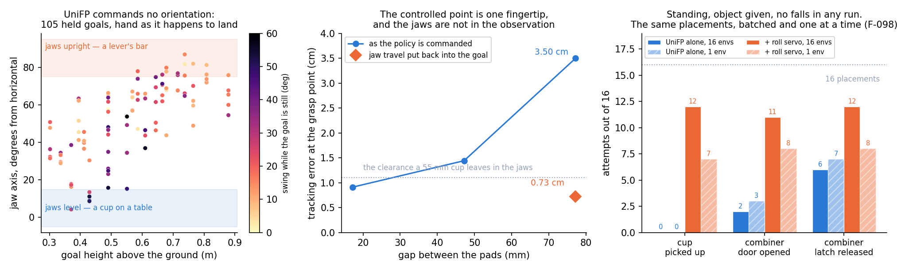

# Week 2 — 21–27 September 2026

**Status:** in progress
**Focus:** Select reusable methods; validate P0 candidate; freeze task/interface definitions and calibrate camera/tool frames

## Planned

From the [revised Thesis B plan](../../docs/thesis_b_plan.md#thesis-b-weekly-schedule),
16 September 2026. This replaces the original Appendix A timing; earlier dated logs remain historical evidence.

- **Reuse, simulation and learning:** Finish bounded UniFP and position-only reproduction attempts; select port versus retarget; validate candidate reaching and define slow pose trajectories plus pressing/box fixtures.
- **Hardware and camera:** Calibrate camera-to-base, tag-to-task and tool transforms; record real observations and replay them through robot-side inference with actuation disabled.
- **Evidence and deliverable:** Freeze sequence phases, box opening extent, tolerances, force bounds, comparison applicability, tool splits and evaluation manifests before substantive runs; calibrate contact definitions by Week 3.
- **Gate focus:** G0; candidate G1a; G4 begins. Implementation and scope decision.

## Checklist

- [ ] Reproduction levels and implementation choice recorded; legacy setup kept within its time budget
- [ ] Revised target workspace and zero-action baseline evaluated on frozen cases
- [ ] Candidate P0 evaluated with 100 frozen episodes; reaching claims distinguished from PPO diagnostics
- [ ] Task-command schema frozen: pose/force frames, units, timestamps, interpolation and tool registration
- [ ] Actual box sequence, loads, opening measurement, phase timeouts and tolerances documented
- [ ] Core pressing/box tasks and tool conditions selected; applicability and held-out cases frozen
- [ ] Camera/tag/tool calibration and recorded-state inference replay completed or blockers recorded
- [ ] Physical trial manifests and training budgets defined from pilot costs

## Log

### 2026-09-25 — The standing combiner demo under the mechanism policy: every door to a 16 N·m closer

**Why.** Lukas asked for a version of the standing combiner demo that uses the mechanism policy (F-108)
effectively. Run the old way — a scripted goal along the lever's and the door's arcs, a friction grip — it
wastes what that policy learnt. `./demos/unifp/run_demo.py --task combiner --mech` (`demos/unifp/mech.py`,
`mech_env.py`) runs it as it was trained: the jaw-centre tool point and 0.01 kg·m² armature, a roll command
instead of the wrist servo, a **claw** that hooks the lever bar when the grip closes (the training's grasp,
torn out above 150 N; Lukas's "the pincers become claws"), and while the claw holds, the **task layer's force
law** on how far the handle lags the script. The script is the old one; the box is the old one, plus an optional
door closer (`--door_torque_nm`, torque at 45°). 11 CPU tests (`demos/unifp/tests/test_mech_demo.py`): the claw,
the law's projection, cap, anti-windup and bleed, and that the roll command is exactly the quantity training
tracked (against `rewards.tool_roll`).

**Getting it to work** (16 placements each, seed 1, lever 0.4 N·m, free door). Every step recorded:

| run | change | opened | what it showed |
| --- | --- | --- | --- |
| [1](#/week/2/run/20260924T234230_combiner_mech_law_seed1) | as trained | 0 | the jaw centre arrives **5.1 cm** off, a steady offset (1–2 mm of spread over a hold's last second); the claw never hooks |
| [2](#/week/2/run/20260924T234455_combiner_mech_law_seed1) | + goal correction: integral action on the jaw centre's measured miss during the reach's holds | **15** | arrives **2.7 mm** off, all 16 hooked; but the law on both joints at once winds to its 80 N cap on a 5 N lever, claw spikes 106–133 N |
| [3](#/week/2/run/20260924T234720_combiner_mech_law_seed1) | law on one joint per phase (lever, then door) | 2 | alone the turn stops the lever at ~41°, short of the 45° release; the latched door then pulled to 80 N |
| [4](#/week/2/run/20260924T234916_combiner_mech_law_seed1) | lever in turn, both in crack, door after | 15 | claw still spikes 130 N in ease/pull: crack's lever integral carries over |
| [5](#/week/2/run/20260924T235124_combiner_mech_law_seed1) | hybrid position/force (goal on the handle along the driven joint, on the reference elsewhere), integral re-projected per phase | 4 | lever to 43° median; the turn is right at the edge |
| [6](#/week/2/run/20260924T235329_combiner_mech_law_seed1_turn60) | turn to the lever's 60° stop | 13 | |
| [7](#/week/2/run/20260924T235456_combiner_mech_law_seed1_turn60_4s) | and over 4 s | 14 | the lever **stalls** near 42° — a limit, not a lag: 6–10 N of claw force whatever the command (34 N) |
| [8](#/week/2/run/20260924T235707_combiner_mech_law_seed1_turn60_rollhold) | hold the roll once hooked (as training did) | 9 | the pads still squeeze the bar, so a held roll clamps the lever (15° by the end of the turn) — reverted |
| [9](#/week/2/run/20260924T235902_combiner_mech_law_seed1_turn60_poslead) | position-led turn (goal on the reference, law force added) | 12 | lever 44° median |
| [**10**](#/week/2/run/20260925T000100_combiner_mech_law_seed1_turn60_grasp95) | hook the lever **95 mm** out (was 75), and cap the door's force at 15 N while the latch holds | **16** | lever ≥ 44.5° by the end of the turn, 60° in crack; claw ≤ 21 N in turn–ease, peak 58 N |

Two things the policy cannot do here decided the configuration: arrive precisely (its training grasped wherever it
stopped), and push down on a short lever (6–10 N at most, the direction training barely asked for). Both are handled
in the task layer — the correction, and a longer lever arm with the reference at the stop — rather than in the policy.
The lever stays at 0.4 N·m for that reason: it, not the door, is the limit. `--mech` now defaults to run 10's settings.

**A stiffer door.** The same script, claw and placements, a door closer from 0 to 16 N·m (≈ 60 N at the handle):

```bash
COMMON="--task combiner --turn_deg 60 --lever_grasp_m 0.095 --attempts 16 --headless"
./demos/unifp/run_demo.py $COMMON --mech --door_torque_nm D                                  # the force law
./demos/unifp/run_demo.py $COMMON --mech --no_force_law --door_torque_nm D                   # the goal alone
./demos/unifp/run_demo.py $COMMON --wrist --claw --goal_correction --door_torque_nm D        # UniFP 56000 + wrist servo
```

| door closer | `--mech` | `--mech --no_force_law` | UniFP + wrist, same claw, correction and script |
| --- | --- | --- | --- |
| free | [**16/16**](#/week/2/run/20260925T000233_combiner_mech_law_seed1_door0_mechlaw), door 58° | [1/16](#/week/2/run/20260925T000337_combiner_mech_goal_seed1_door0_mechgoal) | [9/16](#/week/2/run/20260925T000439_combiner_unifp_wrist_claw_corr_seed1_door0_oldclaw) |
| 4 N·m | [**16/16**](#/week/2/run/20260925T000543_combiner_mech_law_seed1_door4_mechlaw), 44° | [0/16](#/week/2/run/20260925T000646_combiner_mech_goal_seed1_door4_mechgoal) | [3/16](#/week/2/run/20260925T000747_combiner_unifp_wrist_claw_corr_seed1_door4_oldclaw) |
| 8 N·m | [**16/16**](#/week/2/run/20260925T000850_combiner_mech_law_seed1_door8_mechlaw), 41° | [0/16](#/week/2/run/20260925T000953_combiner_mech_goal_seed1_door8_mechgoal) | [0/16](#/week/2/run/20260925T001053_combiner_unifp_wrist_claw_corr_seed1_door8_oldclaw) |
| 12 N·m | [**16/16**](#/week/2/run/20260925T001156_combiner_mech_law_seed1_door12_mechlaw), 40° | [0/16](#/week/2/run/20260925T001259_combiner_mech_goal_seed1_door12_mechgoal) | [0/16](#/week/2/run/20260925T001400_combiner_unifp_wrist_claw_corr_seed1_door12_oldclaw) |
| 16 N·m | [**16/16**](#/week/2/run/20260925T001503_combiner_mech_law_seed1_door16_mechlaw), 35° | [0/16](#/week/2/run/20260925T001607_combiner_mech_goal_seed1_door16_mechgoal) | [0/16](#/week/2/run/20260925T001708_combiner_unifp_wrist_claw_corr_seed1_door16_oldclaw) |

No falls and no tears in any of the 15 runs ([figure](figures/combiner_mech_sweep.png),
[`combiner_mech_sweep.py`](figures/combiner_mech_sweep.py)). Without the law the policy yields to the lever's spring
(the latch released in 1–4 of 16) — the compliance it was trained with when no force is commanded (F-105). The old
controller hooks the lever in only 8–12 of 16 even with the correction, and fails as soon as the door resists.
What the force costs: the claw peaks at a median 47, 57, 74, 103 and 100 N across the closers (its limit 150), and
the door ends 35–40° open at 12–16 N·m, not the scripted 50°, inside the script's clock (success is 30°).

Checks: `--mech` with its defaults at 8 N·m [16/16, door 40.5°](#/week/2/run/20260925T001948_combiner_mech_law_seed1_defaults16) (the
sweep's run exactly) and [one environment at a time, 16/16, 40.8°](#/week/2/run/20260925T002051_combiner_mech_law_seed1_defaults_env1) —
not the environment-count sensitivity of F-098 — and on **placements it was not tuned on** (seed 2):
[16/16 at 8 N·m](#/week/2/run/20260925T002850_combiner_mech_law_seed2_seed2_door8) and
[16/16 at 16 N·m](#/week/2/run/20260925T002953_combiner_mech_law_seed2_seed2_door16), door 41° and 35°, jaws arriving 3.4 and 2.7 mm off.

For running it elsewhere the policy was copied to `checkpoints/unifp_go2d1_mech_law_model_17499.pt` (identical
SHA-256 to the `logs/` original, added to `SHA256SUMS`) and `--mech` now defaults to it; a run from that path with the
welded USD rebuilt, as on a fresh machine,
[opened 4 of 4 at 8 N·m](#/week/2/run/20260925T013237_combiner_mech_law_seed1_checkpoint_path_check).

What it does not show: the claw, the springs and the latch are models (the latch a joint limit); the lever is 0.4 N·m;
the task layer reads the box's joint angles, as tags on the lever and the door would have to report them; the reach
needs the goal correction, which assumes accurate arm kinematics; nothing has run on the robot, and the arm's motors
are at their limits while it pulls (F-108).

### 2026-09-25 — The goal is the input, continued: paying for the push, the task layer's force law, and a held-out test

**In short.** Given only where a held handle should go, a policy has to be paid for pushing while the mechanism has
not yet given (v1 stalled at ~30 N; F-105). Paid for it, an end-to-end goal policy opens 80 N drawers, latches and doors
but cannot push a button (F-107). Better: a task layer that turns the handle's lag into a force command (a PI law,
F-106), with the whole-body policy trained *with that layer in the loop* — on a held-out test set it opens every drawer,
latch and door to 80 N (two seeds) and, in the best run, 120 of 128 buttons, leaning back into pulls and forward onto
the push (F-108). Lifting is a limit of the D1 itself (2.8 N median upward, arm alone). Not solved: a force limit the
policy keeps to (F-109), the lunge when a latch lets go, pushing across seeds, and an arm that runs at its torque limits.
Every mechanism number is invented; no hardware was involved.

Continues the entry below. v1 stalled at ~30 N because nothing paid for pushing harder until a
mechanism gave. v2 adds one term, `mech_push` (weight 2.0): the newtons driven toward the reference,
per 50 N and capped at 100, times `1 − progress`, so it vanishes on the reference. With `mech_progress`
at 4.0, closing the gap is worth more than pushing from behind for any drive under the cap, so sitting
short to collect it never pays (`tests/test_mechanism.py` checks the total rises monotonically as the
error shrinks at 20, 60 and 99 N). Nothing else changed.

```bash
./run_unifp_train.py train --task mechanism --num_envs 4096 --iterations 2500 --headless \
    --resume_from logs/unifp_train/20260924T132337_train_seed1_mech_v1/model_13800.pt --run_name mech_v2
```

| `mech_v2` | drawer | latch | door | button | total | largest drive at 60 / 80 N (drawer, door) |
| --- | --- | --- | --- | --- | --- | --- |
| [`model_14200`](#/week/2/run/20260924T142600_mech_eval_seed1_mech_eval_v2_14200) (400 it.) | 17 | 35, cap. 10 N | 21, 10 N | 33, 10 N | 106 | 37 / 37 N; 37 / 37 N |
| [`model_14600`](#/week/2/run/20260924T144617_mech_eval_seed1_mech_eval_v2_14600) (800 it.) | 38 | 57, cap. **30 N** | 28, 10 N | 28, 10 N | 151 | **55 / 69 N; 53 / 63 N** |

At 800 iterations the drive **climbs with the resistance** — 10, 21, 33, 39, 48, 55, 61, 69 N on the drawer
for 10–80 N — where v1's was flat at ~30 N: the push term did what it was for. It does not yet open
most of them (the drawer at 60 N: 2 of 15, with a median largest drive of 55 N), but it is learning.

| `mech_v2` | drawer | latch | door | button | total |
| --- | --- | --- | --- | --- | --- |
| [`model_15000`](#/week/2/run/20260924T150554_mech_eval_seed1_mech_eval_v2_15000) (1,200 it.) | 48 | 40 | **95, cap. 40 N** | 21, 10 N | **204** |

[The run](#/week/2/run/20260924T140435_train_seed1_mech_v2) was stopped at 15,049 (64 min; curriculum at
65 N, frontier EMA ~0.5). At 15,000 the drive on the door and the drawer follows the resistance to
**84 and 80 N** at 80 N peaks (door: 13 of 15 open at 80 N), but it is uneven in two ways the per-episode
record shows:

- *Short mechanisms get too little push signal.* The latch's drive is flat at ~27 N at 40–80 N and the
  button's at ~19 N; at 10 N, 8 of 15 latches never moved, driven with 9.7–10.1 N against a 10 N latch —
  hovering at the threshold. `mech_push` pays in proportion to the progress lost, and at the fixed 2 and
  8 cm widths a 3 cm latch or a 1.5 cm button that has not moved at all still scores 0.45 or 0.65: it can
  never lag by more than its travel, so pushing on it pays half what pushing on a drawer does.
- *Weak drawers stop short.* At 10 N, 8 of 15 ended at 59–84% of the travel (a proportional offset: at
  small lags nothing much pays for the last centimetres of a light drawer), while at 70 N, 8 of 15 opened.

So **v3**: the progress widths scale with a short mechanism's travel, capped at 0.3× and 1.0× of it
(`mech_cfg.PROGRESS_*_PER_TRAVEL`; a 1.5 cm button gets 4.5 mm and 1.5 cm, a drawer or a door keeps
2 and 8 cm). `mech_push` shares the shape, so the property that closing the gap always pays more than
pushing from behind is kept (tested at 1.5 cm travel too). Nothing else changes.

```bash
./run_unifp_train.py train --task mechanism --num_envs 4096 --iterations 2000 --headless --peak_ceiling 50 \
    --resume_from logs/unifp_train/20260924T140435_train_seed1_mech_v2/model_15000.pt --run_name mech_v3
```

[The run](#/week/2/run/20260924T150908_train_seed1_mech_v3) was stopped at 16,006 (48 min; curriculum at 70 N).

| `mech_v3`, goal only | drawer | latch | door | button | total |
| --- | --- | --- | --- | --- | --- |
| [`model_15400`](#/week/2/run/20260924T152816_mech_eval_seed1_mech_eval_v3_15400) (400 it.) | 64, cap. 20 N | 90 | 90, 30 N | 23, 10 N | 267 |
| [`model_15800`](#/week/2/run/20260924T154721_mech_eval_seed1_mech_eval_v3_15800) (800 it.) | 90 | 111, 80 N | 110 | 14 | 325 |
| [**`model_16000`**](#/week/2/run/20260924T155944_mech_eval_seed1_mech_eval_v3_16000) (1,000 it.) | **111, cap. 70 N** | **120, 80 N** | **114, 80 N** | 13, 0 | **358** |

**Given only where the handle should go, `model_16000` opens more than the hierarchical baseline (358
against 337), with 70–80 N capacity on all three pulls** — every latch at every level to 80 N, the door 12 of 15
at 80 N — and no falls or tears. Two things it does not do:

- *Push.* 13 of 120 buttons; the drive is flat at ~21 N from 30 N up. It pushes with the base pitched
  **7.6° nose-up** — leaning *away* from the button (`model_15400`, peaks ≥ 40 N, median) — where the
  hierarchical baseline leans 12° nose-down into it and drives 38 N. The lean-back of the pull task has
  carried over whichever way the handle must go; the only cue that this one needs a push is a goal 1.5 cm
  ahead, where a force command says it outright.
- *Stop.* [Beyond capacity](#/week/2/run/20260924T160232_mech_eval_seed1_mech_eval_v3_16000_stuck) it opens
  12 of 15 drawers and latches and 11 doors at **100 N**, drives **128–132 N** at 150 N, and 3 of 15 drawers
  there are torn out of the claw at its 150 N limit. Nothing in it limits force but the grip and a small
  effort price; the law's 80 N cap is the hierarchical version's limit by construction.

[Held out](#/week/2/run/20260924T160120_mech_eval_seed1_mech_eval_v3_16000_heldout): lid 0 of 120 (it lifts the
lid ~1.7 cm, lets it fall shut, and stops trying — 1 N of drive with the reference 21 cm up the arc), bolt 31
(drive flat at ~10 N sideways). No better than the baseline at new directions.
[Free space](#/week/2/run/20260924T160339_eval_seed1_free_mech_v3_16000): 3.3 cm quiet tracking, 3 of 50 falls.

**Off design, and the most telling number of the day**: `model_15800` *under the force law*
([run](#/week/2/run/20260924T154917_mech_eval_seed1_mech_eval_v3_15800_forcelaw)) — a policy never trained with
a force command, given one — opens **398 of 480**: all 120 drawers, latches and doors (capacity 80 N on each)
and 38 buttons. But **23 handles were torn out**, every one of them 0.04–6 s *after* the mechanism had opened:
the handle reaches its stop at speed, the stop halts it, the body behind it does not stop, and the grasp
spring passes 150 N (p99 grasp force while held 102 N, max 153 N). The body skill and the law's integral
action and direction are complementary, and the combination needs to learn to stop. That is the next run.

**The hierarchical version trained with the law in the loop** (`mech_law_v1`): the task layer's law writes the
force command in training too, the goal sits on the handle, the pull task's force-tracking term comes back (4.0)
and `mech_push` goes (`mech_cfg.LAW_WEIGHT_CHANGES`). Warm-started from `mech_v3` `model_16000`, since that policy
has the body skill and — the off-design run shows — still follows a force command.

```bash
./run_unifp_train.py train --task mechanism --force_law --num_envs 4096 --iterations 1500 --headless --peak_ceiling 60 \
    --resume_from logs/unifp_train/20260924T150908_train_seed1_mech_v3/model_16000.pt --run_name mech_law_v1
./run_unifp_train.py mech_eval --task mechanism --force_law --headless --checkpoint <model.pt>
```

| law-trained, under the law | drawer | latch | door | button | total | torn | latch peak speed at 80 N |
| --- | --- | --- | --- | --- | --- | --- | --- |
| [`model_16400`](#/week/2/run/20260924T161836_mech_eval_seed1_mech_eval_law_v1_16400) (400 it.) | 119, cap. 80 N | 120, 80 N | 114, 80 N | 31, 20 N | **384** | **0** | 1.10 m/s |
| [`model_16800`](#/week/2/run/20260924T163819_mech_eval_seed1_mech_eval_law_v1_16800) (800 it.) | 114, 80 N | 118, 80 N | 102, 30 N | **95, 40 N** | **429** | 3 (buttons) | |

Between 400 and 800 iterations the button went from 31 to 95 opened, and the posture shows how: at peaks ≥ 40 N
the base pitched **−6.6° (leaning back) at 16,400 and +3.1° (leaning in) at 16,800**, and the drive doubled,
25 → 50 N. The door meanwhile leans back harder (−11.6 → −21.6°) and slipped from 114 to 102. The force command
tells the policy which way the handle has to go; the goal-only policy (F-107) never learned to lean into a push.

| law-trained, under the law | drawer | latch | door | button | total | torn |
| --- | --- | --- | --- | --- | --- | --- |
| [`model_17200`](#/week/2/run/20260924T165725_mech_eval_seed1_mech_eval_law_v1_17200) (1,200 it.) | 118, 80 N | 120, 80 N | 120, 80 N | 120, 80 N | 478 | 0 |
| [**`model_17499`** (final)](#/week/2/run/20260924T171328_mech_eval_seed1_mech_dev_law_v1_17499) | 120, 80 N | 120, 80 N | 120, 80 N | 120, 80 N | **480** | **12 (buttons)** |

[The run](#/week/2/run/20260924T155754_train_seed1_mech_law_v1) completed its 1,500 iterations (75 min).
**The development set is saturated**, and it has been used to pick every reward change and to read every
checkpoint today, so it no longer says much. Hence a **held-out test condition**, frozen before any policy was
scored on it (`mech_eval --mech_test`, `mech_cfg.TEST_*`): 16 handle placements between and beyond the
development grid (heights 0.25–0.55 m, bearings ±0.2 and ±0.55 rad, 0.42 m reach), twice the moving mass
(2 kg), a softer grasp (1,400 N/m), a faster reference (0.15 m/s) and more damping (12 N·s/m); same kinds and
levels, 512 episodes. The final checkpoint was named as the one to report before it was scored there.

| **Test set**, 128 per kind | drawer | latch | door | button | total | torn |
| --- | --- | --- | --- | --- | --- | --- |
| [Pull v4 + force law](#/week/2/run/20260924T170003_mech_eval_seed1_mech_test_v4_forcelaw) (F-106) | 109, 60 N | 104, 60 N | 81, 30 N | 44, 20 N | 338 | 0 |
| [`mech_v3` `model_16000`, goal only](#/week/2/run/20260924T170120_mech_eval_seed1_mech_test_v3_16000) (F-107) | 105, 60 N | 123, 80 N | 112, 0 | 6, 0 | 346 | 0 |
| [**`mech_law_v1` `model_17499` + force law**](#/week/2/run/20260924T171443_mech_eval_seed1_mech_test_law_v1_17499) | **128, 80 N** | **128, 80 N** | **128, 80 N** | **120, 80 N** | **504** | **0** |

The ranking and the margins carry over from the development set. The final hierarchical policy opens 504 of 512,
every drawer, latch and door at every level to 80 N — the most tested — and 120 of 128 buttons; no falls.

Figures: [`mech_capacity.png`](figures/mech_capacity.png) (development set: opened and largest drive by
resistance, for the five controllers), [`mech_capacity_test.png`](figures/mech_capacity_test.png) (the test set) and
[`mech_posture.png`](figures/mech_posture.png) (base pitch at the largest drive), all redrawn from the recorded
runs by [`mech_capacity.py`](figures/mech_capacity.py) and [`mech_posture.py`](figures/mech_posture.py). The
posture figure shows what the mechanism training taught: both trained policies lean back more the harder the
pull (12–17° by 40 N), where the untrained pull policy under the law stays within ±4° (and has the weaker door);
on the button the law-trained policy leans in (to 8°), the goal-only one back (~5°) at every level.

How it does it, and what it costs (development set unless said): the base leans **back 15°** into pulls
(drawer, door, latch at ≥ 40 N) and **in 8–9°** onto the button; the arm's motors are at their limits
(p95 load 1.00 at every level ≥ 20 N) — the body adds force, it does not yet relieve the arm. The handle lunges
at **0.5–1.2 m/s** when a latch or a button lets go (test: 0.4–0.8 m/s), against a 0.10–0.15 m/s reference.

Where it breaks:

- *The 12 torn buttons* (development set) all tore 2.5–10 s after the button was fully pressed: the policy keeps
  pushing into the stop, the law's integral holds its force there (the lag is zero at the stop, so nothing bleeds
  it off), and a spike eventually passes the 150 N grip. A flaw in my law, not only the policy: an integral that
  decays once the handle has arrived would fix the hold phase. Not on the test set (softer grasp, more mass).
  **Fixed in the law, not the policy**: `--force_law_bleed 1.0` lets the integral decay with a 1 s time constant
  while the handle is within 5 mm of its reference (`mech_cfg.FORCE_LAW_ARRIVED_M`). Same checkpoint:
  [buttons 120 of 120, none torn](#/week/2/run/20260924T172316_mech_eval_seed1_mech_eval_law_v1_17499_bleed_button);
  [development set 480 of 480, none torn](#/week/2/run/20260924T172436_mech_eval_seed1_mech_dev_law_v1_17499_bleed);
  [test set 503 of 512, none torn](#/week/2/run/20260924T172551_mech_eval_seed1_mech_test_law_v1_17499_bleed) (one
  button fewer than without). Lunge speeds unchanged. Evaluated with, not trained with, the bleed.
- *[Beyond capacity](#/week/2/run/20260924T171744_mech_eval_seed1_mech_eval_law_v1_17499_stuck)* it opens every
  100 N drawer, latch, door and button (15 of 15 each) and drives 113–134 N at 150 N; 13 of 15 buttons at 150 N
  were torn out. **The law's 80 N cap does not limit this policy** — trained on the progress reward as well, it
  pushes past its command when stuck. A force limit would have to be enforced outside the policy, or trained
  in (the effort term is too weak to be one). *Later check:* the excess is transient — over the last 5 s held
  against the 150 N pulls the median drive is 57.7 N (p90 64.7), under the cap; the 113–134 N are peaks while the
  force is being built, and those are what open the 100 N mechanisms and tear the 150 N buttons.
- *[Held out](#/week/2/run/20260924T171636_mech_eval_seed1_mech_eval_law_v1_17499_heldout)*: bolt 54 of 120 (the
  baseline 18, v3 31); **lid 0 of 120** — lifted to 12% of the arc (median; 72% at best), then it falls shut and the
  drive drops to ~0.5 N with the arm saturated, whatever the law commands. The arm's upward capacity (above).
- *[Free space](#/week/2/run/20260924T171849_eval_seed1_free_mech_law_v1_17499)*: 3.8 cm quiet tracking, 3 of 50 falls
  on UniFP's walking-and-push manifest.

**Control: is the end-to-end detour needed?** `mech_law_v1` inherited v3's body skill. The same hierarchical
training started from the plain pull policy:

```bash
./run_unifp_train.py train --task mechanism --force_law --num_envs 4096 --iterations 1500 --headless --peak_ceiling 40 \
    --resume_from logs/unifp_train/20260924T080558_train_seed1_hook_pull_v4/model_13000.pt --run_name mech_law_from_v4
```

At 600 iterations ([`model_13600`](#/week/2/run/20260924T174544_mech_eval_seed1_mech_eval_law_from_v4_13600),
development set, law with the bleed): drawer 119, latch 116, door 119, button 71 — **425 of 480**, one tear. The
end-to-end detour is not what made `mech_law_v1` work: training the plain pull policy with the law in the loop
gets most of the way in 600 iterations.

[The run](#/week/2/run/20260924T171311_train_seed1_mech_law_from_v4) completed its 1,500 iterations (76 min).
Final `model_14499`, law with the bleed:

| law-in-loop from pull v4 | drawer | latch | door | button | total | torn / fell |
| --- | --- | --- | --- | --- | --- | --- |
| [development](#/week/2/run/20260924T183011_mech_eval_seed1_mech_dev_law_from_v4_14499) | 120, 80 N | 120, 80 N | 120, 80 N | 104, 50 N | 464 of 480 | 1 / 0 |
| [**test**](#/week/2/run/20260924T183123_mech_eval_seed1_mech_test_law_from_v4_14499) | 128, 80 N | 128, 80 N | 128, 80 N | 109, 30 N | **493 of 512** | 0 / 3 (doors) |

Every pull at every level, from the plain pull policy in 1,500 iterations; the long chain (`mech_law_v1`, 504 of
512) is ahead only on buttons, and it had had ~2,850 more iterations on this task, so the comparison is not
compute-matched. **The recipe does not need the end-to-end stage.** (Two evaluation launches before these
failed at `import isaaclab` — my shell had not activated the environment — and made no run directory.)

**Law v2: a limit the policy keeps to** (`--law_variant v2`, `mech_cfg.LAW_V2_*`), from the control's final
checkpoint, 1,000 iterations: the law's cap drawn per episode from 30–100 N, `mech_overforce` (−1.0 per (10 N)²
of drive beyond the command plus 10 N), `mech_overspeed` four times heavier (−20), the integral bleed in training.

```bash
./run_unifp_train.py train --task mechanism --force_law --law_variant v2 --num_envs 4096 --iterations 1000 --headless \
    --peak_ceiling 70 --resume_from logs/unifp_train/20260924T171311_train_seed1_mech_law_from_v4/model_14499.pt --run_name mech_law_v2
```

[Completed](#/week/2/run/20260924T182947_train_seed1_mech_law_v2), 48 min. Final `model_15498`, law with the bleed,
against the control it started from (`model_14499`, same lineage without v2's changes):

| | development | test | beyond capacity (100 N pulls opened) | 40 N budget: 60–80 N mechanisms opened | bolt (held out) | lid |
| --- | --- | --- | --- | --- | --- | --- |
| control `model_14499` | [464](#/week/2/run/20260924T183011_mech_eval_seed1_mech_dev_law_from_v4_14499) | [493](#/week/2/run/20260924T183123_mech_eval_seed1_mech_test_law_from_v4_14499) | — | [110 of 180](#/week/2/run/20260924T192147_mech_eval_seed1_mech_budget40_law_from_v4_14499) | [112, **21 torn**](#/week/2/run/20260924T192124_mech_eval_seed1_mech_heldout_law_from_v4_14499) | 0 |
| law v2 `model_15498` | [464](#/week/2/run/20260924T191830_mech_eval_seed1_mech_dev_law_v2) | [477](#/week/2/run/20260924T191856_mech_eval_seed1_mech_test_law_v2) (buttons 93) | [45 of 45](#/week/2/run/20260924T191922_mech_eval_seed1_mech_stuck_law_v2) | [102 of 180](#/week/2/run/20260924T191944_mech_eval_seed1_mech_budget40_law_v2) | [**116, none torn**](#/week/2/run/20260924T192009_mech_eval_seed1_mech_heldout_law_v2) | [0](#/week/2/run/20260924T192009_mech_eval_seed1_mech_heldout_law_v2) |

**v2 did not make the cap a limit.** Commanded at most 40 N, both policies drive 70–82 N (peak) at 70–80 N
mechanisms and open most of them; v2's over-force term only held back the heavy doors (2 of 15 at 80 N against
12). Lunges at 40–80 N moved a little (drawer 0.80 → 0.70, door 0.87 → 0.72, latch 0.90 → 0.83, button 0.79 →
0.88 m/s). What v2 did do: the held-out sideways bolt, which the control opens 112 of 120 but **tears 21 out of the
claw**, v2 opens 116 of 120 with none torn — the lunge and over-force prices at work on an unseen direction. It
costs some pushing (test buttons 109 → 93). [Free space](#/week/2/run/20260924T192031_eval_seed1_free_mech_law_v2):
4.1 cm quiet tracking, 3 of 50 falls.

The reading: while the outcome reward is in the loop, the policy treats the force command as advice, and a
−1.0 price per (10 N)² does not outweigh opening the mechanism. **Law v3** removes the outcome reward — a pure
force-follower, the task layer owning both the escalation and the limit — and prices over-force four times
higher (`mech_cfg.LAW_V3_WEIGHT_CHANGES`); same start, same 1,000 iterations:

```bash
./run_unifp_train.py train --task mechanism --force_law --law_variant v3 --num_envs 4096 --iterations 1000 --headless \
    --peak_ceiling 70 --resume_from logs/unifp_train/20260924T171311_train_seed1_mech_law_from_v4/model_14499.pt --run_name mech_law_v3
```

[Completed](#/week/2/run/20260924T192248_train_seed1_mech_law_v3), 48 min. The three from the same start, final
checkpoints, law with the bleed (the 40 N budget and "beyond capacity" runs keep an 80 N or 40 N cap on the law):

| | control `14499` | law v2 `15498` | law v3 `15498` |
| --- | --- | --- | --- |
| development, of 480 | 464 | 464 | [435](#/week/2/run/20260924T201109_mech_eval_seed1_mech_dev_law_v3) |
| **test**, of 512 (drawer / latch / door / button) | **493** (128/128/128/109) | 477 (128/128/128/93) | [457](#/week/2/run/20260924T201135_mech_eval_seed1_mech_test_law_v3) (119/121/104/**113**) |
| 40 N budget: 60–80 N mechanisms opened, of 180 | 146 | 113 | [**56**](#/week/2/run/20260924T201222_mech_eval_seed1_mech_budget40_law_v3) |
| 80 N cap: 100 N mechanisms opened, of 60 | — (v1: 60) | 56 | [**15**](#/week/2/run/20260924T201200_mech_eval_seed1_mech_stuck_law_v3) |
| 80 N cap, 150 N: drive held (last 5 s) / peak, medians | — (v1: 57 / 120 N) | 61 / 115 N | **39 / 105 N** |
| held-out bolt, of 120 | 112 (21 torn) | **116** (0 torn) | [41](#/week/2/run/20260924T201247_mech_eval_seed1_mech_heldout_law_v3) |
| free space: quiet tracking, falls of 50 | — | 4.1 cm, 3 | [3.7 cm, 2](#/week/2/run/20260924T201309_eval_seed1_free_mech_law_v3) |

**Dropping the outcome reward mostly makes the cap a limit, and costs capacity and generality.** Under a 40 N budget,
v3 opens 56 of the 180 mechanisms that need 60–80 N (control 146), and under an 80 N cap 15 of 60 at 100 N (v2 56);
it holds 39 N against an unopenable one. It gives up the door past 50 N and the unseen bolt (41 against v2's 116),
and pushes best of the three (113 buttons). **None bounds the peaks**: v3's largest transient drive at a 150 N
mechanism is still ~105 N against an 80 N cap. So the trade-off is real and I have not resolved it: the outcome
reward buys capacity and generalisation and costs obedience; a limit that bounds peaks needs something other than a
squared penalty on them — a hard clamp in the task layer on the *measured* force, or a termination.

**A second seed of the recipe** (law in the loop from the pull policy; the control, seed 2), to see how much of the
control's 493 is the seed:

```bash
./run_unifp_train.py train --task mechanism --force_law --seed 2 --num_envs 4096 --iterations 1500 --headless \
    --peak_ceiling 40 --resume_from logs/unifp_train/20260924T080558_train_seed1_hook_pull_v4/model_13000.pt \
    --run_name mech_law_from_v4_seed2
```

[Completed](#/week/2/run/20260924T201420_train_seed2_mech_law_from_v4_seed2), 72 min. Final `model_14499`, law with the
bleed, against seed 1:

| law in the loop from pull v4 | development, of 480 | **test, of 512** (drawer / latch / door / button) | test buttons: capacity |
| --- | --- | --- | --- |
| seed 1 | 464 | **493** (128 / 128 / 128 / 109) | 30 N |
| [seed 2](#/week/2/run/20260924T212713_mech_eval_seed1_mech_test_law_from_v4_seed2) | [420](#/week/2/run/20260924T212648_mech_eval_seed1_mech_dev_law_from_v4_seed2) | **450** (128 / 128 / 128 / 66) | 20 N |

(At 600 iterations: [seed 2 360](#/week/2/run/20260924T204601_mech_eval_seed1_mech_eval_law_from_v4_seed2_13600) of 480
against seed 1's 425.) **The pulls reproduce exactly** — both seeds open every drawer, latch and door on the test set
to 80 N — **and the push does not**: 66 of 128 buttons against 109. Seed 2 continues for another 1,000 iterations to
see whether pushing is only slower:

```bash
./run_unifp_train.py train --task mechanism --force_law --seed 2 --num_envs 4096 --iterations 1000 --headless --peak_ceiling 80 \
    --resume_from logs/unifp_train/20260924T201420_train_seed2_mech_law_from_v4_seed2/model_14499.pt --run_name mech_law_from_v4_seed2_cont
```

[Completed](#/week/2/run/20260924T212757_train_seed2_mech_law_from_v4_seed2_cont), 47 min. Final `model_15498` (2,500
iterations on the task in all): [development 459 of 480](#/week/2/run/20260924T221542_mech_eval_seed1_mech_dev_law_from_v4_seed2_cont)
(buttons 101), [**test 480 of 512**](#/week/2/run/20260924T221608_mech_eval_seed1_mech_test_law_from_v4_seed2_cont) —
every drawer and door, 127 of 128 latches, **97 of 128 buttons** (capacity 30 N), no falls, no tears. Pushing is slower
and more seed-dependent to learn than pulling, but it keeps improving with training (66 → 97; seed 1 had 109 at 1,500).

Four hundred iterations took the tears from 23 to none and kept the pulls: 80 N capacity on all three.
Still weak: the button (31, below the untrained baseline's 49) and the lunge at release (0.7–1.1 m/s).

*Why nothing lifts.* In training at this point the law-trained policy opened 96% of pulls toward it, 55% of
sideways slides, 47% of pushes and **7% of lifts** (v3: 91 / 29 / 39 / 18%). The static model of F-101 asked
along each direction, over the same reachable postures in the goal shell, arm alone
([`figures/direction_capacity.py`](figures/direction_capacity.py), CPU; [result](figures/direction_capacity.json)):

```bash
PYTHONPATH=. python3 results/week_02/figures/direction_capacity.py
```

| arm alone, level base | p10 | median | p90 | p99 | binds most |
| --- | --- | --- | --- | --- | --- |
| back toward the robot | 5.6 | 9.3 | 14.6 | 22.6 N | Joint1 |
| away from it | 5.0 | 9.2 | 15.2 | 24.2 N | Joint1 |
| **up** | **1.6** | **2.8** | 6.9 | **11.8 N** | Joint3 |
| down | 7.5 | 9.4 | 14.2 | 21.6 N | Joint3 |
| sideways | 4.5 | 8.4 | 14.0 | 21.8 N | Joint3 |

Lifting is the D1's weakest direction by a factor of three: gravity already takes most of Joint3's torque
(F-102: 69% holding the default pose), and leaning, which is how the body adds to a pull or a push, adds
nothing upward — only standing taller could, by a few centimetres. So the lid is mostly physics, not a policy
that failed to learn. **For the real box this matters: a latch or lever that has to be lifted is the hardest
thing this robot can be asked to do.**

*What it costs in free space* ([UniFP's frozen validation manifest](#/week/2/run/20260924T144831_eval_seed1_free_mech_v2_14600),
`eval --task hook --fixture_fraction 0`, `model_14600`): goal tracking in the quiet windows **3.2 cm median
(p90 4.1)** — tighter than the pull policy's 7.1 and the warm start's 4.5, the rigid target at work — but
**4 of 50 episodes fell** (the pull policy: 0). The manifest walks and pushes the tool with UniFP's force
commands, and this policy was trained with neither (the force channel is zero and there are no pushes);
the four falls came with base-velocity errors of 0.6–0.8 m/s. So it is a narrower controller, as designed,
and should not be used for UniFP's task.

**The baseline this has to beat: the goal turned into a force by the task layer.** Before v2 had
anything to show, the obvious alternative was measured. The pull policy follows a force command; a
task layer that knows the path (tags) and the handle's position can make one from the handle's lag
behind its reference, `F = kp lag + ki ∫lag` along the path (integral reset when it would push the
other way; clamped to 80 N), with the goal held on the handle as the pull task trained
(`mech_env.set_force_law`, `mech_cfg.FORCE_LAW_*`). Gains chosen before running it: 10 N at 2.5 cm of
lag, and the integral ramping ~30 N/s per 3 cm of lag, about the pull task's 25 N/s command ramp.

```bash
./run_unifp_train.py mech_eval --task mechanism --headless --force_law [--force_law_gains KP KI MAX] \
    --checkpoint logs/unifp_train/20260924T080558_train_seed1_hook_pull_v4/model_13000.pt
```

| Pull v4 `model_13000` + force law | drawer | latch | door | button | total opened | latch peak speed, 40→70 N |
| --- | --- | --- | --- | --- | --- | --- |
| [ki 500](#/week/2/run/20260924T140754_mech_eval_seed1_mech_eval_v4_forcelaw_ki500) | 109, cap. 70 N | 100, 60 N | 70, 40 N | 46, 30 N | 325 | 0.55 → 0.90 m/s |
| [**ki 1000** (as chosen)](#/week/2/run/20260924T140553_mech_eval_seed1_mech_eval_v4_13000_forcelaw) | 111, **70 N** | 100, **60 N** | 77, **40 N** | 49, **30 N** | **337** | 0.57 → 0.90 m/s |
| [ki 2000](#/week/2/run/20260924T140909_mech_eval_seed1_mech_eval_v4_forcelaw_ki2000) | 110, 70 N | 104, 70 N | 86, 40 N | 49, 30 N | 349 | 0.59 → 0.91 m/s |

Of 120 per kind; no falls, no tears in any. **Without retraining anything, the hierarchical version opens
four times what `mech_v1` does** (337 against 79–89), with capacities of 70 N on the drawer and 60 N on the
latch — the pull policy's 60–70 N (F-103), now reached without anyone knowing the force. It is not
sensitive to the gain: halving or doubling `ki` moves the total by 12. It drives 67–75 N at 80 N
peaks (pitch within ±3°; the base shifts 9–12 cm). What it does badly:

- *The lunge.* When a latch lets go at 40–70 N the handle hits 0.55–0.90 m/s against a 0.10 m/s reference,
  the same at every gain — so it is the stored force and the policy's reaction time, not the law's
  integral. Nobody falls, but a real latch would slam into its stop.
- *Pushing.* The button's capacity is 30 N; the most push it makes is ~37–40 N, nose-down 11–13°. The pull
  policy was never trained to push (press fraction 0 in v4), and its force estimator reads ~5 N there
  against a true 30–40 N.
- *The door.* 40 N: the hinge's arc turns the pull sideways as it opens, and the policy was trained on
  fixed axes.

[Beyond its capacity](#/week/2/run/20260924T141332_mech_eval_seed1_mech_eval_v4_forcelaw_stuck) (peaks of
100 and 150 N, 120 episodes) it fails safe: no falls, no tears, 72–77 N held against the law's 80 N
cap for the whole 14 s. A wiring check of the law inside the *training* environment
([play, 64 envs](#/week/2/run/20260924T141214_play_seed1_mech_law_play_v4)) ran clean: 77 N peak grasp
force at a 60 N ceiling, nothing torn.

*Held-out mechanisms.* Two opt-in evaluation kinds (`--mech_kinds lid bolt`) use directions training
draws but geometries it does not: a **lid** on a level hinge 20 cm beyond the handle, lifted 60° against
mostly its own weight (a spring with a 0.9 preload), and a sideways **bolt**, 6 cm outward, nearly all
stiction. [The baseline on them](#/week/2/run/20260924T142833_mech_eval_seed1_mech_eval_v4_forcelaw_heldout):
**lid 0 of 120** (it drives 2–5 N upward whatever it is asked) and **bolt 18 of 120, capacity 10 N**
(~18 N sideways at most). The pull policy follows force commands only in the directions it was trained
to pull in (back toward the robot, ±0.35 rad of elevation), so the hierarchical version inherits them.

### 2026-09-24 — The goal is the input: a mechanism the robot holds, whose resistance it is never told

**Why.** The pull task below commands a *force*, and on a real box nobody knows that number. Lukas
asked to investigate the alternative: the robot already has hold of the handle (the premise, not a
skill), is told only where the handle should go, and uses its body if the arm is not enough. There is
no hardware to measure yet, so the mechanisms are invented and drawn from wide ranges. Still not a
plan change; `docs/thesis_b_plan.md` is untouched.

**The task** (`--task mechanism`: [`mechanism.py`](../../unifp_train/mechanism.py),
[`mech_cfg.py`](../../unifp_train/mech_cfg.py), [`mech_env.py`](../../unifp_train/mech_env.py),
[`mech_rewards.py`](../../unifp_train/mech_rewards.py), [`mech_eval.py`](../../unifp_train/mech_eval.py)).

- *The plant.* A one-degree-of-freedom mechanism stepped at the 200 Hz physics rate: a slide (drawer,
  bolt, latch, button) or a hinge (door, lid), opening back toward the robot, away from it, sideways or
  up. It resists with a spring and preload toward closed, stiction then kinetic friction, damping, and in
  half the draws a latch that holds until the force passes it and then lets go at once — the snap of a
  latch or an emergency stop, which leaves whatever force the robot built up suddenly unopposed. Hard
  stops at closed and fully open. The claw holds the handle through a 3-D spring (1,000–3,000 N/m, a
  ball joint: no torque), which tears out above 150 N.
- *What is drawn.* The peak force opening needs, under a curriculum ceiling (15 N, +5 N whenever 70%
  of the frontier episodes open, to 80 N), split at random between spring, stiction and latch so the
  peak is exact; mass 0.3–3 kg; travel shortened until the whole path stays where the robot can work.
- *The command.* A reference point sliding along the path at 0.05–0.20 m/s: open 60–100%, hold, then
  anywhere along it, closing included. It goes into UniFP's own goal channel; the force channel is zero.
  Nothing about the resistance is observed. **UniFP's virtual spring is made rigid**
  (`mech_cfg.STIFF_KP`): UniFP's target is `goal + force / 200`, which pays the policy to give way to a
  push — 5 cm at 10 N — and is the opposite of what opening a latch needs. No UniFP pushes in this task.
- *Reward.* The handle at its reference along the path (4.0, two exponentials, 2 and 8 cm); the pull
  task's arm margin (−4.0, above 70% of each limit); tearing the handle out (−100); the handle
  outrunning the reference by 0.1 m/s, squared (−5.0, the lunge after a latch lets go); grasp force
  squared per 100 N (−1.0). UniFP's own terms stay, with the rigid target.
- *Evaluation* (`mech_eval`): four fixed mechanisms — a 12 cm sticky **drawer**, a 3 cm **latch** held
  by 60% of its peak, a **door** on a vertical hinge 25 cm from the handle opened 40° against a closer,
  and a 1.5 cm push **button** that snaps through — each at the pull task's 15 handle placements and at
  peaks of 10–80 N: 480 episodes. *Opened* = the handle reached 90% of its travel while still held and
  the robot upright; a kind's *capacity* is the highest level at which 12 of 15 placements opened, every
  lower level too.
- 21 CPU tests (`tests/test_mechanism.py`): stiction, the latch letting go and catching again, the
  spring shutting it, stops, friction never reversing a motion, the hinge's circle, the grasp's
  directions, tearing, the stiffest grasp settling at 5 ms, the peak split, the goal schedule, rewards
  and scoring.

**Checks before training.**

```bash
./run_unifp_train.py smoke --task mechanism --num_envs 16 --steps 400 --headless
./run_unifp_train.py play --task mechanism --num_envs 64 --steps 1000 --headless \
    --checkpoint logs/unifp_train/20260924T080558_train_seed1_hook_pull_v4/model_13000.pt --run_name mech_play_v4
```

[Zero actions](#/week/2/run/20260924T132045_smoke_seed1): grasps made (2,830 env-steps held), none
torn, peak grasp force 7.2 N. [Driven by the pull policy](#/week/2/run/20260924T132112_play_seed1_mech_play_v4):
handles moved their full travel, peak grasp force 38.8 N, peak handle speed 0.48 m/s, none torn, no
ringing. Both are interface checks, not results.

**Before training: what existing policies do when given only the goal** (480 episodes each).

```bash
./run_unifp_train.py mech_eval --task mechanism --headless --zero_actions --run_name mech_eval_zero
./run_unifp_train.py mech_eval --task mechanism --headless --run_name mech_eval_v4_13000 \
    --checkpoint logs/unifp_train/20260924T080558_train_seed1_hook_pull_v4/model_13000.pt
./run_unifp_train.py mech_eval --task mechanism --headless --run_name mech_eval_unifp_10999 \
    --checkpoint logs/unifp_train/20260923T145001_train_seed1_roll_jaw_8h/model_10999.pt
```

| Opened, of 120 per kind | drawer | latch | door | button | largest drive, median over levels |
| --- | --- | --- | --- | --- | --- |
| [Zero actions](#/week/2/run/20260924T132157_mech_eval_seed1_mech_eval_zero) | 0 | 0 | 0 | 0 | 2–6 N |
| [Pull v4 `model_13000`](#/week/2/run/20260924T132220_mech_eval_seed1_mech_eval_v4_13000) | 0 | 10 (10–20 N only) | 0 | 15 (10–20 N only) | 14–30 N |
| [UniFP `model_10999`](#/week/2/run/20260924T132244_mech_eval_seed1_mech_eval_unifp_10999) | 10 | 19 (capacity 10 N) | 10 | 8 | 10–22 N |

The pull policy holds 60 N when *told* to (F-103), and drives at most ~30 N when it is only given
where the handle should be: it has the posture but not the reason to use it, and it still stops short
by the compliance it was trained with (a 10 N drawer peaks at 13.6 N of drive and ends short of 90%).
Every policy saturates the arm (p95 joint load 1.00). No capacity anywhere above 10 N.

**Training, first attempt** (`mech_v1`), warm-started from the pull policy:

```bash
./run_unifp_train.py train --task mechanism --num_envs 4096 --iterations 2500 --headless \
    --resume_from logs/unifp_train/20260924T080558_train_seed1_hook_pull_v4/model_13000.pt --run_name mech_v1
```

[The run](#/week/2/run/20260924T132337_train_seed1_mech_v1) was stopped at 13,801 (801 iterations,
40 min). The curriculum rose from 15 to 45 N in its first 300 iterations, then stalled: the frontier
episodes (31.5–45 N) opened ~0.3 of the time for the next 500, against 0.7 needed to promote. On the
evaluation:

| `mech_v1` | drawer | latch | door | button | largest drive, median over levels |
| --- | --- | --- | --- | --- | --- |
| [`model_13200`](#/week/2/run/20260924T133901_mech_eval_seed1_mech_eval_v1_13200) (200 it.) | 27, cap. 10 N | 27, cap. 10 N | 29, cap. 10 N | 6 | 7–32 N |
| [`model_13600`](#/week/2/run/20260924T135440_mech_eval_seed1_mech_eval_v1_13600) (600 it.) | 13 | 35, cap. **20 N** | 15 | 16 | 15–30 N |

A real change from the warm start — capacity 10–20 N where every earlier policy had 0 (10 N once,
UniFP's latch), and the estimator now reads the drive (19–25 N at a 28 N drive, against 5–10 N for the
warm start) — but the drive levels off at **~30 N whatever the resistance**, and the base pitches
nose-*up* 8–11° (leaning back) where the pull policy pitched nose-down to line the arm up.

*Is the saturated arm carrying that load, or oscillating?* The evaluation's `|torque|` cannot say, and
F-104 found the pull policy's arm never still. A physics-rate probe of signed arm torque
([`figures/mech_arm_probe.py`](figures/mech_arm_probe.py), 15 placements, stuck 60 N drawer,
`model_13600`; [result](figures/mech_arm_probe_v1_13600_drawer60.json)):

```bash
python results/week_02/figures/mech_arm_probe.py --headless --kind drawer --level 60 \
    --checkpoint logs/unifp_train/20260924T132337_train_seed1_mech_v1/model_13600.pt --out mech_arm_probe_v1_13600_drawer60.json
```

Joint2 and Joint3 hold −0.96 and +0.98 of their limits *signed* (saturated 94% and 99% of physics steps),
sign flips on 0.2% and 0.1% of steps; Joint1 0.92 in magnitude and steady within each robot
(steadiness 0.975; its sign follows the placement's bearing). **A steady load, not a limit cycle**: the
arm is carrying ~30 N through its motors at their limits, and more would need the load moved into the
structure. Why it does not: `mech_progress` is flat until a mechanism breaks free, so trying harder
earns nothing until it succeeds; in the pull task the force command put the target 30 cm past the
anchor at 60 N (`goal + F / 200`), and every newton paid. Hence v2 (next entry).

### 2026-09-24 — Force through the structure: a static study, a pull task, and an arm that was chattering all along

**Why.** Lukas is weighing a redesign of the objective: the D1 is too weak for the box and the
emergency stop, so keep the thesis force- and tool-aware but make it about *whole-body force
transmission* — the legs and body leaning away to pull, or in to push, with the arm posed so it
passes that force on instead of carrying it on its motors. Pincers become claws for pulling, so the
grip is not the first thing to slip (F-073). He asked for tests, then a training environment and
rewards for it. This entry is the first pass. **It is not yet a plan change**; `docs/thesis_b_plan.md`
still describes the box demonstration, and the decision is his.

**1. How much can the D1 hold if the force runs through its joints? (static, CPU)**

```
PYTHONPATH=. python3 results/week_02/figures/force_transmission_study.py     # ~3 min, system Python
```

[Figure](figures/force_transmission_study.png), [numbers](figures/force_transmission_study.json),
[F-101](../findings.md). Published limits, weld mass model, gravity + JᵀF at the jaw centre:

| | horizontal pull the arm holds |
| --- | --- |
| typical bent reach (97,470 postures in UniFP's goal shell), median | **9.4 N** (p10 5.6, p90 14.7) |
| best posture, base level, robust to 2° joint error | 18–33 N (peak at a 0.40 m handle) |
| best posture, base pitched 15° nose-down, robust | **43.8–59.1 N** for handles at 0.30–0.70 m |
| best posture, base pitched 15° nose-up, robust | ≤ 21 N |
| exact near-singular postures, zero joint error | 90–204 N — and 37–49 N of it survives 2° |

At the best standing posture capacity goes 62.4 N exact → 51.9 N at 2° joint error → 35.3 at 5° →
21.4 at 10°. With the tool pinned, **tension is stable at any force; compression buckles** at
43.6 / 108 / 215 / 430 N for 0.1 / 0.25 / 0.5 / 1× the simulator's arm kp. The body is not the
limit: the rigid robot tips at 86 N for a pull at 0.4 m (122 N leaning back 8 cm) and slides at 89 N
on μ = 0.5. So the margin is real — **4–6× the bent-arm pull, and it comes from the body pitching
to line the arm up** — but ~50 N is the practical ceiling for a pull, not the 85 N I had quoted to
Lukas from τ/d arithmetic earlier in the session. That estimate ignored gravity and assumed the
line could pass through every joint at once; it cannot, to 2°.

**2. The task: `--task hook`.** New modules, UniFP's widths unchanged so its checkpoints resume:

- `unifp_train/fixture.py` — the contact: a unilateral 2,000 N/m spring along the fixture's axis
  (a claw takes only tension, a pad only compression), friction-capped across it (claw μ 2.0 + 5 N,
  pad μ 0.5), sliding past the cap, lost when the tool backs off 3 cm or slides off (5 cm bar,
  2 cm button). Stepped at the physics rate, since the spring is stiff. Plus the force-level
  schedule (levels to a ceiling, 25 N/s ramps, 1.5–4 s holds) and the axis samplers.
- `unifp_train/hook_env.py` — 75% of episodes: the goal slides to a handle drawn in front of the
  robot (0.10–0.74 m high), the tool engages wherever it is 0.2–0.4 s after the goal arrives, the
  goal then holds on the anchor, the velocity command is zero, and the force command ramps along
  the axis in UniFP's own force channel. The fixture's reaction is the "measured" force UniFP's
  reward and estimator read. The other 25% run UniFP's task unchanged. The critic gets the fixture
  state in its `mass_params` block, zero in UniFP's task.
- `unifp_train/hook_rewards.py` — `fixture_force_tracking` (+4.0; vector error, two exponentials
  at 3 N and 12 N), `arm_torque_margin` (−4.0; squared load over 70% of each arm joint's limit,
  engaged only — the "route it through the structure" term), `fixture_lost` (−100, once, and the
  episode ends). UniFP's 27 terms stay. Curriculum: the ceiling starts at 15 N and rises 5 N when
  the engaged episodes' relative force error averages under 0.30, to 60 N.
- `unifp_train/hook_eval.py` and `run_unifp_train.py hook_eval` — the frozen experiment: 15
  placements (heights 0.2–0.6 m × bearings −0.4/0/+0.4 rad at 0.45 m reach) × 4 repeats, axis
  straight back, staircase 10 → 60 N, each held 2.5 s, scored over the last 1 s. *Sustained force*
  is the highest level held (≥ 80% of it, contact kept) with every level below held too.
- `tests/test_force_transmission.py` — 17 tests: the contact's signs, unilaterality, damping that
  never adheres, slip and loss, the schedule and staircase, the axes, placements, the reward terms,
  and the scoring. All pass; the 26 UniFP port tests still pass with the shared-file changes
  (`env.py` gained `_privileged_extra()`, `rewards.TaskState` four optional fields).

[Smoke](#/week/2/run/20260924T070236_smoke_seed1_hook_smoke): 16 envs × 600 steps, zero actions,
all fixture episodes — the contact engages, peak 25.2 N against a 14.8 N command with nothing
controlling it, no ringing.

**3. Baselines, and what they turned up.**

```
./run_unifp_train.py hook_eval --task hook --headless --checkpoint \
    logs/unifp_train/20260923T145001_train_seed1_roll_jaw_8h/model_10999.pt   # or --zero_actions
```

| pull staircase, 60 episodes | sustained, median (p90) | lost | applied at the 60 N step |
| --- | --- | --- | --- |
| [zero actions](#/week/2/run/20260924T070416_hook_eval_seed1_hook_eval_zero) | 0 N (0) | 36 | 0.0 N |
| [UniFP `model_10999`](#/week/2/run/20260924T070325_hook_eval_seed1_hook_eval_roll10999), arm as ported | **10 N** (21) | 35 | 23.7 N |
| [UniFP `model_10999`](#/week/2/run/20260924T070831_hook_eval_seed1_hook_eval_roll10999_arm01), arm armature 0.01 | 0 N (10) | 47 | 13.9 N |

As ported, the existing policy tops out at 21–24 N applied and already leans back 19–24° to do
it; its force estimate saturates near 10 N, the range it was trained on (±8 N). That matches the
static model's ~20 N for a posture nobody chose.

But the zero-action run reported the arm at **100% of its torque limit with nothing on it**
([per-joint run](#/week/2/run/20260924T070514_hook_eval_seed1_hook_eval_zero_loads)), and that
led to **F-102**:

```
python results/week_02/figures/arm_chatter_probe.py --headless                       # as ported, 2e-4
python results/week_02/figures/arm_chatter_probe.py --headless --armature 0.002 --out arm_chatter_probe_armature_0.002.json
python results/week_02/figures/arm_chatter_probe.py --headless --armature 0.01  --out arm_chatter_probe_armature_0.01.json
python results/week_02/figures/arm_chatter_probe.py --headless --legs --out arm_chatter_probe_legs.json
```

At the port's 2e-4 kg·m², the wrist (Joint4–6) flips torque sign on 98–99.8% of physics steps at
75–90% of its limits and spins at 1.6–1.7 rad/s RMS while standing still; Joint3 is pinned at its
limit. An explicit PD with kd·dt/I ≈ 19 on gram-weight links, clipped into a limit cycle. At 0.01 —
about what a geared servo reflects, an estimate — the wrist is still and Joint2/3 hold 41% / 69%
against the static model's 32% / 63%. The legs do not chatter. **So every arm-torque number from
the UniFP port so far was mostly artefact**, and probably also the "`action_rate_arm` four times
upstream" noted in `unifp_train/README.md`. The hook task now uses 0.01 on the arm
(`hook_cfg.ARM_ARMATURE_KG_M2`); UniFP's task is unchanged so the released checkpoints reproduce.
The warm-start policy, trained on the chattering arm, does *worse* on the fixed one (third row) —
it drives Joint1–3 into saturation even in free space.

**4. A launcher bug that was blocking the resume path.** The first training smoke
([failed](#/week/2/run/20260924T070931_train_seed1_hook_train_smoke)) raised `NameError: task_cfg`
inside `train()`'s resume branch: the name was only imported in `main()`. So `--resume_from` has never
run on this stack, including the continuation F-100 recommends (noted there). Fixed;
[the retry](#/week/2/run/20260924T070954_train_seed1_hook_train_smoke) resumed `model_10999` at
256 envs for 6 iterations, `kl_first_minibatch` 0.

**5. Training, first attempt** (`hook_pull_v1`), warm-started from `model_10999` on the fixed arm:

```
./run_unifp_train.py train --task hook --num_envs 4096 --iterations 3000 --headless --run_name hook_pull_v1 \
    --resume_from logs/unifp_train/20260923T145001_train_seed1_roll_jaw_8h/model_10999.pt
```

[Stopped at iteration 11,410](#/week/2/run/20260924T071031_train_seed1_hook_pull_v1) (411 iterations,
20 min), deliberately. Over the run the fixture episodes lost dropped from ~0.9 to ~0.2 and episode
length rose from 77 to ~890 steps, but the along-axis force never tracked: the
[staircase at `model_11200`](#/week/2/run/20260924T072706_hook_eval_seed1_hook_eval_v1_11200) shows
**0 of 60 hooks lost** (47 at the warm start) and 10 N sustained, with the policy pulling a flat
13–15 N whatever the command, 15 N being the curriculum's starting ceiling, and ~8 N across the axis
at every level (the arm resting on the handle, most likely). The curriculum could not move: it
promoted on the *vector* error relative to the command, and the sideways load alone kept that
above 0.3. Two hours more would have been spent at 15 N.

Also a modelling error of mine, found while reading that result: v1 lost the hook when the claw
backed 3 cm toward the handle. A claw cannot unhook that way — it meets the door behind the bar —
and the rule made easing off a terminal risk and over-pulling the safe choice.

**v2** (`hook_pull_v2`), resumed from v1's `model_11410`, changes four things:
the claw has a backstop 3 cm behind the bar instead of a release (a pad still releases at 3 cm);
`fixture_force_tracking` scores the along-axis miss plus a quarter of the sideways load; the
curriculum promotes on the along-axis error; and half the level draws land in the top 30% of the
ceiling. 45 tests pass (the 17 above, updated, plus the backstop, frontier and resting-weight cases,
and the 26 port tests).

```
./run_unifp_train.py train --task hook --num_envs 4096 --iterations 3000 --headless --run_name hook_pull_v2 \
    --resume_from logs/unifp_train/20260924T071031_train_seed1_hook_pull_v1/model_11410.pt
```

[v2 stopped at iteration 11,807](#/week/2/run/20260924T073115_train_seed1_hook_pull_v2) (397
iterations, 20 min). The along-axis error came down from 8.5 to ~7 N in the first 60 iterations and
then sat there, the relative error at the frontier-agnostic threshold stayed near 0.9, the ceiling
never left 15 N, and the fraction of fixture episodes that lost the claw *rose* from 0.36 to 0.65.
All of those losses were slides, since v2 has no release. Reading the contact model again found why:
the claw used the pad's isotropic friction, so with a light pull the cap across `d` was 5–9 N and the
arm's own ~10 N weight slid the claw "through" the bar until it was lost. A claw over a bar sits on
it. And one fixed 2,000 N/m made a millimetre of body sway two newtons, which is a hard way to learn
a small force.

**v3** (`hook_pull_v3`), resumed from v2's `model_11807`:

- the claw now rests on its bar: the bar carries any load pressing the claw onto it without
  slipping, friction along the bar scales with the pull *and* that load, lifting 2 cm off the bar
  unhooks it, and running 5 cm off its end does; 30% of bars are vertical (a cabinet pull), the rest
  horizontal (a door handle). A pad is unchanged;
- fixture stiffness is drawn log-uniformly in 500–3,000 N/m per engagement (the staircase evaluation
  stays at 2,000 N/m and a horizontal bar, so evaluations remain comparable);
- the curriculum promotes on the along-axis error over frontier steps only (level ≥ 70% of the
  ceiling), since what it asks is whether the policy can make the forces it is about to be asked
  for more of;
- losses are logged by mode (backed off / slid off / lifted off), and the critic's block carries the
  stiffness and the bar's directions.

50 tests pass, including the claw carrying its weight on the bar, lifting off, sliding off the end,
and the weight adding to the bar's friction. A [smoke of the v3 contact](#/week/2/run/20260924T075210_play_seed1_hook_v3_contact_play),
played by v2's checkpoint, runs; v2's policy loses the claw about twice per episode on it, as expected
of a policy that never had to keep a claw on a bar.

```
./run_unifp_train.py train --task hook --num_envs 4096 --iterations 3000 --headless --run_name hook_pull_v3 \
    --resume_from logs/unifp_train/20260924T073115_train_seed1_hook_pull_v2/model_11807.pt
```

[v3 stopped at iteration 12,055](#/week/2/run/20260924T075259_train_seed1_hook_pull_v3) (248
iterations, 12 min). The frontier-only error started better than v2's (0.46–0.52 relative), but
70–90% of fixture episodes lost the claw throughout, 75–92% of those by lifting it off the bar. Two
causes, both in the setup rather than the policy: the tool engaged wherever it was 0.2–0.4 s after
the goal arrived, often still moving, so its overshoot read as lifting off; and a 2 cm hook is
inside UniFP's ordinary tracking error (1.5–5 cm). With the contact lost within seconds, the policy
was rarely hooked long enough to learn anything about force.

**v4** (`hook_pull_v4`), resumed from v3's `model_12055`:

- **40% of pulls are on a ring** — the claw through a loop, captured across the axis, unable to lift
  or slide off. That isolates the question this task exists for (how much force the body can put
  through the arm) from keeping a claw on a bar. The other 60% stay on bars.
- a **3 cm hook** (2 before);
- **engagement waits for the tool to settle** below 0.10 m/s, or 1 s longer at most;
- a dense **`fixture_seat`** term (−2.0): the squared fraction of the way to losing the contact,
  so there is a gradient before the terminal event;
- the curriculum promotes at **0.40** frontier error rather than 0.30, so the run reaches the
  regime it is for.

The staircase evaluation now takes `--fixture_kind ring` (default, force transmission alone) or
`bar`. 52 tests pass. [A smoke of the v4 contact](#/week/2/run/20260924T080529_play_seed1_hook_v4_contact_play)
played by v3's checkpoint: 4 losses in 32 envs × 8 s, against 70 on v3's contact.

```
./run_unifp_train.py train --task hook --num_envs 4096 --iterations 3000 --headless --run_name hook_pull_v4 \
    --resume_from logs/unifp_train/20260924T075259_train_seed1_hook_pull_v3/model_12055.pt
```

**v4 works** ([F-103](../findings.md)). The frontier error sat at 0.44–0.47 for 340 iterations, then
the ceiling went 15 → 20 N at iteration 12,395 and on to 60 N by 12,795, one promotion per 50
iterations (the minimum interval). The ring staircase, every policy on the same experiment
([figure](figures/hook_staircase.png)):

```
./run_unifp_train.py hook_eval --task hook --headless --fixture_kind ring --checkpoint <model.pt>   # or --zero_actions
```

| ring, 60 episodes | sustained, median (p10–p90) | applied at 10 / 30 / 60 N | held 60 N |
| --- | --- | --- | --- |
| [zero actions](#/week/2/run/20260924T084631_hook_eval_seed1_ring_zero) | 0 N | 0.5 / 0.5 / 0.5 | 0 |
| [UniFP `model_10999`](#/week/2/run/20260924T084249_hook_eval_seed1_ring_warm10999) | 10 N (0–21) | 10.6 / 4.9 / 9.4 | 0 |
| [v1, `model_11410`](#/week/2/run/20260924T084441_hook_eval_seed1_ring_v1_11410) | 10 N (10–11) | 14.0 / 14.2 / 14.1 | 0 |
| [v4, 12,200](#/week/2/run/20260924T082149_hook_eval_seed1_hook4_eval_v4_model_12200) | 0 N (0–20) | 5.5 / 17.2 / 20.4 | 0 |
| [v4, 12,600](#/week/2/run/20260924T083755_hook_eval_seed1_hook4_eval_v4_model_12600) | 35 N (0–60) | 9.2 / 26.1 / 45.6 | 16 |
| [**v4, 13,000**](#/week/2/run/20260924T085620_hook_eval_seed1_ring_v4_13000) | **60 N (60–60)** | **11.8 / 33.3 / 60.7** | **59** |

At 13,000, every handle height sustains 60 N, nothing is lost and nothing falls. On a
[bar](#/week/2/run/20260924T090231_hook_eval_seed1_bar_v4_13000) it is also 60 N median, 54 of 60 at
60 N, with 5 claws lost. Past the trained range ([to 100 N](#/week/2/run/20260924T090751_hook_eval_seed1_ring_v4_13000_to100),
`--eval_levels 20 40 60 70 80 90 100`) the applied force levels off at ~70 N median, sustained 85 N
median, 75 N at a 0.2 m handle and 100 N at 0.6 m.

How it is made. The base pitches nose-down to +9–10° by 20–30 N — the posture F-101 found lines the
arm up — returns to level at 60 N and tips nose-up past it, leaning back against tipping. The
adaptation module's force estimate follows the real one (11.0 → 57.9 N for 11.8 → 60.7 N applied;
UniFP's reads 4.3–7.6 N at every level).

**Where the load goes — checked, because 60 N at a 0.2 m handle is three times F-101's robust
static figure there.** I added contact sensing on the arm's own links: UniFP's sensor matches
`Robot/.*` one level deep and the weld puts the arm at `Robot/D1/...`, so the arm had none. On
[the paths run](#/week/2/run/20260924T085947_hook_eval_seed1_ring_v4_13000_paths) no arm link touches
anything (0 N median and p90, on a sensor that matched all nine D1 bodies — not positively
controlled), the trunk is untouched, and no arm joint comes within 0.01 rad of a limit (also newly
recorded). Joint1–3 are at their torque limits, and Joint5 at 60 N. So the force goes through the
motors, with the arm drawn nearly straight along the pull: F-101's tension case, self-aligning,
which is why its robust estimate (2° of *random* joint error) is pessimistic under a pull.

**What it costs.** Free-space reaching on the frozen roll + jaw-centre set goes from 4.5 cm (the
warm start, on the same arm) to [7.0 cm at 12,200](#/week/2/run/20260924T082414_eval_seed1_free_v4_12200)
(2 of 50 falls) and [7.1 cm at 13,000](#/week/2/run/20260924T090428_eval_seed1_free_v4_13000) (0 falls,
p90 16.4 cm). ([Warm start, 4.5 cm](#/week/2/run/20260924T082548_eval_seed1_free_warm10999_arm01).)
And the arm's motors run at their limits for the whole pull: a real D1 would trip or overheat.

**What this does not show.** One seed, and the staircase has been looked at throughout, so it is a
development set. The fixture is an anchored virtual spring — nothing opens. One pull direction,
straight back, at 2,000 N/m. The ground is μ = 1.0; a μ = 0.5 floor slides at ~89 N. The servos'
real continuous torque is unmeasured. Nothing on hardware.

[At 13,400](#/week/2/run/20260924T092214_hook_eval_seed1_ring_v4_13400) all 60 episodes hold every
level to 60 N, but it now over-delivers (12.2 / 26.9 / 38.4 / 47.3 / 56.5 / 64.8 N for 10–60, up to 8 N
over at 30 N); free-space reaching [6.3 cm](#/week/2/run/20260924T092000_eval_seed1_free_v4_13400),
0 falls. [I stopped v4 at 13,506](#/week/2/run/20260924T080558_train_seed1_hook_pull_v4) (1,451 iterations,
78 min) once 60 N held, to spend the GPU on the push case instead. (The first 13,400 ring evaluation
crashed at scoring on a `NameError` I had introduced with `--eval_levels` — `hook_cfg` not imported
in `hook_evaluate` — and left no `run.json` to record; fixed and re-run. The 100 N probe had passed
only because it named its levels.)

**Pushing, the emergency-stop case.** The pull policy has no push at all: on the press staircase
([run](#/week/2/run/20260924T092559_hook_eval_seed1_press_v4_13506)) — a pad on a button, pushed
straight away from the robot, lost if it backs off 3 cm or slides 2 cm — all 60 pads were lost, at a
median 3.0 s, before the first 10 N level finished. **v5** (`hook_push_v5`) adds presses to the mix,
35% of fixture episodes (30% of them pushing down on a top face), resumed from v4's `model_13506`, the
ceiling restarting at 30 N:

```
./run_unifp_train.py train --task hook --num_envs 4096 --iterations 1500 --headless --run_name hook_push_v5 \
    --press_fraction 0.35 --force_ceiling 30 \
    --resume_from logs/unifp_train/20260924T080558_train_seed1_hook_pull_v4/model_13506.pt
```

[v5](#/week/2/run/20260924T092433_train_seed1_hook_push_v5) trained ~330 iterations: the ceiling ran
back to 60 N on the strength of the pulls, and at [13,800](#/week/2/run/20260924T093943_hook_eval_seed1_press_v5_13800)
every press was still lost, a median 3.3 s in. On a bare 2 cm button, with no push yet, friction holds
nothing sideways, so the tool must hover within 2 cm while its tracking error is 1.5–6 cm.

**v6** gave presses a *tool*: a flat 4 cm rubber pad (μ 0.6, 1 N at rest) — the button is lost only
when it leaves the pad. That is what a push tool is for, and it is the tool-conditioning half of the
thesis rather than a softening. [v6](#/week/2/run/20260924T094052_train_seed1_hook_push_v6), ~290
iterations: [still 60 of 60 lost](#/week/2/run/20260924T094922_hook_eval_seed1_press_v6_14000). I added
the loss mode to the recorder and [re-ran it](#/week/2/run/20260924T095030_hook_eval_seed1_press_v6_14000_modes):
**59 of 60 slid off, a median 5 steps (0.1 s) after engaging** — 4 cm of sideways tool motion in
0.1 s, at least 0.4 m/s. The tool is vibrating. The policy drives Joint1–3 into saturation even in
free space (every evaluation above shows it), a habit UniFP's task rewards and a ring hides, because a
ring captures the tool. So the controller that pulls 60 N through a ring cannot yet rest a pad on a
button — worth knowing on its own.

**v7** keeps the 4 cm pad for evaluation but gives training a curriculum on it: the pad's slide
allowance starts at 15 cm and closes by 1 cm whenever fewer than 30% of press episodes (counted over
400) lose the pad, so the policy pushes while it learns to hold still.

```
./run_unifp_train.py train --task hook --num_envs 4096 --iterations 1500 --headless --run_name hook_push_v7 \
    --press_fraction 0.35 --force_ceiling 30 \
    --resume_from logs/unifp_train/20260924T094052_train_seed1_hook_push_v6/model_14050.pt
```

[v7](#/week/2/run/20260924T095154_train_seed1_hook_push_v7), ~60 iterations: with sliding allowed,
presses were lost the other way — backing off the button, the pull policy's habit — 99.75% of them.
And a bug of mine: the curriculum tightened at the very first reset, counting ~1,000 press episodes
that had not yet landed as "not lost". Each press episode still ended within a second or so, so across
v5–v7 the policy got almost no pushing to learn from.

**v8**: in training a pad that leaves its button is *detached*, not lost — it re-engages when the tool
is pressed back onto the button (within the pad's reach of where it first landed), the push command
stays on while it is off, `fixture_force_tracking` pays nothing and `fixture_seat` charges its maximum.
A real button can be pressed again; evaluation keeps the strict rule. The curriculum now counts only
presses that landed, and counts one as lost if its pad ever came off. 28 tests in
`test_force_transmission.py` pass, including detach, hover, re-press and a miss beside the button.

```
./run_unifp_train.py train --task hook --num_envs 4096 --iterations 1500 --headless --run_name hook_push_v8 \
    --press_fraction 0.35 --force_ceiling 30 \
    --resume_from logs/unifp_train/20260924T095154_train_seed1_hook_push_v7/model_14110.pt
```

[v8](#/week/2/run/20260924T095510_train_seed1_hook_push_v8), 368 iterations: pulls fine (ceiling back
to 60 N, episodes ~830 steps), but **every** press episode still lost its pad at least once and the
press curriculum never left 15 cm. [At 14,400](#/week/2/run/20260924T101002_hook_eval_seed1_press_v8_14400)
60 of 60 evaluation presses slid off a median 0.16 s after landing; recording the slide direction
([run](#/week/2/run/20260924T101134_hook_eval_seed1_press_v8_14400_slide)) showed both habits at once:
the pad **drops** (median 1.7 cm down; down is the main direction in 25 of 60) — the pull policy lets a
fixture carry the arm's weight, and a pad holds 1 N at rest — and **drifts** (2.8 cm across) — the
tool is never still.

**v9** addresses both directly: `fixture_tool_speed` (−5.0, the tool's squared speed while on a
fixture — a real D1 on a 10 Hz firmware loop cannot move like this either), and the pad's resting
friction on the press curriculum, 15 N at the widest allowance down to the real 1 N at 4 cm, so the
pad carries the arm's weight while the policy learns to hold it up.

```
./run_unifp_train.py train --task hook --num_envs 4096 --iterations 1500 --headless --run_name hook_push_v9 \
    --press_fraction 0.35 --force_ceiling 30 \
    --resume_from logs/unifp_train/20260924T095510_train_seed1_hook_push_v8/model_14482.pt
```

This was the first change that moved presses: in training the fraction of press episodes that lost the
pad fell from 0.86 to 0.40–0.50 within 200 iterations (v5–v8 never left 0.95–1.0), and on the strict
staircase at [14,600](#/week/2/run/20260924T102839_hook_eval_seed1_press_v9_14600) **6 of 60 presses kept
the pad**, 9 held 10 and 20 N, 2 held 30 N, pushing 20–24 N whatever was asked. Then it stalled: ~700
iterations at 0.39–0.59 without a trend, the allowance never tightened from 15 cm, and I
[stopped v9 at 15,293](#/week/2/run/20260924T101344_train_seed1_hook_push_v9). Its final checkpoint:

| v9 `model_15293` | sustained, median | notes |
| --- | --- | --- |
| [press](#/week/2/run/20260924T105445_hook_eval_seed1_press_v9_15293) | 0 N (max 10) | 60 of 60 slid off; 5 of 60 held 10 N — worse than at 14,600 |
| [ring](#/week/2/run/20260924T105459_hook_eval_seed1_ring_v9_15293) | **60 N (p10 60)** | 60 of 60 at 60 N; tracks closer than v4: 11.0 / 19.8 / 27.4 / 37.3 / 46.9 / 56.3 N |
| [bar](#/week/2/run/20260924T105534_hook_eval_seed1_bar_v9_15293) | 40 N | **28 of 60 claws lifted off** (v4 at 13,000: 5) |
| [free space](#/week/2/run/20260924T105627_eval_seed1_free_v9_15293) | — | 6.3 cm median, p90 10.2 cm, 0 of 50 falls |

So the steadiness term cost the ring nothing and tightened its tracking, the push chain eroded
keeping a claw on a bar, and pushing is **not solved** ([F-104](../findings.md)). Pulling is: the
pull result is v4 `model_13000` ([F-103](../findings.md)), not the later checkpoints.

**Where this leaves the redesign (for Lukas).** In simulation, whole-body force transmission is real
and large for pulling: 60 N sustained at every handle height, ~70 N at the limit, against ~9 N for the
arm in a bent reach, with the load going through a straightened arm rather than around it. Pushing is a
different skill, and the pull controller lacks the still tool it needs. Neither is validated on the
robot, and the pull runs the D1's motors at their published limits the whole time.

**Next, in order:**
1. Bench, before anything else is believed: the D1 servos' stall and continuous torque (the pull result
   holds three joints at their published limits), a luggage-scale pull on the straightened, powered arm,
   and an estimate of the arm's reflected inertia (F-102's 0.01 kg·m² is a guess).
2. Raise `arm_torque_margin` on the pull task alone and see what force survives a margin.
3. Add `fixture_tool_speed` to the pull task alone and measure it there (on the ring it cost nothing).
4. Train pressing as its own policy from the UniFP warm start with the steadiness term from the start,
   rather than continuing this chain.
5. Seeds, held-out placements, a moving door — and only then the plan change, which is Lukas's decision;
   `docs/thesis_b_plan.md` is unchanged.

**What this does and does not show.** The static study is a ceiling from published limits, not
the real arm's. The fixture is a virtual anchored spring: no moving door, no latch, no claw
geometry — "load a handle", not yet "open it". The pull axis is the handle's; the policy is told
the handle's position through UniFP's goal channel, as it would be from an AprilTag. Nothing here
is measured on hardware, and the arm's real reflected inertia, stiffness and overload behaviour
are all unmeasured.

### 2026-09-24 — Eight hours of it: the roll objective works, at about 0.75 cm

Lukas called an 8 h diagnostic before committing the full 43.5 h. It ran 11,000 iterations in
**8 h 03 m**, `status: complete`, 56 checkpoints, no crash and no collapse
([run](#/week/2/run/20260923T145001_train_seed1_roll_jaw_8h)).

**The result, matched iteration for iteration**, each policy measured on the point it was trained
on, both with zero condition mismatches:

| at iteration 11,000 | tracking | roll error | falls |
| --- | --- | --- | --- |
| [reference, position only, fingertip](#/week/2/run/20260924T022346_eval_seed1_ref11000) | **4.28 cm** | 62.3° — uncontrolled | 1/50 |
| [this run, roll + jaw centre](#/week/2/run/20260924T022236_eval_seed1_ladder10999) | **5.03 cm** | **5.7°** | **0/50** |

Roll error **62° to 5.7°**, for about 0.75 cm of tool-tip tracking and no falls. That is the
orientation gap F-095 measured, closed by training, at a price worth paying.

**The ladder, and a signature that reproduced.**

| checkpoint | tracking | roll | falls |
| --- | --- | --- | --- |
| 4,000 | 3.46 cm | 2.9° | 3/50 |
| 6,000 | 3.20 cm | 3.5° | 4/50 |
| **8,000** — last position-only | **2.85 cm** | 2.5° | **5/50** |
| 9,000 | 5.46 cm | 5.6° | 0/50 |
| 10,000 | 5.86 cm | 6.9° | 1/50 |
| 10,999 | 5.03 cm | 5.7° | 0/50 |

The best-tracking checkpoint is iteration 8,000 and it is the one that falls most — 5 of 50, the
same iteration and the same count F-092 found in the earlier run. Two runs, different tasks, the
same trade at the same place: the force curriculum buys robustness with tracking. It is also the
argument for evaluating a ladder — selecting the last checkpoint, or the best-tracking one, would
each have misled. [F-100](../findings.md) records it.

**A criterion I set wrongly, which changes how the result reads.** Before launching I wrote down
"tracking must beat 3.56 cm". That is the *released* `model_56000` measured at the jaw centre — a
policy with 52,000 iterations of force training against this run's 3,000. It was unmeetable at
11,000 iterations however good the change was, and the comparison it invited (5.03 against 3.56)
reads as a failure where the matched comparison (5.03 against 4.28) reads as a modest cost. The
bar should have been a matched-iteration reference from the start.

**Two reporting errors of my own, on the record because the numbers reached Lukas.** I reported
the post-curriculum position gap as −8.8% and widening; it was −4.0% and closing. I had averaged a
window that was still filling, so it held only that bucket's earliest and lowest iterations. And I
twice told Lukas a process was running when it was not: a `pgrep -f "run_unifp_train.py train"`
guard matches its own command line, so the wait loop blocked on itself and never fired, and the
same self-match reported an evaluation as running when none had started. The GPU sat idle in the
meantime. Neither error touched the training; both touched what was reported about it.

**The demo pin verified.** `UniFPDemoEnvCfg` inherits the training config, so yesterday's
tool-point change had reached the demos, which run the *released* checkpoint. With the fingertip
pinned back the combiner demo returns [11 of 16 with a 45.39° median door and 12
latches](#/week/2/run/20260924T022433_combiner_unifp_wrist_seed1) — identical to the run recorded
before the change. The demo numbers already on the record stand.

**What this does not say.** One run, one seed, 11,000 of 60,000 iterations, 50 episodes per
evaluation — so 0/50 against 1/50 falls is not a difference. The roll weight and width are the
first values tried. The two policies in the matched table control points 2.4 cm apart and are not
measuring the same quantity; the comparison supports "adding roll did not break position
tracking", not a ranking. The reference goes from 4.28 cm at 11,000 to 1.5 cm at 56,000, so
neither is near its ceiling and the 0.75 cm gap may move either way over the remaining 49,000.

**Continuing.** The run resumes rather than restarting, which is only safe because the F-082
defect was fixed in `run_unifp_train.py` before launch — the force curriculum lives on the
environment and restarted at zero on every resume, so a continuation past iteration 8,000 would
have quietly retrained position-only for another 8,000 iterations:

```bash
./run_unifp_train.py train --num_envs 4096 --seed 1 --headless --roll_objective \
    --resume_from logs/unifp_train/20260923T145001_train_seed1_roll_jaw_8h/model_10999.pt \
    --iterations 49000                      # "this many MORE" on a resume, reaching 60,000
```


### 2026-09-24 — What to constrain, measured rather than argued; and the roll objective built

Two questions were open from yesterday: whether a pose-conditioned policy is worth training, and
whether dropping the force half would make room for one. Both have answers now, and the second one
is no for a reason that has nothing to do with rewards.

**The arm has almost no dexterous workspace.** `unifp_train/pose_feasibility.py` runs the
repository's own damped-least-squares solver over 147 goals of UniFP's sphere, with 8 uniformly
random orientations at each ([run](#/week/2/run/20260923T140424_ik_seed1_pose_feasibility)):

| constrained | goals that solve |
| --- | --- |
| position only — what the task does today | **85.7%** |
| position + roll (1 rotational DOF) | **85.7%** — no loss, and analytic |
| position + level (2 rotational DOF) | 42.9% |
| position + a freely chosen orientation | **8.2%** |

Of 147 goals **none** admitted all eight orientations and **81 admitted none**. A full-pose
objective would spend most of training scoring targets no action attains — not a harder task but a
corrupted one. Roll is free for a reason worth writing down: a jaw axis is an *axis*, so a
commanded jaw direction repeats every 180°, and `Joint6` spans 269° hard and 242° soft. An
interval wider than a half turn contains a representative of any commanded roll wherever the arm
is sitting. [F-099](../findings.md) records it and
[the plan is corrected](../../docs/thesis_b_plan.md) — stage 6's "orientation tracking" now reads
as one degree of freedom, where it could previously be read as a full pose.

**Dropping the force half would buy none of this.** The binding constraint is kinematic
redundancy, not reward capacity. And the force command *is* a position offset — `goal + force/k`
at k = 200 N/m and ±8 N is a ≤4 cm nudge — so "remove force and command past the surface" is the
same mechanism with the calibration discarded. What it would cost is the external-wrench channel,
which is the only thing in training that resembles contact, and the estimator that infers tool
force from proprioceptive history, which is the only force readout a robot with no load cell has.
Kept.

**What was built.** The roll objective and the moved controlled point, both off by default so an
unmodified run still reproduces the task the released checkpoints trained on:

```bash
./run_unifp_train.py train --roll_objective                      # the new term
./run_unifp_train.py eval --tool_point fingertip --manifest ...  # reproduce the old numbers
```

- **`task_cfg.EXTENSION_WEIGHTS` / `rewards.EXTENSION_TERMS`**, deliberately *beside*
  `REWARD_WEIGHTS` rather than in it. That dictionary is the port's fidelity record —
  `tests/test_unifp_train.py` asserts its key set equals the term set of a recorded Isaac Gym
  rollout — and folding an addition into it would quietly redefine what "reproduces upstream"
  means. Upstream's own `tracking_ee_orn` and `tracking_ee_orn_ry` are declared at weight zero and
  **implemented nowhere**; setting a weight on those names raises rather than trains, so this is a
  new term and does not take their names.
- **The roll is commanded as `(sin 2φ, cos 2φ)`**, not as an angle, in two channels the observation
  has always carried and the task has never written. An axis angle is discontinuous at ±90°: a
  command sliding past 90 would jump to −90 in the observation while the hand is meant to keep
  turning smoothly. A test caught that; the first implementation fed the raw angle.
- **No observation or action width changes.** Actor 76×32 and critic 153×3 are untouched, so every
  existing checkpoint still loads — what changes is what the policy is asked for.
- **The controlled point moves to the jaw centre**, `Link6 + (0, 0, 0.1051)`: invariant to jaw
  travel by construction, and on the roll axis so commanding a roll costs no position (F-094,
  F-096). `interface.TOOL_BODY` is left alone — it records what the released checkpoints were
  trained against and must keep saying so. **`position_only` still controls the fingertip**, so
  the two tasks now measure different points; that divergence is a P0–P4 decision, not one to make
  silently here.

**Verified, not assumed.** The environment
[smokes](#/week/2/run/20260923T141537_smoke_seed1) with both changes on, widths unchanged;
[six training iterations](#/week/2/run/20260923T141603_train_seed1_roll_smoke) show
`Episode_Reward/tracking_ee_orn_roll` live and accumulating alongside the position term. And the
manifest guard does its job: `model_56000` on its own frozen set now reports **both** condition
mismatches and zero schedule mismatches
([run](#/week/2/run/20260923T141641_eval_seed1_toolpoint_guard)) — the episode set is untouched and
only the measured point differs.

**A number worth carrying forward.** That same evaluation reads **3.5 cm** median tracking where
F-092 recorded 1.5 cm, because it is measuring the jaw centre on a policy trained to put its
*fingertip* on the goal, and the two points are 2.4 cm apart. **F-092's 1.5 cm is a fingertip
number and does not transfer.** Recovering ~1.5 cm *at the jaw centre* is the thing a retrained
policy has to demonstrate, and a new validation manifest is needed before it can be claimed.

**An 8 h run launched, at Lukas's call, as a diagnostic before the full 43.5 h.**
11,000 iterations at 4,096 environments, seed 1, jaw centre and roll objective, force curriculum at
its default 8,000 iterations — so the run crosses into force training at about 5 h 45 m and spends
roughly 3,000 iterations on the far side, showing both phases. Checkpoints every 200 iterations.

Three things were put in place first, because an 8 h run that cannot be judged is 8 h wasted.

- **A frozen validation set for the new task**, `results/manifests/unifp_jaw_centre_roll_validation.json`
  (50 episodes, seed 1), and both baselines on it with **zero condition mismatches**:

  | controller | tracking at the jaw centre | roll error |
  | --- | --- | --- |
  | [zero actions](#/week/2/run/20260923T144845_eval_seed1_rollbase) | 42.1 cm | 33.5° |
  | [released `model_56000`](#/week/2/run/20260923T144908_eval_seed1_rollbase) | 3.56 cm | **50.9°** |

  Chance for a uniform command against an uncontrolled hand is 45°, so **~51° is "no roll control
  at all"** and is the number any claim of learning has to beat. Zero actions' 33.5° is not skill:
  it holds one fixed pose, which happens to sit nearer the middle of the commanded range.
- **Roll error added to the evaluator** (`eval.run_episodes`). Without it the run would have
  finished with no frozen-set measure of the thing it exists to learn. It is traced whether or not
  the objective is on, so the uncontrolled spread above is measurable at all.
- **Acceptance criteria, written before the run rather than after it:** roll error well under 45°
  and ideally under 20°; tracking at the jaw centre at minimum better than 3.56 cm and heading
  toward the ~1.5 cm the released policy reaches at its *own* point; no falls; no collapse by
  F-083's rule.

**Two defects fixed on the way, both of the silent kind.**

- **F-082 was still live in `run_unifp_train.py`.** The force curriculum lives on the environment,
  not in the checkpoint, and `common_step_counter` restarts at zero on every launch —
  `launch_training.py` fixes that for the Isaac Gym side and this path never did. A resume past
  iteration 8,000 would have quietly trained position-only for another 8,000 iterations with
  nothing in the log saying so, which matters precisely because the plan is to continue this run to
  60,000. The resume now restores the counter from the checkpoint's iteration, records
  `resumed_iteration` and `forces_active_at_resume`, and prints which side of the curriculum it is
  on. It also prints the reminder that `--iterations` on a resume means *this many more*.
- **The demos inherited the moved tool point.** `UniFPDemoEnvCfg` extends the training config, so
  the new jaw-centre default reached `demos/unifp/` — which runs the *released* checkpoint, trained
  to put its fingertip on the goal. The demos would have carried on running and reporting while
  commanding a point 2.4 cm from the one that policy knows, silently invalidating every demo number
  already recorded. The demo config now pins the fingertip explicitly, with a test that fails if
  the pin is ever removed.

**Early read at 2,000 iterations** (training curve only — F-090 and F-092 established that return
cannot select a checkpoint on this task, so this is "is it learning", not "is it good"):

| iterations | `tracking_ee_force_world`, reference run | this run |
| --- | --- | --- |
| 500–1,000 | 1.662 | 1.602 |
| 1,000–1,500 | 1.756 | 1.648 |
| 1,500–2,100 | 1.791 | 1.692 |

The roll term sits at 0.788 of its ceiling, which is a mean `exp(-|error|/0.5)` of 0.788 and so a
mean roll error of **about 7°** — against 0.208 for an uncontrolled hand. Learned, and quickly.
Position tracking runs about 5% below the reference and is still climbing, with no collapse. Both
columns are confounded: this run controls a different point, so the two are not measuring the same
quantity, and the verdict belongs to the frozen set at the end rather than to either curve.

**Not yet done, and none of it should be skipped before committing 43.5 h:** the roll weight (1.0)
and its width (σ = 0.5 rad) are guesses and have never been trained with; there is no manifest for
the new controlled point, so there is no frozen set to select a checkpoint on; and F-098 says the
demo criteria must move to continuous measures before a training change is scored against them.


### 2026-09-23 — The demo numbers depend on how many environments are simulated, and I found out by showing Lukas the demo

Lukas asked to watch the combiner demo, so it ran in the viewer at `--num_envs 1`. It opened the door
at **1 of 4** where the recorded 16-environment run had opened 11 of 16 — on the same seed and, checked
attempt by attempt, **the same four placements**. That is worth a section because the number it
undermines is one I wrote into a finding earlier today without the control that would have caught it.

```bash
./demos/unifp/run_demo.py --task combiner --num_envs 1 --attempts 4 --wrist      # 1 of 4
./demos/unifp/run_demo.py --task combiner --attempts 16 --headless --wrist       # 11 of 16
```

**Three eliminations.** It is not the rendering: headless at one environment reproduced the viewer's
[1 of 4](#/week/2/run/20260923T125045_combiner_unifp_wrist_seed1) exactly. It is not run-to-run noise:
re-running the 16-environment command gave
[11 of 16 again](#/week/2/run/20260923T125221_combiner_unifp_wrist_seed1), medians identical to the
decimal. And it is **not my sequential reset**, which was the leading suspect — 16 environments over 32
attempts puts batch 2 through the same reset path the single-environment run uses sixteen times, and
[batch 1 gave 11 of 16, batch 2 gave 12](#/week/2/run/20260923T130839_combiner_unifp_wrist_seed1).

**A hypothesis that was wrong.** The single-environment failures all stall the lever in a narrow
33–42° band, never past the 45° release, which looks exactly like a grip at the edge of what the arm
can turn — F-073 has this grip losing the bar from 0.5 N·m and we run at 0.4. So: drop the spring to
the 0.3 N·m the scripted demo was validated at and the bimodality should collapse. It did the
opposite. One environment at 0.3 N·m gave [4 of 16](#/week/2/run/20260923T130051_combiner_unifp_wrist_seed1),
*worse* than 8 of 16 at 0.4, while sixteen environments stayed at
[11](#/week/2/run/20260923T130655_combiner_unifp_wrist_seed1). A weaker spring cannot make a marginal
grip harder. The explanation is dead and no replacement has been found.

**The matched table**, 16 placements per cell, same seed, same placements:

| controller | task | `--num_envs 16` | `--num_envs 1` |
| --- | --- | --- | --- |
| UniFP alone | cup | 0/16 | [0/16](#/week/2/run/20260923T131701_cup_unifp_seed1) |
| + roll servo | cup | 12/16 | [**7/16**](#/week/2/run/20260923T132040_cup_unifp_wrist_seed1) |
| UniFP alone | combiner | 2/16 | [3/16](#/week/2/run/20260923T131105_combiner_unifp_seed1) |
| + roll servo | combiner | 11/16 | [**8/16**](#/week/2/run/20260923T125405_combiner_unifp_wrist_seed1) |

The **conclusion of F-096 survives** — the roll servo beats the policy alone by a wide margin in both
configurations — and its absolute rates do not. What does not survive at all is any per-placement
claim: the two configurations disagree on **11 of the 16 placements**, seven opening only when batched
and four only when single, an agreement of 5 of 16 that is worse than two independent draws would
give. Which placements succeed carries no information.

With n = 16, 8/16 against 11/16 is about 1.2 standard errors, so the *aggregate* gap between the two
configurations is not established either. [F-098](../findings.md) records what is: exact repeatability
within a configuration, no reproducibility across one, and three eliminated causes. F-096 and F-097
are amended to state `--num_envs 16` as a condition.

**What I should have done.** Run the single-environment control before writing 11/16 into a finding.
Batching sixteen placements into one environment count was a convenience for throughput and I did not
think of it as an experimental condition until the viewer showed me otherwise.

**What this means for the retrain.** The binary criteria hid it — "door past 30°" is a threshold on a
continuous quantity, and the lever angle underneath shows the effect at a glance. Before a training
change is evaluated against these tasks the criteria should move to the continuous measures (lever
angle reached, door angle reached, cup height) and the denominator should grow, or a 43.5 h run will
be scored against a metric that a change of environment count moves by as much as the change itself.


### 2026-09-23 — Recreating the cup and combiner demos on the UniFP policy: it reaches beautifully and cannot grasp, and the two reasons why

Lukas asked whether the trained whole-body controller could do the scripted cup pick and combiner-box
opening, standing, with the cup on a table and the box on a post, and whether it would be faster and more
reliable. It can do both, but not as it stands, and getting there turned up two defects in the interface
that matter beyond these demos.

**The feasibility check came first.** `demos/unifp/orientation_probe.py` holds 105 goals still for 4 s each
and measures not how close the tip gets but *which way the hand is facing when it gets there*
([run](#/week/2/run/20260923T102440_probe_seed1_orientation_probe)).

```bash
./demos/unifp/orientation_probe.py --checkpoint checkpoints/unifp_go2d1_isaaclab_model_56000.pt --headless
```

Median tool-tip error **1.2 cm**, worst 3 cm, no falls — far better than either demo needs. And the jaw axis
anywhere from **4° to 87°** from horizontal, swinging a median of **20°** (worst 93°) while the goal does not
move at all; 12 of 105 goals hold it steadier than 10°. `interface.py` declares `CMD_EE_ORN_R/P/Y` and the
task never writes them: six arm joints, three numbers commanded, three free and nothing holding them. So
"reach the point" is solved and "present the hand" is not. [F-095](../findings.md) records it.

**The demos.** `demos/unifp/` subclasses the trained environment rather than rebuilding it, so the robot,
the control law, the observation contract and the goal frame are the trained ones by construction. What is
added is furniture, a clock-driven phase list (`script.py`), commanded jaws, and a zero velocity command
every step so the dog stands by command rather than by luck. The scheduled force pushes are off: a demo's
forces should be the cup's and the lever's. The cup, the enclosure, the latch rule and the spring are the
scripted demos' own modules, so both demos work the same objects.

```bash
./demos/unifp/run_demo.py --task cup --attempts 16 --headless            # UniFP alone
./demos/unifp/run_demo.py --task combiner --attempts 16 --headless --wrist
```

Every commanded goal is checked to lie inside the trained sphere before a simulator starts
(`demos/unifp/tests/`, 400 sampled placements per task) — the policy has never been asked for a goal outside
it, and a placement that strays does not fail loudly, it just does something unmeasured.

**First defect: the controlled point rides on a finger.** The first cup runs missed by 3 cm and swept the cup
over every time. It was not the table (the same 3 cm in clear air, 0.0 N on the forearm), not the
jaw-centre conversion (3.6 cm commanding the tool point directly), not settling time (no decay over a 4.8 s
hold) and not the base, which drifts 4.7 cm and then holds, correlating at r = +0.18. Holding the jaws at a
fixed opening and running the same path separated it in one sweep:

| jaw travel per finger | gap | tracking error at the grasp point |
| --- | --- | --- |
| 0 mm — the pose it trained in | 17.2 mm | [**0.91 cm**](#/week/2/run/20260923T111858_cup_unifp_no_object_free_jaw0mm_seed1) |
| 15 mm | 47.2 mm | [1.44 cm](#/week/2/run/20260923T111919_cup_unifp_no_object_free_jaw15mm_seed1) |
| 30 mm — fully open | 77.2 mm | [**3.50 cm**](#/week/2/run/20260923T111940_cup_unifp_no_object_free_jaw30mm_seed1) |
| 30 mm, travel added back into the goal | 77.2 mm | [**0.73 cm**](#/week/2/run/20260923T112102_cup_unifp_no_object_free_jaw30mm_seed1) |

`interface.TOOL_BODY` is `Link7_1` — one pincer — and `single_obs` takes 18 of the 20 joints, dropping both
jaws. `Joint7_1` slides that pincer up to 30 mm along the jaw axis, so a grasp moves the controlled point
by a distance the policy has no observation of. The 0.91 cm at the trained jaw pose is the same goal's
1.0 cm in the probe and in F-093's workspace map, so the jaws are the whole of the difference.
[F-094](../findings.md) records it, and the demo now puts the measured travel back into the commanded goal.

**Second defect, and the fix that works: take back one joint, not two.** Levelling the jaws needs the wrist,
and the choice of joint is a factor of three. `Joint6` rolls about the approach axis and the jaw centre lies
*on* that axis, so it can always bring the jaws level while barely moving the point the grasp is placed by.
`Joint5` swings the tool point about 20 cm per radian, and taking it from the policy takes away part of how
the policy was reaching:

| | jaw axis from level | tracking, clear air | cup | box |
| --- | --- | --- | --- | --- |
| UniFP alone | 67–72° | 1.7 cm | [0/16](#/week/2/run/20260923T112548_cup_unifp_seed1) | [2/16](#/week/2/run/20260923T112735_combiner_unifp_seed1) |
| + roll only | **1.4°** | 5.3 cm | [**12/16**](#/week/2/run/20260923T112611_cup_unifp_wrist_seed1) | [**11/16**](#/week/2/run/20260923T112832_combiner_unifp_wrist_seed1) |
| + roll and pitch | 1.0° | 15.5 cm | [3/4 knocked over](#/week/2/run/20260923T111642_cup_unifp_wrist_seed1) | not run |

Two earlier servos are kept in the record because the reason they failed is the design rather than the
tuning: a rate command leads UniFP's PD by a thousandth of what it takes to saturate the 1.7 N·m limit and
the wrist barely turned; a full-authority servo on both wrist joints levelled the jaws and cost 8–9 cm.
[F-096](../findings.md) records it. **No falls in any run on this page**, either controller, either demo.

**The table height is a measurement, not a choice.** The probe says the approach comes in 40–47° nose-down
near the sphere's equator and levels out only at pitch 20–45°. The first table was 0.42 m, where the hand
arrives 38° nose-down, and the cup rolled out of the jaws on every lift even with the jaws level. Raising it
to 0.60 m — an ordinary table — put the grasp at radius 0.55, pitch 20°, where the hand arrives −10° and the
probe measured 0.9 cm. The post is 0.38 m for the same reason.

**Is it faster?** The box sequence runs in **8.3 s at the same 11 of 16** it manages at 20.8 s, against the
scripted grip-and-pull's 18–25 s (F-076). That comparison does not hold, and the trace says why: peak arm
joint speed is **1.77 rad/s** in every run here, where the D1's measured ceiling is 1.21–1.29 (F-033) and a
10 Hz stream through its firmware planner manages about 0.8 (F-046). The scripted demos simulate that
profile; UniFP's port uses UniFP's own PD and neither. Like for like, 8.3 s becomes about 18 s and the
advantage goes. [F-097](../findings.md) records it. What survives the caveat is that the box sequence has no
timing margin problem — 2.5× faster clock, same success — while the cup pick does not (8/16 at 0.6×, 5/16 at
0.4×).

> **Corrected the same day.** Every rate in this entry was measured at `--num_envs 16`, which the
> [next entry](#2026-09-23--the-demo-numbers-depend-on-how-many-environments-are-simulated-and-i-found-out-by-showing-lukas-the-demo)
> and [F-098](../findings.md) establish is a condition, not a detail: at one environment the same
> placements give 7/16 and 8/16 rather than 12/16 and 11/16, and the per-placement outcomes do not
> reproduce across the two at all. The comparison between controllers survives; the absolute
> numbers below need that caveat read with them.

**Is it more reliable?** No. The scripted grip-and-pull opened the door at 50 of 50 attempts that gripped,
using its two proven grasps at 0.2–0.4 N·m (F-075) — though about 6% of placements reach neither grasp and
are not in that 50. This manages 11 of 16 with the roll servo and 2 of 16 without. The scripted cup pick has
no matched number to compare against.

Across every demo run on this page — 36 runs, **274 attempts** — the dog did not fall once, under either
controller and at every clock speed.

**What this does not show.** Simulation only, one checkpoint, 16 placements per cell, one seed. **No
perception ran**: the object's pose is given, because aiming the wrist camera needs the orientation control
this policy does not have, so this is the manipulation phase and nothing else. The comparison against the
scripted demos is not like for like in three separate ways — arm model, posture (standing against lying) and
object height (table and post against the floor) — so "faster" and "more reliable" above are bounded by all
three. The `--wrist` runs are **not UniFP**: they substitute the policy's own actions for one joint, and a
number from them must not be quoted as the policy's. Of the 12 cup picks the median carry tilt is 21°, so
the cup is held at an angle rather than upright; the five combiner failures were not diagnosed.



All 40 runs from the session are recorded, the three that died in scene construction included — those left
no `run.json` at all, which is why the launcher now writes its metadata before anything that can fail.
`results/config.json` gains `logs/unifp_demos` as a log root.

Two documents were touched. [`docs/position_only_environment.md`](../../docs/position_only_environment.md)
already warned that "grasping would need the point between the pincers"; it now carries F-094's measurement
of what not using it costs. Nothing in `docs/` was contradicted: the plan's line that position-only "need
not prohibit orientation commands" is precisely what F-095 measures the absence of.

This bears on the Week 2 checklist item **"task-command schema frozen: pose/force frames, units,
timestamps, interpolation and tool registration"** — not as progress but as an obstacle. The tool
registration the trained policy carries is a point on a moving finger, and freezing the schema around it
would freeze a 2.6 cm error into every grasp. It is left unticked deliberately.


### 2026-09-23 — Chasing an observation from the viewer: the low-front corner of the workspace

Lukas, watching both policies, noticed the arm flops and fails to track on trajectories going low
and in front. The frozen manifest cannot answer that — one median per episode, and an episode
sweeps the whole workspace — so `unifp_train/workspace_map.py` holds the goal still instead: 243
grid points over three radii x nine pitches x nine yaws, one environment each, steady state read
over the last 200 of 600 steps, standing, forces off.

**The observation is right.** Pitch is elevation, so the bottom of the range is low and in front;
at radius 0.45, pitch −45 degrees, the goal is 32 cm forward and 17 cm off the ground.

| | native `model_56000` | ported `model_48800` |
| --- | --- | --- |
| median over 243 goals | 1.5 cm | 3.2 cm |
| lowest pitch band | **3.9 cm** | **4.5 cm** |
| everything above it | 1.4 cm | 3.1 cm |
| worst single goal | 6.4 cm (pitch −45, yaw 0) | 7.7 cm |

**The two failures are not the same failure**, and the spread over time separates them. Median
standard deviation of the error: **native 0.4 cm, ported 1.8 cm** — and at the ported policy's
worst goal, 5.1 cm of swing on a 7.7 cm error. The ported policy really does flop, across most of
the workspace rather than only low down. The native one is steady to half a centimetre everywhere,
including where it is least accurate; its low-goal failure is a **systematic under-reach**, the tip
sitting 2.0 cm forward and 2.1 cm above the goal.

**Two explanations tested and rejected.** It is not a joint limit — arm-joint saturation at the
worst goals is 0.52–0.80 of travel. And it is not under-exposure in training: the goal generator
does command the lowest pitch band less than uniform, 6.6% against 11.1%, because goals are
interpolated between random endpoints and so spend less time at the extremes — but the **highest**
band gets 6.6% as well and tracks at 1.5 cm. The exposure deficit is symmetric and the accuracy
deficit is not.

What does correlate is geometry: error against goal height r = −0.49, against distance from the
task's own keep-out box r = −0.37. Goals within 10 cm of that box average 3.9 cm; beyond 35 cm,
1.3 cm. The worst shell is immediately outside the volume the task declares off-limits, reached by
working down and forward past the front legs.

**What this does not measure.** The probe holds the goal still, so it says nothing about tracking
*lag* on a moving goal — which is what is actually on screen during a sweep, and may be part of
what looked like flopping on the native policy. Standing only; low goals while walking are not
measured. One checkpoint per policy.

[F-093](../findings.md) records it. The practical reading: the deliverable policy has a bounded
weak region — roughly three times the error in the bottom tenth of the workspace, steady, with no
instability anywhere — which is a thing to site tasks around rather than a defect to chase.

### 2026-09-23 — Evaluated: the natively trained policy wins, 1.5 cm against 3.9

The run finished all 60,000 iterations in 43.5 h, `status: complete`, 301 checkpoints. Ten
frozen-manifest evaluations against the same 50-episode set F-090 used, **zero schedule or
condition mismatches** in any of them, so every comparison below is paired episode for episode.

| policy | tracking (median) | p90 | falls | base vel err | train return |
| --- | --- | --- | --- | --- | --- |
| zero actions | 38.1 cm | 44.8 | 0/50 | 0.259 | — |
| Isaac Gym `model_48800`, ported | 3.9 cm | 5.1 | 0/50 | 0.067 | ~154 |
| Isaac Lab 8,000 | 1.5 cm | 2.0 | **5/50** | 0.047 | ~173 |
| Isaac Lab 16,000 | 2.4 cm | 3.0 | 0/50 | 0.049 | ~162 |
| Isaac Lab 24,000 | 2.2 cm | 2.6 | 0/50 | 0.043 | ~164 |
| Isaac Lab 32,000 | 1.6 cm | 2.0 | 0/50 | 0.042 | ~166 |
| Isaac Lab 40,000 | 1.7 cm | 2.5 | 0/50 | 0.039 | ~168 |
| Isaac Lab 48,000 | 1.8 cm | 2.4 | 0/50 | 0.037 | ~168 |
| **Isaac Lab 56,000** | **1.5 cm** | 2.2 | **0/50** | 0.035 | ~168 |
| Isaac Lab 59,999 | 1.7 cm | 2.1 | 0/50 | 0.039 | ~169 |

Per-episode, against the ported policy: **50 of 50 episodes better** for every checkpoint but
40,000 (49 of 50), median paired gain +1.5 to +2.6 cm, sign test p ≈ 2e-15. The zero-action
baseline reproduces F-090's 38.1 cm to the millimetre, which is the check that the set has not
moved under us.

**This reverses F-090.** That finding concluded porting beat native training, 3.9 cm against
6.2 cm. It was measuring a run made with the F-091 defect and stopped at 44%. Fix the defect, let
it finish, and the same task on the same manifest in the same simulator gives 1.5 cm. F-089 built
the native path on the argument that a policy should be trained on the stack it will be evaluated
on; that argument pays.

**F-090's other finding survives intact, and rather pointedly.** The training return still cannot
select a checkpoint: the **highest**-return checkpoint in the ladder is iteration 8,000 at ~173,
and it is the only one that falls — five times in fifty. Return moves over 162–173 while falls go
5 → 0 and tracking 2.4 → 1.5 cm, in no useful relation. What has changed is the cost of choosing
badly: this run contains no catastrophic checkpoints, where the previous one held a 60.8 cm
policy at a perfectly ordinary return.

**What this does not say.** One run, one seed, one 50-episode set, one simulator. No interval is
attached to any median, so 1.5 against 1.6 against 1.7 inside the plateau is not an ordering — the
paired test supports the gap to the *ported* policy, not the ranking within. And this manifest is
Isaac Lab's; it is not comparable episode-for-episode with F-086's 2.6 cm on the Isaac Gym side.

[F-092](../findings.md) records it; F-090 is marked superseded.

### 2026-09-23 — The full run at 80%: still no collapse, and a KL artefact that is not one

48,155 of 60,000, about 8h 50m left, finishing today around 18:50.

| iterations | `tracking_ee_force_world` | | | mean return | | |
| --- | --- | --- | --- | --- | --- | --- |
| | p0 (defect) | Isaac Gym | **this run** | p0 | Isaac Gym | **this run** |
| 8,000–12,000 | 0.925 | 1.600 | 1.598 | 125.6 | 151.6 | **154.8** |
| 12,000–20,000 | 0.887 | 1.608 | **1.673** | 92.1 | 152.6 | **160.9** |
| 20,000–30,000 | 1.189 | 1.643 | **1.706** | 129.3 | 154.2 | **163.7** |
| 30,000–40,000 | — | 1.663 | **1.750** | — | 156.0 | **167.2** |
| 40,000–48,100 | — | 1.673 | **1.764** | — | 156.9 | **167.8** |

**Zero collapse episodes** by the rule that found three in p0 (smoothed term below 80% of its
running maximum for more than 150 iterations). The term has risen in every window since the
curriculum opened and sits at its highest, above the Isaac Gym reference throughout. Episode
length 999 of 1000.

**The KL spikes.** From iteration 45,269 the run has produced 37 iterations with a mean KL above
0.1, peaking at 13 — against a target of 0.01 and a run median of 0.0133. They are not scattered:
they come in two bursts of exactly 18 consecutive iterations (45,269–45,286 and 47,826–47,843)
plus one isolated at 45,617. Reporting the *mean* KL over a window containing one makes it look
like the run is diverging; the median does not move at all.

Nothing behavioural moves with them:

| | at a spike | 20 iterations either side |
| --- | --- | --- |
| σ | 0.53974 | 0.53940 |
| episode length | 998.72 | 998.76 |
| `tracking_ee_force_world` | 1.7714 | 1.7681 |
| `kl_first_minibatch` | 5.2e-10 | 2.2e-10 |
| value loss | 0.0398 | 0.0276 |
| learning rate | 1e-05 (floor) | 2.07e-05 |

The tracking term averages 1.7643 before the first spike and 1.7648 since. So the schedule sees a
huge KL, cuts to the floor for the duration, and the policy comes out the other side unchanged.

**It is not F-091 returning.** `kl_first_minibatch` stays at ~1e-10 through the bursts — the first
mini-batch of each update still sees exactly the policy that acted, so the KL is produced by real
gradient steps within the update and not by a broken pairing. (It is no longer *exactly* 0 as it
was for the first 44,000 iterations; 1.6e-09 is eight orders below the defect's 0.063 and is
floating-point noise.)

**Has it stopped improving?** On the training term, yes — at about iteration 40,000. Gains per
2,000-iteration window ran +0.0087, +0.0095, +0.0057, +0.0074 up to 40,000 and then −0.0006,
−0.0018, +0.0019, +0.0020, −0.0006: flat, oscillating about 1.765. A linear fit over the last
10,000 iterations gives +0.00035 per 1,000, so the remaining 9,185 iterations project to +0.0032,
**+0.18%**.

The Isaac Gym run did no better over the same stretch: it **lost** 1.74% over its last 12,000
iterations (1.674 → 1.646), dipping to 1.557 at 54,000–57,000. That is independent corroboration
of F-083's finding that most of that run's 39.85 h bought nothing.

**This is not a reason to stop early, and the reason why is F-090.** A plateau in the training term
says nothing about the evaluated policy: F-090 measured the return holding at 130–137 while frozen
tracking swung from 6.2 cm to 60.8 cm on the same run. Stopping on the strength of a flat training
curve would be reasoning from precisely the signal that was shown not to carry this information.
Checkpoints are written every 200 iterations, so finishing costs only time and forecloses nothing;
what it buys is the removal of F-090's largest scope caveat, that it compared a policy stopped at
44% against a complete one.

**Untested hypothesis** for the record: a burst of 18 iterations is 432 environment-steps, and an
episode is 1,000. One environment stuck in a pathological state — observations at the ±100 clip,
where the network is most sensitive — would dominate the batch mean until its episode times out,
which fits the duration, the contiguity and the complete absence of a behavioural signature. Not
checked, and not worth interrupting the run for. If it matters later it can be tested on a
checkpoint by looking at the per-sample KL distribution rather than its mean.

### 2026-09-22 — The full run at 25%: no collapse, and ahead of Isaac Gym

15,116 of 60,000 iterations, 11 hours in, ETA Wednesday 23 September about 18:50. The force
curriculum opened on schedule at 8,000.

| iterations | `tracking_ee_force_world` | | | mean return | | |
| --- | --- | --- | --- | --- | --- | --- |
| | p0 (defect) | Isaac Gym | **this run** | p0 | Isaac Gym | **this run** |
| 0–1,000 | 1.037 | 1.292 | **1.492** | 114.2 | 120.3 | **145.6** |
| 1,000–4,000 | 1.518 | 1.632 | **1.801** | 151.7 | 146.6 | **170.2** |
| 4,000–8,000 | 0.932 | 1.690 | **1.841** | 139.0 | 153.1 | **172.9** |
| 8,000–12,000 | 0.925 | 1.600 | 1.598 | 125.6 | 151.6 | **154.8** |
| 12,000–15,100 | 0.975 | 1.604 | **1.660** | 111.9 | 152.6 | **160.0** |

**p0 had collapsed by iteration 5,399 and never recovered**; this run passed that point without
one and is above the Isaac Gym reference in every window. Since the curriculum opened the term has
risen monotonically — 1.563, 1.582, 1.606, 1.640, 1.642, 1.666, 1.670 over 1,000-iteration windows
— against Gym's flat 1.60. The dip at 8,000 is the forces arriving and Isaac Gym shows the same
one.

Health, over all 15,127 iterations so far:

- `Loss/kl_first_minibatch` **maximum 0**. The F-091 standing check has not wobbled once.
- Learning rate steady at 5.06e-05 against upstream's 7.59e-05 median; **0% of iterations at the
  1e-5 floor since iteration 9,000** (p0: 100% from iteration 200).
- Mean KL 0.0124–0.0131 across every window, no drift (−1.5% since the curriculum opened). The
  300-iteration drift screen read +4.3%, reproducing the probe exactly.

**None of this is an evaluation.** These are training-time terms sampled at reset, and F-090
established that on this task the training return cannot distinguish a 6.2 cm policy from a
60.8 cm one. Whether this run beats the ported policy's 3.9 cm is not addressed by anything above
and needs the frozen manifest. The GPU is busy with the run itself, so no evaluation has been made.

### 2026-09-21 — A full run, on UniFP's own configuration, with the pairing fixed

```
./run_unifp_train.py train --num_envs 4096 --iterations 60000 --seed 1 --headless \
    --run_name full_after_f080
```

No departures: 4,096 environments, seed 1, the force curriculum opening at iteration 8,000, 24
steps per environment per iteration — 5.9 billion environment-steps, the same budget the Isaac Gym
run of F-083 had. About 43 hours at the measured 2.59 s/iteration, against that run's 39.85 h.
Checkpoints every 200 iterations, roughly 10.5 GB.

It is deliberately the faithful configuration and not probe B's 1,024-environment variant. The
argument for the smaller batch came from the defect-era measurements retired above, and running
UniFP's own numbers means the comparison with F-083 and with the stopped p0 run carries a
simulator difference and nothing else.

**First 67 iterations**, against the p0 run at the same point:

| | p0 (defect present) | this run |
| --- | --- | --- |
| `kl_first_minibatch` | not logged; 0.063 measured later at `model_4000` | **0, exactly** |
| mean KL | — | 0.0139 |
| learning rate, median | reached the floor at iteration 130 and stayed | **4.44e-04** |
| iterations at the 1e-5 floor | 100% from iteration 200 onward | **0%** |
| mini-batches above 0.02 / below 0.005 | 42% / 3% | 8.1% / 12.8% |

The controller is correcting in both directions rather than only downward, which is the thing that
was never true of any run before today.

**What it is for.** F-090 compared a 26,466-iteration Isaac Lab policy against a complete Isaac Gym
one and found porting ahead, 3.9 cm against 6.2 cm. Both halves of that comparison were
handicapped — one by being unfinished, both by the defect. This run answers the question the
honest way, and it will be judged the same way F-090 judged the others: by frozen-manifest
evaluation of several checkpoints, never by training return, which F-090 showed cannot tell a
6.2 cm policy from a 60.8 cm one.

**Watch `Loss/kl_first_minibatch`.** It should stay at 0 for the whole run. If it leaves 0 the
rollout/update pairing has broken again and the run is not worth finishing; `--diagnose_storage`
says which samples disagree.

### 2026-09-21 — The collapse has a cause: resetting an environment blanked an observation the policy had already acted on

Everything below this entry treats the learning-rate schedule's saturation as a symptom of a
stiff network. It was not. Most of the KL the schedule was regulating was never produced by
learning, and the schedule was doing exactly what it should with a corrupted input.

**Start from the two long runs side by side**, which no earlier entry had done — both still have
their full TensorBoard traces, so it cost no GPU at all:

| | Isaac Lab (p0, 26,468 iters) | Isaac Gym (60,000 iters) |
| --- | --- | --- |
| iterations with the rate at the 1e-5 floor, 200–1,000 | **100.0%** | **0%** |
| … 1,000–10,000 | 100.0% | 1.3% |
| … 10,000–26,400 | 100.0% | 38.5% |
| median rate, 1,000–10,000 | 1e-05 | 7.59e-05 |

The rate reaches the floor at iteration 130 and never leaves for the remaining 26,268 iterations.
Upstream's never touches it until late. And across the twelve probe runs, 42% of the faithful
config's mini-batches were **above** the schedule's upper threshold against 3% below, so it was
asking to go lower and could not: saturated, not merely sitting low. That distinction had not
been drawn and it is the one that matters.

**The estimator-loss gap is a red herring** and the record already warned about it: Lab logs
13–63x upstream's, but `algorithm.py` documents that upstream divides its logged value by
`adaptation_batch_size` (64). Corrected, Lab's is 0.2–1.0x upstream's. Noted here so it is not
chased again.

**Three measurements, each cheap, that turned the question over.**

*The quadratic law holds in-run.* With the adaptive schedule neutralised — a new
`--fixed_learning_rate`, which holds the rate by refusing the schedule's writes rather than using
rsl-rl's `schedule="fixed"`, because that skips the KL computation entirely — the KL at iteration
0, where every condition has identical weights and an identical rollout, scales as the square of
the rate: a tenfold cut gives **0.0098** of the KL against 0.01 predicted. So the earlier "a
tenfold cut is worth only 27%" was not a property of the optimiser. It was the schedule: **mean
KL under an adaptive controller is a regulated quantity, the setpoint, not a measurement of the
policy.** Every probe-to-probe comparison of mean KL in the entries below was comparing a
controlled variable, which is exactly why nothing moved it.

*The null test.* Set both optimisers to zero — `--fixed_learning_rate 0 --estimator_learning_rate 0`
— so no parameter can move and any KL reported is spurious by construction. At a fresh
initialisation: 1.4e-05, near enough nothing. Resumed from `model_4000`: **0.0666**. From
`model_10000`: **1.042**. Against a target of 0.01, with the optimiser switched off.

*Which mini-batch.* The first mini-batch of the first epoch has taken zero gradient steps since
the rollout, so its KL is the numerical floor and nothing else. It is now logged on every run as
`Loss/kl_first_minibatch`. It read **0.063** at `model_4000` with everything frozen.

**The defect.** `ObsHistory.append` returns `self.buffer.reshape(...)` — a view of the ring
buffer — and `ObsHistory.reset` zeroed that buffer **in place**. `DirectRLEnv.step()` resets
terminated environments *after* the policy has acted on the observation and *before* rsl-rl
copies the transition into storage, so an environment that ended had its already-used observation
retroactively replaced by 2432 zeros. The update then evaluated the policy on zeros and compared
it against the distribution the rollout had produced from the real state.

`--diagnose_storage` recomputes the action mean from every stored observation and compares it
with the mean stored beside it. Before the fix, at 256 environments, over three iterations:

| | iter 1 | iter 2 | iter 3 |
| --- | --- | --- | --- |
| samples disagreeing | 3 | 6 | 7 |
| samples whose episode ended | 3 | 6 | 7 |
| stored observation all zero | 3 | 6 | 7 |
| disagree **not** done / done **not** disagree | 0 / 0 | 0 / 0 | 0 / 0 |

Exact set equality, three times. Offsets of ±1 step are far worse than offset 0, so it was never
an off-by-one. After the fix, at 4,096 environments: **0 of 98,304 samples disagree**, with ~100
episodes still ending per iteration.

**The fix** is two lines in `ObsHistory.reset`: rebind rather than write in place, so a reset
cannot reach back into a stack already handed out. Upstream is immune because it rebuilds its
stack with `torch.stack` every step, which allocates. Two regression tests cover it, and both
fail against the old code.

**Probe D re-run with nothing else changed** — 4,096 environments, seed 1, 300 iterations:

| | before | after |
| --- | --- | --- |
| mean KL | 0.0226 | 0.0142 |
| `kl_first_minibatch` | — | **0** |
| mini-batches above 0.02 | 42% | **4.9%** |
| mini-batches below 0.005 | 2.8% | 9.8% |
| learning rate, median | 1e-05 (floor) | **1.98e-04** |
| iterations at the floor | 57% | **0%** |
| KL drift over 300 iterations | +180% | **+4.3%** |
| `tracking_ee_force_world`, last 50 | 0.618 | **1.465** |
| return, last 50 | 92.6 | **141.0** |
| value loss, last 50 | 0.128 | 0.036 |

The rate now sits where upstream's sits and the controller moves in both directions. On the
end-effector term this beats every one of the nine probe conditions, including probe B's 1.235 —
which was measured on seed 7, the one seed in five that did not degrade; this is seed 1, the
worst of them.

**The five-seed scan re-taken**, seed for seed, same configuration, screened with this
repository's own `kl_drift.py` — the instrument that produced the original column:

| seed | KL drift, before | after | `tracking_ee_force_world`, before | after |
| --- | --- | --- | --- | --- |
| 7 | +10% | **+8%** | +6.9% | **+24.4%** |
| 42 | +37% | **+5%** | −20.9% | **+17.4%** |
| 3 | +51% | **+5%** | −21.3% | **+26.9%** |
| 1 | +74% | **+12%** | −19.9% | **+21.0%** |
| 2 | +90% | **+10%** | −30.5% | **+13.3%** |
| probe D, 4096 envs | +180% | **+4%** | −41.4% | **+38.1%** |

**Four of five seeds degraded; none does now, and every one gains.** Median drift +51% → +8%,
median end-effector change −20.9% → +21.0%. Six of six configurations run since the fix sit in the
green band of the screen; six of seven before it did not. Every one reports `kl_first_minibatch`
of exactly 0.

**What this is not.** It is **not** a demonstration that the collapse is cured. The first collapse
in the long run appeared at iteration 5,399 and nothing has been run past 300 iterations since the
fix, so what six of six seeds show is entry into the regime that preceded health rather than the
one that preceded collapse — the necessary condition, not the result. A small residual KL (~5e-4, decaying) remains in the frozen null test in mini-batches
after the first and is unexplained — it is twenty times below the schedule's target and the direct
storage check is exactly zero, so it is not stale observations, but it is not nothing either.

**What it retires.** The factor of two-to-five-point-five between the stacks' policy movement per
unit learning rate was read as a property of the trained weights, and five mechanisms were killed
against it. It was mostly not learning at all. The five-seed scan, the nine probes and the whole
2x2 were all measured under the defect, at a learning rate held ten to twenty times below what
the controller would have chosen, on gradients computed partly from blanked observations.
**"Degradation is the rule" was measured on a broken optimiser loop**, and re-taking it above
reverses it on every seed.
Every number in the entries below stands as a record of what those runs did; none of them should
now be read as evidence about what this task trains like in Isaac Lab.

Also worth keeping: across the collapse, **every** reward term degrades and none improves, so the
policy was never trading the objective against a penalty — it was getting worse at everything at
once, within ~300 iterations across all 27 terms. And the first collapse is at iteration 5,399,
not the 12,000 assumed below.

[F-091](../findings.md) records the result.

### 2026-09-21 — Visual check of the ported policy

`./run_unifp_train.py play --num_envs 4 --steps 30000 --seed 42 --force_start_iteration 0`
with the viewer on, so Lukas could watch `model_48800` drive the welded Go2+D1 directly. Run
through the **training** environment rather than `run_unifp_isaaclab.py play`: the usual playback
path is the harness flagged above, which would have shown a robot on its side within half a second
of a walk command rather than the policy.

`run_unifp_train.py` gained a follow-camera for non-headless runs — `origin_type="asset_root"` on
the robot, offset over its right shoulder — because a fixed world camera loses a walking quadruped
in seconds.

No measurements taken and no run directory written: the session was stopped from outside partway
through, and `play` mode only wrote its `run.json` after the loop. That gap is now closed — both
`play` and `smoke` write the record before stepping and update it after, so an interrupted run
still leaves a note. Nothing here is evidence; it is a look.

### 2026-09-21 — Running down the F-088 contradiction: the policy walks, the playback harness does not

F-090 and F-088 could not both be right, so the difference was bisected rather than left as a
caveat. Both results reproduce exactly — `rollout.py` at a sustained 0.5 m/s gives 0.75558 m and
161 fall-steps, identical to the digit to the run recorded in week 1 — so neither is noise.

| condition | harness | tool-tip error | base height | falls |
| --- | --- | --- | --- | --- |
| 1 env, 0.5 m/s held, no force | `unifp_train` env | **4.1 cm** | 0.302 m | **0** |
| 1 env, 0.5 m/s held, no force | `unifp_isaaclab/rollout.py` | 0.755 m (L1) | 0.154 m | rolls over at step 21 |

Eliminated along the way: the **command protocol** (a held 0.5 and 0.6 m/s both walk fine in the
training env, so it is not that F-088 used a sustained command), the **environment count** (one
environment walks as well as fifty), **external forces** (off in both), and the **ground**, sim
timestep, solver iterations, armature, USD and spawn height, which are shared code.

**Three candidate causes tested, all three wrong, and each made the harness worse.**

- *Foot friction.* Isaac Lab's default `RigidBodyMaterialCfg` is 0.5, and the robot's colliders
  inherit it; the ground carries UniFP's 1.0 from `ground_cfg()` but the feet do not. That is a
  genuine latent discrepancy — and setting it to 1.0 left the walking error unchanged at 0.755 m.
- *Gait-clock ordering.* `rollout.py` advances the clock and the goal **before** the observation;
  UniFP's `post_physics_step` advances them after, so the playback's phase leads the state by one
  policy step. Correcting it degraded **standing** from 0.140 m to 0.417 m.
- *The same with the goal initialised* before the first observation, since advancing at the end
  otherwise leaves a zero goal in the first frame: still 0.417 m.

All three were reverted and the original numbers reproduce to the digit. That every perturbation
breaks this harness is the most informative thing found: it holds the policy on a stability
knife-edge, which is exactly what F-088 itself reported when 8/4 solver iterations flipped its
standing result from success to total failure. The training environment is not in that regime.

**Which side to believe is not symmetric**, and that is what settles it rather than the bisection.
The training environment is verified against the Isaac Gym original at every layer — observations
to 6e-8, actions to 9.5e-6, all 27 reward terms to 4.8e-07, privileged observations to 3.5e-07,
total reward to 0.4%, step ordering checked line by line against
`legged_robot_go2d1_pos_force.py`. `rollout.py` is a hand-written 50 Hz loop whose only
verification is that it runs, and it has now been shown to violate UniFP's documented ordering and
to run the feet at half the intended friction.

**The ported policy does not crouch in Isaac Lab; it stands slightly taller.** Worth recording
because the failing harness's 0.154 m invites the opposite reading — that number is a robot lying
on its side at 2.4 rad of roll, not a posture.

| | base height, median |
| --- | --- |
| Isaac Gym, `model_48800`, recorded rollout | 0.2924 m |
| Isaac Lab, `model_48800`, 1 env, held 0.5 m/s | **0.3024 m** |
| Isaac Lab, `model_48800`, 50 episodes, sampled commands and forces | **0.3031 m** |
| Isaac Lab, zero actions | 0.2749 m |

Both sit within a centimetre of the task's 0.30 m target, and the policy holds itself about 2.8 cm
above the passive resting height. The comparison is if anything conservative: both stacks measure
**world z** — upstream reads `root_states[:, 2]` directly rather than a terrain-relative height,
so this port does the same — and the Isaac Gym fixture was recorded on the trimesh terrain, whose
0 to 5 cm of height variation is inside that 0.2924 m. Its true height above ground is lower
again, so the real gap is larger than the table shows and runs the same way.

That fits the known model difference rather than contradicting it: passively the two robots differ
by about 3.8 cm (zero actions settle at 23.8 cm in Isaac Gym against 27.5 cm here, F-088), and
under the policy they differ by about one. The controller narrows the gap, which is mild evidence
that it transfers cleanly — it reaches the same commanded posture on a model that rests 4 cm
higher.

So F-088's locomotion claim is **superseded**: the finding is annotated and the walking number
should not be cited. Its standing and solver-sensitivity results are untouched. The specific defect
in `rollout.py` remains unidentified, which is recorded as an open issue rather than closed by the
supersession — the harness is still used by `run_unifp_isaaclab.py`, and anything measured with it
carries this doubt.

### 2026-09-21 — Evaluating what was trained: the ported policy wins, and the reward cannot pick a checkpoint

Rather than start a fourth training run on a configuration nothing had validated, the question
was turned around: is the policy already in hand any good? `unifp_train/eval.py` and
`./run_unifp_train.py eval` answer it, scoring any checkpoint against a frozen manifest **in
Isaac Lab** — so the Isaac Gym-trained policy and the natively-trained one are measured in the
same simulator, on the same episodes, by the same code.

```
./run_unifp_train.py manifest --role validation --num_envs 50 --seed 20260921 --headless
./run_unifp_train.py eval --manifest results/manifests/unifp_isaaclab_validation.json \
  --checkpoint <path> --headless
```

**Why a new manifest rather than the Isaac Gym one.** `results/manifests/unifp_validation.json`
freezes its episodes by one seed and one environment count, and verifies each by a digest of the
schedule the environment realised. That works because every draw comes from the global torch RNG
in a fixed order — a property of the *Isaac Gym* code path. This environment draws the same
quantities from different code in a different order, so the same seed gives different episodes and
those digests can never match. A separate manifest says so; reusing the file and ignoring the
mismatch would not.

The digest machinery earns its keep immediately: **all twelve runs reproduced their frozen
schedules exactly**, which is what makes this a paired comparison and not merely a similar one.

| policy | goal tracking, unforced | p90 | falls | training return |
| --- | --- | --- | --- | --- |
| zero actions | 38.1 cm | 44.8 | 0/50 | — |
| Isaac Lab, 4,400 | 5.7 cm | 8.1 | 7/50 | ~159 |
| Isaac Lab, 12,000 | 49.2 cm | 56.3 | 9/50 | ~96 |
| Isaac Lab, 16,000 | 38.8 cm | 41.0 | **26/50** | ~17 |
| Isaac Lab, 20,000 | 8.0 cm | 10.6 | 0/50 | ~132 |
| **Isaac Lab, 22,000** | **6.2 cm** | 8.6 | 1/50 | ~130 |
| Isaac Lab, 24,000 | 7.3 cm | 10.2 | 0/50 | ~137 |
| Isaac Lab, 26,400 (last) | **60.8 cm** | 65.7 | 1/50 | ~134 |
| **Isaac Gym `model_48800`, ported** | **3.9 cm** | **5.1** | **0/50** | ~154 |

**Two results, in [F-090](../findings.md).** The ported weights beat the natively trained policy
in Isaac Lab's own simulator on Isaac Lab's own frozen set — 3.9 cm and no falls against 6.2 cm
and one. And between iterations 20,000 and 26,400 the training return never leaves the 130–137
band while evaluated tracking swings from 6.2 cm to 60.8 cm, so **the reward cannot select a
checkpoint**: the last checkpoint of the run is the worst of its final five and is beaten by an
inert robot.

That is the answer to the question the whole day was really about. F-089 built the native training
path on the argument that a policy should be trained on the stack it will be evaluated on. Measured
rather than argued, that does not pay here — and the collapses were not cosmetic after all, which
is what the evaluation was run to find out.

**It also puts F-088 in question**, and the finding is annotated to say so. The same `model_48800`
that F-088 reports falling within half a second when told to walk takes **zero falls** across
fifty 20-second episodes here, tracking sampled velocity commands to 0.067 m/s — and the
zero-action baseline's 0.259 m/s error shows those commands are not trivial. The likeliest
difference is protocol, a sustained maximum-speed command against sampled ones, but it is not run
down and should not be asserted.

### 2026-09-21 — Continuing the UniFP training port from week 1

The Isaac Lab training run started on 20 September ([week 1](../week_01/notes.md), run
[p0](#/week/2/run/20260920T044925_train_seed1_p0)) is the subject of everything below. The task
port itself, its verification against the Isaac Gym recording and the launch of that run are in
week 1; what follows is what happened to it.

### 2026-09-21 — The run is unstable: the task port holds, the learning does not

At iteration 23,500 of 60,000 (39%). The task port is doing its job and the *learning* is not, and
those are separable claims here because the two runs can be read against each other iteration by
iteration.

**For the first ~4,500 iterations the two stacks agree closely**, which is the strongest evidence
yet that the task port is right — return 158.9 against 150.3, `tracking_lin_vel_force_world` 1.881
against 1.858, `tracking_ee_force_world` 1.492 against 1.691. That is a live, 4,500-iteration
agreement on a learning curve, not a single rollout.

**After that this run oscillates violently and the Isaac Gym one does not.** Over iterations
5,000–24,000:

| | Isaac Gym (F-083) | Isaac Lab (this run) |
| --- | --- | --- |
| return, median | 152.8 | 129.1 |
| return, minimum | 143.2 | **−80.7** (iteration 16,694) |
| iterations with return < 100 | **0** of 19,001 | **4,124** of 18,583 (22%) |
| iterations with the robot falling inside 10 s | **0** | 1,073 |

Three separate collapses (around 12,000, 15,000–16,000 and 18,000), each recovered from. At
iteration 16,000 the mean episode length was 291 steps — the robot falling in under six seconds.
At 16,694 it stayed upright for the full episode and still scored −80.7, so that one is the
penalties winning rather than a fall: violent arm motion, not a stumble.

It has since been **stable for ~4,500 iterations** — the last 2,000 have a median return of 133.5
and a minimum of 124.8, with the action noise coming back down (0.81 → 0.65) and
`tracking_ee_force_world` back to 1.25. So it is recovering, from a worse place than it should
ever have been in, to a level still 13% below Isaac Gym on return and 24% below on the main
objective.

**The measurable difference is the learning rate schedule.** rsl-rl and legged_gym both adapt it
from the KL divergence with the same bounds and the same `desired_kl = 0.01`. In the Isaac Gym run
the rate oscillates, median 7.59e-05 over the first 8,000 iterations, at the 1e-5 floor 44% of the
time. In this run it reaches the floor at **iteration 130 and never once rises above it in 23,000
iterations** — the KL is persistently over twice the target, the schedule has no headroom left to
damp anything, and the entropy bonus is then free to inflate the action noise, which is what each
collapse looks like from the inside.

One confirmed structural difference between the two PPO implementations, though not yet shown to
be the cause: legged_gym clips the actor and critic gradients **jointly** to norm 1.0
(`clip_grad_norm_(self.actor_critic.parameters(), ...)`) and rsl-rl clips them **separately**, so
the actor here takes larger steps than upstream's for the same gradients. The value loss is small
for most of this run, which weakens that explanation rather than supporting it — separate and
joint clipping converge when the critic's gradient is small. Nothing else found so far differs:
the KL formula, the advantage normalisation, the entropy coefficient, the epochs, the mini-batch
count and the batch size all match.

Neither `rsl_rl` nor this port logs the KL itself, so all of the above is inferred from the rate
it drives. That is the first thing to fix before another run.

Lukas's call was to let it run and watch. It is running; checkpoints every 200 iterations mean
`model_4400` (the pre-collapse peak) and the current stable region are both kept.

### 2026-09-21 — Chasing the collapse: five hypotheses eliminated, one mechanism left standing

> **Superseded as an explanation (2026-09-21, [F-091](../findings.md)).** Every run in this
> entry was made with the stale-observation defect present, so its learning rate was held at
> the 1e-5 floor and part of its gradient came from blanked observations. The numbers are a
> faithful record of what those runs did; they are not evidence about how this task trains.


**Eliminated, each for a stated reason rather than by not looking:**

- *Gradient clipping.* legged_gym clips the actor and critic jointly, rsl-rl clips them
  separately, so this run takes larger steps for the same gradients. It cannot be the cause:
  Adam's update is `m̂ / √v̂`, which is invariant to a uniform rescaling of the gradient, so
  clipping barely moves the step size once the moments have adapted. A real difference in the
  port, and a harmless one.
- *The KL formula.* rsl-rl uses `torch.distributions.kl_divergence(Normal(old), Normal(new))`
  summed over dimensions; legged_gym writes the same expression by hand. Identical.
- *Advantage normalisation, entropy coefficient, epochs, mini-batches, batch size.* All match.
- *Early termination.* Upstream terminates on `|pitch| > 1.0 or |roll| > 0.8` and its
  contact-termination list is empty — the same condition this port implements. Isaac Gym's
  episode length never dropping below 964 is its policy never falling, not a different MDP.
- *The adaptation module perturbing the shared encoder.* This one looked like the answer and is
  worth recording because of how it failed. The estimator optimiser runs at a **fixed** 1e-5 and
  updates the encoder the actor reads, so it puts a floor under the KL that no reduction in PPO's
  rate can get below. Measured offline against the recorded observations and a checkpoint of the
  live run, a fresh Adam gave KL 0.024 after **one** step and 0.21 after twenty — ten times the
  threshold. But a fresh Adam moves every parameter by exactly ±lr on its first step, which is not
  what a running optimiser does. Warming the moments 200 steps first and holding the loss at the
  level the live run actually sits at (5e-4) gives KL **0.0013** after twenty steps — and
  upstream's own checkpoint gives **0.0061**, more than this run's. So the effect is real, small,
  and *larger* in the stack that does not collapse.

**What is left, and it fits every number.** The KL divergence scales as `18·Δμ² / (2σ²)` — with
the inverse square of the policy's own noise. This run's action noise fell to **0.540** by
iteration 4,365; the Isaac Gym run's never went below about 0.66 and was **0.741** at that same
iteration. At σ = 0.54 the same policy change produces 1.88x the KL, so the adaptive schedule
floors the learning rate to compensate — and with the rate floored, the surrogate's pull on σ
weakens against the *fixed* entropy bonus, so σ drifts back up. It went 0.540 → 0.61 → 0.72 →
**0.81**, and the three collapses land on that climb; each recovery coincides with σ falling
again (0.65 now). The run over-sharpened first and everything after is the schedule and the
entropy term fighting over the consequences.

Note what the pinned learning rate does and does not prove. The schedule only *raises* the rate
when KL < 0.005, so a permanently floored rate means the KL is never that low — not that it is
high. It can sit harmlessly inside the dead band. That distinction is why the rate alone was
never going to settle this.

**Instrumented.** `unifp_train/algorithm.py` now records the KL that rsl-rl computes and discards:
the mean, and the fraction of mini-batches on each side of the two thresholds the schedule acts
on. It wraps the actor's KL function for the duration of the update rather than reimplementing
the loop, so the schedule sees exactly what it saw before. First reading, at iteration 42 of a
probe: mean KL **0.0143**, 15% of mini-batches above the upper threshold, 10% below the lower —
more pushing the rate down than up, which is how it reaches the floor and stays.

`run_unifp_train.py` gained `--std_type`, `--init_std`, `--entropy_coef` and
`--learning_rate_scale`. Each defaults to UniFP's own value, so the faithful port is what runs
unless one is named, and naming one is recorded in the run's `run.json` under
`departures_from_unifp`.

**Probe A — the faithful configuration, instrumented.** 500 iterations, 1024 environments,
seed 7, run alongside the long job (which slowed from 2.60 to 4.44 s/iteration for the duration;
the cost is the probe's own length, not the alarming ETA the readout shows while it runs).

| | |
| --- | --- |
| mean KL over the run | **0.0172** against a target of 0.010 |
| iterations with mean KL above the upper threshold (0.02) | 127 of 500 |
| iterations with mean KL **below** the lower threshold (0.005) | **0 of 500** |
| KL, start to end | 0.0135 → **0.0237**, rising |
| action noise, start to end | 1.000 → 0.910 |

This kills my own leading hypothesis and replaces it with a better one. The noise stayed **high**
at 0.91 through the whole probe and the KL still reached 0.024, so `σ` is not what drives it —
the story about the policy over-sharpening was wrong, or at least not the mechanism.

What the probe does show is sharper: **at the minimum learning rate the KL is already above target
and climbing.** The schedule's floor is not a formality here, it is binding, and a schedule
pressed against its bound is not regulating anything — which is why the KL drifts upward unchecked
across a run, and an unregulated KL is what a policy collapse looks like beforehand. Upstream sits
at a median rate of 7.59e-05 with its KL inside the band, so its schedule *is* regulating; this
port's policy moves roughly seven times as far per unit of learning rate, and the schedule
responds by flooring the rate and then losing its grip.

The remedy that follows from the measurement rather than from a guess is to give the schedule room
below 1e-5. rsl-rl hard-codes the clamp inside `PPO.update()`, so `algorithm.ScaledAdam` scales
what the optimizer does with whatever rate it is handed: at `--learning_rate_scale 0.25` the
clamp `[1e-5, 1e-2]` becomes an effective `[2.5e-6, 2.5e-3]` and the schedule works inside it
unchanged.

**Probe B — the same run with that one change.** Identical seed, environments and length; the only
difference is `--learning_rate_scale 0.25`.

| 500 iterations, 1024 envs, seed 7 | A: UniFP as-is | B: rate range moved down 4x |
| --- | --- | --- |
| mean KL | 0.0172 | **0.0132** |
| KL, start → end | 0.0135 → 0.0237 (rising) | 0.0145 → 0.0147 (**flat**) |
| iterations above the upper threshold | **127** of 500 | **0** of 500 |
| nominal rate at the 1e-5 floor | 57% of iterations | **23%** |
| longest unbroken stretch at the floor | 209 iterations | **18** |
| median nominal rate | 1.00e-05 | **5.06e-05** |
| final return | 106.4 | **114.3** |
| final `tracking_ee_force_world` | 1.153 | **1.315** |
| final action noise | 0.910 | 0.900 |

Two things worth drawing out. The first is that **B's schedule behaves like upstream's** — bouncing
off the floor rather than sitting on it, with a longest stretch of 18 iterations against upstream's
217 and a median rate of 5.06e-05 against upstream's 7.59e-05. The pathology is gone, and what
replaces it is recognisably the thing that works in the stack that does not collapse.

The second is that lowering the effective rate made learning **faster**, not slower: return 114.3
against 106.4 and end-effector tracking 1.315 against 1.153. That is the tell that the updates
were outside the trust region rather than merely large — a policy that overshoots and comes back
makes less progress per iteration than one that steps inside it.

**What this does not establish.** 500 iterations, one seed, and 1024 environments rather than the
4,096 the long run uses — and the scale matters here, because the long run is at the floor 99.5%
of the time against probe A's 57%, so the saturation is *worse* at full size and 0.25 may not be
enough. Nothing here shows the collapse is fixed: the first collapse in the long run took about
12,000 iterations to appear, so a 500-iteration probe can only show that the schedule regulates
again, which is the precondition, not the result. And the factor of roughly seven between this
port's policy movement per unit rate and upstream's is still unexplained — `ScaledAdam` treats
the symptom competently without saying what causes it.

### 2026-09-21 — Stopped the first run at 44% and started the fixed one

```
kill -INT $(cat logs/unifp_train/20260920T044925_train_seed1_p0/train.pid)
nohup ./run_unifp_train.py train --num_envs 4096 --iterations 60000 --seed 1 \
  --learning_rate_scale 0.1 --run_name p1_lrscale01 --headless > logs/unifp_train/p1.log 2>&1 &
```

The first run stopped at **iteration 26,466 of 60,000** with 133 checkpoints kept
([run](#/week/1/run/20260920T044925_train_seed1_p0)). Nothing is thrown away: it is the control
for the fix, and the only evidence that the collapse exists at all.

**The stop did not record itself, which is a defect worth naming.** `SIGINT` never reached Python —
Isaac Sim installs its own signal handling — so the script's shutdown path never ran and
`run.json` was left saying `"running"` with no final iteration count. The file has been completed
by hand from the log and the checkpoint directory, and says so in a `record_note` field rather
than pretending it wrote itself. `run_unifp_train.py` now installs explicit `SIGINT`/`SIGTERM`
handlers so the next stop records itself.

**The new run uses `--learning_rate_scale 0.1`, not the 0.25 that was tested.** The probes ran at
1,024 environments and the real run uses 4,096, where the saturation is much worse — 99.5% of
iterations at the rate floor against probe A's 57%. A 4x reduction moved 1,024 environments from
57% to 23%; 4,096 starts far deeper, so it needs more room. The ceiling is not the binding end:
`[1e-5, 1e-2]` scaled by 0.1 is an effective `[1e-6, 1e-3]`, and upstream's highest rate all run
was 6.7e-04, so there is no risk of capping the schedule from above.

0.1 is therefore an extrapolation rather than a tested value, which is why it is checked at
iteration 300 rather than trusted for forty hours: if the schedule is still pinned, the run gets
stopped and restarted lower. That check is cheap now only because the KL is instrumented — the
first run had no way to tell.

### 2026-09-21 — The check failed, and failing told us more than passing would have

The 300-iteration check stopped the run, which is what it was for. `learning_rate_scale 0.1` is
confirmed active — `Loss/effective_lr` is 1.00e-06 against a nominal 1.00e-05, exactly the tenth
asked for — and it changed almost nothing:

| new run, first 300 iterations, 4,096 envs, effective rate **1e-6** | |
| --- | --- |
| mean KL | 0.0165 |
| iterations above the upper threshold (0.02) | 54 of 300 |
| iterations below the lower threshold (0.005) | **0** |
| median nominal rate | 1.00e-05, **still on the floor** |

**Correction to the first version of this entry.** It put 0.0172 in a column headed "old run" and
read a 4% difference off the pair. That number is probe A's, measured at **1,024** environments;
the stopped run predates the KL instrumentation entirely and has no KL to compare with. The two
were not the same configuration and the comparison should not have been drawn. The claim it
supported — that a tenfold rate cut barely moved the KL — is not established by it, and probe D
was run to get the baseline that was missing.

What does hold without any comparison is the last row. The schedule is still sitting on its floor
at an effective rate of 1e-6, with not one mini-batch in 300 iterations falling below the lower
threshold: it is asking to go lower still, ten times below where the first run was already stuck.
A control that is saturated at a tenth of the input is not a control whose input is the problem.

What is left is the one optimizer that `learning_rate_scale` does **not** touch. The adaptation
module has its own Adam, hard-wired at 1e-5, updating the encoder the actor reads. Upstream runs
PPO at a median 7.59e-05 against that 1e-5, so the policy objective outweighs the estimator on
the shared encoder by about **7.6 to 1**. The first run here had them **equal**, at 1e-5 apiece.
The run just stopped made it *worse* — PPO at 1e-6 against an unscaled estimator at 1e-5, a ratio
of 1 to 10, with the estimator now the dominant author of the encoder the policy reads.

That ratio is a measured difference between the two stacks rather than another guess, and it fits
the rest: the earlier offline probe found the estimator's own contribution to the KL small on a
*converged* estimator with a warm optimizer, which is the regime late in a run, not the regime
where the collapses started.

Probe C tests it the only way that settles it — `--estimator_learning_rate 0`, everything else
faithful, 4,096 environments. Probe D supplies the baseline that turned out to be missing: the
same thing with nothing changed at all, which no earlier run had, because the KL instrumentation
postdates the long run.

### 2026-09-21 — It is the batch size, and the schedule was never the disease

> **Superseded as an explanation (2026-09-21, [F-091](../findings.md)).** Every run in this
> entry was made with the stale-observation defect present, so its learning rate was held at
> the 1e-5 floor and part of its gradient came from blanked observations. The numbers are a
> faithful record of what those runs did; they are not evidence about how this task trains.


Five conditions, 300 iterations each, seed 1.

| condition | envs | mean KL | iterations below 0.005 | rate at floor | return | `tracking_ee_force_world` |
| --- | --- | --- | --- | --- | --- | --- |
| D: UniFP unchanged | 4096 | 0.0226 | 0 of 300 | 57% | 95.6 | 0.618 |
| C: adaptation module off | 4096 | **0.0226** | 0 of 300 | 57% | 105.5 | 0.718 |
| p1: PPO rate x0.1 | 4096 | 0.0165 | 0 of 300 | 52% | 87.8 | 0.776 |
| A: UniFP unchanged | 1024 | 0.0141 | 0 of 300 | 28% | 101.5 | 1.052 |
| B: PPO rate x0.25 | 1024 | 0.0135 | 0 of 300 | **3%** | 109.1 | **1.235** |

**The adaptation module is exonerated outright.** C and D agree to four decimal places on the mean
KL. Disabling the thing entirely changes nothing, so the shared encoder was never the mechanism,
and the 7.6-to-1 ratio argument in the entry above — which read well and fitted the numbers then
available — was wrong.

**The 10x rate cut is worth 27%, not the 4% claimed above.** With D as the proper baseline the
figure is 0.0226 → 0.0165. Still sharply sublinear, so a rate-independent floor is real, but the
number in the previous entry came from comparing against a 1,024-environment probe and is
withdrawn.

**What the table actually says is in the `envs` column.** At 4,096 every condition sits at 57%
floor occupancy no matter what is changed; at 1,024 the *same unchanged config* sits at 28%, and
with the rate cut at 3% — the schedule fully back in control. Bigger batches mean less gradient
noise, which means Adam's `m̂ / √v̂` stays nearer one, which means more policy movement per
iteration than the schedule can regulate away. The learning rate was the symptom; the batch size
is the input.

And the end-effector term follows it exactly: **1.235 at 1,024 environments against 0.618 at
4,096**, on a quarter of the samples. That is not sample efficiency, it is optimisation.

**The run that follows from this** is probe B's configuration at full length: 1,024 environments,
`--learning_rate_scale 0.25`, 60,000 iterations. It is also cheaper — about 0.9 s/iteration
against 2.6, so roughly 15 hours rather than 42 — and at 1.47 billion environment-steps it still
clears the ~1 billion that F-083 found was all the Isaac Gym run had needed.

Two things it is not. It is **not** upstream's configuration: UniFP trains at 4,096 and this is a
deliberate, recorded departure on two axes at once, so the comparison with F-083 now carries a
batch-size difference as well as a simulator one. And 500 iterations of probe B is **not**
evidence that the collapse is cured — the first collapse took about 12,000 iterations to appear,
and all that has been shown is that the schedule regulates again, which is the precondition and
not the result.

### 2026-09-21 — The batch-size conclusion was confounded with the seed, and it does not survive

> **Superseded as an explanation (2026-09-21, [F-091](../findings.md)).** Every run in this
> entry was made with the stale-observation defect present, so its learning rate was held at
> the 1e-5 floor and part of its gradient came from blanked observations. The numbers are a
> faithful record of what those runs did; they are not evidence about how this task trains.


The run started on that conclusion was stopped at iteration 435 by its own check. It did not
reproduce probe B at all: mean KL **0.0231** against probe B's 0.0135, the rate at the floor
**57%** against 3%, nothing below the lower threshold, and `tracking_ee_force_world` falling
1.085 → 0.749 → 0.463 across the first 435 iterations.

The reason is embarrassing and worth writing down plainly:

| probe | envs | seed |
| --- | --- | --- |
| A, B | 1024 | 7 |
| C, D, p1 | 4096 | 1 |

**Every 1,024-environment probe used seed 7 and every 4,096-environment run used seed 1.** Batch
size and seed were perfectly aliased across the whole comparison, so the `envs` column of that
table could just as well have been headed `seed`. The new run supplies the cell that breaks the
tie — 1,024 environments at seed **1** — and it lands with the seed-1 group, not the
1,024-environment group. On that evidence the effect I attributed to batch size is the seed.

That also puts probe B back in question. A and B share seed 7, so the A-versus-B comparison is
still controlled and `learning_rate_scale 0.25` really did improve *that* pair. What is not
established is that it generalises, and a second seed is the first thing that failed to reproduce
it.

Probes E and F fill in the missing cells — 4,096 at seed 7, and 1,024 at seed 1 with nothing
changed — to separate the two properly instead of arguing about it. What the 2x2 cannot fix is
that every cell is still a single run: with seed variance this large, one run per condition was
never going to support the conclusions drawn from it, and three configurations have now been
launched on the strength of exactly that.

**The completed 2x2**, UniFP's configuration unchanged in every cell, 300 iterations each:

| envs | seed | mean KL | rate at floor | return | `tracking_ee_force_world` |
| --- | --- | --- | --- | --- | --- |
| 1024 | 7 | 0.0141 | 28% | 101.5 | **1.052** |
| 1024 | 1 | 0.0178 | 50% | 99.0 | 0.878 |
| 4096 | 7 | 0.0194 | 56% | 102.3 | 0.670 |
| 4096 | 1 | 0.0226 | 57% | 95.6 | 0.618 |

Both effects are real and roughly additive on the KL: moving from 1,024 to 4,096 environments
costs about +0.005 in each seed row, and changing the seed costs about +0.0035 in each batch
column. So the batch-size claim was **overstated rather than wrong** — and on the end-effector
term, which is the objective the task is named for, the batch effect is the larger and the more
consistent of the two: −0.38 and −0.26 across the rows against −0.17 and −0.05 for the seed.

What does not survive is the *intervention*. `learning_rate_scale 0.25` took seed 7 from 28% floor
occupancy to 3%; on seed 1 it managed 50% to 38%, with a slightly **worse** mean KL (0.0189
against 0.0178). One seed is not a result, and this is the second time that has been the lesson
today.

**Where this leaves the collapse: not fixed, and now characterised rather than explained.** Every
one of the eight conditions has zero iterations below the schedule's lower threshold, so the
saturation is a property of this port across batch sizes, seeds, learning rates and with the
adaptation module switched off entirely. It is not caused by any of them. The factor of roughly
seven between this port's policy movement per unit learning rate and upstream's remains
unexplained, and four separate mechanisms have been proposed and killed by measurement:
gradient clipping, the KL formula, the shared encoder, and the learning-rate floor.

### 2026-09-21 — Measuring the factor instead of inferring it, and the estimator comes back

> **Superseded as an explanation (2026-09-21, [F-091](../findings.md)).** Every run in this
> entry was made with the stale-observation defect present, so its learning rate was held at
> the 1e-5 floor and part of its gradient came from blanked observations. The numbers are a
> faithful record of what those runs did; they are not evidence about how this task trains.


Everything above reasons about policy movement from the learning rate it drives. That movement is
a property of the weights and can be measured directly: load both stacks' checkpoints **at
matched iterations**, feed both the same recorded observations, perturb every encoder and
actor-body parameter by ±2e-4 — one iteration's worth of Adam at the 1e-5 floor, same random sign
pattern for both — and read the KL that comes out. No simulator, no optimizer, no inference.

| iteration | KL, Isaac Lab | KL, Isaac Gym | ratio | mean abs Δμ, Lab vs Gym | σ, Lab vs Gym | ‖W‖, Lab vs Gym |
| --- | --- | --- | --- | --- | --- | --- |
| 200 | 0.00066 | 0.00033 | 2.0x | 0.0062 / 0.0042 | 0.874 / 0.937 | 47 / 43 |
| 1,000 | 0.00200 | 0.00068 | 2.9x | 0.0097 / 0.0056 | 0.796 / 0.803 | 50 / 51 |
| 4,000 | 0.01345 | 0.00243 | **5.5x** | 0.0174 / 0.0100 | 0.553 / 0.753 | 56 / 63 |
| 10,000 | 0.00621 | 0.00269 | 2.3x | 0.0121 / 0.0094 | 0.631 / 0.707 | 62 / 75 |
| 20,000 | 0.01262 | 0.00327 | 3.9x | 0.0222 / 0.0108 | 0.716 / 0.711 | 70 / 81 |
| 26,400 | 0.01031 | 0.00386 | 2.7x | 0.0168 / 0.0109 | 0.652 / 0.688 | 73 / 84 |

**The factor is real, it is 2 to 5.5 rather than seven, and it is present from iteration 200** —
before any collapse, so it is not their consequence. It decomposes cleanly: the Isaac Lab network
moves its mean about 1.7x further for the same parameter step (which enters the KL squared, so
~3x) and carries lower action noise (which enters as 1/σ², another ~1.9x at iteration 4,000).
It is **not** the weight magnitude — the norms are comparable and Isaac Gym's are *larger* late on.

**Two further measurements turn this from a description into a mechanism.**

*KL is exactly quadratic in the step size.* Scaling the perturbation by 0.316 gives 0.1002 of the
KL against 0.0999 predicted; by 0.1 gives 0.0100 against 0.0100. The network is in its linear
regime, so a tenfold smaller optimizer step **must** produce a hundredfold smaller KL.

Run p1 cut PPO's rate tenfold and the KL fell by 27%. Those two facts cannot both be about the
same optimizer, so most of the movement in p1 was not PPO's.

*The encoder carries 45–78% of the sensitivity* in both stacks. The encoder is exactly what the
adaptation module's own optimizer writes to — at a fixed 1e-5 that `learning_rate_scale` never
touched.

**So the estimator is back, and the earlier exoneration was wrong for a specific reason.** Probes
C and D agreed to four decimals because with PPO running at 1e-5 it *corrects* the estimator's
perturbation within the same iteration — they are interleaved twenty times per update, and the
surrogate loss pushes back on anything the estimator does that hurts the policy. Cut PPO to 1e-6
and it can no longer keep up, which is why p1's KL stayed high while its own steps got ten times
smaller. "Disabling it changes nothing" was measured at the one operating point where the effect
is masked.

Probe G tests the correction: scale **both** optimizers by 0.1, preserving their ratio.

**Probe G came back at mean KL 0.0162 against probe D's 0.0226 — not the hundredfold collapse the
quadratic law predicts.** The prediction was naive and the reason is obvious in hindsight: the
schedule *reacts*. Scaling the optimizer does not lower the KL, it lowers the rate at which a
given KL is produced, and the schedule promptly raises the nominal rate to compensate — median
3.43e-05 against D's 1.00e-05, which is very nearly the 10x it was scaled by. An adaptive
controller cannot be moved by changing its gain.

What G did buy is headroom: the rate is off the floor 62% of the time against D's 43%, the mean
KL is back inside the dead band rather than above it, and return and tracking both improved
(103.0 against 95.6, 0.764 against 0.618).

### 2026-09-21 — The drift is the collapse, and it is visible in 300 iterations

> **Superseded as an explanation (2026-09-21, [F-091](../findings.md)).** Every run in this
> entry was made with the stale-observation defect present, so its learning rate was held at
> the 1e-5 floor and part of its gradient came from blanked observations. The numbers are a
> faithful record of what those runs did; they are not evidence about how this task trains.


The mean KL was the wrong statistic all along. Every one of the nine conditions run today starts
in the same place — mean KL between 0.0138 and 0.0149 over the first fifty iterations — and what
separates them is whether it then **drifts**:

| config | envs | seed | KL drift over 300 iters | `tracking_ee_force_world` change |
| --- | --- | --- | --- | --- |
| PPO x0.25 | 1024 | 7 | **−11%** | **+16.8%** |
| unchanged | 1024 | 7 | +10% | +6.9% |
| PPO x0.1 | 4096 | 1 | +30% | −34.2% |
| BOTH x0.1 | 4096 | 1 | +64% | −20.6% |
| unchanged | 1024 | 1 | +74% | −19.9% |
| estimator OFF | 4096 | 1 | +116% | −24.1% |
| unchanged | 4096 | 7 | +119% | −32.9% |
| PPO x0.25 | 1024 | 1 | +133% | −16.8% |
| unchanged | 4096 | 1 | **+180%** | **−41.4%** |

**r = −0.742** between the two columns across nine conditions. The collapse that took 12,000
iterations to become visible in the long run is legible in **300**, which turns an eight-hour
question into a thirteen-minute one.

It also settles the batch-versus-seed argument that the mean-KL 2x2 could not. Holding the seed
fixed, moving 1,024 → 4,096 environments costs +109% and +106% of drift; holding the batch fixed,
changing the seed costs +64% and +61%. **Both are real and the batch size is the larger of the
two** — which is close to the claim made earlier today and then retracted too far. The mean KL
was simply too blunt to show it.

**What the whole day establishes about the factor.** It is 2 to 5.5x, not seven; it is a property
of the *weights* — the Isaac Lab network moves its output about 1.7x further for an identical
parameter step, at comparable weight norms — and it is there from iteration 200, before anything
collapses. Four candidate mechanisms were proposed and killed by measurement (gradient clipping,
the KL formula, the learning-rate floor, and the estimator's shared encoder — the last twice, in
both directions). None of the interventions tried removes the drift at 4,096 environments; the
best of them halve it.

What has **not** been established is why two networks of the same architecture, trained on the
same task, end up with different sensitivity. The most likely answer is the one thing that was
never a candidate because it is not a bug: they are trained in different physics, so they learn
different functions, and this one is stiffer. That would make the drift a property of the Isaac
Lab model rather than a defect in the port — which is a claim this evidence supports but does not
demonstrate.

### 2026-09-21 — Five seeds: the degradation is the rule, and seed 7 was the exception

> **Superseded as an explanation (2026-09-21, [F-091](../findings.md)).** Every run in this
> entry was made with the stale-observation defect present, so its learning rate was held at
> the 1e-5 floor and part of its gradient came from blanked observations. The numbers are a
> faithful record of what those runs did; they are not evidence about how this task trains.


Screening five seeds at 1,024 environments with nothing changed, 300 iterations each, using the
drift indicator above:

| seed | KL drift | `tracking_ee_force_world` change | final ee | return |
| --- | --- | --- | --- | --- |
| **7** | +10% | **+6.9%** | 1.019 | 104.6 |
| 42 | +37% | −20.9% | 0.754 | 93.6 |
| 3 | +51% | −21.3% | 0.745 | 77.1 |
| 1 | +74% | −19.9% | 0.786 | 96.6 |
| 2 | +90% | −30.5% | 0.670 | 91.7 |

Median drift **+51%** (range +10% to +90%, sd 31); median tracking change **−20.9%**; **four of
five seeds degrade**.

**This retires today's remaining conclusion and explains why it was drawn.** Probes A and B were
*both* seed 7 — the one seed in five that does not degrade. "1,024 environments is better" and
"`learning_rate_scale 0.25` helps" were both measured on the single lucky draw, which is also why
neither reproduced when a second seed was tried. The batch size does still help on the median
(−20.9% against −37% across 4,096's two seeds), but it helps a degrading run degrade less; it
does not prevent it.

Counting every faithful run measured today — five seeds at 1,024 and two at 4,096 — **six of seven
degrade**. The collapse is the typical behaviour of this port rather than an unlucky episode, and
the Isaac Gym run does not do it at all: its end-effector term holds between 1.6 and 1.7 for the
full 60,000 iterations, never once below 143 on return.

So: the task port is verified, the training port runs, and what it trains reliably gets worse at
the objective the task is named for. Nothing tried today prevents that, the mechanism is measured
(the Isaac Lab network is 2–5.5x stiffer per parameter step, from iteration 200 onward) and its
cause is not established.

**What is worth doing next is not another training run.** Committing fifteen hours to one seed has,
on this evidence, about a four-in-five chance of producing a degrading run — and it is still not
known whether degradation in this metric matters for the thing the thesis actually asks. The
stopped run left `model_26400`, which recovered from three collapses and was scoring 134 against
upstream's 154. Evaluating it against `model_48800` on the frozen manifests answers F-088's real
question — does training natively beat porting the weights — and costs no GPU-hours gambled on
a run that will probably degrade.


<!-- Dated entries (### YYYY-MM-DD · topic). For each: the exact command or change, the outcome in numbers,
     and what it does and does not show. Record runs with ./dashboard.py record. -->

### 2026-09-21 — Could crouching turn a stiffer combiner handle? A static study

Lukas asked whether the dog could turn stiffer handles by standing, gripping the lever and crouching or sitting
to pull it down with its body weight. In the grip-and-pull the jaws gave way at 0.5 N·m (F-073); the lying push
turned 0.9–1.15 N·m (F-071).

**Method** ([`figures/combiner_crouch_push_study.py`](figures/combiner_crouch_push_study.py), CPU, no
simulator):
- **Stance.** The dog stands level at its 0.274 m base height. The arm's mount is then ~0.35 m up, above the
  lever at 0.30 m, so the gripper can come straight down with the jaws straddling the bar.
- **Stroke.** The arm holds still and the body drops. A vertical push at horizontal distance d from the
  spindle gives torque F·d at every lever angle, with the contact sliding out along the bar. At d = 6.5 cm the
  contact reaches the 105 mm lever's end at 52°, after an 8.3 cm drop.
- **Ceiling.** With the arm still, its joint torques do not change through the stroke, so each stance has one
  ceiling: `press.press_capacity` (gravity plus JᵀF against the published limits). In F-071 that model's force
  matched the simulated push within 20%.
- **Placements.** 4,000 random box poses within 0.9 m, door toward the dog, kept where the box's footprint
  clears a generous dog outline (±0.40 × ±0.17 m) and the arm clears the trunk proxy.

**Result.**
- **Standing.** 439 placements solve. The ceiling is median 0.94 N·m, 90th percentile 1.17, best 1.51. That
  is a push of 14.5 N median and 23 N best.
- **Limit.** Joint2, the shoulder, limits 308 of them; Joint3, the elbow, the other 131.
- **Best stances.** The box stands beside the dog, with the lever about 0.20 m to the side of the mount.
- **Lying.** The same top-down push solves at none of 600 tries: the lever is above the mount.

**What this shows.**
- **Weight is not the constraint.** 1 N·m at 6.5 cm is 15 N, against about 180 N of dog and arm.
- **The arm is.** The force reaches the lever through the arm, so the legs doing the moving does not change
  the torque each joint must hold. What standing changes is the pose: pushing straight down with the gripper
  vertical takes the wrist and base yaw out of the load, and the push goes into the palm rather than along
  the jaws, which is the grip's weak direction.
- **Size of the gain.** About 2.5× the grip-and-pull's 0.4 N·m, but at best ~1.3× the lying push. The
  shoulder carries F × ~0.20 m, and the dog's own width keeps the lever from coming closer.

**What it does not show.**
- **Motion.** Nothing moved. The simulated scene still has the dog lying, and there is no standing or
  crouching leg controller in it.
- **Contact.** Whether the bar reaches the D1 gripper's palm between the fingers is unchecked.
- **The real arm.** Its servo limits under load are unmeasured (F-007, F-023).
- **Stance.** The dog outline and trunk proxy are coarse.
- **Sitting.** Not studied. It pitches the body, so a still arm's gripper would swing through an arc instead
  of dropping straight.

Recorded as [F-077](../findings.md#f-077) (provisional, model only). No runs.

### 2026-09-21 — Stronger arms for the dog: a spec survey (no runs)

Lukas asked what stronger arms could go on a robot dog. The survey used published specs, fetched today.
- **Rated/peak.** Torques are given as rated/peak where the maker gives both.
- **Unconfirmed.** Values with no primary source are marked so.

| Arm | Mass | Shoulder torque | Wrist torque | Payload | On a Go2? |
| --- | --- | --- | --- | --- | --- |
| Unitree D1 (current) | 2.37 kg (unitree.com D1-T page) | 3.3 | 1.7 | 0.5 kg | Unitree lists it as a Go2 module |
| ARX X5 ("ARX5") | 3.4 kg (UMI-on-Legs notes) | EC-A4310 motors, 36 N·m peak; SDK caps 30/40/30 | DM-J4310, 3/7 | 1.5 kg (2 kg in press) | yes: UMI-on-Legs (CoRL 2024), powered from the Go2 battery |
| ARX L5 | ~3.6 kg | DM-J4340, 9/27 | 3/7 | ~1.5 kg | none found |
| Galaxea A1X/A1Y | 4.2 kg | J2 20/50; J1, J3 9/27 | 5/12 | 3 kg at 0.6 m | none found |
| Trossen WidowX AI | 4 kg | 9/27 | 3/7 | 1.5 kg | none found |
| AgileX PiPER | 4.2 kg + 0.5 kg gripper | unpublished | unpublished | 1.5 kg | Go1 (HANDO, 2025) |
| AIRBOT Play | 3.5–3.8 kg | unpublished | unpublished | 1.5 kg | vendor's Go2 EDU kit |
| Unitree Z1 Air/Pro | 4.3–4.5 kg | 33 max | — | 2 / ≥3 kg | UMI-on-Legs judged it too heavy for a Go2 |

**Too heavy for a Go2.** The Go2's rated payload is ~7–8 kg. These arms weigh as much or more:
- DynaArm (8–9.2 kg, 60 N·m peak drives, ANYmal);
- Spot Arm (8 kg, Spot only);
- Kinova Gen3 (7.2–8.2 kg);
- RealMan RM65 (7.2 kg, shown on a B1).

**Heat.** UMI-on-Legs reports that with a 3.4 kg arm the Go2's front-leg motors overheated within 5–10 min
unless the controller minimised front-leg torque.

**Sources.** unitree.com (D1-T, Z1, Go2 pages); github.com/real-stanford/umi-on-legs
(`real-wbc/docs/hardware_design_choices.md`) and `arx5-sdk`; the Galaxea user guide on GitHub; Trossen, AgileX,
Discover Robotics, Duatic, Boston Dynamics, Kinova and RealMan spec pages. Several figures come from resellers
or press.

**Issue found.** Unitree's D1-T page gives the D1 as **2.37 kg**. This repo simulates **3.152 kg**, taken from
support.unitree.com, which could not be reopened today. The two disagree by 0.8 kg, and the figure sets the
arm's load in the whole-body simulation. Weighing the real arm would settle it.

## Results

Twenty runs on 2026-09-21, all under **Runs** below: nine probe configurations diagnosing the
training instability carried over from week 1, a five-seed drift scan, and twelve frozen-manifest
evaluations. Frozen set: [unifp_isaaclab_validation.json](../manifests/unifp_isaaclab_validation.json),
50 episodes, content `94e576a6…`, specific to the Isaac Lab simulator and not interchangeable with
the Isaac Gym manifest of the same task.

<!-- Tables of metrics and links to figures. Recorded runs are listed by the dashboard automatically. -->

## Findings this week

- [F-110](../findings.md): in the standing combiner demo the mechanism policy, given a claw and the task layer's force law, opens the box in 16 of 16 placements against door closers up to 16 N·m (≈ 60 N at the handle), also on untuned placements; UniFP with the same claw and script opens 9 of 16 free doors and none from 8 N·m; the lever turn (pushing down) is the limit (provisional, simulation, modelled claw and latch).
- [F-109](../findings.md): making the task layer's force cap a limit trades against capacity — with the outcome reward in training the policy treats the command as advice (146 of 180 heavy mechanisms opened under a 40 N budget); as a pure force-follower it keeps closer (56 of 180) but loses the heavy door and an unseen direction; no variant bounds the transient peaks (~105–120 N at an 80 N cap) (provisional).
- [F-108](../findings.md): trained with the task layer's force law in the loop, the whole-body policy opens 504 of 512 held-out test mechanisms — every drawer, latch and door to 80 N and 120 of 128 buttons — leaning back 15° into pulls and forward 8–9° onto pushes; with the law's integral bled once the handle arrives, no handle is torn out; it does not keep to the law's force cap (113–134 N at a 150 N mechanism), lunges 0.5–1.2 m/s at a release, and no controller lifts a lid, because the arm alone holds a median 2.8 N upward (provisional, simulation, invented mechanisms, one seed).
- [F-107](../findings.md): with the push paid for as it happens, a policy given only the goal escalates to 80+ N and opens 358 of 480 (346 of 512 on the test set), 70–80 N capacity on pulls; it cannot push a button (it leans the wrong way) and has no force limit of its own (provisional).
- [F-106](../findings.md): the goal can be turned into a force by the task layer — the pull policy under a three-line PI law on the handle's lag opens 337 of 480, 70 N drawers and 60 N latches, with no retraining, insensitive to the gains, and fails safe beyond capacity; it inherits the pull task's directions (provisional).
- [F-105](../findings.md): given only where a held handle should go, no existing policy finds the force (≤ 30 N), and a policy trained on the outcome alone stops at the same ~30 N — a steady load, not a limit cycle — because nothing pays for trying harder until the mechanism gives (provisional).
- [F-101](../findings.md): routing a pull through the arm's joints raises what the D1 holds from a 9.4 N median in a bent reach to 40–59 N, but only with the base pitched 15° nose-down to line the arm up (level base 18–33 N); exact alignment promises 90–204 N and keeps 37–49 N of it at 2° joint error; tension is stable, compression buckles at a force proportional to servo stiffness (provisional, static model).
- [F-104](../findings.md): the pull policy cannot press a button — its tool is never still and it lets a fixture carry the arm's weight; a tool-steadiness penalty plus a pad-friction curriculum briefly took it from 0 to 6 of 60 presses kept, then stalled, and the push training cost claw-on-bar retention (5 → 28 of 60 lifted off). Pushing is not solved (provisional).
- [F-103](../findings.md): trained for it, the whole-body policy pulls 60 N through the D1 on a ring or a bar in simulation — six times the bent-arm figure — sustained at every handle height, levelling off at ~70 N past the trained range; the arm is drawn straight along the pull with Joint1–3 at their torque limits, no arm contact and no joint at a limit; costs 2.6 cm of free-space reaching (provisional, one seed, development set).
- [F-102](../findings.md): the UniFP port's arm is in a numerical limit cycle — with zero actions the wrist flips torque on 98–99.8% of physics steps at 75–90% of its limits and Joint3 sits at its limit; 0.01 kg·m² of arm armature stops it and the holding torques then match the static model to within 6–9 points (confirmed, simulation).
- [F-077](../findings.md): crouching onto the lever with the arm held still would turn about 1 N·m (median 0.94, best 1.51) by the static model; the arm's shoulder, not body weight, sets the limit (provisional, model only).
- [F-093](../findings.md): both policies track worst at goals low and in front, confirming an
  observation from the viewer — but for opposite reasons. The ported policy oscillates across the
  workspace (error sd 1.8 cm); the native one is steady everywhere (0.4 cm) and under-reaches
  downward by a systematic 4 cm in the lowest pitch band against 1.4 cm elsewhere. Not a joint
  limit, and not under-exposure in training.
- [F-092](../findings.md): with the F-091 fix and a complete 60,000-iteration run, training
  natively in Isaac Lab **beats porting the Isaac Gym weights** — 1.5 cm against 3.9 cm on the same
  50 frozen episodes in the same simulator, better on 50 of 50 paired episodes (p ≈ 2e-15), no
  falls. This reverses [F-090](../findings.md), which measured a defective run stopped at 44%.
  The training return still cannot select a checkpoint: the highest-return one is the only faller.
- [F-091](../findings.md): the Isaac Lab training collapse has a located cause — `ObsHistory.reset`
  blanked, in place, an observation the policy had already acted on, for every environment whose
  episode ended. With both optimisers frozen the port reported a KL of 0.063 at `model_4000` and
  1.055 at `model_10000` against a target of 0.01; after the fix the first mini-batch reports
  exactly 0 and 0 of 98,304 stored samples disagree. On probe D's configuration the learning rate
  goes from the floor 57% of iterations to 0%, and the end-effector term from 0.618 to 1.465.
  Re-taking the five-seed scan reverses its conclusion: 0 of 5 seeds degrade against 4 of 5, and
  every seed now gains on the end-effector term. **Not** verified over a full run — 300 iterations,
  and the first collapse took 5,399.
- [F-090](../findings.md): training UniFP's task natively in Isaac Lab does not beat porting the Isaac Gym weights (3.9 cm against 6.2 cm on the same frozen episodes in the same simulator), and the training return cannot select a checkpoint — it holds at 130–137 while evaluated tracking swings tenfold (confirmed on one run, one seed, 50 episodes; the Isaac Lab run was stopped at 44% of its schedule).
- [F-088](../findings.md): **locomotion claim superseded** — the policy walks (4.1 cm, 0 falls, 0.302 m base height) under F-088's own condition in the verified training environment; the failure is an artefact of the `rollout.py` playback harness, whose specific defect is not yet identified. Standing and solver sensitivity stand.

## Issues and risks

- **Every mechanism number is invented** (2026-09-25). The goal-commanded task's springs, latches, friction,
  masses and the 150 N grip were drawn from wide ranges because there was no hardware; the box, the latch and the
  emergency stop still have to be measured, and F-108's "80 N capacity" is only the largest level tested.
- **The mechanism policies run the D1's motors at their published limits for most of every push** (p95 joint load
  1.00, F-105–F-108). The simulated arm holds that indefinitely; a real servo may overheat or trip. None of
  these controllers relieves the arm yet — the body adds force on top of a saturated arm.
- **The mechanism evaluation's development set was used to pick every reward change and checkpoint** on
  2026-09-24/25; only the `--mech_test` set (frozen 2026-09-25, before any policy was scored on it) supports
  generalisation claims, and it was built the same day as the final policy.
- **Arm torques from the UniFP port are unreliable (F-102, 2026-09-24).** The wrist chatters at its
  limits at the port's 2e-4 armature. Tracking results stand; any arm load, torque or force figure
  from `unifp_train` before `--task hook` does not. The real D1's reflected inertia is unmeasured.
- **The objective redesign (whole-body force transmission) is Lukas's decision, not yet made.**
  The plan still reads as the box demonstration. The static study (F-101) and the hook task are the
  evidence for deciding, not a replacement plan.
- **The D1's mass is in question:** unitree.com's D1-T page says 2.37 kg, and the simulation uses 3.152 kg from support.unitree.com (log, 2026-09-21). Weigh the real arm.
- **Every native training number on this stack predates the F-091 fix** (2026-09-21). The
  26,468-iteration run, the nine probes, the 2x2 and the five-seed scan were all measured with the
  learning rate pinned to its floor by a spurious KL. The five-seed scan has been re-taken and
  reverses (0 of 5 degrade against 4 of 5), but the 26,468-iteration run and F-090's Isaac Lab
  column have not: those checkpoints all come from the affected run and no full-length run has
  been made since.
- **A residual spurious KL of ~5e-4 is unexplained** (2026-09-21). In the frozen null test the
  first mini-batch reports exactly 0 but later ones do not, with no parameter able to move. It is
  twenty times below the schedule's target and the direct storage check is exactly zero at 98,304
  samples, so it is not stale observations. `Loss/kl_first_minibatch` is logged on every run as
  the standing check; if it stops being ~0, this is the thing to chase.
- **`unifp_isaaclab/rollout.py` is not trustworthy and the reason is not known** (2026-09-21).
  It fails to walk where the verified training environment succeeds under an identical condition,
  it advances the gait clock a step ahead of UniFP's documented order, and it runs the robot's
  colliders at Isaac Lab's default 0.5 friction rather than UniFP's 1.0. Correcting either of
  those makes it *worse*, so neither is the defect. `run_unifp_isaaclab.py` uses this harness, so
  F-087's interface results — which are verified offline against recorded Isaac Gym data and do
  not depend on the rollout loop — stand, but any *behavioural* number measured through it should
  be re-taken in the training environment before it is cited.

## Next week

Carried from the goal-commanded mechanism work (2026-09-24/25, F-105–F-108); none started, and which of them
matter depends on Lukas's decision about the objective:

1. **Measure the real mechanisms**: the combiner box's latch and door and an emergency stop — peak force, travel,
   whether it snaps, which way it moves (a lifted latch is the D1's weakest direction, F-108) — and the D1's stall
   and continuous torque. Every mechanism number so far is invented.
2. **A force limit that bounds the peaks** (F-108 note, F-109): law v3, a pure force-follower, keeps closest to its
   cap but still peaks ~25 N over it, and loses capacity; try the limit where the force is measured — a clamp or an
   abort in the task layer on the estimated force — rather than a penalty.
3. **The release**: 0.5–1.2 m/s lunges when a latch lets go; a real latch would slam into its stop.
4. **Relieve the arm**: every mechanism policy runs the D1's motors at their limits; raise `arm_torque_margin`
   on the hierarchical task and measure what capacity survives.
5. **Seeds and a compute-matched comparison** of the two hierarchical lineages before either is cited.
